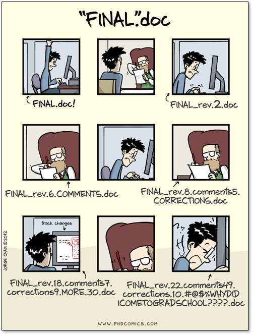
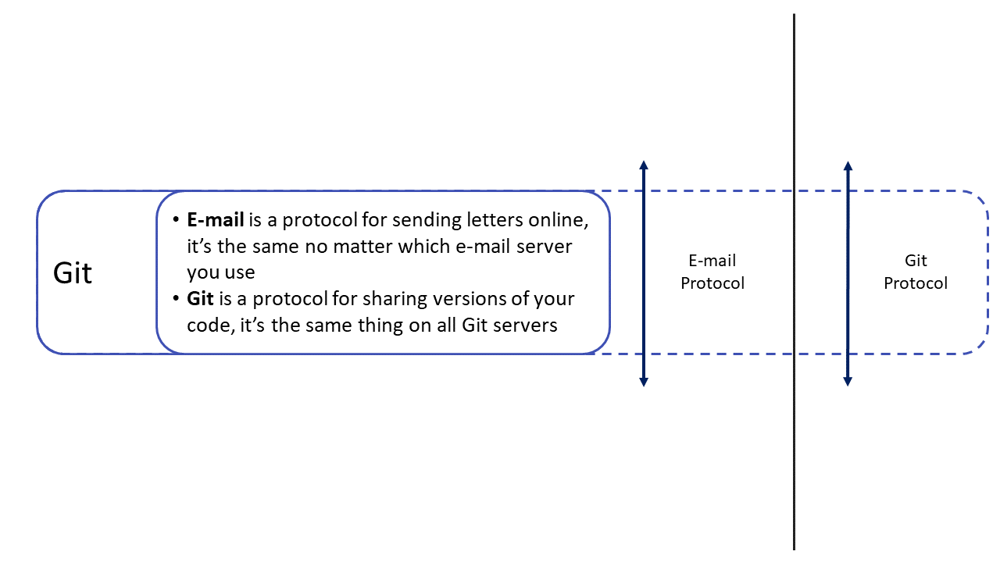
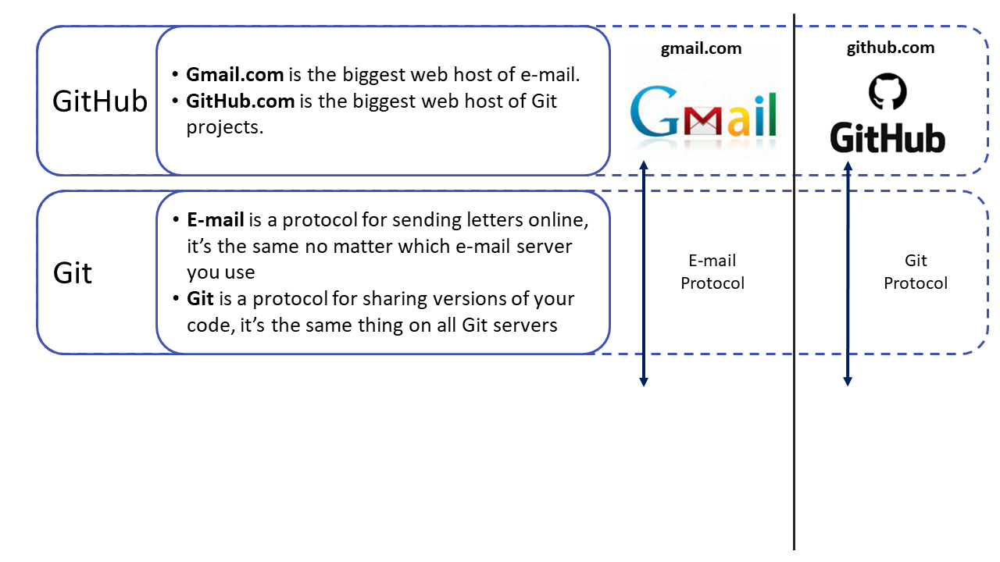
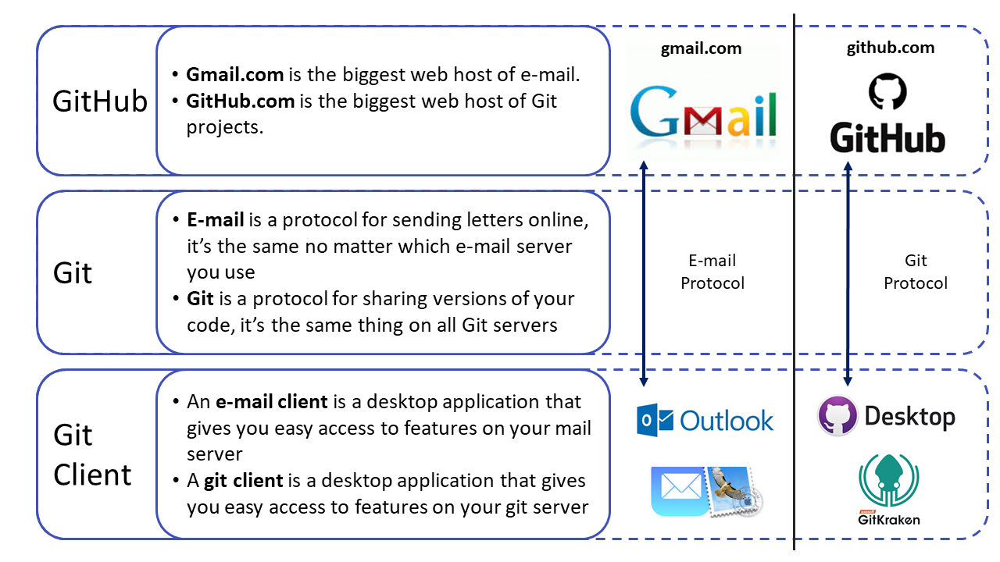
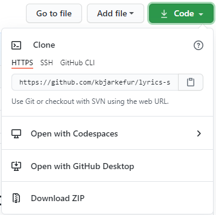
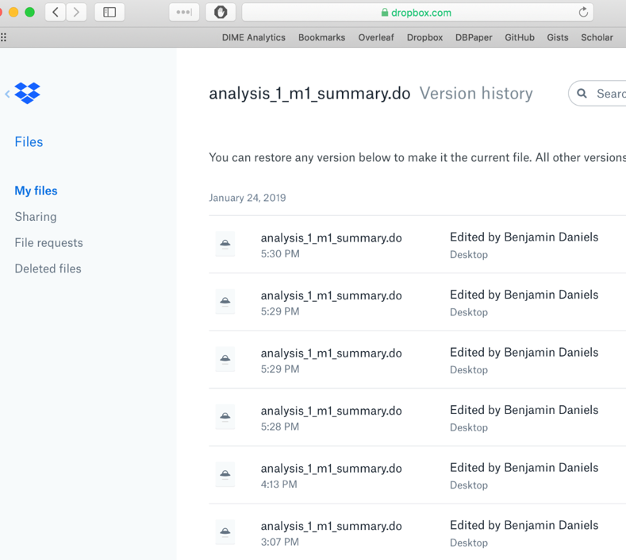
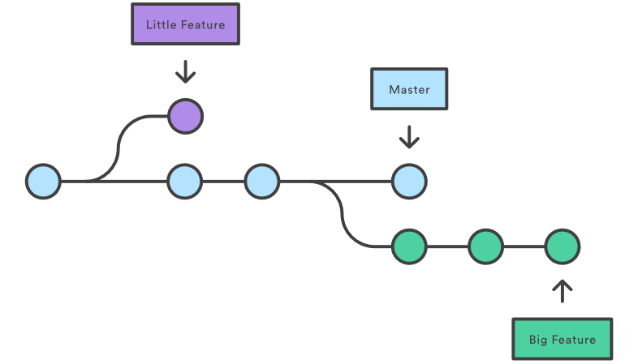
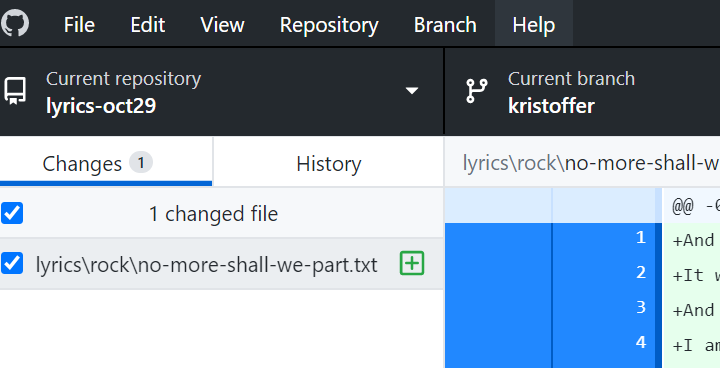
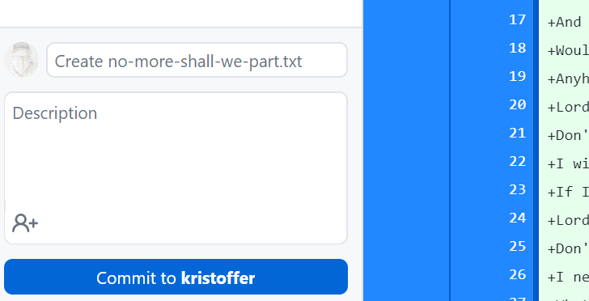

## Before the session starts:

1. Do you have a GitHub.com account? If not, go to <https://github.com/join> and sign up
2. Have you sent your GitHub username to the organizer or to [kbjarkefur@worldbank.org](mailto:kbjarkefur@worldbank.org)?
3. Have you installed GitHub Desktop? If not go to <https://desktop.github.com/> and download it.
4. Have you logged in at least once on GitHub Desktop? If not open GitHub Desktop and log in using your GitHub account.
5. Have you been invited to [github.com/dime-wb-trainings/lyrics-aibc](https://github.com/dime-wb-trainings/lyrics-aibc)?
6. And have you accepted at [github.com/dime-wb-trainings/lyrics-aibc/invitations](https://github.com/dime-wb-trainings/lyrics-aibc/invitations)?

## Three common GitHub roles

The objective of this training is to make you able to take the role of a **Contributor**. See Impact Analytics GitHub Roles for full details (link at the end of the presentation).

:::: {.columns}

::: {.column width="33%"}
### Observer

* Browse code in GitHub
* Provide feedback through GitHub
* **Who?** Typically a PI that does not code
:::

::: {.column width="33%"}
### Contributor

* Contribute to code in GitHub
* Understand and follow instructions from a Repo Maintainer
* **Who?** Typically an RA, or a PI that codes
:::

::: {.column width="33%"}
### Repo Maintainer

* Make sure that best practices and standards are followed in the repository
* Guide new contributors
* **Who?** Typically the most senior RA. Takes too much time for a PI.
:::

::::

## What is Git used for?

:::: {.columns}

::: {.column width="60%"}
* Git solves the *Final.doc* problem
* [Common solution to the *Final.doc* problem: Name all your docs like *YYMMDD\_docname\_INITIALS.doc*]{.fragment fragment-index=2}
* [Git tracks *YYMMDD* and *INITIALS* for all edits without the user having to remember it]{.fragment fragment-index=3}
* [That's far from everything, Git also solves:]{.fragment fragment-index=4}
    * [Conflicting copy problem (DropBox etc.)]{.fragment fragment-index=4}
    * [I can't re-produce my Baseline report problem]{.fragment fragment-index=4}
    * [Who wrote this code 4 years ago and why?]{.fragment fragment-index=4}
    * [And much much more...]{.fragment fragment-index=4}
:::

::: {.column width="40%"}
{fig-align="center"}
:::

::::

## What is Git, GitHub and GitHub Desktop?

{fig-align="center" width="70%"}

## What is Git, GitHub and GitHub Desktop?

{fig-align="center" width="70%"}

## What is Git, GitHub and GitHub Desktop?

{fig-align="center" width="70%"}

## What will we learn?

In **An intro to Git and GitHub - Contributor Role** you will learn to:

* Explore the history of a project folder in GitHub and see what different team members are currently working on
* Download a project folder from GitHub so you can work on it
* Create a space in the project folder where you can make your edits
* Make edits and share those versions with your team. When you are ready, request that your edits are included in the main version

## MVO

::: {style="font-size: 1.3em;"}
Three Git concepts needed to do this:

* Clone
* Commit
* Branch
:::

## Code free training!

::: {style="text-align: center; padding: 0 12%;"}
**No code today!**

We will not work with code today.

Code tends to distract people if, for example, they see a command they do not understand.

Instead we will work with lyrics in .txt files that works exactly the same as code files in Git.
:::

## How to browse GitHub.Com

Your project folder is called a **repository** in Git, often **repo** for short. When you enter [github.com/dime-wb-trainings/lyrics-aibc](https://github.com/dime-wb-trainings/lyrics-aibc) you get to what we will call the **repository landing page**.

:::: {.columns}

::: {.column width="55%"}
Go from **GitHub.com** to **repo**

1. From anywhere on [github.com](https://github.com) click the *octocat* icon in the top left corner.
2. In the menu to your left you see the repositories you are invited to
3. Click any repo to get to the landing page of that repo.
:::

::: {.column width="45%"}
Go from **repo** to **landing page**

1. Click the repo name in `dime-wb-trainings/lyrics-aibc` at the top of any page within the repo
:::

::::

# Clone {background-color="#530153"}

## What is cloning?

Cloning is similar to downloading a **repository** to your computer.

The difference between cloning and downloading is that **when Git clones a repository it remembers where you downloaded it from**. This is necessary so that Git knows where send any edits you make to the files when sharing them with your team.

## How do I clone a repository from GitHub?

:::: {.columns}

::: {.column width="70%"}
How to clone a repository:

1. Go to the **landing page** of [github.com/dime-wb-trainings/lyrics-aibc](https://github.com/dime-wb-trainings/lyrics-aibc)
2. Click the green *Code* button (see image)
3. Click *Open with GitHub Desktop*
4. Select where on your computer to clone the repository. Do **NOT** clone in a shared folder, like a network drive or in DropBox. Create a *GitHub* folder in non-synced location and clone there. Read more about this in our guide [here](https://github.com/worldbank/dime-github-trainings/blob/master/GitHub-resources/DIME-GitHub-Guides/clone-location.md).
:::

::: {.column width="30%"}
{fig-align="center"}
:::

::::

## Explore the clone

::: {style="text-align: center; padding: 0 10%;"}
**Explore the clone!**

Compare the files and folders you cloned to your computer with those in the repository on [github.com/dime-wb-trainings/lyrics-aibc](https://github.com/dime-wb-trainings/lyrics-aibc)
:::

# Collaboration on a repository {background-color="#530153"}

## Collaboration needs two more concepts

::: {style="text-align: center;"}
In order to collaborate on a repository we need to introduce two topics:

:::: {.columns}

::: {.column width="50%"}
[**Commits**]{style="font-size: 1.6em;"}
:::

::: {.column width="50%"}
[**Branches**]{style="font-size: 1.6em;"}
:::

::::
:::

# Commit {background-color="#530153"}

## What is a version in version control?

:::: {.columns}

::: {.column width="50%"}
First look at how version control works in another software you might be familiar with.

In DropBox each saved version of a file is saved to the version history. This is the only way to do it automatically, but are all these versions meaningful differences?
:::

::: {.column width="50%"}
{fig-align="center"}
:::

::::

## What is a commit?

Instead of having a list of each saved version of a file, in Git we use **commits to indicate what is each meaningful difference between two versions of our project folder**.

Each commit is a snap shot of all files in the project folder, and lists how that snap shot differ from the previous snap shot (the previous commit).

Each commit has a time stamp and tracks who did the commit. This is very similar to the *YYMMDD\_docname\_INITIALS.doc* solution to the *Final.doc* problem.

## How to make a commit

We need to introduce *branches* before we can all commit to the same repository, so for now, let me show you how to make a commit:

1. I add a new lyrics .txt file in the clone
2. I use GitHub desktop to commit the new file to the repository
3. Can you see the new file on your computer?
4. Can you see it if you sync in GitHub Desktop?

## Exploring commits

Now when we know what a commit is, we can start exploring how the [github.com/dime-wb-trainings/lyrics-aibc](https://github.com/dime-wb-trainings/lyrics-aibc) repository was created.

We will see a list of commits, that at first sight is similar to the the version history in DropBox, but **in Git the version list is more meaningful, as it is a list of only meaningful differences**.

* [github.com/dime-wb-trainings/lyrics-aibc/commits](https://github.com/dime-wb-trainings/lyrics-aibc/commits)
* This list can also be found in GitHub Desktop in the *History* tab

# Branch {background-color="#530153"}

## Introducing branches

:::: {.columns}

::: {.column width="60%"}
**Branches is the "killer feature" of Git**. This is where Git becomes really powerful as a collaboration tool and not just as version control.

Branches allows you to **create a copy of the code where you can experiment**, if you like the result, **you can very easily merge your experiment with the main version of your code**.

This non-linear version control is much more similar to how we actually work than the strictly linear version control in, for example, DropBox
:::

::: {.column width="40%"}
{fig-align="center"}
:::

::::

## Looking at branches

**One more way to explore the repository**

* [github.com/dime-wb-trainings/lyrics-aibc/commits](https://github.com/dime-wb-trainings/lyrics-aibc/commits) ← Linear progression
* [github.com/dime-wb-trainings/lyrics-aibc/network](https://github.com/dime-wb-trainings/lyrics-aibc/network) ← Non-linear progression

**Exploring branches**

* You can change branch in */commits*. What happens then?
* Go to the landing page, what happens if you change branch here?
* Which version is in the clone on your computer? They are all actually in your clone, but only one is shown - **checked out** - at the time
* What happens to the files on your computer when you check out another branch in GitHub Desktop?

## Working with branches

A typical Git work flow involves multiple branches and there are tools in GitHub to makes that work flow easy, but that is not within today's scope. Although, what you should know after this training is only how to create your own branch and how to commit to it.

**Create a branch:**

* Go to [github.com/dime-wb-trainings/lyrics-aibc](https://github.com/dime-wb-trainings/lyrics-aibc) and click the button where it says *Branch: main*.
* Write your name in the field and click *Create branch: your\_name*. Make sure it says *from 'main'*.
* See how the button now says *Branch: your\_name*
* Go to [github.com/dime-wb-trainings/lyrics-aibc/network](https://github.com/dime-wb-trainings/lyrics-aibc/network) to check that your branch is there.

# Combining Commit & Branch {background-color="#530153"}

## Now it is time to collaborate

**Now it is time for you to collaborate:**

1. Make sure your branch is checked out in GitHub Desktop.
2. Open a text editor. It could be *Notepad* if you are using Windows, *TextEdit* if you are using Mac, or any other code editor like *Atom*, or *Notepad++* etc.
3. Google the lyrics of your favorite song, and copy the lyrics to a new file in the text editor you just opened
4. Save the lyrics in your local clone according to these instructions:
    * Save the file in *.txt* format (Especially Mac users, this is not always the default)
    * Name the file after the title of the song
    * Save it in the appropriate genre folder (create a new genre folder if needed)

## Do your first commit

:::: {.columns}

::: {.column width="60%"}
1. Open the changes tab in GitHub Desktop
2. GitHub Desktop tracks your clone and has noticed that you changed something in it
3. Then you need to do the three steps required to commit a file to the repository:
    1. Make sure the file you want to add is checked
    2. Write a commit message
    3. Click *Commit to your\_name* - check out your branch if it says *main*
    4. Click the sync button
:::

::: {.column width="40%"}
{fig-align="center"}

{fig-align="center"}
:::

::::

## Check your contribution

**Check your commit on GitHub:**

* Go to [github.com/dime-wb-trainings/lyrics-aibc/network](https://github.com/dime-wb-trainings/lyrics-aibc/network)
    * Can you find your commit?
* Go to [github.com/dime-wb-trainings/lyrics-aibc/commits](https://github.com/dime-wb-trainings/lyrics-aibc/commits)
    * Can you find your commit?
    * If you cannot see your commit, make sure that you are looking in the correct branch

## Pull Requests

A feature related to branches is a **pull request**. When the edits you have done in your branch are ready to be merged with the main version of the code, you make a pull request, i.e. you are requesting that your edits are pulled into the main branch.

A pull request can be made either by the person that edited the branch or the repo maintainer.

It is common in GitHub repositories that only the repo maintainer have access to the main branch, and pull requests are then the only way to contribute to the main branch.

## Merge your contribution

**To make a pull request for your branch:**

* Go to [github.com/dime-wb-trainings/lyrics-aibc/pulls](https://github.com/dime-wb-trainings/lyrics-aibc/pulls) and click *New pull request*
* Make sure that the *main* branch is selected as the *base:* branch, and then select your branch as the *compare:* branch
* Scroll down to check the edits you are requesting to be pulled in to the main branch. If it looks ok, then click *Create pull request*
* Then you have the chance to add more instructions if you want, then click *Create pull request* again

## Merge your contribution

Can you see your lyrics file in the main branch now? Why not?

Your contribution will not be included until the branch is merged. We have more trainings on the details of merging branches but for now this is all you need to know:

* Always have someone to review your PR before merging it
* Always delete your branch after it is merged - you can always recreate a new branch with the same name if you want

## What have we learned?

In **An intro to Git and GitHub - Contributor Role** you have learned to:

* Explore the history of a project folder in GitHub and see what different team members are currently working on
* Download a project folder from GitHub so you can work on it
* Create a space in the project folder where you can make your edits
* Make edits and share those versions with your team. When you are ready, request that your edits are included in the main version

## What have we learned?

In **An intro to Git and GitHub - Contributor Role** you have learned to:

* Explore the history of **repository** and see what different team members are currently working on
* **Clone** a **repository** so you can work on it
* Create a **branch** in the **repository** where you can make your edits
* Make edits and share **commits** with your team. When you are ready, make a **pull request** to the **main branch**

# Magic Trick {background-color="#530153"}

## Magic Trick

All great training ends with a magic trick! This is a pedagogical magic trick, don't worry, just bear with me!

::: {style="text-align: center; padding-top: 1.2em;"}
I need a volunteer for a simple task from the audience!
:::

# Next steps for the research team {background-color="#530153"}

## Three common GitHub Roles

:::: {.columns}

::: {.column width="33%"}
### Observer

* Browse code in GitHub
* Provide feedback through GitHub
* **Who?** Typically a PI that does not code
:::

::: {.column width="33%"}
### Contributor

* Contribute to code in GitHub
* Understand and follow instructions from a Repo Maintainer
* **Who?** Typically an RA, or a PI that codes
:::

::: {.column width="33%"}
### Repo Maintainer

* Make sure that best practices and standards are followed in the repository
* Guide new contributors
* **Who?** Typically the most senior RA. Takes too much time for a PI.
:::

::::

## Next steps for the research team

Before adopting Git the research team should discuss the following things:

* Who will be repo maintainer
* Agree on a work flow
* Public/private repository
* External collaborators
* Where to put data and where to put code
* Request a repo on DIME or World Bank account

## Useful links

* All Impact Analytics GitHub trainings: <https://osf.io/e54gy/>
* Other Impact Analytics GitHub resources: <https://github.com/worldbank/dime-github-trainings>. For example:
    * Impact Analytics GitHub Templates (for example .gitignore): <https://github.com/worldbank/dime-github-trainings/tree/master/GitHub-resources/DIME-GitHub-Templates>
* Markdown cheat sheet (how to format text on GitHub.com): <https://www.markdownguide.org/cheat-sheet/>
