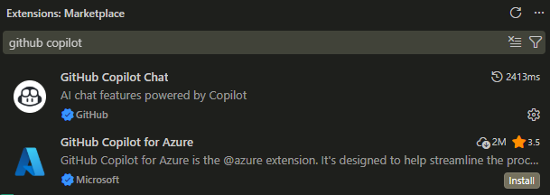
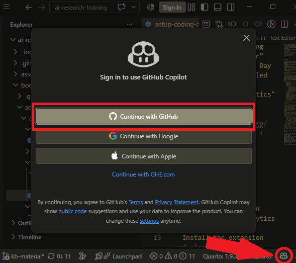
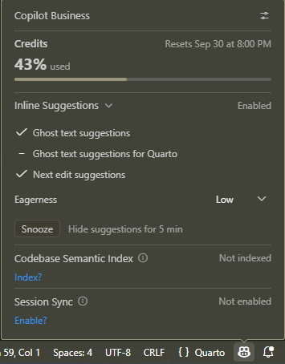

## Steps

- Request access to WB GitHub Copilot from Analytics
- Install the extension and sign in
- Verify access to WB copilot and see spending limits
- Run a first interaction with the agent

## Request access to WB GitHub Copilot

- Find all GitHub Copilot-related resources at the WB here: https://github.com/worldbank/ospo/blob/main/docs/copilot/README.md.
- In essence:
    - Be a member of any WB GitHub organization, for example:
        - https://github.com/worldbank
        - https://github.com/dime-worldbank
    - Send an email, _that includes your GH username_, to github@worldbank.org saying that you are requesting access to WB GitHub Copilot.
    - Move to the next slide while waiting for confirmation

## Install GitHub Copilot Extension

- Open the Extensions view in VS Code - search for "GitHub Copilot Chat"
- This extension comes installed by default with recent versions of VS Code.
- If you see an "Install" button, first make sure that you have the latest version of VS Code installed.
    - In the VS Code top menu, go to Help and then click on "Check for Updates" - install any available updates.
- Go back to the extension view in VS Code, and search again for "GitHub Copilot Chat"
- If it still shows an "Install" button, click it to install the extension.

## Log in to your GitHub account

::: {.columns}
::: {.column width="70%"}
All tools that use your GitHub account use the same VS Code authentication to GitHub. So you may already be signed in if you are already using a feature or extension that already has GitHub authentication set up for you.

If not, follow these steps:

- Click the Copilot icon in the status bar at the bottom of your VS Code window
- If you are prompted to log in, click Log in with GitHub and follow the prompts
- If you are not prompted to log in and see usage metrics, then you are already logged in and may move to the next slide
:::

::: {.column width="30%"}

:::
:::

## Make sure VS Code picks up your WB GitHub Copilot License

::: {.columns}
::: {.column width="70%"}
- For this step, make sure that you have received confirmation that you have been assigned a license. You may still proceed, as the steps below will confirm whether this has been done yet.
- Click the GitHub Copilot icon in the status bar at the bottom of your VS Code window again
- Make sure it says Copilot Business and not Copilot Free or anything else at the top
- If you have multiple licenses and want to confirm you are using the one provided by the WB, go to https://github.com/settings/copilot/features
:::

::: {.column width="30%"}

:::
:::

## Make your first interaction with GitHub Copilot

- Open a folder in VS Code with a project that you are familiar with. Preferably, choose one with a code folder, but this is not required.
- Open the chat by clicking the GitHub Copilot Chat icon next to the search bar at the top of your VS Code window.
- To make sure the agent will not edit any files, switch the mode from "Agent" to "Ask".
- Then ask the agent a question about your project. Since this is a coding agent, it will be better at code-related queries, but can handle other files as well. If you have a code folder, ask it to find the code folder and give a high-level overview of what the code files in this project are about.