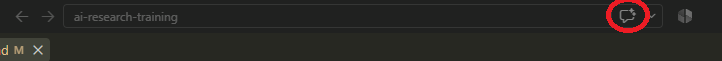
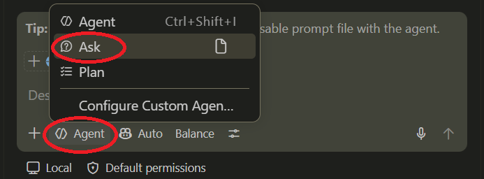

```{r}
#| label: setup
#| include: false
source("../../../_extensions/bootcamp/setup_palettes.R")

knitr::opts_chunk$set(echo = FALSE, warning = FALSE, message = FALSE)
```

## Steps

- Request access to WB GitHub Copilot from Analytics
- Install the extension and sign in
- Verify access to WB Copilot and review spending limits
- Run a first interaction with the agent

## Request access to WB GitHub Copilot

- Find all GitHub Copilot-related resources at the WB here: [https://github.com/worldbank/ospo/blob/main/docs/copilot/README.md](https://github.com/worldbank/ospo/blob/main/docs/copilot/README.md).
- In essence:
    - Be a member of at least one WB GitHub organization, for example:
        - [https://github.com/worldbank](https://github.com/worldbank)
        - [https://github.com/dime-worldbank](https://github.com/dime-worldbank)
        - If you are not a member of any WB GitHub organization, request access [using this eServices request](https://worldbankgroup.service-now.com/wbg/en/join-github-organization-account-request?id=wbg_sc_catalog&sys_id=910e1739db1a54903c5960ab13961912).
    - Send an email, _including your GitHub username_, to github@worldbank.org saying that you are requesting access to WB GitHub Copilot -- move to the next slide while waiting for confirmation

## Install GitHub Copilot Extension

- Open VS Code's Extensions view and search for "GitHub Copilot Chat". In recent versions of VS Code, it comes pre-installed.
- If you see "Install" next to "GitHub Copilot Chat", first try to update VS Code via **Help → Check for Updates**. If there is an available update, install it, and then search again.
- If "Install" appears even when VS Code is up to date, click the "Install" button.

::: {.columns .center}
::: {.column width="20%" .center}
:::
::: {.column width="60%" .center}

:::
::: {.column width="20%" .center}
:::
:::

## Log in to your GitHub account

::: {.columns .v-center-container}
::: {.column width="70%"}
VS Code features and extensions that use your GitHub account share the same GitHub authentication. 
You may already be signed in if you are already using a feature or extension that has GitHub authentication set up for you.

If not, follow these steps:

- Click the Copilot icon in the status bar at the bottom of your VS Code window
- If you are prompted to log in, click Log in with GitHub and follow the prompts
- If you are not prompted to log in and can see usage metrics, then you are already logged in and may move to the next slide
:::

::: {.column width="30%"}

:::
:::

## Make sure VS Code picks up your WB GitHub Copilot License


::: {.columns}
::: {.column width="70%"}
- For this step, make sure that you have received confirmation that you have been assigned a license. The steps below will confirm whether you have a license.
- Click the GitHub Copilot icon in the status bar at the bottom of your VS Code window again
- Make sure it says `Copilot Business` and not `Copilot Free` or anything else at the top
- If you have multiple licenses and want to confirm you are using the one provided by the WB, go to [https://github.com/settings/copilot/features](https://github.com/settings/copilot/features)

:::

::: {.column width="30%"}

:::
:::

## Make your first interaction with GitHub Copilot

- Open a folder in VS Code with a project that you are familiar with. Preferably, choose one with a code folder, but this is not required.
- Open the chat by clicking the GitHub Copilot Chat icon next to the search bar at the top of your VS Code window.
- This is a common way to start an interaction with the agent, but there are other ways as well. 

<div style="height: 3em;"></div>


::: {.columns .center}
::: {.column width="17%" .center}
:::
::: {.column width="66%" .center}

:::
::: {.column width="17%" .center}
:::
:::

## Ask a question


::: {.columns .center}
::: {.column width="45%" .center}

To make sure the agent will not edit any files, switch the mode from "Agent" to "Ask".

We will cover what these options mean in more detail next week.

:::

::: {.column width="5%" .center}
:::

::: {.column width="50%" .center}

- Then ask the agent a question about your project. 
- Since this is a coding agent, it is especially useful for code-related queries, but it can handle questions about other files as well. 
- If you have a code folder, ask it to find the folder and give a high-level overview of what the code files in the project are about.
- Try other questions as well.
:::
:::

