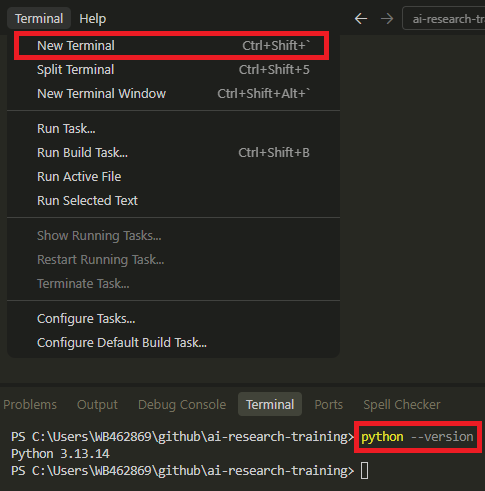
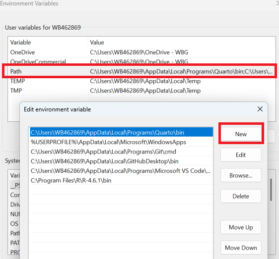

```{r}
#| label: setup
#| include: false
source("../../../_extensions/bootcamp/setup_palettes.R")

knitr::opts_chunk$set(echo = FALSE, warning = FALSE, message = FALSE)

# Reusable command and expected-output text for the verification slides.
python_verify <- "Command to verify installation: `python --version` -> expected output if already installed: `Python 3.*.*`"
r_verify <- "Command to verify installation: `R --version` -> expected output if already installed: `R version 4.*.* [...]` followed by R's copyright information"
quarto_verify <- "Command to verify installation: `quarto --version` -> expected output if already installed: `1.*.*`"
latex_verify <- "Command to verify installation: `latex --version` -> output is usually verbose. If there is no error and it includes a LaTeX compiler name, such as `pdfTeX 3.*.*` or `MiKTeX *.*.*`, the installation is verified."
wb_installation_note <- function(software) {
  paste0("Even when you self-install software, ITS appreciates it if you submit a Software Installation eServices request. Note in the comments that you installed ", software, " through self-service. This helps ITS understand demand and allocate resources to support ", software, " users.")
}

wb_path_note <- function(software, path) {
  paste0("If the installation seemed successful but ", software, " is still not available from the command line, follow the instructions on the slide \"**Adding software to the system path**\". On WB computers, a common installation location is `", path, "`, but confirm that this is the location on your computer before adding it to PATH.")
}

personal_path_note <- function(software) {
  paste0("If the installation seemed successful but ", software, " is still not available from the command line, then use the agent or an AI ChatBot to find how to add this software to your computer's path variable.")
}


```

## Objective

You may already have some of this software installed. For this training, it is equally important that it be accessible from your computer's default command line, because that is how the agent has access to it.

### Required for everyone:

- **Python** installed and accessible from the command line
  - We recommend this even if none of your projects require Python. Agents default to Python for many tasks, such as parsing PDF and Word files.
- Either **Quarto** or **LaTeX** installed and accessible from the command line
  - Several sessions require this, particularly on Days 2 and 3.

### Required if your specific project uses it:

- **R** installed and accessible from the command line

## Opening the Default Terminal

:::: {.columns}

::: {.column width="65%" }
Your agent will use the default terminal configured in VS Code.

Therefore, software must be available from that terminal for this training.

To open it, go to the top menu and select "Terminal", then "New Terminal".

Type the verification commands on the next slide into the terminal and press Enter.

The folder location does not matter when running these specific commands.
:::

::: {.column width="35%" }
  
:::

::::

## Verifying installations in the command line

- **Python**. `r python_verify`
- **R**. `r r_verify`
- **Quarto**. `r quarto_verify`
- **LaTeX compiler**. `r latex_verify`

## Installing Python - WB Computer

1. Open Company Portal from the Start menu and search for "Python".
2. Select Python and click "Install".
3. Then verify that Python is available in the command line. `r python_verify`

`r wb_path_note("Python", "C:\\WBG\\Python313")`

`r wb_installation_note("Python")`
  
## Installing Python - Personal Computer

1. Go to [https://www.python.org/downloads/](https://www.python.org/downloads/) and follow the instructions for your operating system.
2. Download and install the appropriate Python distribution, following the prompts.
3. Then verify that Python is available in the command line. `r python_verify`

`r personal_path_note("Python")`

## Installing LaTeX - WB Computer

1. Open Company Portal from the Start menu and search for "MiKTeX".
2. Select MiKTeX and click "Install".
3. Then verify that LaTeX is available in the command line. `r latex_verify`

`r wb_path_note("MiKTeX", "C:\\Program Files\\MiKTeX\\miktex\\bin\\x64")`

`r wb_installation_note("MiKTeX")`

## Installing LaTeX - Personal Computer

1. Go to [https://www.latex-project.org/get/#tex-distributions](https://www.latex-project.org/get/#tex-distributions) and follow the instructions for your operating system.
2. Download and install the appropriate LaTeX distribution, following the prompts.
3. Then verify that LaTeX is available in the command line. `r latex_verify`

`r personal_path_note("MiKTeX")`

## Installing Quarto - WB Computer

1. Open Company Portal from the Start menu and search for "Quarto".
2. Select the Quarto application and click "Install".
3. Then verify that Quarto is available in the command line. `r quarto_verify`

`r wb_path_note("Quarto", "C:\\WBG\\Quarto\\bin")`

`r wb_installation_note("Quarto")`

## Installing Quarto - Personal Computer

1. Go to [https://quarto.org/docs/get-started/](https://quarto.org/docs/get-started/) and follow the instructions for your operating system.
2. Download and install the appropriate Quarto distribution, following the prompts.
3. Then verify that Quarto is available in the command line. `r quarto_verify`

`r personal_path_note("Quarto")`

## Installing R - WB Computer

1. Open Company Portal from the Start menu. Search for "RforWindows".
2. Select the "RforWindows" application and click "Install".
3. Then verify that R is available in the command line. `r r_verify`

`r wb_path_note("R", "C:\\Program Files\\R\\R-4.6.1\\bin")`

`r wb_installation_note("R")`

## Installing R - Personal Computer

1. Go to [https://cran.r-project.org/](https://cran.r-project.org/) and follow the instructions for your operating system.
2. Download and install the appropriate R version for your operating system, following the prompts.
3. Verify that R is available from the command line. `r r_verify`

`r personal_path_note("R")`

If desired, you may also download and install RStudio as your R code editor, but the agent will not access R through RStudio.

## Adding software to the system path

:::: {.columns}

::: {.column width="75%" }

_For a WB Windows Computer, you must follow this procedure:_

1. In the Start menu, search for "Edit environment variables for your account" and select it.
2. In the User variables box, select "Path" and click "Edit".
3. Click "New" and add the location the software was installed.
4. Then click "OK" in both boxes to save the changes. 
5. Close and reopen VS Code, then verify that the software is available in the terminal.

:::

::: {.column width="25%" }
  
:::

::::

If you are using a personal computer, search online or ask an AI chatbot how to add the specific software to your computer's system PATH.
