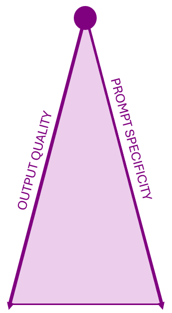
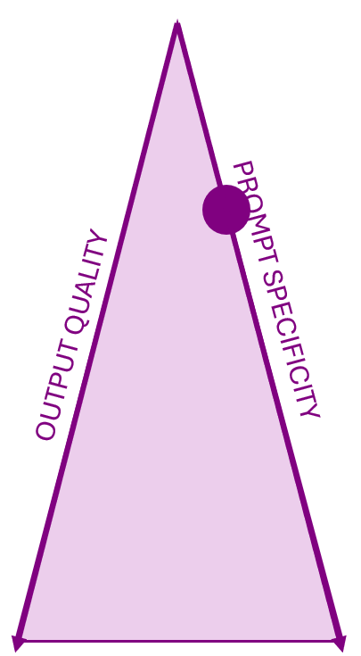
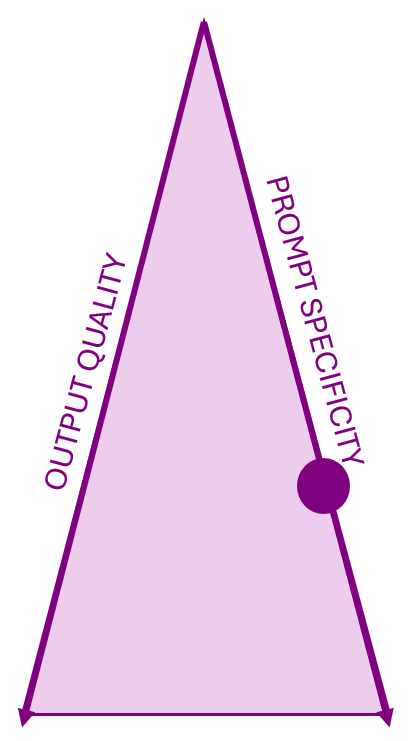
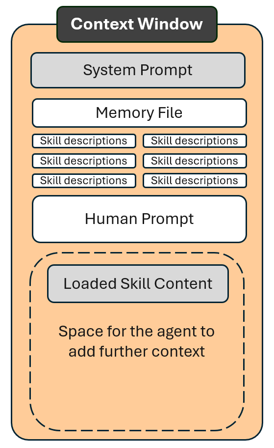
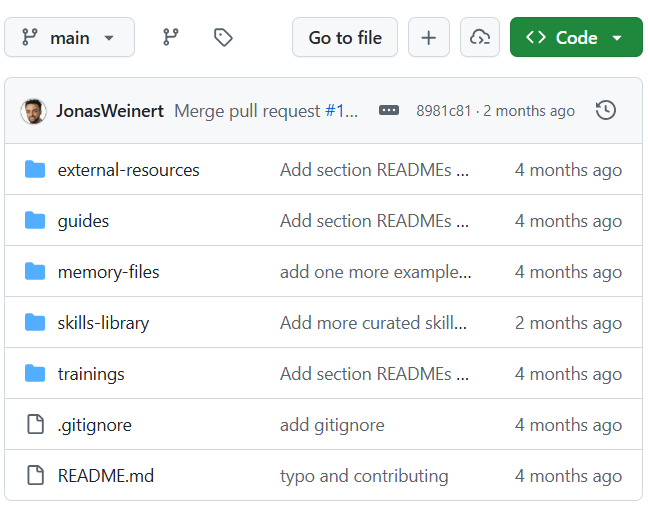
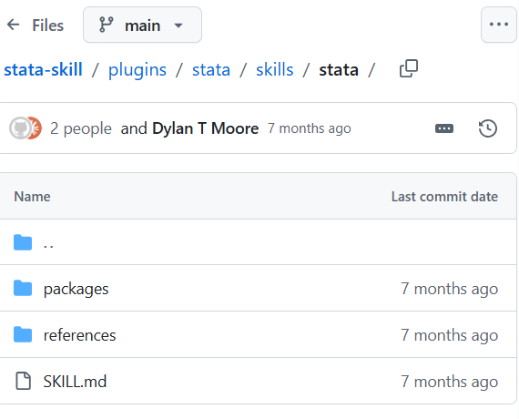

```{r}
#| label: setup
#| include: false
source("../../../_extensions/bootcamp/setup_palettes.R")

knitr::opts_chunk$set(echo = FALSE, warning = FALSE, message = FALSE)
```

# Scope of This Session {background-color="#530153"}

## Scope of This Session

- Good Prompts
- Good Prompts vs. Memory Files vs. Skills
- Introduction to skills
  - What are skills?
  - What are their formats?
  - How do I install and use them?


# Recap and Introduction {background-color="#530153"}

## Recap

- AI is a skilled but naive RA requiring guidance.
- Agents search files for prompt-relevant guidance to add to the context window.
- Use memory files for:
  - Project-specific content you always want AI to gather first
  - Relevant context that cannot be found in your files.
- Caution:
  - Cramming every use case into the memory file makes it dominate the context window.
  - Irrelevant information in the context window competes for and distracts the AI's attention from the specific task.


# Good prompting {background-color="#530153"}

## Vague Prompts

:::: {.columns .v-center-container}

::: {.column width="30%" }
  
:::

::: {.column width="5%" }
:::

::: {.column width="65%" }

**Prompt:** “Can you write R code to estimate the effect of a treatment on employment?”

::: {.fragment}

* **What’s Missing:** No variable names, statistical method or package
* **What you’ll get:** Likely a generic regression and most likely incorrect model for intended analysis. Can be used as general boilerplate code (similar to what you’d find on forums).
:::

:::
::::

## Good Prompts

:::: {.columns .v-center-container}

::: {.column width="30%" }
  
:::

::: {.column width="5%" }
:::

::: {.column width="65%" }

**Prompt:** "How do I estimate the effect of `treatment` on `employment_status` in R, controlling for `age` and `gender`, with fixed effects for `district`?"


::: {.fragment}

* **What’s Missing:** No packages and context
* **What you’ll get:** A regression setup that’s more specific to your case, but will most likely require tweaks. 

:::

:::
::::

## Expert Prompts

:::: {.columns .v-center-container}

::: {.column width="30%" }
  
:::

::: {.column width="5%" }
:::

::: {.column width="65%" }

**Prompt:** “I am running an analysis in R. My data is in a dataframe called `df`. I'd like you to help me write code that estimates the effect of `treatment` on `employment_status`, controlling for `age` and `gender`, with fixed effects for `district` and SEs clustered by `village`. Please use the `fixest` package."


::: {.fragment}

* **What you’ll get:** Highly accurate code using a widely established R package for regressions using the exact research design you had intended.
:::

:::
::::

# When Should Prompts Become Memory files or Skills  {background-color="#530153"}

## Well-Crafted Prompts vs. Skills

 - Writing a well-crafted prompt takes time - we as regular humans will eventually take shortcuts and not do it
 - For a one-time task, writing a well-crafted prompt is our best approach to get a well-crafted context-specific answer from the agent
 - For recurring tasks, investing that time in a skill is more efficient as it is automatically reused when relevant
 - If you make skills part of your project folder, anyone else in your team will also benefit from the instructions in the skill
 - If you are a TTL who wants your team members to follow consistent procedures, creating skills ensures that everyone has access to the same instructions.

## Memory Files vs. Skills

| | Memory files | Skills |
|---|---|---|
| Typical purpose | Domain knowledge and instructions relevant for every prompt | Detailed instructions relevant only for specific tasks |
| Added to every new context window? | Yes | No, only when the agent thinks they are needed |
| Need to be token-efficient? | Yes, because they are always loaded | Much less so, because they are loaded only when relevant |
| Project-specific or domain-specific? | Mostly project-specific; reuse from other projects but adapt common sections | Domain-specific, including tools, research fields, econometrics, and personal preferences; typically reusable across projects |


# Skills: Format {background-color="#530153"}

## Progressive Disclosure

- Instructions can be loaded only when the agent deems them relevant.
- This is called **progressive disclosure**. It is central to skills, but not unique to them.
- In the last session, we used progressive disclosure to point to codebooks from the memory file.

```markdown
### Input Datasets
- `data/raw/census_2011.csv`: 
  - household demographics. Main variables: household ID and income. 
  - Full codebook: `data/raw/census_2011_codebook.csv`.
```

## Skills Format - Technical Requirements

- Skills are also files with natural-language content, similar to prompts and memory files.
- A skill requires "_frontmatter_" with at least a name and a description.
- The description should not include how the skill solves a task. 
- The description's purpose is only to tell the agent when to use it and when not to use it.
- The content (everything but the frontmatter) contains the actual instructions and details for the skill.

```markdown
---
name: new-shiny-dash
description: Use when setting up a new dashboard - use when Shiny or no specific
  dashboard tool is specified
---
# New Shiny Dashboard Skill
Always start from the templates in `templates/` and build toward one of the
`examples/`. If not sure which example is the best fit, ask the user.
Then populate it by [...]
```

## An Efficient Way to Populate the Context Window

:::: {.columns .v-center-container}

::: {.column width="65%" }

- The frontmatter of all available skills is loaded into each new context window.
- Only when the agent thinks a skill is needed is its full content loaded.
- Therefore, skills can contain extensive details such as:
  - Step-by-step instructions for a task
  - What the agent should ask or confirm before proceeding
  - Templates and examples to be used for the expected output format

:::

::: {.column width="5%" }
:::

::: {.column width="30%" }
  
:::

::::

## Open-Source Folder Format

- Minimum requirement: a `SKILL.md` file in a folder named after the skill.
- The skill folder may contain resources in subfolders referenced by the skill file.
- The skill is everything in the skill folder; resources are used through progressive disclosure.

:::: {.columns}

::: {.column width="50%" }
```markdown
skills/
|-- stata-skill/
|   |-- SKILL.md     Instructions for the Stata skill
|-- new-shiny-dash/
|   |-- SKILL.md     Instructions for the skill
|   |-- templates/   Files for the agent to start from
|   |-- examples/    Examples of end results
```
:::

::: {.column width="50%" }
```markdown
---
name: new-shiny-dash
description: Use when setting up a new dashboard - use [...]
---
# New Shiny Dashboard Skill
Always start from the templates in `templates/` and build 
toward one of the `examples/`. If not sure which example 
is the best fit, ask the user. Then populate it by [...]
```
:::
::::


## Skills Folder Location

- While the skill folder has a standardized open-source format, where to save it differs by agent.
- Similar to memory files, agents will eventually find and use skills even when the location is not their native one.

| Skill folder location | Agent | Cross-agent compatibility |
|---|---|---|
| `.agents/skills/` | Open-source format, such as Cursor and Codex | Commonly used as a backup by other agents - for example Claude and GitHub Copilot |
| `.claude/skills/` | Claude | Well-recognized and quickly found by most agents |
| `.github/skills/` | GitHub Copilot | Less well-recognized, but eventually found and used |

# Skills: Installation {background-color="#530153"}

## Installation

- Many skills are not project-specific. Therefore:
  - Common to install skills written by others.
  - Common to install the same skill across projects
- More skills do not automatically mean a better agent. Agents are nudged to use skills over generic knowledge.
- Sometimes you want general knowledge. Too many skills can make the agent find a skill when it is not needed.
- Do not worry about adding a few more skills; the point made here is to not install the whole universe of skills.

## Manual Installation

- A skill folder only needs to be saved in your project.
- Manual installation works anywhere, regardless of how the skill was published.
- Knowing how to install manually helps with troubleshooting.

### How to Install - Follow these steps during hands-on session

1. Locate or create your skills folder.
2. Download or copy the full skill folder, including all its content, into your skills folder.
3. Type `/skills` in the Agent and confirm that your skill is there - it should then appear as an option.

#### _Automatic Installation_

There are ways to automatically install skills. However, those are not straightforward to set up on a WB computer, and not all skills are shared in a format where this is possible.

# Skills: Library and Examples {background-color="#530153"}

## Skills Library

:::: {.columns .v-center-container}
::: {.column width="55%" }

- We have a library that we are still populating at [https://github.com/dime-worldbank/coding-agents-hub](https://github.com/dime-worldbank/coding-agents-hub).
- As with memory files, this is where we want to share skill examples for different purposes.
- Share skills with us that you have used and found useful for general purposes and we are happy to add them.

:::

::: {.column width="45%" }
  
:::
::::

## Example Skill: Stata

:::: {.columns .v-center-container}
::: {.column width="65%" }

- Stata usage is much smaller than R and especially Python, so Stata is less represented in an agent's generic knowledge.
- Adding a Stata skill to a project with Stata code can make a big difference.
- Example: [https://github.com/dylantmoore/stata-skill](https://github.com/dylantmoore/stata-skill)
  - This repository is set up for automatic installation, which makes finding the relevant folder harder. 
  - Find the `SKILL.md` file, then copy that file's parent folder into your project's skills folder.

:::

::: {.column width="35%" }
  
:::
::::

# Thank You! - Questions? {background-color="#530153"}
