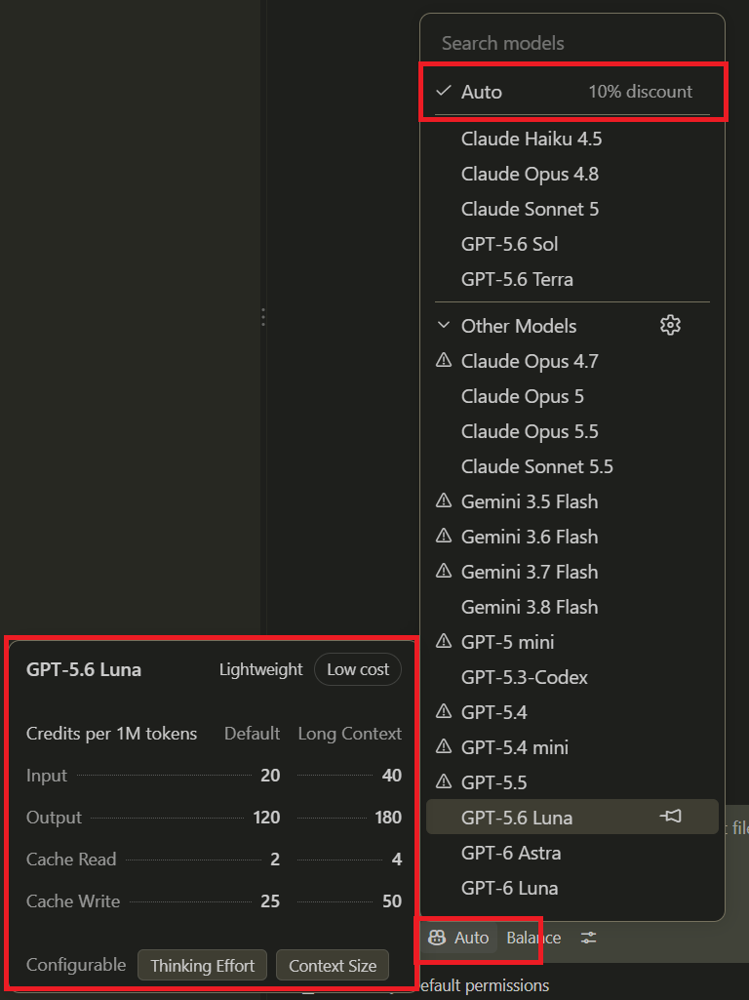
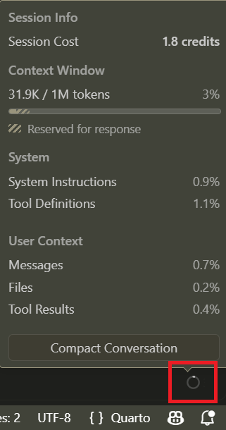

```{r}
#| label: setup
#| include: false
source("../../../_extensions/bootcamp/setup_palettes.R")

knitr::opts_chunk$set(echo = FALSE, warning = FALSE, message = FALSE)
```

## Objective

- Understand the cost and efficiency trade-offs of using AI agents.
- Learn strategies to minimize token usage without compromising AI performance.
- Learn where in VS Code you can implement these strategies.

## Do I Really Need to Worry About Token Efficiency?

::: {.fragment}
- Maybe not now, but eventually. AI tokens will never again be as subsidized by the AI giants as they are today. And setups with data privacy are not subsidized.
:::
::: {.fragment}
- We live in the AI-token equivalent of a pre-1973 oil crisis - the era of cheap and abundant tokens.
:::
::: {.fragment}
- It will never again be as cheap to experiment and learn with tokens as it is now.
:::
::: {.fragment}
- Those of us who have been using the WBG's GitHub Copilot licenses for six months have already experienced a mini oil crisis.
:::
::: {.fragment}
- We can afford to drive a V8 Cadillac Eldorado today, but need to learn how to drive a hybrid Toyota Prius tomorrow.
:::
::: {.fragment}
- The AI giants' revenue models count on us to get comfortable in our Cadillacs before they hike the prices.
:::

## 3 strategies to avoid common token inefficiencies

1. Use an appropriate model for each task.
2. Use memory files to indicate what is important for most tasks.
3. Start a new session if the current session has context that is not relevant to the task.

# Use Appropriate Models {background-color="#530153"}

## What Makes Different Models Different? How To Choose?

:::: {.columns .v-center-container}
::: {.column width="65%" }

* **Question:** If the biggest model is the most advanced model, why should I not always use it?

::: {.fragment}
* It is like asking: if my 18-wheel semi-truck is my most capable vehicle, why should I not use it when driving to the convenience store for a gallon of milk?

Using a semi-truck for this will work -- but if this is your habit, it will not mainly be the current gas prices' fault if you max out your household's fuel budget.
:::

:::
::: {.column width="35%" }

::: {.fragment}

:::

:::
::::

## What Makes Different Models Different? And When to Use Them

- A bigger model can hold more detail, which is better if token cost was not a factor, but that extra capacity may be unnecessary for simple tasks.

::: {.fragment}
- While bigger models tend to be "_better_", they are not always the best choice when a task does not need that level of detail, as we then would be paying for unused capacity.
:::
::: {.fragment}
- As models improve, smaller models can handle more complex tasks, so there is no definitive cutoff for when to use a smaller or a larger model.
:::
::: {.fragment}
- Example: a small model can be just as effective for proofreading a short paragraph. Using a larger model for this task is like taking a semi-truck to the convenience store.
:::
::: {.fragment}
- AI giants want us to develop the habit of using big models for every task, regardless of size, since this will make their shareholders richer the day token subsidies end.
:::

# Use Memory Files {background-color="#530153"}

## Why Use Memory Files? My agent works great without them

:::: {.columns .v-center-container}
::: {.column width="65%" }

* **Question:** Why do I need a memory file? My agent is really good at fetching all information in the project folder to find all relevant information on its own.

::: {.fragment}
* It is like going to the grocery store and buying everything in the store "_just in case_", instead of using a shopping list and getting only what you need.

Buying a whole store "_just in case_" and then throwing out what you did not use for dinner is wasteful and inefficient. If you do that, it is not the current grocery prices' fault if you max out your household's grocery budget.
:::

:::
::: {.column width="35%" }

::: {.fragment}

:::

:::
::::

## Why Use Memory Files? My agent works great without them

- Yes, your agent will perform well without a memory file, but you will have paid for processing a lot of irrelevant information unnecessarily.

::: {.fragment}
- The memory file provides the high-level information. Don't waste tokens on every single request by making the agent search through the project folder for information that takes you 5 seconds to write in the memory file. For example, what programming languages are used or where the code folder is located.
:::
::: {.fragment}
- With a memory file, the agent will, when needed, still search for and find additional context relevant to your request. But it does not start from nothing, and with a folder structure in the memory file, it can do a targeted search and does not need to buy the full grocery store.
:::

# Start New Sessions {background-color="#530153"}

## Why Start New Sessions? It is easier to keep using the same chat

:::: {.columns .v-center-container}
::: {.column width="65%" }

* **Question:** Why can't I keep using the same chat for multiple tasks? It is faster and easier than constantly starting new chat sessions.

::: {.fragment}
* It is like going to the hardware store in an appropriate vehicle, but with several trailers, each carrying everything you bought on previous trips to that store.

Even if you tell the agent to forget the previous part of the conversation, it will still have to process the full conversation regardless of whether that part is relevant or not.
:::

:::
::: {.column width="35%" }

::: {.fragment}

:::

:::
::::

## Why Start New Sessions? It is easier to keep using the same chat


- Models are stateless. This means that each time you or the agent sends a request to a language model, the full history (including whatever the agent has added to the context window) is reprocessed. Besides being cost-**_in_**efficient, this also risks diluting the model's attention with irrelevant information.

::: {.fragment}
- This is repeated for each word generated by the model. **Yes. Each word!** (_Optimizations like caching exist, but fundamentally this is how it works, and caching still takes resources._)
:::
::: {.fragment}
- If you use the same chat session for, let's say, 10 tasks, then when the agent is generating a response for the second task, you are paying again for the tokens used for the first task. For the third task, you are paying again for the first and second tasks, and so on. For the tenth task, you are paying for all nine previous tasks when generating the tenth response.
:::

# Repetition {background-color="#530153"}

## Cost-Effective AI Practices - Remember This Slide Visually

:::: {.columns style="align-items: flex-start;"}

::: {.column width="33%" }


<span style="display: block; text-align: center; line-height: 1;">Use the smallest model sufficient for the task.</span>
:::

::: {.column width="33%" }


<span style="display: block; text-align: center; line-height: 1;">Use memory files so the agent starts with what always matters.</span>
:::

::: {.column width="33%" }


<span style="display: block; text-align: center; line-height: 1;">Start a new session for each new task.</span>
:::
::::

# How to Do This in VS Code {background-color="#530153"}

## Use Appropriate Models

:::: {.columns .v-center-container}
::: {.column width="65%" }

- This is an art and not a science. Experiment with models to find the smallest one sufficient for a type of task.
- A good memory file makes it possible to use a smaller model, as the "just-in-case groceries" will not take up space.
- Using `auto` gives you a small discount - but when token subsidies end, you will save much more money by knowing how to use models appropriate for the task.

:::
::: {.column width="35%" }

:::
::::

## Start New Sessions

:::: {.columns .v-center-container}
::: {.column width="75%" }

- You can see how full your current context window is in GitHub Copilot's extension in VS Code.
- This can help you determine whether you used an appropriately sized model at the end of a session:
  - `< 5%` could suggest you used a too big model - cost inefficient
  - `> 95%` could suggest you used a too small model - details were probably lost
- But this also shows you how much payload you would submit again if you reused the session for a new task.
- Use the plus button at the top of the chat window to start a new session for each new task.
:::
::: {.column width="25%" }

:::
::::

## How Do I Repeat the Same Prompt on Several Files or Cases?

- Once you have typed up a great prompt - for example, a prompt about exactly how you want a Quarto slide to be proofread for an _AI-Enabled Research Bootcamp_ session you are about to hold - it would be great to reuse it.
- Instead of using the same chat window and asking the agent "and now this slide as well" on each Quarto slide, copy the prompt and paste it into a new session.
- If you find yourself copying the same prompt repeatedly, then this is a great case for a skill, which we will cover in a later session...

# Thank You! - Questions? {background-color="#530153"}

