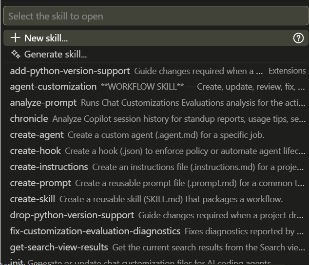

```{r}
#| label: setup
#| include: false
source("../../../_extensions/bootcamp/setup_palettes.R")

knitr::opts_chunk$set(echo = FALSE, warning = FALSE, message = FALSE)
```

## Project and Objective

### Project to use

- We recommend that you use your own project for this (and all the following hands-on sessions)
- If you do not have a project for this bootcamp, we will have a demonstration example available for each hands-on session. For this session, you can download and use [this demo project](TODO: Add url to project)

### Objective

- Set up a memory file - [jump to section](#set-up-a-memory-file)
- Install a skill - [jump to section](#install-a-skill)

# Set Up a Memory File {background-color="#530153"}

## Starting fresh or using a template?

- For this exercise, we will create a memory file from scratch
- This will help you to practice and consider each piece of information you include.
- Going forward, you're more likely to start with a template or a memory file from another project.

At the end of this slide deck, you will see a link to some example memory files. Feel free to look at them if you feel stuck during this exercise, but try to create your own without looking at the templates first.

## Use the agent to create the memory file?

* It is also possible to use the agent itself to create the memory file.
* Some agents provide so-called _slash commands_.
* One example is `/init`, which creates a memory file for you.
* However, memory files created by `/init` tend to be verbose and are usually based only on what the agent finds in the project folder.
* They may not include the project-owner guidance that you want all future edits to follow.
* Still, feel free to ask the agent to add sections that are tedious to type, such as the folder structure. Afterwards, add the information that you, as the project owner, want all contributors to know.

## Set up a new AGENTS.md

In the root folder (the top folder) of your project folder, create a new file called `AGENTS.md`. Then go through the next slides and follow the suggested content.

No one gets an `AGENTS.md` file perfect the first time, so do not make that your worry for this session. The memory file should be a living document where, throughout the project, you add details that the agent needs to perform tasks as you want it to.

Remember that every project is unique, and you should tailor your memory file to fit your specific project's needs. The suggested content is just a guideline. Compare it to RA onboarding documents: there are some sections that RA onboarding documents typically include, but the exact content is different.



## Keep Memory Files Concise

After you set up your memory file, take some time to review it and see if it can be made more concise without losing important context. 

- Since the memory file is included in every request you make, keeping it concise helps you use tokens efficiently and preserve your token budget.
- Adding all onboarding information to the memory file would soon leave little space for the actual task in the context window.
- Use targeted ways to load context only when needed. For example, move a verbose section to a separate file in your project and link to it in the memory file. Include a description next to that link that tells the agent when to load that file into context.
- If you are unsure, it is still better to add relevant context to the memory file than to omit it, even if it is not the most token optimized option. This is an art more than a science.

## Templates and Adaptation

We have started a resource hub at <https://github.com/dime-worldbank/coding-agents-hub/tree/main/memory-files>.

The examples in the `example-library` folder are mature memory files specific to the projects they were created for. It is very unlikely that they will be a good fit for your project as-is. Still, you can use them as references and draw inspiration from them.

# Install a Skill {background-color="#530153"}

## Which Skill?

- If you know which skill you want to use for your project, use that skill.
- If you do not have a particular skill in mind, we recommend using the Impact Analytics skill for [preparing reproducibility packages](https://github.com/worldbank/wb-reproducible-research-repository/tree/main/ai-skills/reproducibility-skill).
  - This skill helps you set up a reproducibility package that follows the standards of the [World Bank's Reproducibility Initiative](https://reproducibility.worldbank.org).

## How to Install

1. Open your project in a VS Code workspace.
1. Locate _or_ create your skills folder.
   - We recommend using the general open-source location `.agents/skills/`. If you do not already have a skills folder, create one at the root (top-level folder) of your workspace.
1. Download the complete folder for the skill you want to use to your computer.
1. Copy the complete skill folder, including all its contents, into your workspace's skills folder.

That is all you need to install the skill.

## Verify the Skill Installation

:::: {.columns .v-center-container}
::: {.column width="70%" }

- Type `/skills` in the Agent chat, press Enter, and confirm that your skill is listed.
- As you can see, agents come with pre-installed slash commands. Test and explore them at some point!
- See whether any of those skills can help you with something you were not sure how to do manually.

:::
::: {.column width="30%" }

:::
::::


## Using the Skill

Three different ways, each with its own nuances, to trigger and use the skill with the agent:

<div style="height: 1em;"></div>

:::: {.columns style="align-items: flex-start;" }
::: {.column width="33%" }
<span style="display: block; text-align: center; line-height: 1;">**Trust agent to detect skill**</span>
:::

::: {.column width="33%" }
<span style="display: block; text-align: center; line-height: 1;">**Force skill without context**</span>
:::

::: {.column width="33%" }
<span style="display: block; text-align: center; line-height: 1;">**Force skill with context**</span>
:::
::::

:::: {.columns style="align-items: flex-start;" }

::: {.column width="33%" }

```markdown
Can you help me review the 
reproducibility package in 
this folder?

```

:::

::: {.column width="33%" }

```markdown
/wb-reproducibility-package

```

:::

::: {.column width="33%" }

```markdown
/wb-reproducibility-package In my 
project the "code" folder is called
"magic-files" and my data folder 
is called "bytes". 
```

:::
::::

<div style="height: 1em;"></div>

:::: {.columns style="align-items: flex-start;" }
::: {.column width="33%" }
<span style="display: block; text-align: center; line-height: 1; font-size: 0.8em;">The agent will use skill descriptions to determine whether any appropriate skills are installed.</span>
:::

::: {.column width="33%" }
<span style="display: block; text-align: center; line-height: 1; font-size: 0.8em;">This forces the agent to use that skill. All instructions for the task are expected to be in the skill.</span>
:::

::: {.column width="33%" }
<span style="display: block; text-align: center; line-height: 1; font-size: 0.8em;">This forces the agent to use that skill, while you add project-specific instructions to the general instructions in the skill.</span>
:::
::::