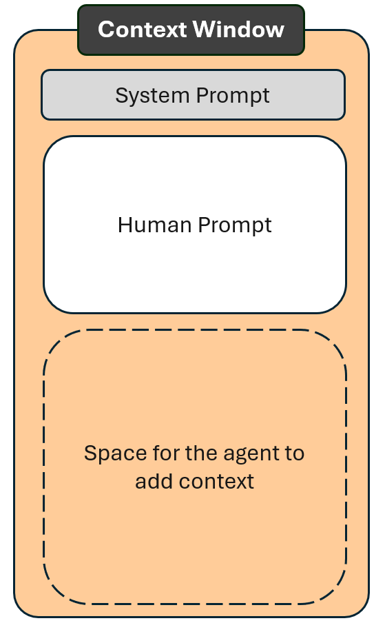

```{r}
#| label: setup
#| include: false
source("../../../_extensions/bootcamp/setup_palettes.R")

knitr::opts_chunk$set(echo = FALSE, warning = FALSE, message = FALSE)
```


## Scope of This Session

:::: {.columns .v-center-container}

::: { .column width="100%" }

- Overview of Large Language Models (LLMs) and how Agents fits in to the LLM evolution
- Introduction to agents, with an emphasis on coding agents and examples from coding work
- Tools and context windows: how agents gather additional information relevant to your prompt

:::

::::

# How Does AI Work? And What Are Agents? {background-color="#530153"}

## Two Types of AI Models

No matter how amazed we are with new AI capabilities the last year, 
the Large Language Models (LLMs) that is the technology behind text based AI, 
can only do these two things. 
And that has not changed since the publication of ChatGPT changed the world forever.

<div style="height: 1.45em;"></div>


:::: {.columns}

::: { .column width="50%" }
### Embedding Models

- Represent the meaning of text as numbers, which is useful for:
  - Comparing text for similarity
  - Finding relevant tasks or documents
  - Identifying gaps in available information
- Do not generate text by themselves
:::

::: {.column width="50%"}
### Generative Models

- Generate text one word at a time by predicting likely next word
- Draw on patterns learned during training
- Can perform common language tasks
:::

::::

## But What About Reasoning Models?

:::: {.columns .v-center-container}

::: {.column width="50%" }

  

:::

::: {.column width="50%" }

### Reasoning Models

- A reasoning model breaks a task into steps and reviews its own progress
- When connected to tools, it can gather additional information that improves its response
- The process is not necessarily linear: it may jump back and forth between steps

:::

::::


# Tools {background-color="#530153"}


## LLMs Cannot Do Math

### What is "3 x 7"?

::: {.fragment}
How many of you solved it by:

- Adding 7 three times: 7 + 7 = 14, and 14 + 7 = 21
- Fetching the answer from memory
:::

::: {.fragment}

### Language models fetch patterns from training
LLMs can often answer "3 x 7" because the answer appears in many multiplication tables in their training data.

However, the exact calculation "35 x 22" is unlikely to appear in the training data, so LLMs alone may produce an incorrect answer.

How can AI platforms like ChatGPT still solve 35 x 22?
:::

## But How Can AI Platforms Do Math?

AI platforms, like ChatGPT or mAI, are more than just the language model. They can connect the model to tools and have instructions for when to use them.

::: {.fragment}
The model identifies that the prompt is a math question. It extracts the numbers and the operator, then sends them to a calculator. The calculator's answer is added to the context. The updated prompt becomes:
:::
::: {.fragment}
```json
{
  "human_prompt": "What is 35 x 22?",
  "calculator_tool_answer": 770
}
```
The model can then generate the answer without doing the calculation itself: "35 times 22 is equal to 770".
:::

::: {.fragment}
### Have you ever helped a child with math homework?

Bob, Alice, and Tom have 7 apples each. How many apples do they have altogether?
:::

# Agents {background-color="#530153"}

## Agents

:::: {.columns .v-center-container}

::: {.column width="65%" }

* An agent is software that combines language models and tools.
* It uses the LLM to review a request and decide which tools to use.
* For example, a coding agent can read code files in the project folder and add relevant content to the context.
* Once the model has enough context, the agent generates a response or, for coding tasks, writes code in the project folder.

:::

::: {.column width="35%" }

  

```json
{
  "human_prompt": "What is 35 x 22?",
  "calculator_tool_answer": 770
}
```

:::

::::

## What Is a Context Window?

:::: {.columns .v-center-container}
::: {.column width="65%" }

* In most AI requests, much more information relevant for the task is gathered in addition to what the user provides.

* This is central to why AI performs so much better today than three years ago.

* Everything sent to the generative model is part of the **_context window_** -- the human prompt is often only a small part of it.

* It may include full content of project files, code outputs, and web searches. Managing the context window is central to productive and cost-effective AI use.

:::
::: {.column width="35%" }

```json
{
  "human_prompt": "What is 35 x 22?",
  "calculator_tool_answer": 770
}
```

:::
::::

## Which Agent is Best?

- Any definite answer will soon be outdated, so I will not attempt one
- Anthropic has pioneered many features, and Claude is currently a market leader
- But just as no one knew about Claude two years ago, no one knows today what tools will be the market leader in two years.
- While the details differ and the features are called different things, how to use AI, including agentic AI, comes down to managing the context window. 
- **_Prediction:_** Skill sets for managing context windows will remain essential for effective AI use, even if they look different and are called something else.
  - _"Don't give the AI user a fish, teach the AI user to fish."_
- Currently, ITS provisions licenses for GitHub Copilot, so that is what we will use in this training.

## Common Confusions Related to Data Privacy and AI Agents

::: {.fragment}
- mAI and GitHub Copilot provides access to Claude models. This is **NOT** the same as using Claude Code. 
:::
::: {.fragment}
- Claude Code is an agent: agents combine models and tools -- Claude Code exclusively use Claude models.
:::
::: {.fragment}
- mAI sends your request to a more secure server, which protects sensitive information. This **DOES NOT** transfer that protection to GitHub Copilot or Claude Code.
:::
::: {.fragment}
- Neither GitHub Copilot nor Claude Code allows you to route traffic through mAI's privately hosted server with the exact same models.
:::
::: {.fragment}
- A personal Claude Code license has less data privacy restrictions compared to WB enterprise GitHub Copilot license -- this explains part of why Claude Code performs better. It simply sends more to the Claude servers for processing.
:::

# Context window  {background-color="#530153"}

## What Do I Need to Know About Context Windows?

:::: {.columns .v-center-container}
::: {.column width="75%" }

The more information included in the context window, the better responses, right? - **NO!!**

* Every context window has a maximum capacity. Its size depends on the model. If you approach or exceed that limit, the AI will summarize earlier content to avoid errors.

* However, the closer to that limit, the less the AI can handle and keep track of details and nuances. How close you can be to the context limit depends on the specific task. 

  * A single incorrect character in code can crash the execution, while a single miscolored pixel in an AI image is not visible to the human eye.

:::
::: {.column width="25%" }



<span style="display: block; text-align: center; font-size: 0.7em; line-height: 1;">This is how we will represent context window from now on.</span>

:::
::::

## Prompt Engineering vs. Agents

Prompt engineering was a popular buzzword two years ago. One central practice was to provide the AI with all relevant context in the prompt. That is still relevant, but agents can gather much of that context for us.

<div style="height: 2em;"></div>

::: {.fragment}
### Which prompt gets the most correct and helpful answer?

**A.** Paste only the error code and ask for a solution.

**B.** Paste the error code and relevant parts of project files that could be related to the error.

Option B is a central best practice in prompt engineering. Coding agents can do much of this work for you.
:::

## Sessions

- Each chat or agent execution is called a session. Each session has its own context window.

- All back and forth between the user and the AI is included in the context window.

- If you are starting a new topic, _always_ start a new session. Otherwise, you clutter the context window which leads to loss of details -- it also saves your token credits.

- Edit and resubmit your previous prompt rather than asking the AI to "forget" earlier prompts or answers.

## Planning Mode

- Use "_planning mode_" when starting a new non-trivial task. 
- In planning mode:
  - The agent stays in context gathering mode, until you indicate it should proceed.
  - The agent gathers relevant context and asks for human input instead of guessing when it cannot find relevant context 
- The agent will provide you with its plan after you have answered questions. If you spot something incorrect or missing, you can provide additional input before execution.

## Set Up GitHub Copilot on WB Computers

For the session after the coffee break, we expect you to have VS Code installed, with GitHub Copilot enabled and authenticated.

Come see us if this is not already the case.

# Thank You! - Questions? {background-color="#530153"}


