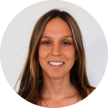
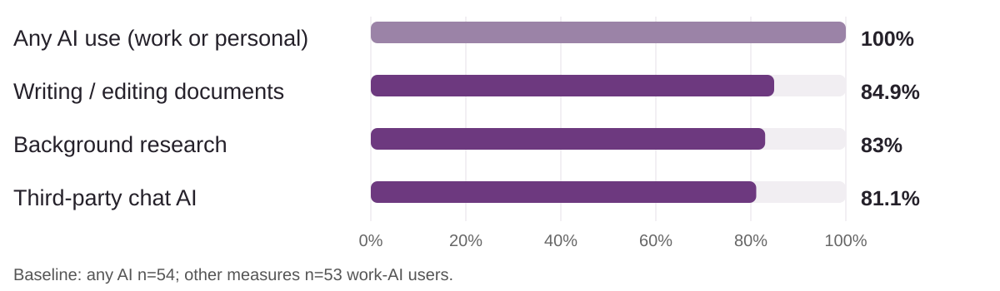
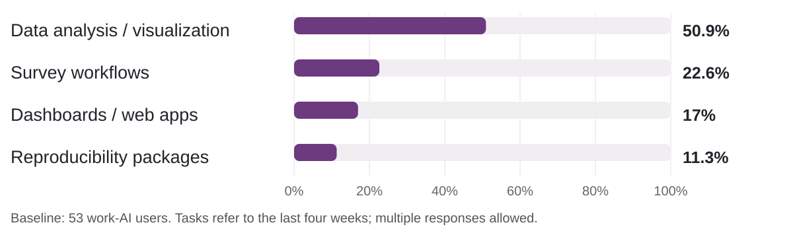

## Welcome: make AI work for your research {.welcome-slide}

::: {.welcome-intro}
This is a **hands-on bootcamp** about applying AI to real analytical work—with tools and workflows available in the World Bank environment.
:::

:::: {.welcome-grid}

::: {.welcome-card}
<h3>Bring your work</h3>
Try AI workflows on your own project, with guidance and technical support from instructors.
:::

::: {.welcome-card}
<h3>Build your pathway</h3>
Start with the foundations, then choose topics that fit your experience, interests, and work program.
:::

::: {.welcome-card}
<h3>Explore the research cycle</h3>
Work with practical examples spanning data and surveys, analysis, research outputs, and reproducibility.
:::

::: {.welcome-card}
<h3>Leave ready to apply</h3>
Build confidence with useful workflows you can adapt and reuse in your day-to-day work.
:::

::::

::: {.welcome-takeaway}
The goal is not just to learn what AI can do—it's to find where it can make your work more effective.
:::

::: {.notes}
~1 minute 30 seconds. Welcome participants and set the practical tone. This bootcamp is not just about AI capabilities: it is about applying tools and workflows in the World Bank environment. Encourage participants to bring a real task or project. They will have opportunities to work on their own projects with instructor guidance and technical support. The program progresses from foundational to advanced sessions, so participants can shape a pathway around their experience, interests, and work programs. Sessions span different stages of analytical work, from data and surveys through research outputs and reproducibility.
:::

## Impact Analytics

### Strengthening research quality across the full production cycle

Impact Analytics is part of the World Bank's Development Impact Group. Its mission is to strengthen the **transparency, credibility, and reproducibility** of research.

Over the past decade, the team has developed **open-source, open-access tools, processes, and training** that support the full research production cycle.

::: {.callout-note-custom}
This Bootcamp brings that practical approach to AI-enabled research workflows.
:::

::: {.notes}
~1 minute. Impact Analytics brings concepts from data science and computer science into development research. Its work includes public goods—open tools, processes, and trainings—to improve transparency, credibility, and reproducibility across the research cycle. The team also partners with the World Bank Group Institute for Economic Development on e-learning that extends these methods globally. Source: [Impact Analytics](https://www.worldbank.org/en/about/unit/unit-dec/impactevaluation/analytics).
:::

## Meet the instructors

<strong>Kristoffer Bjarkefur</strong>

<strong>Maria Reyes Retana</strong>

<strong>Ankriti Singh</strong>

<strong>Marina Visintini</strong>

<strong>Roshni Khincha</strong>

<strong>Jonas Weinert</strong>

::: {.notes}
~45 seconds. Welcome the six instructors. Five portraits are from the public Impact Analytics team page; Jonas Weinert's portrait is from the LinkedIn profile he provided.
:::

## BASELINE_TITLE {#everyone-is-experimenting-with-ai}

{width="100%" fig-alt="Baseline percentages for any AI use, writing, background research, and third-party chat AI."}

::: {.callout-note-custom}
Most people use it for documents and background research, and rely on chat interfaces.
:::

::: {.notes}
~1 minute. These percentages come from the raw baseline responses (n = BASELINE_TOTAL). The any-AI bar includes work or personal use. The other bars are among the BASELINE_WORK_USERS work-AI users. Writing and background research refer to the last four weeks; third-party chat AI is an ever-used tool question. Chat-tool use and background research are separate items, not a measured pairing. This is a cohort baseline, not an estimate for all WBG staff.
:::

## What we're doing less of

{width="100%" fig-alt="Baseline percentages for data analysis, surveys, dashboards or web apps, and reproducibility packages."}

::: {.callout-note-custom}
**Let's change this distribution through coding agents.** Move beyond chat to reusable research workflows. **BASELINE_CODING_PERCENT** have tried a coding agent; our goal is **everyone by the end of the Bootcamp**.
:::

::: {.notes}
~1 minute. The less-used workflows are data analysis/visualization, surveys, dashboards/web apps, and reproducibility packages. All refer to AI use in the last four weeks among BASELINE_WORK_USERS work-AI users. Coding agents are a practical way to expand how we use AI across research workflows. The ever-used coding-agent baseline is BASELINE_CODING_PERCENT; 100% participation by endline is an aspiration, not an observed result. Together, these two slides replace the previous two-minute baseline overview.
:::

## Four days, from foundations to practice {.day-overview}

:::: {.welcome-grid}

::: {.welcome-card}
<h3>Day 1 · Agentic AI at the WBG</h3>
Understand agents; onboard them to a project; use prompts, memory files, and skills; work efficiently and safely.
:::

::: {.welcome-card}
<h3>Day 2 · Data acquisition and analysis</h3>
Apply AI to surveys, transcription, data quality, code improvement, and reproducible tables and charts.
:::

::: {.welcome-card}
<h3>Day 3 · Reproducible research products</h3>
Use AI for literature, presentations, working papers, reproducibility packages, and an adoption plan.
:::

::: {.welcome-card}
<h3>Day 4 · Advanced workflows</h3>
Explore the WBG AI API, dashboards, MCPs, multi-agent workflows, geospatial analysis, and Git-based verification.
:::

::::

::: {.welcome-takeaway}
**Day 4 is optional and advanced.** More than half of the sessions are hands-on.
:::

::: {.notes}
~1 minute. Give the arc, not a session-by-session tour: agent foundations, data work, research products, then advanced/scalable workflows. Day 4 is optional and geared toward people ready for more advanced practice. The closing slide will show the tangible outputs.
:::

## A few things to do

### Take the baseline survey
[Open the baseline survey](https://survey.wb.surveycto.com/collect/ai_bootcamp_pre_survey?caseid=)

### Join the Teams channel
[General | AI-Enabled Research Bootcamp - WB Group](https://teams.microsoft.com/l/team/19%3AWSQWckjEYr1wdopHGzlta4n0OUhBgYgBkSPKvZAU2X81%40thread.tacv2/conversations?groupId=c5942f33-8b4c-4896-b91c-c4627e950b69&tenantId=31a2fec0-266b-4c67-b56e-2796d8f59c36)

### Open the course materials
[Open the bootcamp website](https://dime-worldbank.github.io/ai-research-training/bootcamp/)

::: {.notes}
~1 minute 30 seconds. Ask participants to complete the baseline survey, join the Teams channel for announcements and questions, and bookmark the course website for all materials.
:::

## Leave with outputs—not just ideas {.outcomes-slide}

:::: {.welcome-grid}

::: {.welcome-card}
<h3>A project-ready agent · Day 1</h3>
A memory file for your project, plus a reusable AI skill installed and used.
:::

::: {.welcome-card}
<h3>A stronger data workflow · Day 2</h3>
An AI-programmed survey, reusable data-quality checks, improved code, and a table or chart.
:::

::: {.welcome-card}
<h3>Research you can share · Day 3</h3>
A presentation or policy brief, a reproducibility package, and an adoption plan with 6-week and 3-month targets.
:::

::: {.welcome-card}
<h3>Advanced practice · Optional Day 4</h3>
A MEGA workspace and AI API query, Git-verified AI outputs, and a multi-agent workflow.
:::

::::

::: {.welcome-takeaway}
**Bring a real project. Leave ready to apply new workflows to it.** Your outputs will reflect the sessions you attend; demo materials are available for practice.
:::

::: {.notes}
~1 minute. Close with the tangible outputs listed in the course agenda, not a promise of identical products for every participant. Day 1: a project memory file and a skill installed and used. Day 2: an AI-programmed survey, reusable data-quality checks, reviewed/improved code, and a table or chart; the survey and data checks can use demo materials. Day 3: a presentation or policy brief, reproducibility package, and adoption plan with 6-week and 3-month targets. Optional Day 4: a MEGA workspace and successful World Bank AI API query, AI outputs reviewed through GitHub, and a multi-agent workflow. Encourage participants to leave with workflows they can apply to their own projects. Transition to the first session.
:::
