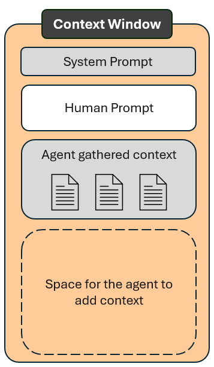
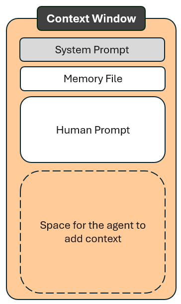
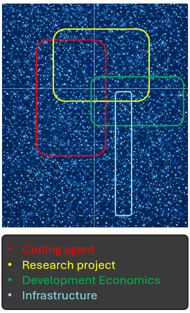

```{r}
#| label: setup
#| include: false
source("../../../_extensions/bootcamp/setup_palettes.R")

knitr::opts_chunk$set(echo = FALSE, warning = FALSE, message = FALSE)
```

# Scope of This Session {background-color="#530153"}

## Scope of This Session

- AI onboarding: how to make it work in your specific context
- How to format and set up memory files
- What to put in a memory file

# Recap and Introduction {background-color="#530153"}

## Populating the Context Window

:::: {.columns .v-center-container}

::: {.column width="70%" }
- The LLMs used by the agent are new to your project for each new request. Without providing the context again, the models do not know whether the project uses Python or Stata, where the code files are located etc.
- The agent needs to search files and add relevant information to the context window each time to provide answers that reflect your project.
- Without any guidance, the agent will gather much more than what it needs. Is there any way for us humans to provide that guidance?
:::

::: {.column width="5%" }
:::

::: {.column width="25%" }
  
:::

::::


## Why is guidance for context important

:::: {.columns .v-center-container}

::: {.column width="70%" }
Agents can browse files and find context without human guidance. Why is it still important for humans to provide guidance and context?

- Repeating the search is token-expensive
- Non-deterministic: the agent may gather different context each time
- Incomplete: not all context relevant to all tasks can be found in project files

Agents have features for humans to provide context in an efficient and predictable way. We should use them.

:::

::: {.column width="5%" }
:::

::: {.column width="25%" }
  
:::

::::


# Memory Files: Purpose {background-color="#530153"}

## Memory Files - What to put in them?

:::: {.columns .v-center-container}

::: {.column width="70%" }

- Think of the memory file as project-specific context that can be added to each new request.
- The agent will gather more context when relevant, while the memory file reduces the need to rediscover recurring information.
- A good memory file provides both:
  - What the agent otherwise gathers for each request
  - Project-specific context that is not available in the project files.

:::

::: {.column width="5%" }
:::

::: {.column width="25%" }
  
:::

::::

## Steer the Model Toward Your Topic


:::: {.columns .v-center-container}

::: {.column width="70%" }

LLMs receive prompts on vastly different topics all the time:

- A scientist designing a research project
- Someone setting up a new exercise routine
- A spouse needing advice on an anniversary gift
- Anything else humans can think of

LLMs do not retain your project context between requests. We get better results if we immediately draw their attention to our topic of interest.

:::


::: {.column width="30%" }
  
:::

::::


## What Do LLMs Know?

- LLMs do store facts in their neural-network memory; they only generate text by predicting likely sequences of words.
- They can produce factually correct answers when facts are statistically very common in their training data.
- Research questions typically lack universally valid correct answers that are commonly repeated online.

:::: {.columns}

::: {.column width="20%" style="border: 1px solid #999; border-radius: 8px; padding: 1em;"}
**General Factual Question:**

_Prompt:_ What is the capital of France?

_AI Answer:_ The capital of France is ...
:::

::: {.column width="20%" style="border: 1px solid #999; border-radius: 8px; padding: 1em;"}
**Specific Research Question:**

_Prompt:_ What control variables are needed to make my regression valid?

_AI Answer:_ You need to control for ...
:::

::::

## What Can You Trust a Coding Agent to Do?

### A coding agent reliably reproduces patterns seen thousands of times

It is usually reliable for generic tasks such as dashboards, API clients, visualizations, and utility functions, without requiring project-specific context.

### But ask yourself questions like:

- Has it seen the econometric judgment behind your research?
- Has it seen your exact regression specification a thousand times?
- Has it seen scripts cleaning your exact dataset a thousand times?

### Agents can still be helpful in such tasks, but they need to be onboarded.

And you know this, as you have done onboarding before...

## What Do RAs Know?

:::: {.columns .v-center-container}

::: {.column width="50%" }
<div style="text-align: center;">

  **_Imagine a super-human RA - someone with a master's degree from each of the top-five economics programs and who became valedictorian at each of them._**

  **_Would that RA be able to start contributing to your research project without any onboarding?_**
</div>
:::

::: {.column width="50%" }
  - AI onboarding is similar in principle to RA onboarding.
  - Use resources previously used to onboard RAs as the starting point for onboarding AIs.
  - Upload RA onboarding documents and ask the AI to summarize the information most relevant to contributing to code.
:::

::::


# Memory Files: Format {background-color="#530153"}

## Markdown

:::: {.columns .v-center-container}

::: {.column width="50%" }
- Instructions to agents are often written in Markdown, which is easily read by humans and machines. Markdown formatting helps structure the content and makes it easier for humans to read.
- Markdown uses symbols for formatting, similar to LaTeX but much simpler.

```markdown
# Project Notes
## Data Sources
Raw files are saved in data/raw.
```
:::

::: {.column width="50%" }
| You write | What it is used for |
|---|---|
| Regular text | Regular text |
| `# Level 1 heading` | Level 1 heading |
| `## Level 2 heading` | Level 2 heading |
| `**bold text**` | **bold text** |
| `1. numbered point` | 1. numbered point |
| `` `inline code` `` | `inline code` |
| `[link text](url)` | [link text](url) |

:::
::::

## Memory File Name Format

- Different agents look for different memory file names when loading instructions automatically.
- Agents often use `AGENTS.md` as a fallback if the expected file name is not found.
- Even without a match or fallback, agents can find memory files by browsing project files.

| Name | Agent | Cross-agent compatibility |
|---|---|---|
| `AGENTS.md` | Cursor, Codex, and others | Widely recognized and a common fallback |
| `CLAUDE.md` | Claude | Well-recognized agent-specific name, though not always loaded directly |
| `.github/copilot-instructions.md` | GitHub Copilot | Eventually located by other agents, but slower because it is in a subfolder |
| `GEMINI.md` | Gemini | Less common, but eventually located by other agents | 

# Memory Files: Content {background-color="#530153"}

## Content Format

- Think of a memory file as project-specific prefix added to your prompts.
- This is project onboarding that the LLM needs to provide project-relevant answers.
- Prompts are natural-language instructions without technical requirements, and so are memory files.
- Since memory files are added to each context window, they tend to be less verbose and use bullet points and other formatting that makes them concise.

### Set up

- Just create a file named `AGENTS.md` in your project directory - we recommend you using that file name to make your project agent-agnostic.

## Memory File Content

- There is no universal best practice yet for these files.
- Coding agents are made by and for software developers.
- Making these agents work for our field is not only a technical question; it is also a domain-knowledge question.

### Possible Sections

- Project description
- Folder structure
- Data descriptions
- Software preferences
- Research design
- Rules

## Project Description

- For each request, the LLM looks at your project for the first time.
- Use LLMs to make a short summary of your concept note or analysis plan.
- Focus on details important to someone implementing your project, not details important to someone approving or funding it.

### What Sets Your Research Apart from a generic example

What makes your project different from textbook examples or private-sector data science.

| Probably better | Probably worse |
|---|---|
| Developing-country context | Exact country context |
| The novel research question | Just the general research topic |
| The type of data sources | A generic description of the topic |


## Folder Structure and Important Files

:::: {.columns}

::: {.column width="40%" }

### File Structure

- Tell the agent where to find what and where to save what.
- Do not just list folders; also explain their intended usage.

:::

::: {.column width="60%" }

```markdown
project/
├── data/
│   ├── raw/          Raw datasets - do not save any processed data here
│   └── processed/    Modified datasets ready for analysis
├── code/
│   ├── clean/        Data cleaning scripts
│   └── analysis/     Statistical analysis scripts
└── paper/            Manuscript and related documents

```

:::
::::

### File paths to specific files

Agents can also follow specific file paths. For example, if you have a file describing your treatment assignment in an RCT, you can point to that file directly and add a description where that file is:

```markdown
Treatment assignment strategy file: `paper/research-design/treatment_assignment.md`
```

## Data Descriptions

- Describe the location of input datasets.
- Describe the main variables in each dataset.
- Point to a codebook for full documentation.

### Input Datasets

```markdown
- `data/raw/census_2011.csv`: 
  - household demographics. Main variables: household ID and income. 
  - Full codebook: `data/raw/census_2011_codebook.csv`.
- `data/raw/firm_panel.dta`: 
  - firm-level output. Main variables: firm ID and sales. 
  - Full codebook: `data/raw/firm_panel_codebook.csv`.
- `data/raw/prices_monthly.csv`: 
  - monthly commodity prices. Main variables: commodity, region, month, and price. 
  - Full codebook: `data/raw/prices_monthly_codebook.csv`.
```

## Software Preferences

- List the tools you want to use.
- Specify the programming language and packages.
- Specify data packages, such as `dplyr` versus `data.table`.
- Specify output formats for tables and visualizations.
- Specify the dynamic document type.

### Example

```markdown
- Write data-cleaning and analysis code in Stata.
- Use Python or R only for data visualization.
- Use LaTeX for the report and export all tables in `.tex` format.
```

## Programming Preferences

- Include preferred best practices, such as using a main do-file that runs all other code.
- Include naming conventions.

### Code Writing Guidelines

```markdown
- Make sure all code can be run through a single script called `code/main.do`.
- Each time you create a new script, add it to the workflow in `main.do`.
- Write clean and well-commented code; human readability is important.
```

## Research Design and Preferences

- This is an area where you will always know better than the agent what is valid in your context.
- The next session will provide a more specific tool, skills, for detailed steps. For now, list a high-level description of the research design.
- Include the randomization strategy, units of randomization, treatment modality, and so on.
- Include preferences such as "always use OLS."


## Rules

Telling the agent what not to do is just as important as telling it what to do.

### Examples:

- Packages and tools not to use
- Files not to edit
- Anything else you have ever told an RA not to do

# Thank You! {background-color="#530153"}

## Questions?


--- 