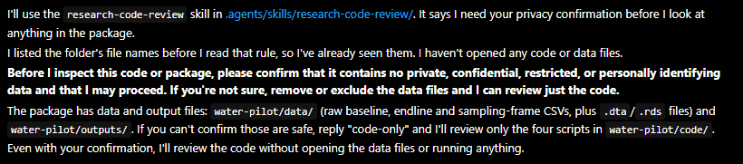
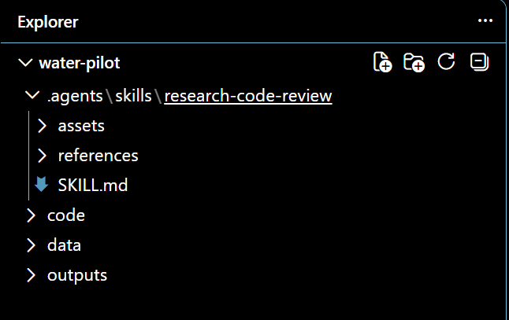

```{r}
#| label: setup
#| include: false
source("../../../_extensions/bootcamp/setup_palettes.R")

knitr::opts_chunk$set(echo = FALSE, warning = FALSE, message = FALSE)
```

## Objective

```{=html}
<style>
/* Styles used across this deck. Kept here, inside the first slide, so they do not create an empty slide. */
.flow { display: flex; align-items: stretch; gap: 0.5em; margin: 0.4em 0 0.8em; font-size: 0.62em; }
.flow-phase { flex: 1; border-radius: 10px; padding: 0.5em 0.6em 0.7em; }
.flow-phase.p1 { background: #F4EAF4; }
.flow-phase.p2 { background: #FAF7FA; border: 2px dashed #B974B9; }
.flow-label { font-family: "Montserrat", sans-serif; font-weight: 700; color: #530153; font-size: 0.85em; margin-bottom: 0.5em; }
.flow-steps { display: flex; align-items: center; gap: 0.35em; }
.flow-step { flex: 1; background: #FFFFFF; border: 2px solid #800280; border-radius: 8px; padding: 0.45em 0.3em; text-align: center; line-height: 1.25; color: #1A1A1A; }
.flow-step.gate { border-color: #530153; background: #530153; color: #FFFFFF; }
.flow-arrow { align-self: center; color: #800280; font-weight: 700; }
.flow-decide { align-self: center; background: #800280; color: #FFFFFF; border-radius: 50%; width: 5.2em; height: 5.2em; display: flex; align-items: center; justify-content: center; text-align: center; font-weight: 700; line-height: 1.2; flex-shrink: 0; }
.flow-icon { display: block; font-size: 1.1em; margin-bottom: 0.15em; }
.agent-quote { border-left: 4px solid #800280; background: #FAF7FA; padding: 0.5em 0.9em; font-size: 0.72em; line-height: 1.4; }
.agent-quote p { margin: 0.3em 0; }
.reveal .ba-columns.columns { align-items: flex-start; }
.reveal .ba-columns pre, .reveal .ba-columns div.sourceCode { overflow: hidden; }
.reveal table.cost-table { width: 100%; }
.reveal .big-tree, .reveal .big-tree code { font-size: 0.75em !important; line-height: 1.5 !important; }
.reveal pre.mid-tree code, .reveal .mid-tree pre code { font-size: 1.6em !important; line-height: 1.45 !important; }
.reveal .slides a { text-decoration: underline; text-underline-offset: 0.15em; }
.reveal div.sourceCode, .reveal pre.sourceCode { overflow: hidden !important; }
.reveal pre.sourceCode.markdown code { font-size: 1.35em !important; line-height: 1.5 !important; }
</style>
```

By the end of this session, you will have:

- Reviewed one existing code file or code package with an AI skill
- Triaged the findings: decided which proposed changes to accept as they are, which to modify or discuss further, and which to set aside for now
- Let the agent implement a few approved fixes and checked the diff

## Agenda

- Why review research code with an AI skill
- How the code review skill works
- What it looks like in practice
- Hands-on: review and improve your own code, or the demo project

# Why review code with AI? {background-color="#530153"}

## Your name is on code you didn't write

- Most TTLs don't write all their own code: research assistants and consultants write much of it
- The final product carries the TTL's name, so they need to know the code is right and free of issues
- Reviewing every line by hand takes time, and is often not feasible
- AI makes this harder: coding agents write more code, faster, and no one has read all of it closely

## Research code fails quietly

Most errors in research code do not crash. They change results.

- Combining two datasets can quietly create extra copies of rows *(many-to-many merges)*
- Removing duplicates can keep the wrong record *(no rule for which copy to keep)*
- A random draw can come out differently every time the code runs *(no seed set)*
- Codes for "refused" or "don't know" get treated as real numbers *(e.g., −99, −88)*
- Code only runs on the author's computer *(hard-coded paths)*

## Mistakes are found late, and late is expensive

```{=html}
<table class="cost-table">
  <thead>
    <tr><th>When the mistake is found</th><th>What it costs</th></tr>
  </thead>
  <tbody>
    <tr class="fragment"><td>While writing the code</td><td>Minutes: the logic is still fresh</td></tr>
    <tr class="fragment"><td>At peer review or a project milestone</td><td>Days: rerunning and re-checking downstream steps</td></tr>
    <tr class="fragment"><td>At the reproducibility check before publication</td><td>Weeks: results change, tables and text need rework</td></tr>
    <tr class="fragment"><td>After publication</td><td>A correction, a retraction, lost credibility</td></tr>
  </tbody>
</table>
```

::: {.fragment}
Most review happens in the last two rows.
:::

## Reproducible is not the same as correct

::: {.callout-note-custom}
Only **1 in 5** packages we receive reproduce as-is.
:::

:::: {.columns .ba-columns}

::: {.column width="50%"}
**What our check asks**

- Does the code run from start to finish?
- Does it produce the same tables and figures?
:::

::: {.column width="50%"}
**What it doesn't ask**

- Does the merge keep the right rows?
- Are "don't know" codes treated as missing?
- Are dropped observations documented?
:::

::::

Code can reproduce perfectly and still be wrong. The code review looks for both kinds of problem, before the code goes public.

## From peer code review to an AI skill

Before AI coding tools, DEC ran [peer code reviews](https://github.com/worldbank/dime-standards/blob/master/dime-coding-standards/guidance_note_peer_code_review.md): colleagues were paired up and reviewed each other's code against standard checklists. It was useful, but code was often at different stages, and people weren't always ready to share work in progress.

Now that AI writes more of our code, we've turned those checklists into a skill:

- Review your code at any stage, whenever you want
- No need to share unfinished code with a colleague

## Why a skill, not just a prompt?

Asking an agent to "review my code" works, but it checks different things each time, at a different depth, and may start opening data or editing files right away.

The skill gives every review the same foundation:

- A curated list of checks built from DEC's peer code review checklists
- The same checks and severity levels every time, so reviews can be compared across projects and team members
- Built-in guardrails: it reads your code but never runs it or opens your data, checks privacy first, and changes nothing until you approve
- A standard report you can act on

## Three complementary skills for improving research code

| Skill | When to use it | Session |
|---|---|---|
| **Code review** | After you finish a coding task or stage, or to review an entire research-code project | This session |
| **Automate outputs** | During analysis, to automate the production of outputs such as tables and figures | Next session |
| **Reproducibility** | To prepare and validate a complete reproducibility package | Day 3 |

: {tbl-colwidths="[22,58,20]"}

## What is in the skill

```{.text .mid-tree}
research-code-review/
├── SKILL.md                    # the workflow and guardrails
├── references/
│   ├── review-flags.md         # what to check: 60+ flags with severity
│   ├── languages.md            # Stata, R, and Python specifics
│   └── phase-one-report.md     # how to write the report
└── assets/
    ├── main.do  main.R  main.py   # entry-point script templates
```

The flags draw on the checklists developed for peer review of code within DEC, and on the reproducibility failures we see most often in the packages we review.

# How the skill works {background-color="#530153"}

## Two phases, with you in control

```{=html}
<div class="flow">
  <div class="flow-phase p1">
    <div class="flow-label">Phase 1 · read-only</div>
    <div class="flow-steps">
      <div class="flow-step gate"><span class="flow-icon">🔒</span>Privacy check</div>
      <div class="flow-arrow">→</div>
      <div class="flow-step"><span class="flow-icon">🔍</span>Static review</div>
      <div class="flow-arrow">→</div>
      <div class="flow-step"><span class="flow-icon">📋</span>Report and flags</div>
    </div>
  </div>
  <div class="flow-arrow">→</div>
  <div class="flow-decide">You<br>decide</div>
  <div class="flow-arrow">→</div>
  <div class="flow-phase p2">
    <div class="flow-label">Phase 2 · only what you approve</div>
    <div class="flow-steps">
      <div class="flow-step gate"><span class="flow-icon">🔒</span>Git check</div>
      <div class="flow-arrow">→</div>
      <div class="flow-step"><span class="flow-icon">🛠️</span>Approved fixes</div>
    </div>
  </div>
</div>
```

- **Phase 1** reads code and documentation only. It does not open data, run code, install packages, or edit files.
- **Phase 2** happens only if you ask, and only for the fixes you approve.

## Guardrails built in

- **Privacy gate:** the agent asks you to confirm the folder has no private, confidential, or personally identifying data *before* it lists a single file. "Probably fine" counts as no.
- **Doesn't run your code:** Phase 1 only reads code and documentation, even if the data are public.
- **No edits without Git:** before changing anything, the agent asks whether the project is under version control and offers a new branch, so every change shows up as a diff you can review (example later).
    - No Git? Ask the agent to copy the original files to a backup folder first, and to keep a change log of every edit.
- **Research choices stay with you:** the agent won't decide which observations to drop, how to fill in missing values, how to treat outliers, or which model to run. It flags these as **No** findings for you to decide.

::: {.notes}
The privacy gate is the skill's own check. It is separate from Claude Code's permission prompts, which ask before running commands or editing files.

Git is what makes coding agents safe to use: every change is visible, reviewable line by line, and reversible.
:::

## What it checks

| Area | Examples |
|---|---|
| Privacy and secrets | Credentials in code, identifiers in shared outputs |
| Package structure | Entry-point script, README, inputs → scripts → outputs |
| Stability and reproducibility | Seeds, stable sorts, absolute paths, versions, overwritten raw data |
| IDs, merges, appends | Unique keys, merge cardinality, `m:m`, forced deduplication |
| Cleaning and missing data | Undocumented value changes, missing-value codes |
| Construction | Units, denominators, aggregation keys, outliers |
| Sampling and assignment | Documented design, frame checks, weights |
| Analysis and outputs | Hard-coded choices, manual copying of tables |
| High-frequency checks | Survey tracking, durations, enumerator summaries |

: {tbl-colwidths="[32,68]"}

## Severity reflects consequences

| Severity | Meaning |
|---|---|
| **Critical** | Privacy exposure, credentials, destructive behavior, or materially invalid results |
| **High** | Strong risk of wrong results, or a consequential step that cannot be reproduced |
| **Medium** | Risky or hard to rerun (no checks, only works on one computer), but no sign it changed your results |
| **Low** | Local readability or consistency issues |

: {tbl-colwidths="[20,80]"}

Severity is about risk to your results, not how hard the fix is.

## Reading the report

Each finding is one row, sorted from Critical to Low:

::: {.small-table}
| ID | Flag | Severity | Location | AI implementation | Proposed next action |
|---|---|---|---|---|---|
| `STAB-001` | `runiform()` with no seed | High | `01_randomize_treatment.do:23` | Conditional | Provide a seed, then set it before the draw |
| `DATA-005` | Attriters dropped without a documented rule | High | `04_analyze_impacts.R:27` | No | Researcher decides and documents the rule |
| `STAB-007` | Absolute user path in every script | Medium | `02_clean_baseline.R:11` | Yes | Define the project root once, derive all paths |
:::

Example rows from a review of the demo project.

## Three kinds of finding

| AI implementation | What it means | What you do |
|---|---|---|
| **Yes** | The intended behavior is clear from the code or docs | Approve, and the agent implements it |
| **Conditional** | A value or decision is needed first | Answer the question, or approve the proposed choice |
| **No** | A research or privacy decision only you can make | Decide, document, then optionally ask the agent to implement *your* decision |

"Do the straightforward ones" approves only the **Yes** items.

Don't agree a change is needed, or not now? Answer `defer`: nothing changes, and the item stays on the "still open" list.

## Answering Conditional findings

The report ends with a form you can copy, edit, and send back:

```text
STAB-001 — Random seed

Agent recommendation or information needed:
Provide the seed or seed-selection policy that this workflow should use.

Your response: provide: seed = 20261006
```

Accepted answers: `approve`, `change: ...`, `provide: ...`, `defer`, `discuss`.
Or answer briefly: `DATA-003: approve`, `CLEAN-003: defer`.

A blank or unclear answer leaves the item unresolved.

# What it looks like in practice {background-color="#530153"}

## The privacy gate in action

Before reading any code, the agent asks for confirmation:

{fig-alt="The agent asks the user to confirm the package contains no private or personally identifying data before it inspects any code, and offers a code-only review if the user is unsure." width="100%"}

## The Git gate in action

We answered the form and asked the agent to make the changes. The folder was not a Git repository, so it stopped:

::: {.agent-quote}
I haven't changed any files yet. Your form says the project is tracked with Git, but this folder is not a Git repository. The review skill says I mustn't edit without either Git tracking or your explicit OK to work untracked. Options:

**A.** Point me to the real repo, if this folder is a copy of one.<br>
**B.** Ask me to run `git init`, commit the current files as a baseline, then make the changes on `code-review-fixes`. I recommend this, so you get a reviewable diff.<br>
**C.** Let me edit the files untracked.
:::

## Not sure? Answer "discuss"

When a finding needs a decision you're unsure about, reply `discuss` instead of approving. The agent then:

- Explains the options, with their pros and cons
- Describes the usual practice in research code
- Recommends one option and says why
- Changes nothing until you choose

*For example: "Should the balance table use every observation available for each variable, or one common sample for all variables?"*

## What Phase 2 reports back

After making the changes, the agent reports:

- **Changes by finding ID:** for example, *STAB-001: added `version 18`, a sort by `district_id`, `set seed`, and a stable sort*
- **New files:** `main.R` (one entry point for Stata and R) and `README.md`
- **Before you rely on the outputs:** which results will change when you rerun, and why
- **Still open:** deferred items (DATA-007, CLEAN-006) and researcher decisions (CONST-001, DATA-005, ANALYSIS-004)
- **Not changed:** anything you did not approve

::: {.callout-note-custom}
Nothing is committed until you have reviewed the diff.
:::

## Review randomization code before fieldwork

Example from a test project.

:::: {.columns .ba-columns}

::: {.column width="48%"}
**Before**

```stata
* Randomize within each zone so
* treatment is balanced geographically.
gen random_order = runiform()
sort random_order
gen treatment = _n <= 6
```
:::

::: {.column width="4%"}
:::

::: {.column width="48%"}
**After**

```stata
version 18
...
* Simple (unstratified) random assignment:
* 6 districts are treated across all zones.
* Sort by ID first so the draw does not
* depend on file order.
sort district_id
set seed 237567
gen random_order = runiform()
sort random_order, stable
gen treatment = _n <= 6
```
:::

::::

The comment now matches the method the code uses (RAND-001); the seed, version, and stable sort make the draw reproducible (STAB-001). Do this before anything happens in the field: after fieldwork, a new seed won't recreate the assignment that was actually used.

## What the review does not tell you

- That your code reproduces your results: nothing was run
- That your data are clean: no data were opened
- That your research design is right: methodological findings are questions, not verdicts

::: {.callout-note-custom}
Treat the report as a well-prepared peer reviewer's notes. You still own every decision and every line that changes.
:::

# Hands-on {background-color="#530153"}

## Your code, or the demo project

We encourage you to review **your own code**: a script you wrote recently, or a project you are working on.

If you don't have any code with you, use the demo project, **water-pilot**:

- A synthetic impact evaluation of a water conservation pilot in 12 districts
- **Stata** randomly assigns districts to treatment
- **R** cleans the baseline and endline surveys, checks balance and attrition, and estimates treatment effects
- Four short scripts and three small CSV files, all synthetic, with realistic mistakes in the code

## One missing line flips the result

The demo project has no `set seed`. We ran the same code on the same data twice:

| | Run 1 | Run 2 |
|---|---|---|
| Treated districts, North / South / East | 1 / 3 / 2 | 2 / 1 / 3 |
| Treatment effect, unadjusted | +1.90 (SE 1.69) | **−3.73 (SE 1.30)** |
| Treatment effect, adjusted | +2.17 (SE 1.77) | **−4.27 (SE 1.18)** |

::: {.callout-note-custom}
No error, no warning. Just the opposite conclusion. Will the review catch it?
:::

## Where should the skill go?

:::: {.columns}

::: {.column width="50%"}
The skill lives in a folder inside your project, where the agent can find it:

1. In your project's top folder, create a folder called `.agents` (with the dot)
2. Inside `.agents`, create a folder called `skills`
3. Save the skill folder, `research-code-review`, inside `skills`

Tip: create the folders in VS Code's Explorer. On a Mac, Finder hides folders whose names start with a dot.
:::

::: {.column width="50%"}
```{.text .big-tree}
your-project/
├── .agents/
│   └── skills/
│       └── research-code-review/
│           ├── SKILL.md
│           ├── references/
│           └── assets/
├── code/
├── data/
└── outputs/
```
:::

::::

## Set up

:::: {.columns}

::: {.column width="55%"}
1. Download the skill: [research-code-review.zip](https://github.com/dime-worldbank/ai-research-training/releases/download/research-code-review-latest/research-code-review.zip)
2. Open your project in VS Code
3. In the project's top folder, create `.agents`, and inside it, `skills`
4. Unzip the skill into `skills`, keeping the whole `research-code-review` folder
5. Move any non-public data out of the project folder

Using the demo? Download [water-pilot.zip](https://github.com/dime-worldbank/ai-research-training/raw/refs/heads/main/bootcamp/sessions/day-2/ai-review-code/materials/water-pilot.zip), unzip it, open the `water-pilot` folder, and follow steps 2–4.
:::

::: {.column width="45%"}
{fig-alt="VS Code Explorer showing the water-pilot folder with .agents/skills/research-code-review expanded to assets, references and SKILL.md, followed by the code, data and outputs folders."}
:::

::::

## Run the review

Open your project in VS Code and prompt your agent:

```markdown
Read .agents/skills/research-code-review/SKILL.md and use it to review
the research-code package in this folder.
```

Or review only a few files:

```markdown
Read .agents/skills/research-code-review/SKILL.md and review only:
- code/01_randomize_treatment.do
- code/04_analyze_impacts.R
Treat this as a selected-files review.
```

Confirm the privacy question when asked (the demo data are synthetic), then read the report.

## Triage the findings

For each finding, ask:

- Is the evidence real? Open the file at the reported line.
- Is the severity right for *your* project?
- Is it **Yes**, **Conditional**, or **No**, and do you agree?

Then fill in the Conditional decision form: approve, change, provide a value, defer, or discuss.

## Implement and check

1. Make sure your project is in Git, and let the agent work on a new branch
2. Approve a few **Yes** items and any Conditional items you answered
3. Review the diff line by line in VS Code's Source Control panel
4. Ask the agent to run an affected script only if it is safe to do so
5. Commit what you accept; discard what you don't

## Discuss

- Which finding surprised you most?
- Did the agent flag anything that was not actually a problem?
- Which **No** items do you now need to decide on as a team?

## Key takeaways

- A skill turns "review my code" into a repeatable, standards-based review
- Review early: right after a coding task, not just before publication
- Read-only first: privacy confirmation, then static review, then your decisions
- The agent proposes; you approve. Research decisions are never automatic
- Git and a branch make every AI change reviewable and reversible

## Sources

The review flags and language rules are built from:

- DECDI peer code-review guidance and checklists, including the [Stata code review checklist](https://github.com/worldbank/dime-standards/tree/master/dime-coding-standards/checklists)
- DECDI research standards (DIME Standards): [reproducibility](https://github.com/worldbank/dime-standards/tree/master/dime-research-standards/pillar-3-research-reproducibility) and [data security](https://github.com/worldbank/dime-standards/tree/master/dime-research-standards/pillar-4-data-security)
- [World Bank guidance note on reproducible research](https://worldbank.github.io/wb-reproducible-research-repository/guidance_note_wb.html)
- [DECDI Data Map (DIME Data Map)](https://github.com/worldbank/dime-standards/tree/master/dime-coding-standards/data-map)
- [DECDI coding guide and Stata style guide (DIME Analytics Data Handbook)](https://worldbank.github.io/dime-data-handbook/coding.html)
- Language style guides: [Tidyverse](https://style.tidyverse.org/), [data.table reference semantics](https://rdatatable.gitlab.io/data.table/articles/datatable-reference-semantics.html), and [PEP 8](https://peps.python.org/pep-0008/)

## Thank you {.closing}

This skill is a work in progress, and we'd love your feedback.
