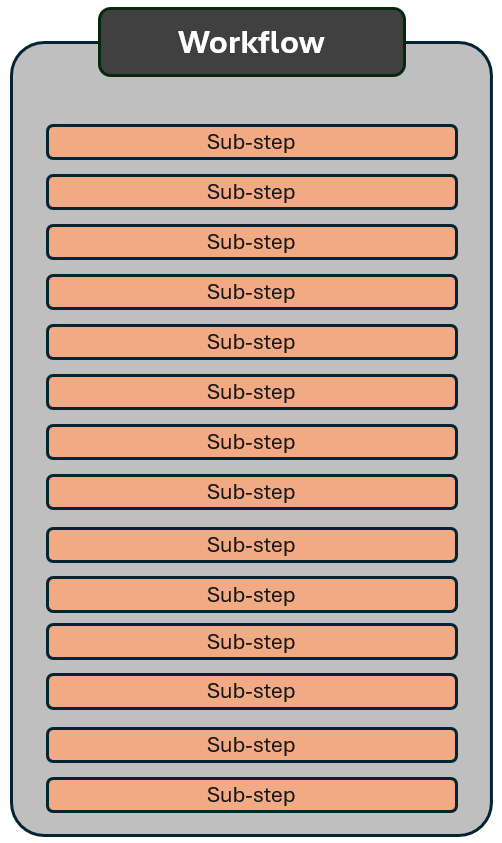
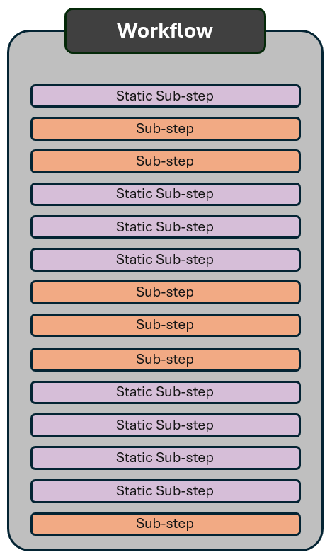
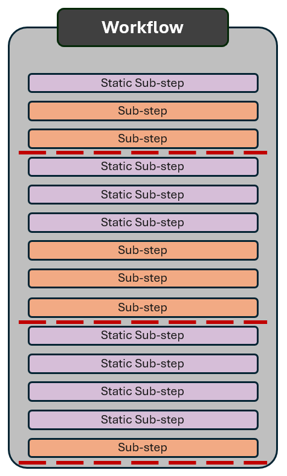

```{r}
#| label: setup
#| include: false
source("../../../_extensions/bootcamp/setup_palettes.R")

knitr::opts_chunk$set(echo = FALSE, warning = FALSE, message = FALSE)
```


## Agenda

- Why human review remains essential
- Techniques for evaluating AI-generated outputs
- Building a validation checklist

# The Challenge is Not New {background-color="#530153"}

## Human in the loop is not new

- The underlying reason for keeping a human in the loop is not new. We have always done "TTL-in-the-loop" or, more commonly called, simply old-fashioned _human review_.

::: {.fragment}
- The underlying reason is that the human owner of a product is always responsible for the product, no matter if the product was created by:
  - the human owner
  - a more junior human
  - a robot
:::

::: {.fragment}
- _**If the product is a static product**_, such as a report or a code script, then the method we need are not new.
- _**If the product is a robot making qualitative decisions for us**_, then that is new and requires new methods.
:::

## Static Products vs. Decision Making Products

This distinction is crucial to understand what type of human in the loop is needed - raise questions and ask if this distinction is not clear

:::: {.columns}
::: {.column style="border: 3px solid #D6BED8; border-radius: 8px; padding: 0.5em;"}

### Static Tools

- Examples: Reports, presentation decks, code etc.
- Created by team members, vendors, or AI-tools
- Product owner reviews finalized output before the product is used, published etc. This is old-fashioned "human-in-the-loop"

:::

::: {.column style="border: 3px solid #F2AA84; border-radius: 8px; padding: 0.5em;"}

### Decision Making Products

- Examples: Review bots, interactive bots like chat bots, etc.
- Set up by team members, vendors, or AI-tools
- Answers and decisions are made in real time. We can do a final review of the setup, but not the output (unless we have a "human-in-the-loop")

:::
::::

## Why are these distinctions important?

- Computers have been handling important tasks for decades. For example, financial transactions. 
- No human reviews your internet banking transactions.

::: {.fragment}
### So, what is different about AI-powered computers?

- AI is non-deterministic: it uses a random process and its output can vary and be incorrect.
- While banks develop code using AI today, no bank will let a non-deterministic AI handle your transaction.
- If AI would handle your financial transactions, banks would need a human-in-the-loop to review each transaction before any money is transferred.
:::

::: {.fragment}
When AI is used to make qualitative decisions, we either need a human-in-the-loop or have been convinced the error rate is acceptably low.
:::

# Reduce the Need for Human-in-the-Loop {background-color="#530153"}

## In Practice - Full AI

:::: {.columns .v-center-container}
::: {.column width="75%" }

- Many of you have come with complex workflows to this training - such as the multi-step process visualized on this slide.
- Today's AI systems can most likely handle very complex workflows and generate results that _are correct in most cases_.
- Sometimes, "_in most cases_" is good enough - if not, then we need to review output. 
- But if we need to review all output, has it saved us any time or effort?

:::
::: {.column width="25%" }



:::
::::


## Not everything has to (or should) involve random AI

:::: {.columns .v-center-container}
::: {.column width="75%" }

- Before adding a human-in-the-loop system that will require many manual human hours, can we reduce the need?

- When a computer can adequately handle a task deterministically by code it should - i.e. the example of financial transactions

- Break up your workflow into smaller workflows, and ask yourself, which one can be done deterministically with human reviewed code?
  - Reduced the need of human-in-the-loop
  - Increased quality of your workflow's output

:::
::: {.column width="25%" }



:::
::::


## But I can't code!?

- Maybe you can't code - but the agent can do it for you!

- Creating the code with human review. Validate that it performs the tasks as intended. 

- How can I verify code if I can't code?

  - After the agent generated the code, ask the agent to explain what it does. Use a different model to check that explanations are consistent and accurate.
  - Ask the agent to explain in a language you understand. Keep asking questions until you are confident.
  - Ask the agent what edge cases the code might fail on - and address if necessary.
  - Give the agent test cases, including tricky ones that check how it handles edge cases. Don't use only easy or obvious examples; real-world examples aren't always easy or obvious.


## Add human-in-the-loop checkpoints

:::: {.columns .v-center-container}
::: {.column width="75%" }

- Hopefully, in your workflow, you now start to see natural locations for human checkpoints.
- Make sure that both code and AI steps documents what they have done - this will help the human review
- What is a human-in-the-loop checkpoint? Depends on what you have used for your workflow.
   - _Skills_ - each skill is all the steps between checkpoints - don't run next skill until after the human review
   - _Multi-agent workflow_ - don't approve that next agent takes over until after the human review
   - _Dashboard or monitoring system_ - review and then approve moving to next step.

:::
::: {.column width="25%" }



:::
::::


## When can I remove human checkpoints

### What level of accuracy do you need? 
 - Are you ok with a 20% error rate? Could be ok, if it the system is an initial check
 - What would the consequences be if the AI makes an error?
 - If you need perfect or near-perfect accuracy, human checkpoints are likely necessary, or at least take a lot of work to eliminate

### Can you thoroughly evaluate the AI's performance?

- Do you have 100s or old cases you know should pass or fail? If so, run them through your system and check accuracy
- Can you make a thorough evaluation of the AI's performance? Have 100 TTLs use the tool and provide feedback.
- How does the AI-workflow handle self-identified failures? And how will humans address them.

Use agents that review the output and generate a "confidence score". What threshold should require human review?

- You probably have more intuition for how to do this than you think. If you have ever managed a junior team member, you already have an intuition for what to review and what to delegate.


