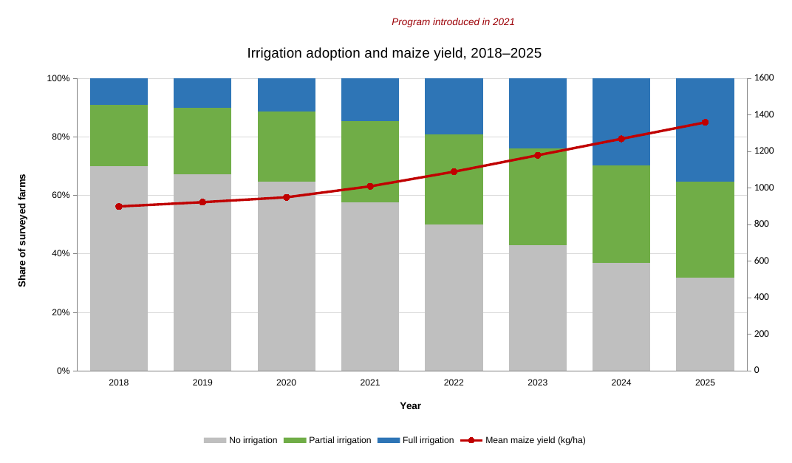
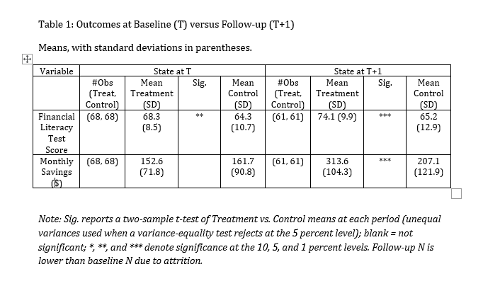

## Session objective

Turn a manually prepared table or figure into a workflow that:

- starts from the project's source data;
- performs the calculations and formatting in code;
- regenerates the exhibit without manual editing;
- records how to run and check the result.

# Why automate exhibits {background-color="#530153"}

## The figure nobody can rebuild

:::: {.columns}

::: {.column width="32%"}
### 2021, baseline

Data cleaned in Stata. Figure 1 built in Excel from pasted values, with labels
and colors adjusted by hand.
:::

::: {.column width="32%" .fragment}
### 2023, midline

Some records are corrected. Figure 1 is rebuilt by hand, and nobody writes down
which version of the numbers it used.
:::

::: {.column width="32%" .fragment}
### 2026, submission

The journal asks for a reproducibility package. The replicator runs the code,
and no Figure 1 comes out. The analyst who built it has moved on.
:::

::::

::: {.callout-note-custom .fragment}
If the code ends before the figure does, nobody can rebuild the figure, no
matter how clean the code is.
:::

## Why automate the exhibit

- **The data will change.** Corrections, new survey rounds, new years. With
  code, you rerun. By hand, you rebuild.
- **Copying introduces errors.** Every retyped number is a chance for a typo.
  
- **Others can check the work.** Code shows how every number was made. An
  Excel chart doesn't.
- **It looks the same every time.** Labels, colors, and formats don't drift
  between versions.

## What an automated exhibit looks like

:::: {.columns}

::: {.column width="22%"}
**1. Inputs**

Source or cleaned data
:::

::: {.column width="22%"}
**2. Code**

Calculations and plotting data
:::

::: {.column width="22%"}
**3. Rendering**

Table or figure formatting
:::

::: {.column width="22%"}
**4. Output**

One publication-ready file
:::

::::

. . .

Run the code, get the exhibit, with no manual calculations or formatting in
between.

# The skill {background-color="#530153"}

## Why a skill instead of a long prompt {.smaller}

### Without the skill, you'd have to write

> Reproduce the figure in R. First inspect the workbook formulas, chart
> sources, and named ranges. Don't use the displayed values as inputs. Keep the
> existing cleaning code. Build the plotting data before drawing. Check the
> values before the appearance. Create only a PNG. Don't add new folders. If
> Stata isn't available, ask me to run it. Finish with a numbered run order and
> list the files I can delete…

::: {.fragment}
### With the skill

> Use the reproduce-manual-exhibit skill to reproduce the Excel figure in this
> project using R.

::: {.callout-note-custom}
The prompt names the task. The skill holds the method, so every run follows the
same steps and checks and ends with the same handoff.
:::
:::

## When to use the skill

Use it when:

1. A table or figure already exists, in Excel, Word, PDF, or as an image, and
   shows the result you want.
2. You want Stata, R, or Python code to regenerate it from the source data.

. . .

**Not for:** exploratory analysis with no reference exhibit.

If the exhibit contains pasted numbers with no traceable source, the agent says
what is missing and asks for it instead of guessing.

## Skill structure

```text
reproduce-manual-exhibit/
├── SKILL.md      when to use it, the steps, rules, final handoff
├── references/   detailed guidance: workflow, tables, figures,
│                 validation, and one file each for R, Stata, Python
└── scripts/      helpers to inspect Excel and compare tables/figures
```

The agent reads only what the task needs: the table or figure guide, plus one
language guide.

## Reconstruction workflow

1. **Inspect the evidence**
   Review the project, reference exhibit, data, and existing code.

2. **Recover the logic**
   Identify calculations, plotted values, labels, ordering, and formatting.

3. **Implement the smallest useful change**
   Preserve the project structure and generate one requested output.

4. **Run and validate**
   Check the data and semantics before inspecting the rendered exhibit.

5. **Report the new workflow**
   Explain what changed, how to run it, and what can now be deleted.

## Tables and figures

:::: {.columns}

::: {.column width="48%"}
### Tables

Compute every number in code at full precision. Round and format only at the
last step.
:::

::: {.column width="48%"}
### Figures

Build the plotting data first, then draw the chart from it.
:::

::::

::: {.callout-note-custom}
In both cases, the agent first checks that the numbers match the original,
then checks how the output looks.
:::

## Choosing the final file

Choose the format used by the next stage of the research workflow.

| Intended use | Typical output |
|---|---|
| Figure for a paper, report, or slide | PNG |
| Table used in Word | RTF or DOCX |
| Table included in a LaTeX paper | TEX |
| Table used in Excel | XLSX |
| Table used in a web report | HTML |

# Demonstration and exercise {background-color="#530153"}

## Choose your project {.smaller}

**Option A: your own project.** You need a manually prepared table or figure,
the data behind it, and any existing code.

**Option B: a demo project from `materials/`.**

| Project | Contents | Manual step |
|---|---|---|
| `r-demo` | `01-clean-data.R`, `data/`, `output/manual-figure.xlsx` | Chart built and formatted in Excel |
| `excel-demo` | `analysis.xlsx`, `source-data.csv` | All calculations done with Excel formulas |
| `stata-demo` | `Clean Data.do`, `Analysis.do`, `data/`, `Coaching Pilot Paper.docx` | Table 1 typed into Word from Stata output |

## Set up your project {.smaller}

:::: {.columns}

::: {.column width="48%"}
### Your own project

1. [Download the skill](https://github.com/dime-worldbank/ai-research-training/raw/refs/heads/main/bootcamp/sessions/day-2/reproducible-exhibits/skills/reproduce-manual-exhibit.zip) and unzip it.
2. In your project folder, create a folder named `.agents/skills/`.
3. Move the unzipped `reproduce-manual-exhibit/` folder into `.agents/skills/`.
4. Open your project folder in VS Code.
:::

::: {.column width="48%"}
### A demo project

1. Download one demo project and unzip it:
   [r-demo](https://github.com/dime-worldbank/ai-research-training/raw/refs/heads/main/bootcamp/sessions/day-2/reproducible-exhibits/materials/r-demo.zip),
   [excel-demo](https://github.com/dime-worldbank/ai-research-training/raw/refs/heads/main/bootcamp/sessions/day-2/reproducible-exhibits/materials/excel-demo.zip), or
   [stata-demo](https://github.com/dime-worldbank/ai-research-training/raw/refs/heads/main/bootcamp/sessions/day-2/reproducible-exhibits/materials/stata-demo.zip).
2. [Download the skill](https://github.com/dime-worldbank/ai-research-training/raw/refs/heads/main/bootcamp/sessions/day-2/reproducible-exhibits/skills/reproduce-manual-exhibit.zip) and unzip it.
3. Inside the demo folder, create `.agents/skills/` and move
   `reproduce-manual-exhibit/` into it.
4. Open the demo folder in VS Code.
:::

::::

::: {.callout-note-custom}
Create `.agents` from the VS Code Explorer. Folders whose names start with a dot
can be hidden in Finder.
:::

## Where the skill goes

:::: {.columns}

::: {.column width="48%"}
### Your own project

```text
your-project/
├── .agents/skills/
│   └── reproduce-manual-exhibit/
└── (your code, data, exhibit)
```
:::

::: {.column width="48%"}
### A demo project

```text
r-demo/
├── .agents/skills/
│   └── reproduce-manual-exhibit/
├── 01-clean-data.R
├── data/
└── output/manual-figure.xlsx
```
:::

::::

- Copy the **whole** folder, not just `SKILL.md`.
- Open the project folder itself in VS Code, not a parent folder.

## Demo: R figure {.smaller}

:::: {.columns}

::: {.column width="38%"}
- `01-clean-data.R` cleans the CSV and writes the yearly data into the
  workbook.
- `data/synthetic-irrigation-monitoring.csv` holds the district-year data.
- `output/manual-figure.xlsx` holds the chart built by hand, which reads the
  data through named ranges.
:::

::: {.column width="60%"}
{width="100%"}
:::

::::

## Demo prompt

```md
Use the reproduce-manual-exhibit skill to reproduce the Excel figure in this project using R. 
```

. . .

The project is already open in VS Code. Detailed paths are needed only if the
agent cannot determine which workbook, data, or script the request refers to.

## The updated workflow {.smaller}

The final handoff should use researcher-facing instructions:

1. Run `01-clean-data.R`.
2. Run `02-make-figure.R`.
3. Open `output/figure-1.png`.

. . .

It should also report:

- files created or modified;
- required software and packages;
- validation status and unresolved choices;
- exact paths of files that can be deleted, or state that nothing should be
  deleted.

::: {.callout-note-custom}
The agent recommends deletion candidates. It does not delete them without the
researcher's approval.
:::

## Excel demo

`analysis.xlsx`: Raw Data → Calculations (`SUMIFS`/`COUNTIFS`) → Table 1 and
Figure 1. There's no code.

Note: the formula ranges stop at row 49, and the household counts are typed in,
not calculated.

```md
Use the reproduce-manual-exhibit skill to reproduce Table 1 in analysis.xlsx using R, starting from source-data.csv. Output the table as an XLSX file.
```

Prefer Python or Stata? Replace "using R" with your language.

## Stata demo

{height="330px" fig-align="center"}

```md
Use the reproduce-manual-exhibit skill to automate Table 1 in the paper using Stata. Output the table as an RTF file.
```

## Can the agent run Stata? {.smaller}

**Yes, if Stata is installed on your computer.** The agent runs the do-file in
batch mode from the VS Code terminal and reads the log, for example:

```text
"C:\Program Files\Stata18\StataMP-64.exe" /e do "Analysis.do"
```

**On Windows, the agent often won't find Stata.** It usually isn't on the
terminal's search path, and the skill allows only one quick check, without
searching the disk.

::: {.callout-note-custom}
**Tip:** put the path in your prompt: *"Stata is at
C:\\Program Files\\Stata18\\StataMP-64.exe."*
:::

**If the agent can't run Stata:** you run the do-file and return the first
error, the `r()` code, and nearby log lines. The agent fixes one error at a
time until the do-file completes.

R and Python are usually on the path, so the agent runs those itself.

## Review checklist

- Does the exhibit come out of the code, with nothing done by hand?
- Do the numbers match the original?
- Did it keep your existing code and create only the file you asked for?
- Is the run order clear?
- Are open questions listed, not guessed?

## Key takeaways

- **Automate the exhibit, not just the analysis.** The table or figure should
  come out of the code.
- **The prompt names the task. The skill supplies the method.**
- **You stay in charge.** Review how the agent reads the exhibit, check the
  numbers, and decide what it can't infer.

## Thank you {.closing}

Questions?
