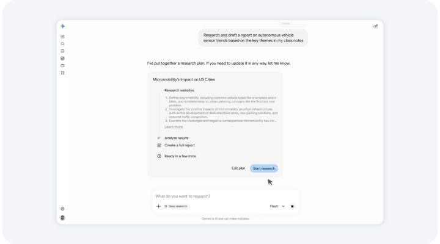
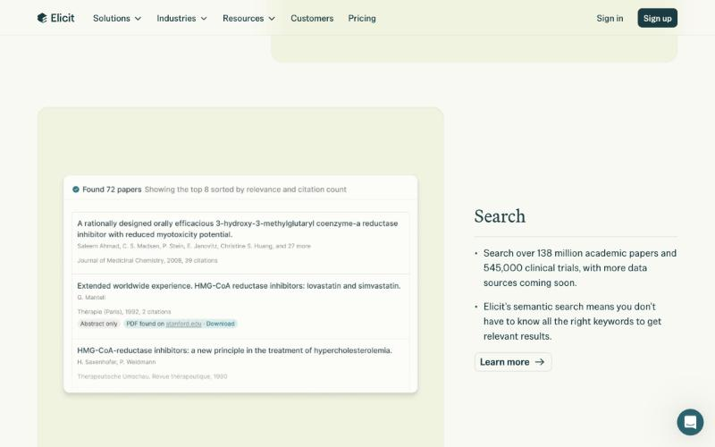
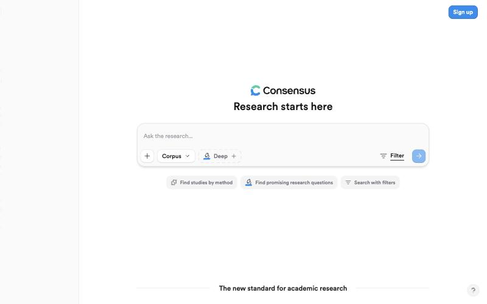
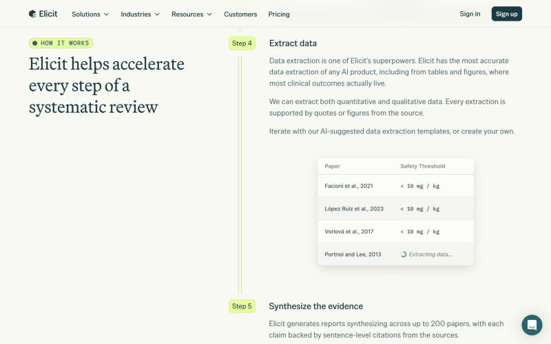
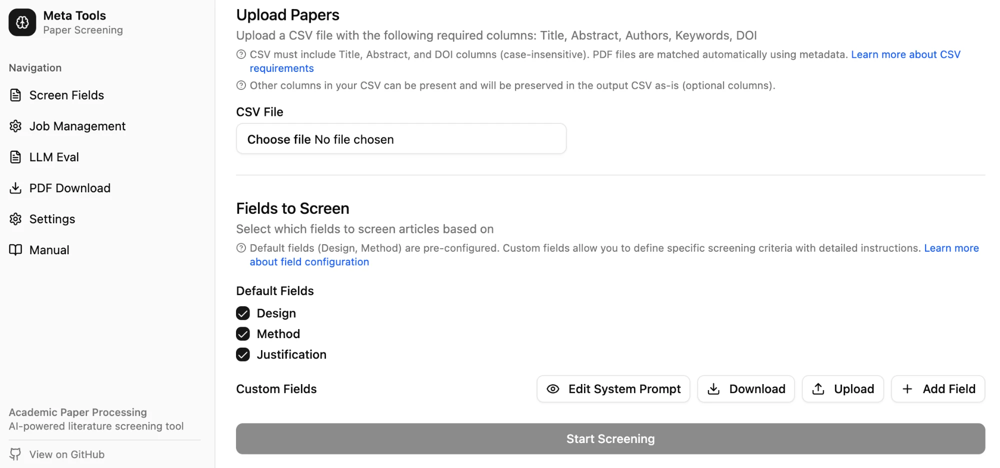
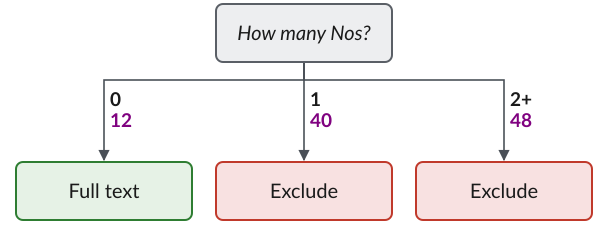
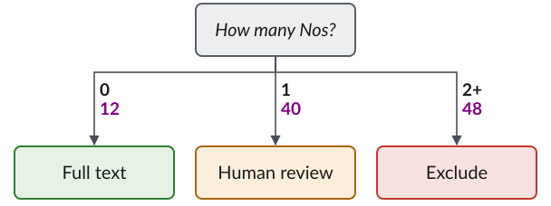
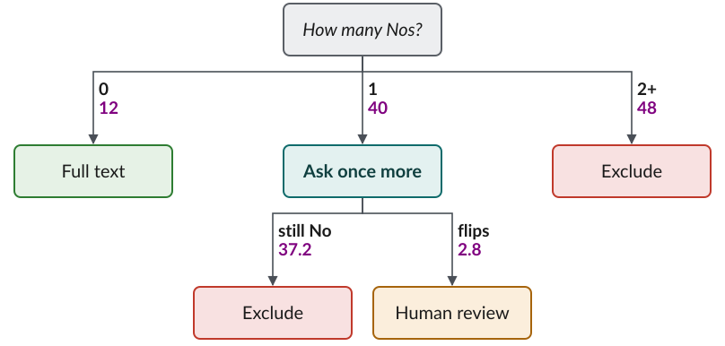
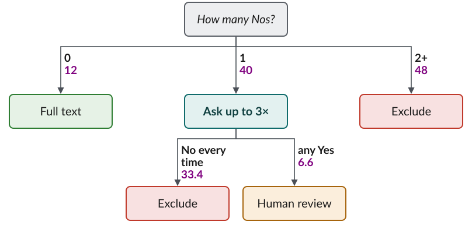
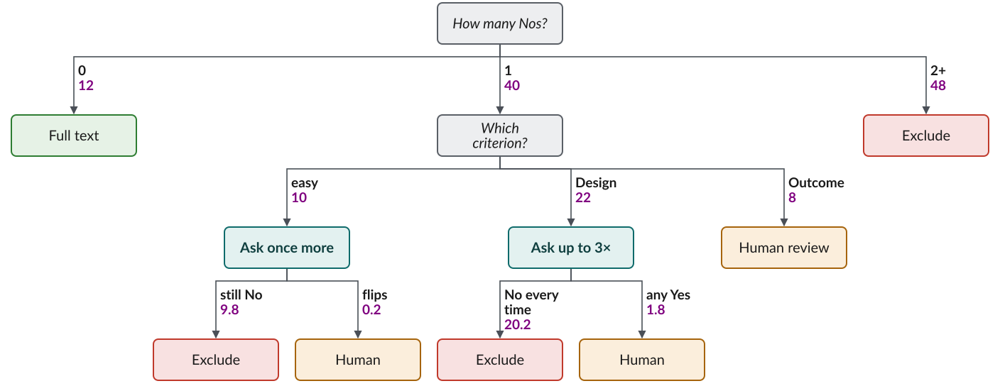

```{r}
#| label: setup
#| include: false
source("../../../_extensions/bootcamp/setup_palettes.R")

knitr::opts_chunk$set(echo = FALSE, warning = FALSE, message = FALSE)
```

## Why are you reading the literature?

```{=html}
<style>
/* ---------- shared tokens (bootcamp palette) ---------- */
:root { --navy:#530153; --blue:#800280; --cyan:#B974B9; --pale:#F4EAF4; --red:#C0392B; --green:#1E8F5B; --grey:#6B6B6B; }
.ic { width: 1.6em; height: 1.6em; stroke: currentColor; fill: none; stroke-width: 2; stroke-linecap: round; stroke-linejoin: round; flex: 0 0 auto; }
.big-ic .ic { width: 2.2em; height: 2.2em; }
.reveal .muted { color: var(--grey); }

/* ---------- cards ---------- */
.cards { display: grid; gap: 18px; margin-top: 0.6em; }
.cards.c2 { grid-template-columns: 1fr 1fr; }
.cards.c3 { grid-template-columns: repeat(3, 1fr); }
.cards.c4 { grid-template-columns: repeat(4, 1fr); }
.cards.c5 { grid-template-columns: repeat(5, 1fr); }
.card { background: var(--pale); border-radius: 12px; padding: 22px 22px; color: var(--navy); display: flex; flex-direction: column; gap: 10px; font-size: 0.95em; line-height: 1.35; }
.card p { margin: 0; }
.card.dark { background: var(--blue); color: #fff; }
.card.line { background: #fff; border: 2px solid var(--cyan); }
.card h4, .card .ct { display: block; margin: 0; font-family: "Montserrat", sans-serif; font-weight: 700; font-size: 1.2em; color: inherit; text-transform: none; }
.card .ex { font-style: italic; display: block; font-size: 1.05em; margin: 8px 0; }
.card .foot { display: block; margin-top: auto; font-size: 0.85em; opacity: 0.8; }
.cards.c5 .ct { font-size: 1em; }
.cards.c5 .card { padding: 18px 14px; }
.reveal .card.dark strong, .reveal .card.dark code { color: #fff; }
.card code { font-size: 0.9em; }

/* ---------- flows ---------- */
.flow { display: flex; align-items: stretch; gap: 8px; margin: 0.3em 0; }
.step { flex: 1 1 0; border-radius: 10px; padding: 20px 12px; font-size: 0.92em; line-height: 1.25; display: flex; flex-direction: column; align-items: center; justify-content: center; text-align: center; gap: 6px; }
.step.you { background: var(--blue); color: #fff; }
.step.ai { background: var(--pale); color: var(--navy); border: 2px solid var(--cyan); }
.step small { font-size: 0.8em; opacity: 0.85; }
.arrow { align-self: center; color: var(--blue); font-weight: 700; font-size: 1.1em; }
.flow-label { font-family: "Montserrat", sans-serif; font-weight: 700; color: var(--navy); font-size: 0.9em; margin: 0.8em 0 0.3em; }
.key { display: flex; gap: 8px; justify-content: flex-end; font-size: 0.6em; margin-top: 0.4em; }
.key span { padding: 3px 10px; border-radius: 4px; }
.key .you { background: var(--blue); color: #fff; }
.key .ai { background: var(--pale); color: var(--navy); border: 1px solid var(--cyan); }

/* ---------- big statement ---------- */
.punch { font-family: "Montserrat", sans-serif; font-weight: 700; color: var(--navy); font-size: 1.1em; text-align: center; margin-top: 1.2em; }

/* ---------- timeline ---------- */
.timeline { display: flex; height: 200px; border-radius: 10px; overflow: hidden; margin: 1em 0 0.4em; }
.timeline div { display: flex; flex-direction: column; justify-content: center; padding: 0 22px; color: #fff; font-size: 0.9em; line-height: 1.25; }
.timeline b { font-family: "Montserrat", sans-serif; font-size: 1.1em; }

/* ---------- chat ---------- */
.chat { display: flex; flex-direction: column; gap: 10px; font-size: 0.78em; line-height: 1.3; }
.bubble { max-width: 82%; padding: 9px 14px; border-radius: 14px; }
.bubble.agent { background: var(--pale); color: var(--navy); align-self: flex-start; border-bottom-left-radius: 3px; }
.bubble.me { background: var(--blue); color: #fff; align-self: flex-end; border-bottom-right-radius: 3px; }
.who { font-size: 0.75em; font-weight: 700; opacity: 0.7; display: block; }

/* ---------- chips ---------- */
.chips { display: flex; flex-wrap: wrap; gap: 8px; align-items: center; margin: 0.35em 0; font-size: 0.72em; }
.chips .lbl { font-family: "Montserrat", sans-serif; font-weight: 700; color: var(--navy); width: 5.5em; }
.chip { padding: 4px 11px; border-radius: 999px; border: 1.5px solid var(--cyan); color: var(--navy); background: #fff; }
.chip.on { background: var(--blue); border-color: var(--blue); color: #fff; font-weight: 700; }

/* ---------- comment card ---------- */
.comment { border-left: 6px solid var(--red); background: #fff; box-shadow: 0 2px 10px rgba(0,0,0,.12); border-radius: 6px; padding: 14px 18px; font-size: 0.75em; line-height: 1.35; }
.comment .hdr { font-family: "Montserrat", sans-serif; font-weight: 700; color: var(--red); margin-bottom: 4px; }
.comment p { margin: 3px 0; }
.btns { display: flex; gap: 8px; margin-top: 10px; }
.btn { padding: 6px 14px; border-radius: 6px; font-weight: 700; font-size: 0.95em; border: 2px solid var(--blue); color: var(--blue); }
.btn.hot { background: var(--blue); color: #fff; }

/* ---------- folder tree ---------- */
.tree { font-family: "Fira Code", monospace; font-size: 0.72em; line-height: 1.55; background: var(--pale); border-radius: 10px; padding: 14px 20px; color: var(--navy); white-space: pre; }
.tree em { font-family: "Lato", sans-serif; font-style: normal; color: var(--grey); }

/* ---------- prompt box ---------- */
.prompt { background: #1E1E1E; color: #F4EAF4; border-radius: 8px; padding: 14px 18px; font-family: "Fira Code", monospace; font-size: 0.72em; line-height: 1.35; }
/* ---------- literature session additions ---------- */
.step.stage-strong { background: var(--navy); color: #fff; }
.step.stage-mid { background: var(--cyan); color: #fff; }
.step.stage-risk { background: #fff; color: var(--red); border: 2px dashed var(--red); }
.key .k-strong { background: var(--navy); color: #fff; }
.key .k-mid { background: var(--cyan); color: #fff; }
.key .k-risk { border: 1px dashed var(--red); color: var(--red); }
.funnel { display: flex; flex-direction: column; align-items: center; gap: 6px; margin: 0.6em 0 0.4em; }
.fbar { box-sizing: border-box; background: var(--pale); color: var(--navy); border-radius: 6px; padding: 9px 14px; font-size: 0.72em; text-align: center; white-space: nowrap; min-width: fit-content; }
.fbar span { font-family: "Montserrat", sans-serif; font-weight: 700; font-size: 1.15em; margin-right: 6px; }
.fbar.dark { background: var(--blue); color: #fff; }
.placeholder { border: 3px dashed var(--cyan); border-radius: 10px; background: repeating-linear-gradient(45deg, #fff, #fff 12px, #FAF5FA 12px, #FAF5FA 24px); color: var(--grey); display: flex; flex-direction: column; justify-content: center; align-items: center; text-align: center; gap: 8px; padding: 20px; min-height: 260px; font-size: 0.7em; white-space: pre-line; }
.placeholder b { color: var(--blue); font-family: "Montserrat", sans-serif; }
.placeholder.small { min-height: 300px; }
.results { display: flex; flex-direction: column; gap: 5px; margin-top: 10px; font-size: 0.62em; }
.res { padding: 6px 12px; border-radius: 6px; display: flex; justify-content: space-between; gap: 10px; }
.res small { opacity: 0.7; white-space: nowrap; }
.res.on { background: #DCF3E6; color: #155C3B; font-weight: 700; }
.res.off { background: #F2F2F2; color: #8A8A8A; }
.dots { display: grid; grid-template-columns: repeat(7, 54px); gap: 12px; margin: 0.8em 0 0.4em; }
.dot { width: 54px; height: 54px; border-radius: 50%; display: block; }
.dot.hit { background: var(--blue); }
.dot.miss { border: 3px dashed var(--cyan); box-sizing: border-box; }
.bignums { display: grid; grid-template-columns: repeat(3, 1fr); gap: 18px; margin-top: 0.8em; }
.bignums div { background: var(--pale); border-radius: 12px; padding: 22px; text-align: center; color: var(--navy); }
.bignums b { display: block; font-family: "Montserrat", sans-serif; font-size: 2.2em; color: var(--blue); line-height: 1.1; }
.bignums span { font-size: 0.7em; line-height: 1.3; display: block; margin-top: 8px; }
.card.err { background: #FBE4E4; color: #8E2A20; }
.reveal .card.err strong, .reveal .card.err b { color: #8E2A20; }
.strat { display: flex; flex-direction: column; gap: 7px; margin-top: 0.5em; font-size: 0.66em; }
.srow { display: grid; grid-template-columns: 13em 1fr 9em; align-items: center; gap: 12px; }
.srow .sname { font-weight: 700; color: var(--navy); }
.srow .sbar { display: block; min-width: 3.2em; box-sizing: border-box; border-radius: 4px; padding: 5px 8px; color: #fff; white-space: nowrap; background: var(--red); }
.srow .srev { text-align: right; color: var(--blue); font-weight: 700; }
.srow.head { font-size: 0.85em; color: var(--grey); }
.srow.head .srev { font-weight: 400; color: var(--grey); }
.checks { display: grid; grid-template-columns: 1fr 1fr; gap: 14px; margin-top: 0.6em; }
.checks div { display: flex; gap: 14px; align-items: center; background: var(--pale); border-radius: 10px; padding: 14px 16px; font-size: 0.72em; color: var(--navy); line-height: 1.3; }
.checks b { flex: 0 0 1.8em; height: 1.8em; border-radius: 50%; background: var(--blue); color: #fff; display: flex; align-items: center; justify-content: center; font-family: "Montserrat", sans-serif; }
/* ---------- restructure additions ---------- */
.jobs { display: grid; grid-template-columns: repeat(3, 1fr); gap: 18px; margin-top: 0.5em; }
.job { background: var(--pale); color: var(--navy); border-radius: 12px; padding: 18px; display: flex; flex-direction: column; gap: 8px; font-size: 0.72em; line-height: 1.3; }
.job.dark { background: var(--blue); color: #fff; }
.job b { font-family: "Montserrat", sans-serif; font-size: 1.35em; }
.reveal .job.dark b, .reveal .job.dark i { color: #fff; }
.job i { font-size: 1.05em; min-height: 2.7em; }
.job .jn { font-family: "Montserrat", sans-serif; font-weight: 700; font-size: 1.1em; opacity: 0.6; }
.job .jq { border-top: 1px solid rgba(128,2,128,.25); padding-top: 6px; }
.job.dark .jq { border-color: rgba(255,255,255,.35); }
.job .jq span { display: block; font-size: 0.8em; font-weight: 700; opacity: 0.7; text-transform: uppercase; letter-spacing: .04em; }
.debate { display: flex; flex-direction: column; gap: 8px; }
.debate .lbl { display: block; font-family: "Montserrat", sans-serif; font-weight: 700; color: var(--navy); font-size: 0.62em; margin-bottom: 4px; }
.root { background: var(--blue); color: #fff; border-radius: 6px; padding: 7px 12px; font-size: 0.62em; margin-bottom: 5px; display: flex; justify-content: space-between; gap: 8px; }
.root small { opacity: 0.8; white-space: nowrap; }
.recent .res { font-size: 0.62em; margin-bottom: 5px; }
.tracker { display: flex; gap: 5px; margin: -0.2em 0 0.5em; }
.tracker span { flex: 1; text-align: center; font-size: 0.42em; padding: 4px 2px; border-radius: 4px; background: #F2F2F2; color: #9A9A9A; font-weight: 700; }
.tracker span.done { background: var(--pale); color: var(--cyan); }
.tracker span.on { background: var(--blue); color: #fff; }
.pipe { display: grid; grid-template-columns: repeat(7, 1fr); gap: 8px; margin-top: 0.7em; }
.ps { background: var(--pale); color: var(--navy); border: 2px solid var(--cyan); border-radius: 10px; padding: 14px 8px; text-align: center; display: flex; flex-direction: column; gap: 6px; font-size: 0.62em; line-height: 1.2; }
.ps.you { background: var(--blue); color: #fff; border-color: var(--blue); }
.ps span { font-family: "Montserrat", sans-serif; font-weight: 700; font-size: 1.6em; opacity: 0.6; }
.ps b { font-size: 1.05em; }
.reveal .ps.you b { color: #fff; }
.ps small { opacity: 0.85; }
.runs { display: flex; flex-direction: column; gap: 12px; margin-top: 0.4em; }
.rrow { display: grid; grid-template-columns: 11.5em 1fr; align-items: center; gap: 10px; font-size: 0.66em; color: var(--navy); }
.rd { display: flex; gap: 4px; }
.rd i { width: 16px; height: 16px; border-radius: 50%; background: var(--pale); border: 1.5px solid var(--cyan); display: inline-block; }
.rd i.n { background: var(--red); border-color: var(--red); }
.key .nokey { background: var(--red); color: #fff; }
.rewrite { display: flex; align-items: stretch; gap: 12px; margin-top: 0.5em; }
.rewrite .card { flex: 1; }
.crit { display: flex; flex-direction: column; gap: 8px; margin-top: 0.4em; font-size: 0.64em; }
.crow, .chead { display: grid; grid-template-columns: 12em 1fr 1fr; gap: 16px; align-items: center; color: var(--navy); }
.chead { color: var(--grey); font-size: 0.9em; }
.crow span { display: flex; align-items: center; gap: 8px; }
.cn { font-weight: 700; }
.cb { display: inline-block; height: 18px; border-radius: 3px; max-width: 75%; }
.cb.bad { background: var(--red); }
.cb.good { background: var(--green); }
.cb.good.warn { background: #A6640C; }
.rules, .walk { width: 100%; border-collapse: separate; border-spacing: 0 6px; font-size: 0.6em; margin-top: 0.3em; }
.reveal .rules th, .reveal .walk th { color: var(--navy); font-family: "Montserrat", sans-serif; text-align: left; border: none; padding: 4px 8px; }
.reveal .rules td, .reveal .walk td { border: none; padding: 7px 8px; background: #FAF6FA; vertical-align: middle; }
.pill { display: inline-block; padding: 3px 10px; border-radius: 999px; font-weight: 700; color: #fff; font-size: 0.95em; margin-right: 4px; }
.pill.exc { background: var(--red); }
.pill.rev { background: var(--blue); }
.pill.rer { background: #A6640C; }
.reveal .walk td { text-align: center; font-weight: 700; font-size: 1.05em; }
.reveal .walk td:first-child { text-align: left; font-weight: 400; background: var(--pale); }
.reveal .walk td small { font-weight: 400; font-size: 0.85em; }
.reveal .walk td.bad { background: #FBE4E4; color: #8E2A20; }
.reveal .walk td.ok { background: #DCF3E6; color: #155C3B; }
.reveal .walk td.cost { background: #FBF1E1; color: #8A5A00; }

/* ---------- intuition slides ---------- */
.setup { display: grid; grid-template-columns: 1fr 1.3fr; gap: 18px; margin-top: 0.5em; align-items: stretch; }
.critlist { display: grid; grid-template-columns: 1fr 1fr; gap: 10px; }
.crit-c { border-radius: 10px; padding: 14px 16px; font-size: 0.8em; line-height: 1.3; display: flex; flex-direction: column; gap: 4px; color: var(--navy); }
.crit-c b { font-family: "Montserrat", sans-serif; font-size: 1.15em; }
.crit-c span { font-size: 0.8em; font-weight: 700; text-transform: uppercase; letter-spacing: .05em; }
.crit-c.easy { background: #DCF3E6; } .crit-c.easy span { color: #155C3B; }
.crit-c.hard { background: #FBF1E1; } .crit-c.hard span { color: #8A5A00; }
.flip { margin-top: 8px; font-size: 0.9em; font-weight: 700; padding: 4px 10px; border-radius: 6px; align-self: flex-start; }
.flip.bad { background: #FBE4E4; color: #8E2A20; }
.flip.good { background: #DCF3E6; color: #155C3B; }
.reveal .card.dark .flip.good b, .reveal .flip b { color: inherit; }
.grid100 { display: grid; grid-template-columns: repeat(10, 34px); gap: 7px; margin: 0.4em 0 0.3em; }
.grid100 i { width: 34px; height: 34px; border-radius: 50%; background: #DCF3E6; border: 2px solid #1E8F5B; box-sizing: border-box; display: block; }
.grid100 i.c { background: #FBF1E1; border-color: #A6640C; }
.grid100 i.w { background: var(--red); border-color: var(--red); }
.key .k-clear { background: #DCF3E6; color: #155C3B; }
.key .k-conf { background: #FBF1E1; color: #8A5A00; }
.askagain { display: flex; align-items: center; justify-content: space-between; gap: 8px; margin-top: 0.6em; }
.aa { background: var(--pale); color: var(--navy); border-radius: 12px; padding: 14px 18px; text-align: center; min-width: 6.5em; }
.aa b { display: block; font-family: "Montserrat", sans-serif; font-size: 1.9em; color: var(--red); line-height: 1.1; }
.aa span { font-size: 0.62em; }
.aa.dark { background: var(--blue); color: #fff; } .reveal .aa.dark b { color: #fff; }
.askagain .arrow { font-size: 0.55em; text-align: center; line-height: 1.1; }
.surv { display: flex; flex-direction: column; gap: 16px; margin-top: 0.6em; font-size: 0.72em; }
.shead, .srow2 { display: grid; grid-template-columns: 13em 1fr 1fr 1fr; gap: 14px; align-items: center; color: var(--navy); }
.shead { color: var(--grey); }
.srow2 .sl { font-weight: 700; line-height: 1.2; } .srow2 .sl small { font-weight: 400; color: var(--grey); }
.srow2 span { display: flex; align-items: center; gap: 8px; }
.sb { display: inline-block; height: 22px; border-radius: 3px; max-width: 70%; min-width: 3px; }
.sb.bad { background: var(--red); } .sb.good { background: var(--green); } .sb.warn { background: #A6640C; }
.price { display: grid; grid-template-columns: repeat(4, 1fr); gap: 14px; margin-top: 0.6em; }
.pstep { background: var(--pale); color: var(--navy); border-radius: 12px; padding: 16px; display: flex; flex-direction: column; gap: 4px; text-align: center; font-size: 0.7em; }
.pstep .from { font-family: "Montserrat", sans-serif; font-weight: 700; font-size: 1.2em; }
.pstep b { font-family: "Montserrat", sans-serif; font-size: 2.2em; color: var(--blue); line-height: 1.1; margin-top: 6px; }
.pstep.dark { background: var(--blue); color: #fff; } .reveal .pstep.dark b { color: #fff; }
.rule3 { display: grid; grid-template-columns: repeat(3, 1fr); gap: 14px; margin: 0.5em 0 0.6em; }
.r3 { background: var(--pale); color: var(--navy); border-radius: 12px; padding: 16px; text-align: center; display: flex; flex-direction: column; gap: 6px; font-size: 0.7em; }
.r3 > b { font-family: "Montserrat", sans-serif; font-size: 1.9em; color: var(--red); }
.r3.dark { background: var(--blue); color: #fff; } .reveal .r3.dark b, .reveal .r3.dark strong { color: #fff; }
.reveal .slides section img[src$=".svg"] { max-height: 420px; }
.flipbars { display: flex; flex-direction: column; gap: 12px; margin-top: 12px; font-size: 0.75em; }
.flipbars div { display: grid; grid-template-columns: 7em 1fr 3em; align-items: center; gap: 10px; color: var(--navy); }
.flipbars i { display: block; height: 26px; border-radius: 4px; background: var(--cyan); }
.flipbars i.hot { background: #A6640C; }
.flipbars b { color: var(--navy); }
.key .full-k { background: #E6F2E6; color: #2E7D32; border: 1px solid #2E7D32; }
.key .hum-k { background: #FBEEDC; color: #A6640C; border: 1px solid #A6640C; }
.key .rer-k { background: #E3F1F0; color: #0F6B6B; border: 1px solid #0F6B6B; }
.card.compact { font-size: 0.72em; padding: 12px 14px; gap: 4px; }
.side { display: flex; flex-direction: column; gap: 10px; }
.side .card { font-size: 0.8em; padding: 14px 16px; gap: 4px; }
.costintro { font-size: 0.7em; color: var(--grey); margin: 0.2em 0 0.4em; }
.cost { display: flex; flex-direction: column; gap: 9px; }
.crowx { display: grid; grid-template-columns: 1.3fr 1.3fr 1.3fr 1fr; align-items: center; gap: 14px; background: var(--pale); color: var(--navy); border-radius: 10px; padding: 6px 18px; font-size: 0.68em; }
.crowx .cfrom b { font-family: "Montserrat", sans-serif; font-size: 1.15em; display: block; }
.crowx .cfrom small { color: var(--grey); }
.crowx .cx b, .crowx .cy b { font-family: "Montserrat", sans-serif; font-size: 1.3em; color: var(--blue); }
.crowx .cz { text-align: right; line-height: 1.05; }
.crowx .cz b { font-family: "Montserrat", sans-serif; font-size: 1.5em; color: var(--red); display: block; }
.crowx .cz small { font-size: 0.8em; }
.crowx.dark { background: var(--blue); color: #fff; }
.reveal .crowx.dark b, .reveal .crowx.dark small { color: #fff; }
.shot2 { margin: 0; display: flex; flex-direction: column; gap: 8px; }
.shot2 > a { display: block; line-height: 0; }
.shot2 img { width: 100%; border-radius: 8px; border: 1px solid #E2E2E2; box-shadow: 0 3px 12px rgba(0,0,0,.12); }
.shot2 figcaption { font-size: 0.55em; line-height: 1.35; color: var(--grey); text-align: left; }
.reveal .shot2 figcaption b { color: var(--navy); }
.source-shots { font-size: 0.45em; color: var(--grey); }
.asks { display: flex; flex-direction: column; gap: 10px; margin-top: 10px; }
.ask { background: var(--pale); border-radius: 10px; padding: 10px 14px; font-size: 0.66em; line-height: 1.35; color: var(--navy); display: flex; flex-direction: column; gap: 3px; }
.ask b { font-family: "Montserrat", sans-serif; font-size: 1.05em; }
.reveal .tooltable table { font-size: 0.62em; }
.reveal .tooltable table td, .reveal .tooltable table th { padding: 7px 10px; }
.reveal .column > .card { padding: 16px 20px; }
.reveal .column > .card + .card, .reveal .column > .card + div > .card, .reveal .column > * + .card { margin-top: 14px; }
</style>
```

```{=html}
<div class="jobs">
  <div class="job"><span class="jn">1</span><b>Get an overview</b><i>What is the conversation on this topic?</i><div class="jq"><span>Good means</span>balanced, the main camps and landmark papers</div><div class="jq"><span>A miss costs</span>little: you will meet it later</div></div>
  <div class="job"><span class="jn">2</span><b>Check what's been done</b><i>What is closest to my question, and what is new in mine?</i><div class="jq"><span>Good means</span>the nearest neighbours, read closely</div><div class="jq"><span>A miss costs</span>a referee finds the paper you missed</div></div>
  <div class="job dark"><span class="jn">3</span><b>Systematic review</b><i>What does all the evidence say?</i><div class="jq"><span>Good means</span>every eligible study, reproducibly</div><div class="jq"><span>A miss costs</span>a biased answer that nobody can see</div></div>
</div>
```

::: {.punch}
A missed paper costs little in an overview, and a lot in a systematic review.
:::

::: {.notes}
Timing: intro is 5 minutes.
Hands up: which of the three do you do most? Most people will say 1 and 2; far fewer run full systematic reviews. The first half of the session serves all three; the second half goes deep on 3, because that is where AI can be measured most precisely.
:::

## Pulling data out of papers

::: {.cards .c2}
::: {.card}
[For an overview or related work]{.ct}

A comparison table of the 10–20 closest papers: question, data, method, finding.

<span class="foot">Purpose: spot the differentiator. Check the rows you will cite.</span>
:::

::: {.card .dark}
[Systematic review]{.ct}

A fixed coding form for every included study: effect sizes, samples, risk of bias.

<span class="foot">Purpose: data for synthesis. Every value verified, ideally twice.</span>
:::
:::

::: {.punch}
A rough table is fine for an overview. A review needs every value checked.
:::

# Overviews and Related Work {background-color="#530153"}

## Which tool for what

::: {.tooltable}
| Job | Tools | Good at | Watch for |
|---|---|---|---|
| **Overview** | Deep research (ChatGPT, Gemini, Claude) | A cited overview in minutes | Web sources, misattributed claims |
| **Overview** | Gemini Notebook (NotebookLM) | Answers from your own sources | Only as good as what you upload |
| **Related work** | Elicit · Consensus · Undermind | Semantic search, comparison tables | Only what they index |
| **Related work** | Connected Papers · ResearchRabbit · Litmaps | Citation maps | Depends on your starting papers |
| **Both** | AI assistant + literature connector | Repeatable searches where you work | Keyword matching |
| **Review** | MetaScreener | Per-criterion screening, audit trail | You decide what humans check |
:::

::: {.source-note}
ImpactAI (World Bank) was at the Day 1 Bazaar. Check the Day 1 classification rules before uploading anything non-public.
:::

::: {.notes}
Timing: this section is about 10 minutes, the review tools another 5.
Literature is public, but search strategies, unpublished drafts and review corpora may not be: check the Day 1 classification rules before uploading anything that is not public.
:::

## Getting an overview with deep research

:::: {.columns}

::: {.column width="62%"}
```{=html}
<figure class="shot2"><a href="https://gemini.google.com/app" target="_blank" rel="noopener"></a><figcaption>Gemini Deep Research: it proposes a plan you can edit, then searches and writes a cited report. ChatGPT and Claude work similarly.</figcaption></figure>
```
:::

::: {.column width="38%"}
::: {.card}
[Good for]{.ct}
Main camps, key debates, search terms you had not thought of
:::

::: {.card .line}
[Check]{.ct}
Open every cited source. Is it a paper or a blog? Does it say what the report says?
:::
:::

::::

## Search tools built for papers

```{=html}
<div class="cards c3">
  <figure class="shot2"><a href="https://elicit.com" target="_blank" rel="noopener"></a><figcaption><b>Elicit</b> · semantic search, then tables of extracted details</figcaption></figure>
  <figure class="shot2"><a href="https://consensus.app" target="_blank" rel="noopener"></a><figcaption><b>Consensus</b> · asks the literature a question, summarises where papers agree</figcaption></figure>
  <figure class="shot2"><a href="https://www.undermind.ai" target="_blank" rel="noopener"></a><figcaption><b>Undermind</b> · an agent that follows citation trails over many rounds</figcaption></figure>
</div>
```

::: {.punch}
Each searches a different index. Run the same question in two and compare.
:::

::: {.notes}
Use the same question as on the previous slides in all three tools. No single index covers everything; the differences are the point.
:::

## Searching from inside your AI assistant

:::: {.columns}

::: {.column width="60%"}
Three requests to a literature-search connector in Claude, all on *AI decision support for community health workers in LMICs*:

```{=html}
<div class="asks">
  <div class="ask"><b>Search the literature</b><span>35,551 hits. Top 20 by citations: 2–3 on topic, plus low-back pain and antibiotics in farming</span></div>
  <div class="ask"><b>Which papers does everyone cite?</b><span>29 recent papers, mostly commentaries. 1 squarely on topic</span></div>
  <div class="ask"><b>Has someone already done this?</b><span>9 of 10 "closest" papers off topic. 1 real find: a 2026 trial protocol in rural Kenya on almost exactly this question</span></div>
</div>
```
:::

::: {.column width="40%"}
::: {.card}
[Useful for]{.ct}
Running the same searches again, from where you already work
:::

::: {.card .line}
[Watch for]{.ct}
Keyword matching and citation-count ranking. Read before you trust a result.
:::
:::

::::

::: {.source-note}
Real output, 30 Sep 2026. Dedicated citation-map tools (Connected Papers, ResearchRabbit, Litmaps) do the "who cites whom" job more directly.
:::

::: {.notes}
This is a connector (an add-on) for Claude that searches OpenAlex and Semantic Scholar. The point is not this particular connector: it is that your AI assistant can now run literature searches inside your normal workflow, and that those searches are only as good as a keyword engine. The one real find, a 2026 cluster-RCT protocol on CHWs using AI decision support in Kenya, is exactly what a referee would point to.
:::

## Comparing papers side by side

:::: {.columns}

::: {.column width="50%"}
```{=html}
<figure class="shot2"><a href="https://elicit.com" target="_blank" rel="noopener"></a><figcaption><b>Elicit</b> · one row per paper, one column per detail you ask for</figcaption></figure>
```
:::

::: {.column width="50%"}
```{=html}
<figure class="shot2"><a href="https://notebooklm.google.com" target="_blank" rel="noopener"></a><figcaption><b>Gemini Notebook</b> (formerly NotebookLM) · answers only from the sources you upload</figcaption></figure>
```
:::

::::

::: {.punch}
Check every row you cite against the paper.
:::

## Where these tools go wrong

::: {.cards .c3}
::: {.card .err .big-ic}
<svg class="ic" viewBox="0 0 24 24"><path d="M14 2H6a2 2 0 0 0-2 2v16a2 2 0 0 0 2 2h12a2 2 0 0 0 2-2V8z"/><path d="M14 2v6h6M9 13l6 6M15 13l-6 6"/></svg>

[Invented sources]{.ct}

Citations that look real but do not exist, or do not say what is claimed
:::

::: {.card .big-ic}
<svg class="ic" viewBox="0 0 24 24"><circle cx="12" cy="12" r="10"/><path d="M2 12h20M12 2a15 15 0 0 1 0 20M12 2a15 15 0 0 0 0 20"/></svg>

[Coverage gaps]{.ct}

Paywalls, grey literature, non-English work, LMIC evidence
:::

::: {.card .big-ic}
<svg class="ic" viewBox="0 0 24 24"><path d="M21 12a9 9 0 1 1-3-6.7L21 8"/><path d="M21 3v5h-5"/></svg>

[Moving models]{.ct}

Same prompt, new model version, different list. Record tool, model and date
:::
:::

::: {.punch}
Use the lists to find papers. Then read the papers.
:::

::: {.notes}
The Day 1 ethics session showed a fabricated citation that nobody could spot by reading it. Popularity bias is the other quiet one: citation-ranked results favour old, highly cited papers over the recent study that matters.
:::

# Systematic Reviews {background-color="#530153"}

## One review: 284,525 records, 17 studies

```{=html}
<div class="funnel">
  <div class="fbar" style="width:100%"><span>284,525</span> records found</div>
  <div class="fbar" style="width:74%"><span>68,049</span> titles and abstracts screened</div>
  <div class="fbar" style="width:52%"><span>2,163</span> about AI for frontline providers</div>
  <div class="fbar" style="width:36%"><span>229</span> empirically tested</div>
  <div class="fbar" style="width:24%"><span>57</span> in LMIC or low-resource settings</div>
  <div class="fbar dark" style="width:14%"><span>17</span> included</div>
</div>
```

::: {.source-note}
Our review of AI tools for frontline health workers in LMICs. By hand: 68,049 abstracts × 2 screeners × 2 min ≈ 4,500 hours. One LLM pass: about $11 per 1,000 papers.
:::

::: {.notes}
At 2 minutes per abstract with two screeners, 68,049 abstracts is roughly 4,500 hours of human screening. An LLM pass costs on the order of $11 per 1,000 papers. The question for the rest of the session: how much of that can you hand over, and how sure can you be?
:::

## Screening with MetaScreener

```{=html}
<div class="flow" style="margin-top:0.4em">
  <div class="step ai"><b>Upload</b><small>deduplicated CSV: title, abstract, DOI</small></div><span class="arrow">→</span>
  <div class="step you"><b>Criteria</b><small>you write yes/no/maybe per criterion</small></div><span class="arrow">→</span>
  <div class="step ai"><b>LLM passes</b><small>1–3 full runs, or a bootstrap sample</small></div><span class="arrow">→</span>
  <div class="step you"><b>Moderate</b><small>you check boundary cases and disagreements</small></div><span class="arrow">→</span>
  <div class="step ai"><b>Audit trail</b><small>labels, prompts, model, parameters</small></div>
</div>
<div class="key"><span class="you">you</span><span class="ai">tool</span></div>
```

::: {.cards .c3}
::: {.card}
[Private]{.ct}
Runs in the browser; bibliographies stay local
:::

::: {.card}
[Per criterion]{.ct}
A No names the criterion that failed
:::

::: {.card}
[Auditable]{.ct}
Disagreements become review tasks
:::
:::

::: {.notes}
Switch to the live demo, about 4 minutes: upload a small CSV, define two criteria, run one pass, open a disagreement. Backup screenshot on the next slide.
:::

## Demo: MetaScreener

```{=html}
<figure class="shot2" style="align-items:center"><a href="https://sautmann.github.io/MetaScreener/" target="_blank" rel="noopener"></a><figcaption><b>MetaScreener</b> · upload your papers as a CSV, pick the fields to screen on, add your own criteria, start screening</figcaption></figure>
```

# How Much Screening Can an LLM Do? {background-color="#530153"}

## Papers can be lost before screening starts

:::: {.columns}

::: {.column width="55%"}
```{=html}
<div class="dots">
  <span class="dot hit"></span><span class="dot hit"></span><span class="dot hit"></span><span class="dot hit"></span><span class="dot hit"></span><span class="dot miss"></span><span class="dot miss"></span><span class="dot miss"></span><span class="dot miss"></span><span class="dot miss"></span><span class="dot miss"></span><span class="dot miss"></span><span class="dot miss"></span>
</div>
<div class="key" style="justify-content:flex-start"><span class="you">found</span><span class="ai">missed</span></div>
```
A narrower, typical PICOS search (4,291 records) would have found **5 of 13** studies our broad search included.

::: {.source-note}
Our LMIC review, retrospective comparison. The last real numbers: from here on, all numbers are invented.
:::
:::

::: {.column width="45%"}
::: {.card .dark}
[Potential]{.ct}
Cheap screening makes a broad search affordable.
:::

::: {.card .line}
[Pitfall]{.ct}
No screener can rescue a paper the search never found.
:::
:::

::::

::: {.notes}
Timing: this section is about 25 minutes.
The last real number from our LMIC review. From here on, every number is made up for a fictional review, so the logic is easy to follow.
:::

## Two ways screening goes wrong

```{=html}
<div class="cards c2" style="margin-top:0.6em">
  <div class="card err"><span class="ct">False exclusion</span><div>An eligible paper is dropped with no human check.</div><div><b>Lost for good, and invisible.</b></div></div>
  <div class="card"><span class="ct">False inclusion</span><div>An ineligible paper goes to a human or to full text.</div><div><b>Costs time, but recoverable.</b></div></div>
</div>
<div class="bignums" style="margin-top:18px">
  <div><b>13%</b><span>missed by a single human screener</span></div>
  <div><b>3%</b><span>missed with two independent screeners</span></div>
  <div><b>?</b><span>LLM + human: match this, for less work</span></div>
</div>
```

::: {.source-note}
Gartlehner et al. (2020), RCT of single vs dual screening; Waffenschmidt et al. (2019) find a median of 5% missed (range 0–58%).
:::

## A made-up review to work through

```{=html}
<div class="setup">
  <div class="card dark"><span class="ct">Cash transfers and school attendance</span><div><b>1,000</b> papers to screen, <b>100</b> truly eligible</div><div>The LLM answers each criterion separately. A paper is excluded if <b>any</b> criterion says No</div><div style="opacity:.8;font-size:.85em">Invented numbers, chosen to make the logic easy to follow</div></div>
  <div class="critlist">
    <div class="crit-c easy"><b>Population</b> children in LMICs<span>easy</span></div>
    <div class="crit-c easy"><b>Intervention</b> a cash transfer<span>easy</span></div>
    <div class="crit-c hard"><b>Design</b> a credible comparison group<span>tricky</span></div>
    <div class="crit-c hard"><b>Outcome</b> attendance or enrolment<span>tricky</span></div>
  </div>
</div>
```

::: {.punch}
Would you let an LLM exclude papers on its own? At what error rate?
:::

::: {.notes}
Ask the room and take a few answers. Most people say "only if it is as good as a human", which is the bar from the previous slide. All numbers from here on are invented for this review.
:::

## Seven steps to a screening rule

```{=html}
<div class="pipe">
  <div class="ps"><span>1</span><b>Bootstrap</b><small>screen a sample many times</small></div>
  <div class="ps"><span>2</span><b>Read the inconsistency</b><small>which criteria flip?</small></div>
  <div class="ps you"><span>3</span><b>Fix the criteria</b><small>rewrite, rerun</small></div>
  <div class="ps you"><span>4</span><b>Reference answer</b><small>human labels or the modal answer</small></div>
  <div class="ps"><span>5</span><b>How Nos behave</b><small>wrong vs correct, on a rerun</small></div>
  <div class="ps"><span>6</span><b>Compare strategies</b><small>replay rules on the pilot</small></div>
  <div class="ps you"><span>7</span><b>Choose, then check</b><small>explicit trade-off, fresh audits</small></div>
</div>
<div class="key"><span class="you">human decision</span><span class="ai">computed from the pilot</span></div>
```

::: {.punch}
A small pilot tells you how often the LLM is wrong, and on which criteria.
:::

## Step 1 · Ask the same question many times

```{=html}
<div class="tracker"><span class="on">1 · Bootstrap</span><span class="">2 · Inconsistency</span><span class="">3 · Criteria</span><span class="">4 · Reference</span><span class="">5 · How Nos behave</span><span class="">6 · Strategies</span><span class="">7 · Choose</span></div>
```

:::: {.columns}

::: {.column width="60%"}
```{=html}
<div class="runs">
  <div class="rrow"><span class="rl">Paper A · clearly eligible</span><span class="rd"><i></i><i></i><i></i><i></i><i></i><i></i><i></i><i></i><i></i><i></i><i></i><i></i><i></i><i></i><i></i><i></i><i></i><i></i><i></i><i></i></span></div>
  <div class="rrow"><span class="rl">Paper B · eligible, confusing</span><span class="rd"><i></i><i class="n"></i><i class="n"></i><i></i><i class="n"></i><i></i><i></i><i></i><i></i><i></i><i class="n"></i><i></i><i class="n"></i><i></i><i></i><i></i><i></i><i></i><i></i><i></i></span></div>
  <div class="rrow"><span class="rl">Paper C · a genuine borderline</span><span class="rd"><i class="n"></i><i class="n"></i><i></i><i class="n"></i><i></i><i></i><i class="n"></i><i></i><i></i><i></i><i></i><i class="n"></i><i class="n"></i><i class="n"></i><i></i><i class="n"></i><i class="n"></i><i class="n"></i><i></i><i></i></span></div>
  <div class="rrow"><span class="rl">Paper D · clearly ineligible</span><span class="rd"><i class="n"></i><i class="n"></i><i class="n"></i><i class="n"></i><i class="n"></i><i class="n"></i><i class="n"></i><i class="n"></i><i class="n"></i><i class="n"></i><i class="n"></i><i class="n"></i><i class="n"></i><i class="n"></i><i class="n"></i><i class="n"></i><i class="n"></i><i class="n"></i><i class="n"></i><i class="n"></i></span></div>
  <div class="key" style="justify-content:flex-start"><span class="nokey">No</span><span class="ai">Yes</span> <span class="muted" style="font-size:0.9em">20 runs of the Design question</span></div>
</div>
```
:::

::: {.column width="40%"}
::: {.card}
[The pilot]{.ct}
100 papers × 20 runs each, about the cost of screening 2,000 papers once
:::

::: {.card .dark}
[What you get]{.ct}
Same prompt, same abstract, different answers. So not one label per paper, but a **share of No answers**
:::
:::

::::

::: {.notes}
Same prompt, same model, same abstract: the answer varies from run to run. That variation is information. Paper B is the dangerous one: eligible, but the LLM says No one time in four.
:::

## Step 2 · See which criteria flip

```{=html}
<div class="tracker"><span class="done">1 · Bootstrap</span><span class="on">2 · Inconsistency</span><span class="">3 · Criteria</span><span class="">4 · Reference</span><span class="">5 · How Nos behave</span><span class="">6 · Strategies</span><span class="">7 · Choose</span></div>
```

:::: {.columns}

::: {.column width="55%"}
How often each criterion's answer changes between runs of the same paper:

```{=html}
<div class="flipbars">
  <div><span>Population</span><i style="width:5%"></i><b>1%</b></div>
  <div><span>Intervention</span><i style="width:10%"></i><b>2%</b></div>
  <div><span>Design</span><i class="hot" style="width:90%"></i><b>18%</b></div>
  <div><span>Outcome</span><i class="hot" style="width:60%"></i><b>12%</b></div>
</div>
```
:::

::: {.column width="45%"}
::: {.card}
[Most papers are stable]{.ct}
80 of 100 get the same decision in all 20 runs
:::

::: {.card .dark}
[Flips are on the borderline]{.ct}
When the decision flips, 9 times in 10 only **one** criterion changed
:::
:::

::::

::: {.punch}
Most flips come from two criteria and a few papers.
:::

## Step 3 · Fix the criteria that flip

```{=html}
<div class="tracker"><span class="done">1 · Bootstrap</span><span class="done">2 · Inconsistency</span><span class="on">3 · Criteria</span><span class="">4 · Reference</span><span class="">5 · How Nos behave</span><span class="">6 · Strategies</span><span class="">7 · Choose</span></div>
```


::: {.punch}
If the LLM can't decide on a criterion, your co-screeners probably can't either.
:::

::: {.source-note}
Rewrite, rerun the pilot, repeat until the flip rates are low. Human screening gets more consistent too.
:::

## Step 4 · What counts as the right answer?

```{=html}
<div class="tracker"><span class="done">1 · Bootstrap</span><span class="done">2 · Inconsistency</span><span class="done">3 · Criteria</span><span class="on">4 · Reference</span><span class="">5 · How Nos behave</span><span class="">6 · Strategies</span><span class="">7 · Choose</span></div>
```

::: {.cards .c2}
::: {.card}
[Human labels on the pilot]{.ct}
Closest to the truth. Costs reviewer time, and humans err too: adjudicate disagreements.
:::

::: {.card}
[The LLM's majority answer]{.ct}
Free once you have the runs. Gives a probability per paper, not just a label.
:::
:::

```{=html}
<div class="card err" style="margin-top:16px"><span class="ct">If the LLM is consistently wrong, so is the majority</span><div>If the LLM says No on an eligible paper in 15 of 20 runs, the majority says "ineligible" too. Only human labels catch those papers.</div></div>
```

## Step 5 · Where do wrong Nos come from?

```{=html}
<div class="tracker"><span class="done">1 · Bootstrap</span><span class="done">2 · Inconsistency</span><span class="done">3 · Criteria</span><span class="done">4 · Reference</span><span class="on">5 · How Nos behave</span><span class="">6 · Strategies</span><span class="">7 · Choose</span></div>
```

:::: {.columns}

::: {.column width="52%"}
```{=html}
<div class="grid100"><i></i><i></i><i></i><i></i><i></i><i></i><i></i><i class="c"></i><i class="c"></i><i></i><i></i><i></i><i class="c"></i><i class="c"></i><i></i><i class="c"></i><i></i><i></i><i></i><i></i><i></i><i></i><i></i><i class="w"></i><i class="c"></i><i></i><i class="c"></i><i></i><i></i><i></i><i></i><i class="c"></i><i></i><i></i><i></i><i></i><i></i><i></i><i class="w"></i><i class="w"></i><i class="c"></i><i></i><i></i><i></i><i></i><i></i><i class="c"></i><i class="c"></i><i></i><i></i><i></i><i></i><i></i><i></i><i class="w"></i><i></i><i></i><i></i><i class="w"></i><i class="w"></i><i></i><i></i><i></i><i class="c"></i><i></i><i></i><i></i><i></i><i class="w"></i><i class="c"></i><i class="c"></i><i class="c"></i><i class="c"></i><i class="w"></i><i class="c"></i><i></i><i></i><i></i><i></i><i class="c"></i><i></i><i class="c"></i><i></i><i></i><i></i><i class="c"></i><i></i><i class="c"></i><i></i><i></i><i></i><i class="c"></i><i></i><i class="c"></i><i></i><i></i><i></i><i class="c"></i><i></i><i></i></div>
<div class="key" style="justify-content:flex-start"><span class="k-clear">clear</span><span class="k-conf">confusing</span><span class="nokey">wrong No</span></div>
```
:::

::: {.column width="48%"}
The LLM wrongly says No 8% of the time on average. But not evenly. Of the **100 eligible** papers:

- **68** are clear: the LLM never says No
- **32** are confusing: it says No **1 time in 4**

::: {.card .dark}
One pass: 32 × ¼ = **8 wrong Nos**.

**8 of 100** eligible papers lost: worse than a single human.
:::
:::

::::

::: {.notes}
On average the LLM wrongly says No 8% of the time. But those Nos are not spread evenly: they all come from the confusing third. That one fact drives everything that follows.
:::

## Step 5 · Asking again catches most wrong Nos

```{=html}
<div class="tracker"><span class="done">1 · Bootstrap</span><span class="done">2 · Inconsistency</span><span class="done">3 · Criteria</span><span class="done">4 · Reference</span><span class="on">5 · How Nos behave</span><span class="">6 · Strategies</span><span class="">7 · Choose</span></div>
```

```{=html}
<div class="askagain">
  <div class="aa"><b>8</b><span>wrong Nos</span></div>
  <span class="arrow">ask<br>again<br>→</span>
  <div class="aa"><b>2</b><span>still No<br><small>8 × ¼</small></span></div>
  <span class="arrow">ask<br>again<br>→</span>
  <div class="aa"><b>0.6</b><span>still No<br><small>stickier: ~30%</small></span></div>
  <span class="arrow">ask<br>again<br>→</span>
  <div class="aa dark"><b>0.2</b><span>still No</span></div>
</div>
<div class="cards c2" style="margin-top:18px">
  <div class="card"><span class="ct">The naive calculation</span><div>"It is wrong 8% of the time, so a repeat is 8% × 8%." Predicts <b>0.6</b> left after one rerun.</div></div>
  <div class="card err"><span class="ct">What actually happens: 2 left</span><div>A paper that got a wrong No is probably a confusing one, so it repeats <b>1 time in 4</b>, not 8%.</div></div>
</div>
<div class="source-note" style="margin-top:10px">Confusion also varies between papers: after two Nos in a row, the paper is likely one of the most confusing, so the repeat chance rises to ~30%. Each extra check helps, but less than you would expect.</div>
```

::: {.notes}
This is the key intuition. Errors cluster in confusing papers, so a No that has already happened once is much more likely to happen again than the average error rate suggests. And confusion varies: after two Nos in a row, the paper is probably one of the most confusing ones, so the repeat chance rises again (here from 25% to about 30%). Each extra confirmation helps, but less than independence would promise.
:::

## Step 5 · Correct Nos usually repeat

```{=html}
<div class="tracker"><span class="done">1 · Bootstrap</span><span class="done">2 · Inconsistency</span><span class="done">3 · Criteria</span><span class="done">4 · Reference</span><span class="on">5 · How Nos behave</span><span class="">6 · Strategies</span><span class="">7 · Choose</span></div>
```

```{=html}
<div class="surv">
  <div class="shead"><span></span><span>after 1 rerun</span><span>after 2</span><span>after 3</span></div>
  <div class="srow2"><span class="sl">Wrong No survives<br><small>eligible paper, would be lost</small></span><span><i class="sb bad" style="width:25%"></i>25%</span><span><i class="sb bad" style="width:8%"></i>8%</span><span><i class="sb bad" style="width:3%"></i>3%</span></div>
  <div class="srow2"><span class="sl">Correct No survives<br><small>ineligible paper, Design</small></span><span><i class="sb good" style="width:98%"></i>98%</span><span><i class="sb good" style="width:96%"></i>96%</span><span><i class="sb good" style="width:94%"></i>94%</span></div>
  <div class="srow2"><span class="sl">Correct No survives<br><small>ineligible paper, Outcome</small></span><span><i class="sb warn" style="width:80%"></i>80%</span><span><i class="sb warn" style="width:64%"></i>64%</span><span><i class="sb warn" style="width:51%"></i>51%</span></div>
</div>
```

::: {.punch}
Three checks catch 97% of wrong Nos and keep 94% of correct Design Nos. Outcome Nos wobble even when correct.
:::

::: {.notes}
Ask three times and demand No every time: 97% of wrong Nos are caught, while 94% of correct Design Nos still exclude on their own. For Outcome, correct Nos wobble too: half would end up with a human anyway, so it is cheaper to send Outcome Nos straight to a person.
:::

## Step 6 · Rules for what to do with a No

```{=html}
<div class="tracker"><span class="done">1 · Bootstrap</span><span class="done">2 · Inconsistency</span><span class="done">3 · Criteria</span><span class="done">4 · Reference</span><span class="done">5 · How Nos behave</span><span class="on">6 · Strategies</span><span class="">7 · Choose</span></div>
```

:::: {.columns}

::: {.column width="50%"}
**Strategy 1** · trust one pass

{height="170px" fig-alt="Decision tree: 0 Nos to full text, any No excluded"}

::: {.card .err .compact}
**8 of 100 eligible lost** · 0 human reviews
:::
:::

::: {.column width="50%"}
**Strategy 6** · a human checks every single No

{height="170px" fig-alt="Decision tree: 0 Nos to full text, 1 No to human review, 2 or more Nos excluded"}

::: {.card .compact}
**0 lost** · 400 human reviews per 1,000 papers
:::
:::

::::

```{=html}
<div class="key" style="justify-content:flex-start;margin-top:12px"><span class="full-k">full text</span><span class="nokey">exclude</span><span class="hum-k">human review</span><span class="rer-k">ask the LLM again</span><span class="muted" style="font-size:.95em">numbers on branches: papers per 100 after the first pass</span></div>
```

::: {.notes}
Numbers on the branches are papers per 100 after the first pass: 12 get no No, 40 get exactly one, 48 get two or more. The two extremes: trust the LLM completely, or check every paper with a single No. Everything in between asks the LLM again before asking a human.
:::

## Strategy 3 · Ask once more

```{=html}
<div class="tracker"><span class="done">1 · Bootstrap</span><span class="done">2 · Inconsistency</span><span class="done">3 · Criteria</span><span class="done">4 · Reference</span><span class="done">5 · How Nos behave</span><span class="on">6 · Strategies</span><span class="">7 · Choose</span></div>
```

::::: {.columns}

:::: {.column width="64%"}
{fig-alt="Decision tree: single Nos are asked once more; still No is excluded, a flip goes to human review"}
::::

:::: {.column width="36%"}
```{=html}
<div class="side">
  <div class="card"><span class="ct">2 of 100 lost</span><div>8 wrong Nos × ¼</div></div>
  <div class="card"><span class="ct">28 reviews / 1,000</span><div>only papers that flip</div></div>
  <div class="card line"><span class="ct">Still loses 1 in 50</span><div>cheap, but not safe</div></div>
</div>
```
::::

:::::

## Strategy 4 · Confirm three times

```{=html}
<div class="tracker"><span class="done">1 · Bootstrap</span><span class="done">2 · Inconsistency</span><span class="done">3 · Criteria</span><span class="done">4 · Reference</span><span class="done">5 · How Nos behave</span><span class="on">6 · Strategies</span><span class="">7 · Choose</span></div>
```

::::: {.columns}

:::: {.column width="64%"}
{fig-alt="Decision tree: single Nos are asked up to three more times; No every time is excluded, any Yes goes to human review"}

::: {.source-note}
Stops at the first Yes, so most papers need only 1–2 extra LLM calls.
:::
::::

:::: {.column width="36%"}
```{=html}
<div class="side">
  <div class="card dark"><span class="ct">0.2 of 100 lost</span><div>8 × 3% survive</div></div>
  <div class="card"><span class="ct">66 reviews / 1,000</span><div>many are Outcome Nos that wobble</div></div>
  <div class="card line"><span class="ct">Why "every time"</span><div>A 2-of-3 vote would lose 1.6</div></div>
</div>
```
::::

:::::

::: {.notes}
Stop early: as soon as one answer is Yes, the paper goes to a human, so most papers need only one or two extra calls. Voting (exclude if 2 of 3 are No) is a much weaker test than "No every time".
:::

## Strategy 5 · A different rule per criterion

```{=html}
<div class="tracker"><span class="done">1 · Bootstrap</span><span class="done">2 · Inconsistency</span><span class="done">3 · Criteria</span><span class="done">4 · Reference</span><span class="done">5 · How Nos behave</span><span class="on">6 · Strategies</span><span class="">7 · Choose</span></div>
```

{fig-align="center" height="300px" fig-alt="Decision tree: single Nos branch by criterion; easy criteria asked once more, Design asked up to three times, Outcome sent to human review"}

```{=html}
<div class="cards c4">
  <div class="card compact"><span class="ct">Easy criteria</span><div>one recheck</div></div>
  <div class="card compact"><span class="ct">Design</span><div>confirm 3×</div></div>
  <div class="card compact"><span class="ct">Outcome</span><div>to a human: correct Nos wobble anyway</div></div>
  <div class="card compact dark"><span class="ct">Result</span><div>0.1 of 100 lost · 100 reviews / 1,000</div></div>
</div>
```

::: {.notes}
This is what the error profiles buy you: each criterion gets the treatment its behaviour deserves. 0.1 of 100 eligible lost, 100 human reviews per 1,000.
:::

## Papers lost vs. human reviews

```{=html}
<div class="tracker"><span class="done">1 · Bootstrap</span><span class="done">2 · Inconsistency</span><span class="done">3 · Criteria</span><span class="done">4 · Reference</span><span class="done">5 · How Nos behave</span><span class="on">6 · Strategies</span><span class="">7 · Choose</span></div>
```

```{=html}
<div class="strat">
  <div class="srow"><span class="sname">1 · One pass</span><span class="sbar lost" style="width:80%">8 lost</span><span class="srev">0 reviews</span></div>
  <div class="srow"><span class="sname">2 · Vote 2 of 3</span><span class="sbar lost" style="width:16%">1.6</span><span class="srev">15</span></div>
  <div class="srow"><span class="sname">3 · Ask once more</span><span class="sbar lost" style="width:20%">2</span><span class="srev">28</span></div>
  <div class="srow"><span class="sname">4 · Confirm 3×</span><span class="sbar lost" style="width:2%">0.2</span><span class="srev">66</span></div>
  <div class="srow"><span class="sname">5 · By criterion</span><span class="sbar lost" style="width:1%">0.1</span><span class="srev">100</span></div>
  <div class="srow"><span class="sname">6 · Human every single No</span><span class="sbar lost" style="width:0.5%">0</span><span class="srev">400</span></div>
  <div class="srow head"><span class="sname"></span><span>eligible papers lost, of 100</span><span class="srev">human reviews / 1,000 papers</span></div>
</div>
```

::: {.punch}
Each extra review saves fewer papers than the last.
:::

## Step 7 · Extra screens per paper saved

```{=html}
<div class="tracker"><span class="done">1 · Bootstrap</span><span class="done">2 · Inconsistency</span><span class="done">3 · Criteria</span><span class="done">4 · Reference</span><span class="done">5 · How Nos behave</span><span class="done">6 · Strategies</span><span class="on">7 · Choose</span></div>
```

```{=html}
<div class="cost">
  <div class="crowx"><span class="cfrom"><b>1 → 2</b><small>One pass → Vote 2 of 3</small></span><span class="cx">You screen <b>15</b> extra papers</span><span class="cy">for <b>6.4</b> averted misses</span><span class="cz"><b>2</b><small>screens per averted miss</small></span></div>
  <div class="crowx"><span class="cfrom"><b>2 → 4</b><small>Vote 2 of 3 → Confirm 3×</small></span><span class="cx">You screen <b>51</b> extra papers</span><span class="cy">for <b>1.4</b> averted misses</span><span class="cz"><b>36</b><small>screens per averted miss</small></span></div>
  <div class="crowx"><span class="cfrom"><b>4 → 5</b><small>Confirm 3× → By criterion</small></span><span class="cx">You screen <b>34</b> extra papers</span><span class="cy">for <b>0.1</b> averted misses</span><span class="cz"><b>340</b><small>screens per averted miss</small></span></div>
  <div class="crowx dark"><span class="cfrom"><b>5 → 6</b><small>By criterion → Human every single No</small></span><span class="cx">You screen <b>300</b> extra papers</span><span class="cy">for <b>0.1</b> averted misses</span><span class="cz"><b>3,000</b><small>screens per averted miss</small></span></div>
</div>
```

::: {.punch style="margin-top:0.5em;font-size:1em"}
Decide before you look: how many extra screens is one averted miss worth to you?
:::

::: {.source-note}
Per 1,000 papers screened (100 eligible). A miss is an eligible paper excluded without a human seeing it. Strategy 3 is skipped: strategy 2 misses fewer papers for fewer screens. Or set a floor instead, e.g. "miss no more than dual human screening (3%)".
:::

::: {.notes}
Per 1,000 papers screened (100 eligible). Strategy 3 is left out: strategy 2 loses fewer papers with fewer reviews. The first steps are almost free; the last ones cost thousands of reviews per saved paper. Fix the exchange rate, or a recall floor such as "no worse than dual human screening", before comparing, so the choice is not driven by the numbers you happen to see.
:::

## Step 7 · Finding no errors does not mean there are none

```{=html}
<div class="tracker"><span class="done">1 · Bootstrap</span><span class="done">2 · Inconsistency</span><span class="done">3 · Criteria</span><span class="done">4 · Reference</span><span class="done">5 · How Nos behave</span><span class="done">6 · Strategies</span><span class="on">7 · Choose</span></div>
```

```{=html}
<div class="rule3">
  <div class="r3"><span class="q">Pilot of 100 papers,<br><strong>10</strong> eligible, <strong>0</strong> lost</span><b>up to 30%</b><small>could still be lost</small></div>
  <div class="r3"><span class="q">Enriched pilot,<br><strong>50</strong> eligible, <strong>0</strong> lost</span><b>up to 6%</b><small>could still be lost</small></div>
  <div class="r3 dark"><span class="q">Audit: <strong>300</strong> random<br>exclusions, <strong>0</strong> eligible</span><b>up to 1%</b><small>of exclusions eligible</small></div>
</div>
```

::: {.card}
[The rule of three]{.ct}
Seeing **zero** problems in **n** checks means the true rate could still be about **3 / n** (95% upper bound).
:::

::: {.source-note}
So: enrich the pilot with likely includes, and audit the borderline (flips, split answers, tricky criteria) rather than random exclusions.
:::

::: {.notes}
Zero events in n trials gives a 95% upper bound of roughly 3/n. A random pilot of 100 papers with 10% eligible gives you only 10 eligible papers, so "we lost none" is compatible with losing up to 30%. Enrich the pilot by oversampling papers the LLM includes, then reweight. For audits, check the borderline (flips, split votes, single Nos on tricky criteria) rather than random exclusions: that is where the lost papers are.
:::

## Before you let an LLM screen

```{=html}
<div class="checks">
  <div><b>1</b>Search broadly: screening cannot fix recall lost at the search</div>
  <div><b>2</b>Pilot with repeated runs, enriched for likely includes</div>
  <div><b>3</b>Rewrite the criteria that flip, then rerun</div>
  <div><b>4</b>Label part of the pilot by hand; do not trust the majority alone</div>
  <div><b>5</b>Fix your trade-off before comparing strategies</div>
  <div><b>6</b>Validate on fresh papers, audit the borderline, report recall honestly</div>
</div>
```

## Thank you {.closing}

:::: {.columns}

::: {.column width="65%"}
Try MetaScreener on your own review, and share your disagreements with us: we are validating across domains.

Method: *How much can we automate? Quantifying uncertainty to choose hybrid LLM–human screening strategies.*
:::

::: {.column width="35%"}
[{width="200px" fig-alt="QR code linking to MetaScreener"}](https://sautmann.github.io/MetaScreener/){target="_blank" rel="noopener"}
:::

::::

# Appendix {background-color="#530153"}

## The method in one slide {.smaller}

1. **Decompose** eligibility into criteria; a paper is excluded if any criterion is No
2. **Pilot:** screen J papers R times each (e.g. 100 × 100)
3. **Reference answer** per paper and criterion: human labels, the majority vote, or a latent-class estimate
4. **Error structure:** wrong-No rates, whether wrong Nos repeat, how stable correct Nos are
5. **Candidate strategies:** for each first-pass pattern of Nos, exclude, review, or rerun k times
6. **Replay** every strategy exactly on the pilot runs, with confidence intervals from resampling papers
7. **Choose** on the frontier with an explicit exchange rate or recall floor
8. **Validate** out of sample, and audit in production

::: {.source-note}
Full derivations, notation and scenarios: `presentation1/screening-uncertainty.qmd`.
:::

## A1 · Notation {.smaller}

- **Papers and runs.** Papers $j = 1,\dots,J$ in the pilot, each screened $R$ times ($r = 1,\dots,R$). Criteria $c = 1,\dots,C$.
- **No-indicators.** $N_{jrc} = 1$ if run $r$ of paper $j$ answers No on criterion $c$. The **No-set** of a run is $S_{jr} = \{c : N_{jrc} = 1\}$, and $n_{jc} = \sum_r N_{jrc}$ counts a paper's Nos on $c$.
- **Reference answer.** Paper $j$ is eligible ($j \in \mathcal E$) if no criterion's reference answer is No: human labels where available, otherwise the modal answer across the $R$ runs.
- **Error rates.** For a paper that truly meets $c$, $\theta_{jc} = P(N_{jrc} = 1)$ is its **wrong-No rate**. For a paper that truly fails $c$, $\phi_{jc} = P(N_{jrc} = 1)$ is its **correct-No rate**.
- **Strategy.** A rule $a(S)$ that maps every first-pass No-set to an action: full text, exclude, human review, or $\text{rerun}(k)$. $\text{Rerun}(k)$: ask the flagged criteria again up to $k$ times; exclude only if every flagged criterion is No every time, otherwise send to a human.

::: {.source-note}
In the fictional review: $J = 100$, $R = 20$, $C = 4$, and $|\mathcal E| = 10$ in a random pilot.
:::

## A2 · What happens to one first run {.smaller}

Take paper $j$ with first run $r$ and No-set $S = S_{jr}$. Reruns are drawn from the paper's other $R-1$ runs. Let $m_{jr}$ be how many of those still say No on every flagged criterion:

$$
m_{jr} \;=\; \#\{\, r' \neq r \;:\; N_{jr'c} = 1 \ \text{for all } c \in S \,\}
$$

For $\text{rerun}(k)$, all $k$ reruns must come from those $m_{jr}$ runs. That is a hypergeometric draw, so the exclusion and review probabilities are exact:

$$
\pi_{jr} = \begin{cases} 1 & a(S) = \text{exclude} \\ \dfrac{\binom{m_{jr}}{k}}{\binom{R-1}{k}} & a(S) = \text{rerun}(k) \\ 0 & \text{otherwise} \end{cases}
\qquad
\rho_{jr} = \begin{cases} 1 & a(S) = \text{review} \\ 1 - \pi_{jr} & a(S) = \text{rerun}(k) \\ 0 & \text{otherwise} \end{cases}
$$

With early stopping the loop ends at the first rerun that is not No, so the expected number of LLM calls is

$$
\mathbb E[\text{calls}_{jr}] \;=\; \sum_{i=0}^{k-1} \binom{m_{jr}}{i} \Big/ \binom{R-1}{i}
$$

## A3 · From runs to strategy figures {.smaller}

In production each paper is screened once, so each of its $R$ runs is an equally likely first pass. Average over them:

$$
\bar\pi_j = \frac1R \sum_{r} \pi_{jr}, \qquad \bar\rho_j = \frac1R \sum_{r} \rho_{jr}
$$

The figures on the main slides are then

$$
\text{WrongExcl} = \frac{1}{|\mathcal E|} \sum_{j \in \mathcal E} \bar\pi_j,
\qquad
\text{Reviews per 1,000} = \frac{1000}{J} \sum_{j} \bar\rho_j,
\qquad
\text{Lost per 1,000} = \frac{1000}{J} \sum_{j \in \mathcal E} \bar\pi_j
$$

- Everything is enumerated exactly: no simulation noise.
- **Uncertainty:** resample the $J$ papers with replacement (e.g. 3,000 times) and recompute. The paper, not the run, is the unit of uncertainty.
- **Enriched pilots:** weight each paper by the inverse of its sampling probability before averaging.

## A4 · Why a repeat is likelier than the average error {.smaller}

For an eligible paper with wrong-No rate $\theta$, two runs are independent **given** $\theta$. But $\theta$ differs across papers. Across papers with mean $\bar p = \mathbb E[\theta]$:

$$
s_1 \;=\; P(\text{No on run 2} \mid \text{No on run 1}) \;=\; \frac{\mathbb E[\theta^2]}{\mathbb E[\theta]} \;=\; \bar p + \frac{\operatorname{Var}(\theta)}{\bar p}
$$

The naive calculation uses $\bar p$. The extra term is large when errors concentrate in a few papers.

::: {.card}
[Fictional review]{.ct}
68% of eligible papers have $\theta = 0$, 32% have $\theta = 0.25$. Then $\bar p = 0.08$, $\operatorname{Var}(\theta) = 0.32 \cdot 0.25^2 - 0.08^2 = 0.0136$, and $s_1 = 0.08 + 0.0136/0.08 = 0.25$: **a wrong No repeats 1 time in 4, not 8%.**
:::

## A5 · Why each extra check buys less {.smaller}

A wrong No survives $k$ confirmations with probability $\prod_{i=1}^{k} s_i$, where $s_i$ is the repeat chance after $i$ Nos in a row:

$$
s_i \;=\; \frac{\mathbb E[\theta^{i+1}]}{\mathbb E[\theta^{i}]}
\qquad\text{estimated from the pilot as}\qquad
\hat s_i = \frac{\sum_{j} \binom{n_{jc}}{i+1} \big/ \binom{R}{i+1}}{\sum_{j} \binom{n_{jc}}{i} \big/ \binom{R}{i}}
$$

- **Independence** assumes $s_i \equiv s_1$, so survival $= s_1^{\,k}$.
- **Two groups** (as in the fictional review): $s_i = 0.25$ for every $i$.
- **Confusion that varies**, e.g. $\theta \sim \text{Beta}(\alpha, \beta)$: $s_i = \dfrac{\alpha + i}{\alpha + \beta + i}$ **rises** with $i$. After a streak, the paper is probably one of the most confusing.
- **Correct Nos** use the same formula with $\phi$ in place of $\theta$ ($q_i$): criteria whose $q_i$ is well below 1 send many correctly excluded papers to humans when confirmed.

::: {.source-note}
Latent-class models that assume conditional independence between runs run into the same problem.
:::

## A6 · Choosing, and how sure you are {.smaller}

**Exchange rate.** With $\lambda$ = reviews you would spend to save one eligible paper:
$$\min_{a} \;\; \text{Reviews}(a) + \lambda \cdot \text{Lost}(a)$$

**Recall floor.** With $\varepsilon$ = the largest acceptable loss (e.g. dual human screening, 3%):
$$\min_{a} \;\; \text{Reviews}(a) \quad \text{s.t.} \quad \text{WrongExcl}^{\text{upper 95\%}}(a) \le \varepsilon$$

**Rule of three.** If $n$ independent checks find zero problems, the largest rate $p$ still consistent with that at 95% solves
$$(1 - p)^n = 0.05 \;\;\Rightarrow\;\; p = 1 - 0.05^{1/n} \;\approx\; \frac{\ln 20}{n} \;\approx\; \frac{3}{n}$$

## A7 · What the method cannot see {.smaller}

::: {.cards .c2}
::: {.card}
[Consistent errors]{.ct}
If the reference is the LLM's own majority, papers it gets wrong on most runs look correctly excluded. Only human labels bound this.
:::

::: {.card}
[Tuning on the pilot]{.ct}
Choosing $k$ or criterion rules on the same pilot you evaluate on is optimistic. Validate on fresh papers.
:::

::: {.card}
[Few eligible papers]{.ct}
Wrong-exclusion rates rest on the eligible papers in the pilot: a handful can dominate. Enrich.
:::

::: {.card}
[Pilot ≠ production]{.ct}
Single-question reruns may behave differently from full-prompt runs, and the corpus may have a different share of eligible papers.
:::
:::
