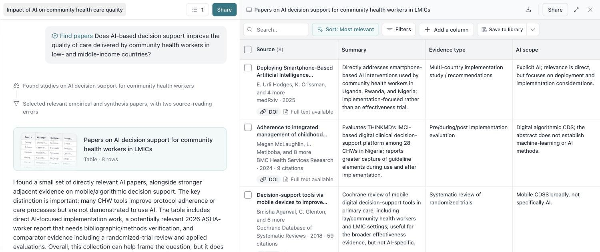
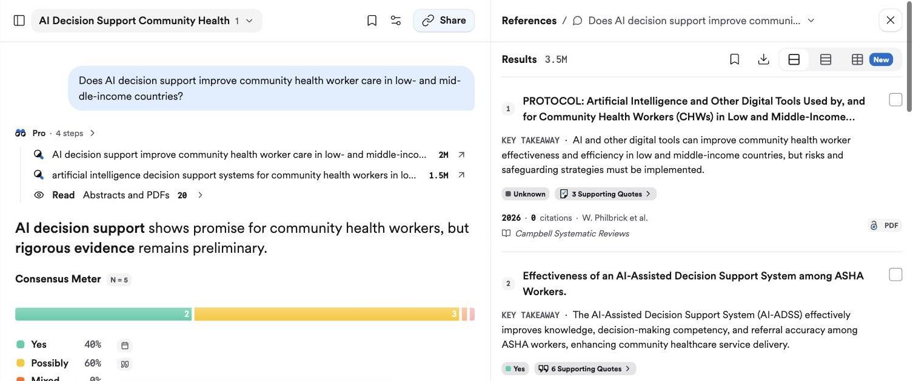
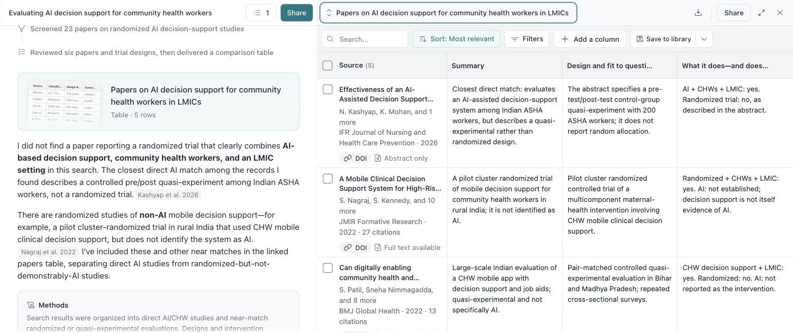
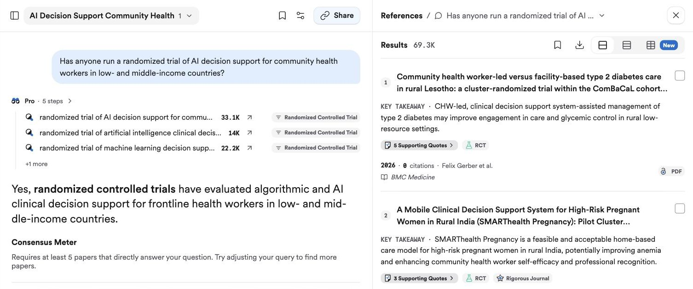
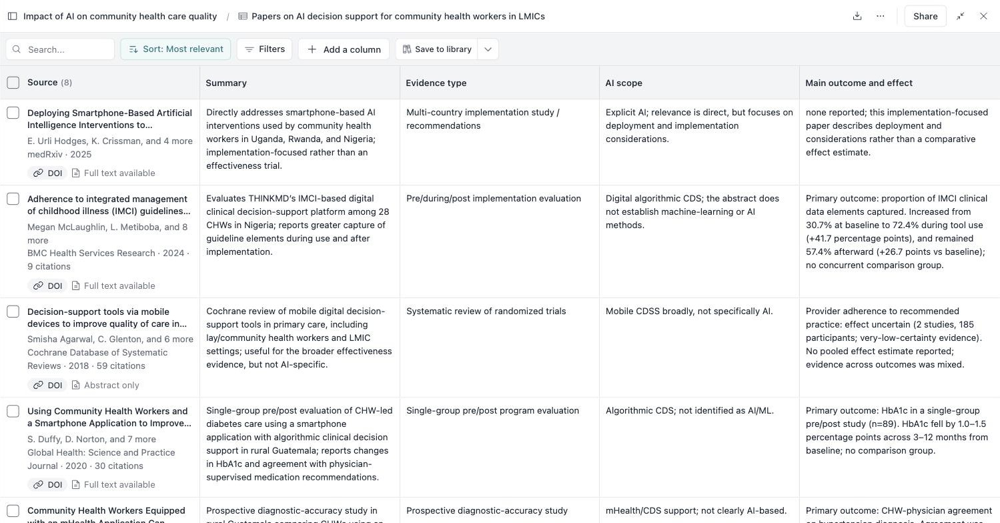
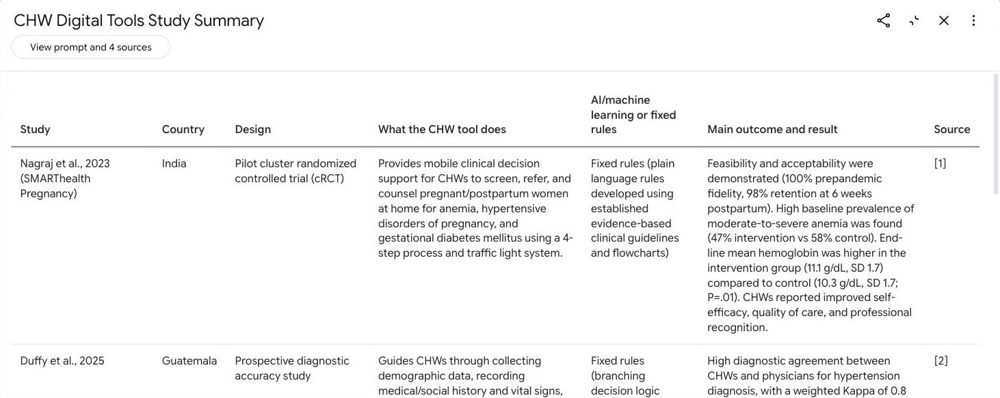

```{r}
#| label: setup
#| include: false
source("../../../_extensions/bootcamp/setup_palettes.R")

knitr::opts_chunk$set(echo = FALSE, warning = FALSE, message = FALSE)
```

## Why are you reading the literature?

```{=html}
<style>
/* ---------- shared tokens (bootcamp palette) ---------- */
:root { --navy:#530153; --blue:#800280; --cyan:#B974B9; --pale:#F4EAF4; --red:#C0392B; --green:#1E8F5B; --grey:#6B6B6B; }
.ic { width: 1.6em; height: 1.6em; stroke: currentColor; fill: none; stroke-width: 2; stroke-linecap: round; stroke-linejoin: round; flex: 0 0 auto; }
.big-ic .ic { width: 2.2em; height: 2.2em; }
.reveal .muted { color: var(--grey); }

/* ---------- cards ---------- */
.cards { display: grid; gap: 18px; margin-top: 0.6em; }
.cards.c2 { grid-template-columns: 1fr 1fr; }
.cards.c3 { grid-template-columns: repeat(3, 1fr); }
.cards.c4 { grid-template-columns: repeat(4, 1fr); }
.cards.c5 { grid-template-columns: repeat(5, 1fr); }
.card { background: var(--pale); border-radius: 12px; padding: 22px 22px; color: var(--navy); display: flex; flex-direction: column; gap: 10px; font-size: 0.95em; line-height: 1.35; }
.card p { margin: 0; }
.card.dark { background: var(--blue); color: #fff; }
.card.line { background: #fff; border: 2px solid var(--cyan); }
.card h4, .card .ct { display: block; margin: 0; font-family: "Montserrat", sans-serif; font-weight: 700; font-size: 1.2em; color: inherit; text-transform: none; }
.card .ex { font-style: italic; display: block; font-size: 1.05em; margin: 8px 0; }
.card .foot { display: block; margin-top: auto; font-size: 0.85em; opacity: 0.8; }
.cards.c5 .ct { font-size: 1em; }
.cards.c5 .card { padding: 18px 14px; }
.reveal .card.dark strong, .reveal .card.dark code { color: #fff; }
.card code { font-size: 0.9em; }

/* ---------- flows ---------- */
.flow { display: flex; align-items: stretch; gap: 8px; margin: 0.3em 0; }
.step { flex: 1 1 0; border-radius: 10px; padding: 20px 12px; font-size: 0.92em; line-height: 1.25; display: flex; flex-direction: column; align-items: center; justify-content: center; text-align: center; gap: 6px; }
.step.you { background: var(--blue); color: #fff; }
.step.ai { background: var(--pale); color: var(--navy); border: 2px solid var(--cyan); }
.step small { font-size: 0.8em; opacity: 0.85; }
.arrow { align-self: center; color: var(--blue); font-weight: 700; font-size: 1.1em; }
.flow-label { font-family: "Montserrat", sans-serif; font-weight: 700; color: var(--navy); font-size: 0.9em; margin: 0.8em 0 0.3em; }
.key { display: flex; gap: 8px; justify-content: flex-end; font-size: 0.6em; margin-top: 0.4em; }
.key span { padding: 3px 10px; border-radius: 4px; }
.key .you { background: var(--blue); color: #fff; }
.key .ai { background: var(--pale); color: var(--navy); border: 1px solid var(--cyan); }

/* ---------- big statement ---------- */
.punch { font-family: "Montserrat", sans-serif; font-weight: 700; color: var(--navy); font-size: 1.1em; text-align: center; margin-top: 1.2em; }

/* ---------- timeline ---------- */
.timeline { display: flex; height: 200px; border-radius: 10px; overflow: hidden; margin: 1em 0 0.4em; }
.timeline div { display: flex; flex-direction: column; justify-content: center; padding: 0 22px; color: #fff; font-size: 0.9em; line-height: 1.25; }
.timeline b { font-family: "Montserrat", sans-serif; font-size: 1.1em; }

/* ---------- chat ---------- */
.chat { display: flex; flex-direction: column; gap: 10px; font-size: 0.78em; line-height: 1.3; }
.bubble { max-width: 82%; padding: 9px 14px; border-radius: 14px; }
.bubble.agent { background: var(--pale); color: var(--navy); align-self: flex-start; border-bottom-left-radius: 3px; }
.bubble.me { background: var(--blue); color: #fff; align-self: flex-end; border-bottom-right-radius: 3px; }
.who { font-size: 0.75em; font-weight: 700; opacity: 0.7; display: block; }

/* ---------- chips ---------- */
.chips { display: flex; flex-wrap: wrap; gap: 8px; align-items: center; margin: 0.35em 0; font-size: 0.72em; }
.chips .lbl { font-family: "Montserrat", sans-serif; font-weight: 700; color: var(--navy); width: 5.5em; }
.chip { padding: 4px 11px; border-radius: 999px; border: 1.5px solid var(--cyan); color: var(--navy); background: #fff; }
.chip.on { background: var(--blue); border-color: var(--blue); color: #fff; font-weight: 700; }

/* ---------- comment card ---------- */
.comment { border-left: 6px solid var(--red); background: #fff; box-shadow: 0 2px 10px rgba(0,0,0,.12); border-radius: 6px; padding: 14px 18px; font-size: 0.75em; line-height: 1.35; }
.comment .hdr { font-family: "Montserrat", sans-serif; font-weight: 700; color: var(--red); margin-bottom: 4px; }
.comment p { margin: 3px 0; }
.btns { display: flex; gap: 8px; margin-top: 10px; }
.btn { padding: 6px 14px; border-radius: 6px; font-weight: 700; font-size: 0.95em; border: 2px solid var(--blue); color: var(--blue); }
.btn.hot { background: var(--blue); color: #fff; }

/* ---------- folder tree ---------- */
.tree { font-family: "Fira Code", monospace; font-size: 0.72em; line-height: 1.55; background: var(--pale); border-radius: 10px; padding: 14px 20px; color: var(--navy); white-space: pre; }
.tree em { font-family: "Lato", sans-serif; font-style: normal; color: var(--grey); }

/* ---------- prompt box ---------- */
.prompt { background: #1E1E1E; color: #F4EAF4; border-radius: 8px; padding: 14px 18px; font-family: "Fira Code", monospace; font-size: 0.72em; line-height: 1.35; }
/* ---------- literature session additions ---------- */
.step.stage-strong { background: var(--navy); color: #fff; }
.step.stage-mid { background: var(--cyan); color: #fff; }
.step.stage-risk { background: #fff; color: var(--red); border: 2px dashed var(--red); }
.key .k-strong { background: var(--navy); color: #fff; }
.key .k-mid { background: var(--cyan); color: #fff; }
.key .k-risk { border: 1px dashed var(--red); color: var(--red); }
.funnel { display: flex; flex-direction: column; align-items: center; gap: 6px; margin: 0.6em 0 0.4em; }
.fbar { box-sizing: border-box; background: var(--pale); color: var(--navy); border-radius: 6px; padding: 9px 14px; font-size: 0.72em; text-align: center; white-space: nowrap; min-width: fit-content; }
.fbar span { font-family: "Montserrat", sans-serif; font-weight: 700; font-size: 1.15em; margin-right: 6px; }
.fbar.dark { background: var(--blue); color: #fff; }
.placeholder { border: 3px dashed var(--cyan); border-radius: 10px; background: repeating-linear-gradient(45deg, #fff, #fff 12px, #FAF5FA 12px, #FAF5FA 24px); color: var(--grey); display: flex; flex-direction: column; justify-content: center; align-items: center; text-align: center; gap: 8px; padding: 20px; min-height: 260px; font-size: 0.7em; white-space: pre-line; }
.placeholder b { color: var(--blue); font-family: "Montserrat", sans-serif; }
.placeholder.small { min-height: 300px; }
.results { display: flex; flex-direction: column; gap: 5px; margin-top: 10px; font-size: 0.62em; }
.res { padding: 6px 12px; border-radius: 6px; display: flex; justify-content: space-between; gap: 10px; }
.res small { opacity: 0.7; white-space: nowrap; }
.res.on { background: #DCF3E6; color: #155C3B; font-weight: 700; }
.res.off { background: #F2F2F2; color: #8A8A8A; }
.dots { display: grid; grid-template-columns: repeat(7, 54px); gap: 12px; margin: 0.8em 0 0.4em; }
.dot { width: 54px; height: 54px; border-radius: 50%; display: block; }
.dot.hit { background: var(--blue); }
.dot.miss { border: 3px dashed var(--cyan); box-sizing: border-box; }
.bignums { display: grid; grid-template-columns: repeat(3, 1fr); gap: 18px; margin-top: 0.8em; }
.bignums div { background: var(--pale); border-radius: 12px; padding: 22px; text-align: center; color: var(--navy); }
.bignums b { display: block; font-family: "Montserrat", sans-serif; font-size: 2.2em; color: var(--blue); line-height: 1.1; }
.bignums span { font-size: 0.7em; line-height: 1.3; display: block; margin-top: 8px; }
.card.err { background: #FBE4E4; color: #8E2A20; }
.reveal .card.err strong, .reveal .card.err b { color: #8E2A20; }
.strat { display: flex; flex-direction: column; gap: 7px; margin-top: 0.5em; font-size: 0.66em; }
.srow { display: grid; grid-template-columns: 13em 1fr 9em; align-items: center; gap: 12px; }
.srow .sname { font-weight: 700; color: var(--navy); }
.srow .sbar { display: block; min-width: 3.2em; box-sizing: border-box; border-radius: 4px; padding: 5px 8px; color: #fff; white-space: nowrap; background: var(--red); }
.srow .srev { text-align: right; color: var(--blue); font-weight: 700; }
.srow.head { font-size: 0.85em; color: var(--grey); }
.srow.head .srev { font-weight: 400; color: var(--grey); }
.checks { display: grid; grid-template-columns: 1fr 1fr; gap: 14px; margin-top: 0.6em; }
.checks div { display: flex; gap: 14px; align-items: center; background: var(--pale); border-radius: 10px; padding: 14px 16px; font-size: 0.72em; color: var(--navy); line-height: 1.3; }
.checks b { flex: 0 0 1.8em; height: 1.8em; border-radius: 50%; background: var(--blue); color: #fff; display: flex; align-items: center; justify-content: center; font-family: "Montserrat", sans-serif; }
/* ---------- restructure additions ---------- */
.jobs { display: grid; grid-template-columns: repeat(3, 1fr); gap: 18px; margin-top: 0.5em; }
.job { background: var(--pale); color: var(--navy); border-radius: 12px; padding: 18px; display: flex; flex-direction: column; gap: 8px; font-size: 0.72em; line-height: 1.3; }
.job.dark { background: var(--blue); color: #fff; }
.job b { font-family: "Montserrat", sans-serif; font-size: 1.35em; }
.reveal .job.dark b, .reveal .job.dark i { color: #fff; }
.job i { font-size: 1.05em; min-height: 2.7em; }
.job .jn { font-family: "Montserrat", sans-serif; font-weight: 700; font-size: 1.1em; opacity: 0.6; }
.job .jq { border-top: 1px solid rgba(128,2,128,.25); padding-top: 6px; }
.job.dark .jq { border-color: rgba(255,255,255,.35); }
.job .jq span { display: block; font-size: 0.8em; font-weight: 700; opacity: 0.7; text-transform: uppercase; letter-spacing: .04em; }
.debate { display: flex; flex-direction: column; gap: 8px; }
.debate .lbl { display: block; font-family: "Montserrat", sans-serif; font-weight: 700; color: var(--navy); font-size: 0.62em; margin-bottom: 4px; }
.root { background: var(--blue); color: #fff; border-radius: 6px; padding: 7px 12px; font-size: 0.62em; margin-bottom: 5px; display: flex; justify-content: space-between; gap: 8px; }
.root small { opacity: 0.8; white-space: nowrap; }
.recent .res { font-size: 0.62em; margin-bottom: 5px; }
.tracker { display: flex; gap: 5px; margin: -0.2em 0 0.5em; }
.tracker span { flex: 1; text-align: center; font-size: 0.42em; padding: 4px 2px; border-radius: 4px; background: #F2F2F2; color: #9A9A9A; font-weight: 700; }
.tracker span.done { background: var(--pale); color: var(--cyan); }
.tracker span.on { background: var(--blue); color: #fff; }
.pipe { display: grid; grid-template-columns: repeat(7, 1fr); gap: 8px; margin-top: 0.7em; }
.ps { background: var(--pale); color: var(--navy); border: 2px solid var(--cyan); border-radius: 10px; padding: 14px 8px; text-align: center; display: flex; flex-direction: column; gap: 6px; font-size: 0.62em; line-height: 1.2; }
.ps.you { background: var(--blue); color: #fff; border-color: var(--blue); }
.ps span { font-family: "Montserrat", sans-serif; font-weight: 700; font-size: 1.6em; opacity: 0.6; }
.ps b { font-size: 1.05em; }
.reveal .ps.you b { color: #fff; }
.ps small { opacity: 0.85; }
.runs { display: flex; flex-direction: column; gap: 12px; margin-top: 0.4em; }
.rrow { display: grid; grid-template-columns: 11.5em 1fr; align-items: center; gap: 10px; font-size: 0.66em; color: var(--navy); }
.rd { display: flex; gap: 4px; }
.rd i { width: 16px; height: 16px; border-radius: 50%; background: var(--pale); border: 1.5px solid var(--cyan); display: inline-block; }
.rd i.n { background: var(--red); border-color: var(--red); }
.key .nokey { background: var(--red); color: #fff; }
.rewrite { display: flex; align-items: stretch; gap: 12px; margin-top: 0.5em; }
.rewrite .card { flex: 1; }
.crit { display: flex; flex-direction: column; gap: 8px; margin-top: 0.4em; font-size: 0.64em; }
.crow, .chead { display: grid; grid-template-columns: 12em 1fr 1fr; gap: 16px; align-items: center; color: var(--navy); }
.chead { color: var(--grey); font-size: 0.9em; }
.crow span { display: flex; align-items: center; gap: 8px; }
.cn { font-weight: 700; }
.cb { display: inline-block; height: 18px; border-radius: 3px; max-width: 75%; }
.cb.bad { background: var(--red); }
.cb.good { background: var(--green); }
.cb.good.warn { background: #A6640C; }
.rules, .walk { width: 100%; border-collapse: separate; border-spacing: 0 6px; font-size: 0.6em; margin-top: 0.3em; }
.reveal .rules th, .reveal .walk th { color: var(--navy); font-family: "Montserrat", sans-serif; text-align: left; border: none; padding: 4px 8px; }
.reveal .rules td, .reveal .walk td { border: none; padding: 7px 8px; background: #FAF6FA; vertical-align: middle; }
.pill { display: inline-block; padding: 3px 10px; border-radius: 999px; font-weight: 700; color: #fff; font-size: 0.95em; margin-right: 4px; }
.pill.exc { background: var(--red); }
.pill.rev { background: var(--blue); }
.pill.rer { background: #A6640C; }
.reveal .walk td { text-align: center; font-weight: 700; font-size: 1.05em; }
.reveal .walk td:first-child { text-align: left; font-weight: 400; background: var(--pale); }
.reveal .walk td small { font-weight: 400; font-size: 0.85em; }
.reveal .walk td.bad { background: #FBE4E4; color: #8E2A20; }
.reveal .walk td.ok { background: #DCF3E6; color: #155C3B; }
.reveal .walk td.cost { background: #FBF1E1; color: #8A5A00; }

/* ---------- intuition slides ---------- */
.setup { display: grid; grid-template-columns: 1fr 1.3fr; gap: 18px; margin-top: 0.5em; align-items: stretch; }
.critlist { display: grid; grid-template-columns: 1fr 1fr; gap: 10px; }
.crit-c { border-radius: 10px; padding: 14px 16px; font-size: 0.8em; line-height: 1.3; display: flex; flex-direction: column; gap: 4px; color: var(--navy); }
.crit-c b { font-family: "Montserrat", sans-serif; font-size: 1.15em; }
.crit-c span { font-size: 0.8em; font-weight: 700; text-transform: uppercase; letter-spacing: .05em; }
.crit-c.easy { background: #DCF3E6; } .crit-c.easy span { color: #155C3B; }
.crit-c.hard { background: #FBF1E1; } .crit-c.hard span { color: #8A5A00; }
.flip { margin-top: 8px; font-size: 0.9em; font-weight: 700; padding: 4px 10px; border-radius: 6px; align-self: flex-start; }
.flip.bad { background: #FBE4E4; color: #8E2A20; }
.flip.good { background: #DCF3E6; color: #155C3B; }
.reveal .card.dark .flip.good b, .reveal .flip b { color: inherit; }
.grid100 { display: grid; grid-template-columns: repeat(10, 34px); gap: 7px; margin: 0.4em 0 0.3em; }
.grid100 i { width: 34px; height: 34px; border-radius: 50%; background: #DCF3E6; border: 2px solid #1E8F5B; box-sizing: border-box; display: block; }
.grid100 i.c { background: #FBF1E1; border-color: #A6640C; }
.grid100 i.w { background: var(--red); border-color: var(--red); }
.key .k-clear { background: #DCF3E6; color: #155C3B; }
.key .k-conf { background: #FBF1E1; color: #8A5A00; }
.askagain { display: flex; align-items: center; justify-content: space-between; gap: 8px; margin-top: 0.6em; }
.aa { background: var(--pale); color: var(--navy); border-radius: 12px; padding: 14px 18px; text-align: center; min-width: 6.5em; }
.aa b { display: block; font-family: "Montserrat", sans-serif; font-size: 1.9em; color: var(--red); line-height: 1.1; }
.aa span { font-size: 0.62em; }
.aa.dark { background: var(--blue); color: #fff; } .reveal .aa.dark b { color: #fff; }
.askagain .arrow { font-size: 0.55em; text-align: center; line-height: 1.1; }
.surv { display: flex; flex-direction: column; gap: 16px; margin-top: 0.6em; font-size: 0.72em; }
.shead, .srow2 { display: grid; grid-template-columns: 13em 1fr 1fr 1fr; gap: 14px; align-items: center; color: var(--navy); }
.shead { color: var(--grey); }
.srow2 .sl { font-weight: 700; line-height: 1.2; } .srow2 .sl small { font-weight: 400; color: var(--grey); }
.srow2 span { display: flex; align-items: center; gap: 8px; }
.sb { display: inline-block; height: 22px; border-radius: 3px; max-width: 70%; min-width: 3px; }
.sb.bad { background: var(--red); } .sb.good { background: var(--green); } .sb.warn { background: #A6640C; }
.price { display: grid; grid-template-columns: repeat(4, 1fr); gap: 14px; margin-top: 0.6em; }
.pstep { background: var(--pale); color: var(--navy); border-radius: 12px; padding: 16px; display: flex; flex-direction: column; gap: 4px; text-align: center; font-size: 0.7em; }
.pstep .from { font-family: "Montserrat", sans-serif; font-weight: 700; font-size: 1.2em; }
.pstep b { font-family: "Montserrat", sans-serif; font-size: 2.2em; color: var(--blue); line-height: 1.1; margin-top: 6px; }
.pstep.dark { background: var(--blue); color: #fff; } .reveal .pstep.dark b { color: #fff; }
.rule3 { display: grid; grid-template-columns: repeat(3, 1fr); gap: 14px; margin: 0.5em 0 0.6em; }
.r3 { background: var(--pale); color: var(--navy); border-radius: 12px; padding: 16px; text-align: center; display: flex; flex-direction: column; gap: 6px; font-size: 0.7em; }
.r3 > b { font-family: "Montserrat", sans-serif; font-size: 1.9em; color: var(--red); }
.r3.dark { background: var(--blue); color: #fff; } .reveal .r3.dark b, .reveal .r3.dark strong { color: #fff; }
.reveal .slides section img[src$=".svg"] { max-height: 420px; }
.flipbars { display: flex; flex-direction: column; gap: 12px; margin-top: 12px; font-size: 0.75em; }
.flipbars div { display: grid; grid-template-columns: 7em 1fr 3em; align-items: center; gap: 10px; color: var(--navy); }
.flipbars i { display: block; height: 26px; border-radius: 4px; background: var(--cyan); }
.flipbars i.hot { background: #A6640C; }
.flipbars b { color: var(--navy); }
.key .full-k { background: #E6F2E6; color: #2E7D32; border: 1px solid #2E7D32; }
.key .hum-k { background: #FBEEDC; color: #A6640C; border: 1px solid #A6640C; }
.key .rer-k { background: #E3F1F0; color: #0F6B6B; border: 1px solid #0F6B6B; }
.card.compact { font-size: 0.72em; padding: 12px 14px; gap: 4px; }
.side { display: flex; flex-direction: column; gap: 10px; }
.side .card { font-size: 0.8em; padding: 14px 16px; gap: 4px; }
.costintro { font-size: 0.7em; color: var(--grey); margin: 0.2em 0 0.4em; }
.cost { display: flex; flex-direction: column; gap: 9px; }
.crowx { display: grid; grid-template-columns: 1.3fr 1.3fr 1.3fr 1fr; align-items: center; gap: 14px; background: var(--pale); color: var(--navy); border-radius: 10px; padding: 6px 18px; font-size: 0.68em; }
.crowx .cfrom b { font-family: "Montserrat", sans-serif; font-size: 1.15em; display: block; }
.crowx .cfrom small { color: var(--grey); }
.crowx .cx b, .crowx .cy b { font-family: "Montserrat", sans-serif; font-size: 1.3em; color: var(--blue); }
.crowx .cz { text-align: right; line-height: 1.05; }
.crowx .cz b { font-family: "Montserrat", sans-serif; font-size: 1.5em; color: var(--red); display: block; }
.crowx .cz small { font-size: 0.8em; }
.crowx.dark { background: var(--blue); color: #fff; }
.reveal .crowx.dark b, .reveal .crowx.dark small { color: #fff; }
.shot2 { margin: 0; display: flex; flex-direction: column; gap: 8px; }
.shot2 > a { display: block; line-height: 0; }
.shot2 img { width: 100%; border-radius: 8px; border: 1px solid #E2E2E2; box-shadow: 0 3px 12px rgba(0,0,0,.12); }
.shot2 figcaption { font-size: 0.55em; line-height: 1.35; color: var(--grey); text-align: left; }
.reveal .shot2 figcaption b { color: var(--navy); }
.shot2.demo img { max-height: 190px; object-fit: cover; object-position: top left; }
.shot2.demo figcaption { font-size: 0.46em; }
.shot2.demo figcaption .q { margin-bottom: 4px; }
.shot2.demo figcaption i { color: var(--navy); }
.shot2.demo figcaption span { display: block; padding-left: 10px; border-left: 2px solid #E2E2E2; margin-bottom: 3px; }
.reveal .shot2.demo figcaption a.src { font-size: 0.9em; color: var(--grey); }
.source-shots { font-size: 0.45em; color: var(--grey); }
.asks { display: flex; flex-direction: column; gap: 10px; margin-top: 10px; }
.ask { background: var(--pale); border-radius: 10px; padding: 10px 14px; font-size: 0.66em; line-height: 1.35; color: var(--navy); display: flex; flex-direction: column; gap: 3px; }
.ask b { font-family: "Montserrat", sans-serif; font-size: 1.05em; }
.reveal .tooltable table { font-size: 0.62em; }
.reveal .tooltable table td, .reveal .tooltable table th { padding: 7px 10px; }
.reveal .column > .card { padding: 16px 20px; }
.reveal .column > .card + .card, .reveal .column > .card + div > .card, .reveal .column > * + .card { margin-top: 14px; }

/* ---------- screenshot lightbox ---------- */
.lb { position: fixed; inset: 0; z-index: 9999; background: rgba(20,0,20,.92); display: none; flex-direction: column; align-items: center; justify-content: center; gap: 14px; padding: 3vh 3vw; box-sizing: border-box; cursor: zoom-out; }
.lb.open { display: flex; }
.lb img { max-width: 94vw; max-height: 84vh; border-radius: 8px; box-shadow: 0 8px 40px rgba(0,0,0,.5); background: #fff; cursor: default; }
.lb a { font-family: "Montserrat", sans-serif; font-size: 18px; font-weight: 600; color: #fff; background: var(--blue); padding: 8px 18px; border-radius: 20px; text-decoration: none; cursor: pointer; }
.lb a:hover { background: var(--navy); }
.reveal .shot2 > a { cursor: zoom-in; }

/* ---------- why a rule per criterion ---------- */
.cwhy { display: flex; flex-direction: column; gap: 8px; margin-top: 0.7em; font-size: 0.6em; }
.cw { display: grid; grid-template-columns: 1.1fr 1fr 1fr 1.7fr 0.9fr; gap: 14px; align-items: center; background: var(--pale); border-radius: 10px; padding: 12px 16px; color: #1A1A1A; }
.cw.head { background: none; padding: 0 16px; color: var(--grey); font-size: 0.85em; line-height: 1.25; }
.cw b { color: var(--navy); }
.cw .bar { display: block; height: 10px; border-radius: 5px; background: var(--cyan); margin-bottom: 4px; }
.cw .bar.hot { background: var(--red); }
.cw .bar.good { background: var(--green); }
.cw .bar.warn { background: #E0A100; }
.cw .rule { font-family: "Montserrat", sans-serif; font-weight: 700; color: var(--navy); background: #fff; border: 2px solid var(--navy); border-radius: 8px; padding: 6px 8px; text-align: center; }
.cw .rule.dark { background: var(--navy); color: #fff; }

/* ---------- coding-agent bonus ---------- */
.chat { display: flex; flex-direction: column; gap: 10px; font-size: 0.52em; line-height: 1.4; }
.chat .cu { align-self: flex-end; max-width: 82%; background: var(--navy); color: #fff; padding: 9px 14px; border-radius: 14px 14px 4px 14px; }
.chat .ca { align-self: flex-start; max-width: 92%; background: var(--pale); color: #1A1A1A; padding: 9px 14px; border-radius: 14px 14px 14px 4px; }
.chat .ca.bad { background: #FBE9E7; }
.chat .ca.bad b { color: var(--red); }
.chat .chip { display: table; font-size: 0.78em; color: var(--blue); font-weight: 700; margin-bottom: 5px; padding: 1px 8px; border: 1px solid var(--cyan); border-radius: 10px; background: #fff; }
.chat .doi { display: block; font-size: 0.8em; color: var(--grey); margin-top: 4px; }
.lscmds { display: flex; flex-direction: column; gap: 6px; font-size: 0.56em; }
.lscmds div { background: var(--pale); border-radius: 8px; padding: 6px 12px; color: var(--navy); }
.lscmds div.lh { background: none; padding: 0 2px; color: var(--grey); font-weight: 700; }
.reveal a.dl { display: block; margin-top: 14px; text-align: center; background: var(--navy); color: #fff; font-family: "Montserrat", sans-serif; font-weight: 700; font-size: 0.55em; padding: 10px 14px; border-radius: 8px; text-decoration: none; }
.reveal a.dl:hover { background: var(--blue); }
.dlnote { font-size: 0.45em; color: var(--grey); margin-top: 8px; line-height: 1.35; }
</style>
<script>
document.addEventListener('DOMContentLoaded', () => {
  const lb = document.createElement('div');
  lb.className = 'lb';
  lb.innerHTML = '<a target="_blank" rel="noopener"></a>';
  document.body.appendChild(lb);
  const img = lb.querySelector('img'), link = lb.querySelector('a');
  const close = () => lb.classList.remove('open');
  document.querySelectorAll('.shot2 > a').forEach(a => a.addEventListener('click', e => {
    e.preventDefault();
    const fig = a.closest('figure'), src = a.querySelector('img');
    const tool = fig.querySelector('figcaption b')?.textContent || new URL(a.href).hostname;
    img.src = src.src; img.alt = src.alt;
    link.href = a.href;
    link.textContent = tool + ' ↗';
    lb.classList.add('open');
  }));
  lb.addEventListener('click', e => { if (e.target === lb) close(); });
  link.addEventListener('click', close);
  window.addEventListener('keydown', e => {
    if (lb.classList.contains('open')) { e.stopImmediatePropagation(); e.preventDefault(); if (e.key === 'Escape') close(); }
  }, true);
});
</script>
```

```{=html}
<div class="jobs">
  <div class="job"><span class="jn">1</span><b>Get an overview</b><i>What is the conversation on this topic?</i><div class="jq"><span>Good means</span>balanced, the main camps and landmark papers</div><div class="jq"><span>A miss costs</span>little: you will meet it later</div><div class="jq"><span>So</span>any tool. Skim, move on</div></div>
  <div class="job"><span class="jn">2</span><b>Check what's been done</b><i>What is closest to my question, and what is new in mine?</i><div class="jq"><span>Good means</span>the nearest neighbours, read closely</div><div class="jq"><span>A miss costs</span>a referee finds the paper you missed</div><div class="jq"><span>So</span>two tools, then read the nearest papers yourself</div></div>
  <div class="job dark"><span class="jn">3</span><b>Systematic review / meta-analysis</b><i>What does all the evidence say?</i><div class="jq"><span>Good means</span>every eligible study, reproducibly</div><div class="jq"><span>A miss costs</span>a biased answer that nobody can see</div><div class="jq"><span>So</span>a tested workflow with a measured miss rate</div></div>
</div>
```

::: {.punch}
The more a missed paper costs, the more care the process needs.
:::

::: {.notes}
- 5 minutes for the intro.
- Hands up: which of the three do you do most? Most will say 1 and 2.
- The rule for the whole session: how careful you need to be depends on what a missed paper costs.
- Overview: a miss is cheap, you will run into the paper later. Related work: a referee finds it for you. Systematic review: the answer is biased and nobody can see it.
- First half of the session serves all three jobs. Second half goes deep on job 3, where we can measure the AI.
:::

## Pulling data out of papers

::: {.cards .c2}
::: {.card}
[For an overview or related work]{.ct}

A comparison table of the 10–20 closest papers: question, data, method, finding.

<span class="foot">Purpose: spot the differentiator. Check the rows you will cite.</span>
:::

::: {.card .dark}
[Systematic review / meta-analysis]{.ct}

A fixed coding form for every included study: effect sizes, samples, risk of bias.

<span class="foot">Purpose: data for synthesis. Every value verified, ideally twice.</span>
:::
:::

::: {.punch}
A rough table is fine for an overview. A systematic review / meta-analysis needs every value checked.
:::

::: {.notes}
- Same split for extraction.
- Overview: a rough comparison table of the 10–20 closest papers is enough. Check the rows you cite.
- Systematic review: a fixed coding form, every value verified, ideally by two people.
- Elicit and Gemini Notebook both build these tables. The later demo shows what they get right and wrong.
:::

# Overviews and Related Work {background-color="#530153"}

## Which tool for what

::: {.tooltable}
| Job | Tools | Good at | Watch for |
|---|---|---|---|
| **Overview** | Deep research (ChatGPT, Gemini, Claude) | A cited overview in minutes | Web sources, misattributed claims |
| **Overview** | Gemini Notebook (NotebookLM) | Answers from your own sources | Only as good as what you upload |
| **Related work** | Elicit · Consensus · Undermind | Semantic search, comparison tables | Only what they index |
| **Related work** | Connected Papers · ResearchRabbit · Litmaps | Citation maps | Depends on your starting papers |
| **Systematic review / meta-analysis** | MetaScreener | Per-criterion screening, audit trail | You decide what humans check |
:::

::: {.source-note}
Not all of these are Bank-approved. Check the approved-tools list before using one for work, and the Day 1 classification rules before uploading anything non-public (drafts, search strategies, review corpora). ImpactAI (World Bank) was at the Day 1 Bazaar.
:::

::: {.notes}
- About 10 minutes for this section, plus 5 for the review tools later.
- Read the table by job, not by tool. Each row is a different kind of index.
- Not all of these are Bank-approved. The literature itself is public; search strategies, unpublished drafts and review corpora may not be. Day 1 classification rules apply before uploading anything.
- ImpactAI was at the Day 1 Bazaar.
:::

## General agent or a tool built for papers?

::: {.tooltable}
| | General agent (ChatGPT, Gemini, Claude, Copilot) | Tool built for papers (Elicit, Consensus, MetaScreener) |
|---|---|---|
| **The question** | One-off: "what are the main camps?" | The same search or screen, run on hundreds of papers |
| **What it searches** | The web | A paper index with abstracts and metadata |
| **What you do with the list** | Read it, then read the papers | Cite it, pool it, or report it as your method |
| **A missed paper** | Costs little | Costs a lot |
| **What is saved** | A chat transcript | Prompts, model and settings with every result |
:::

::: {.punch}
Start with a general agent. Switch when you have to trust the list.
:::

::: {.notes}
- 2 minutes. This is the question people have not heard answered yet.
- Two things decide it: what a miss costs, and whether anyone will need to check how the list was made.
- General agent with web search: fine for the first hour on a topic.
- Once the list goes into a paper, a protocol or a pooled estimate: use a tool that searches a paper index and records how it got there.
- The coding agent with the literature-search skill sits in between: a paper index, asked in plain language. Two slides on.
:::

## How to ask, and how to check

::: {.cards .c2 style="font-size:0.85em;gap:14px"}
::: {.card}
[Get an overview]{.ct}

```{=html}
<div class="prompt">I am studying [topic]. I already know [papers or camps]. What are the main positions on [question]? Give 2–3 landmark papers for each, a DOI for every paper, the search terms you used, and anything you looked for and could not find.</div>
```

<span class="foot">Asking for the search terms and the gaps shows you where it looked.</span>
:::

::: {.card}
[Check what's been done]{.ct}

```{=html}
<div class="prompt">My study: [population], [intervention], [design], [outcome]. Find the 5 closest papers. For each, say in one line what differs from mine. DOI for every paper.</div>
```

<span class="foot">Run the same question in a second tool. The demos show why.</span>
:::
:::

```{=html}
<div class="checks" style="margin-top:10px;gap:10px;font-size:0.95em">
  <div><b>1</b>Ask for a DOI for every paper. Check each one before it goes in a draft</div>
  <div><b>2</b>Open the paper before you use a quote or a number from it</div>
  <div><b>3</b>Ask what it could not find. An empty answer there is a warning</div>
  <div><b>4</b>Save the export with tool, model and date</div>
</div>
```

::: {.notes}
- 3 minutes. Two prompts people can copy.
- Overview prompt: tell it what you already know so it does not spend the answer on that. Ask for its search terms and its gaps so you can see where it looked.
- Related-work prompt: give the study in four parts so it has to match on all four.
- Check 1 catches invented references: a DOI either resolves or it does not.
- Next slide: a skill that runs that check for you.
:::

## Finding literature with your coding agent

```{=html}
<style>
.lscmds div.q { cursor: pointer; border: 1.5px solid transparent; }
.lscmds div.q:hover { border-color: var(--cyan); }
.lscmds div.q.on { background: var(--navy); color: #fff; }
.lscmds .hint { font-size: 0.85em; color: var(--grey); padding: 0 2px; }
.lsflow { display: none; flex-direction: column; gap: 7px; font-size: 0.52em; line-height: 1.35; }
.lsflow.on { display: flex; }
.lsflow .fh { display: flex; flex-direction: column; gap: 2px; font-family: "Montserrat", sans-serif; font-weight: 700; color: var(--navy); font-size: 1.05em; padding: 0 2px 3px; border-bottom: 2px solid var(--cyan); }
.lsflow .fh .cmd { font-weight: 400; font-size: 0.88em; color: var(--grey); }
.lsflow .fh code { color: var(--blue); }
.lsflow .fr { display: grid; grid-template-columns: 5.2em 1fr; gap: 10px; align-items: start; background: var(--pale); border-radius: 8px; padding: 7px 10px; color: #1A1A1A; }
.lsflow .fr b { font-family: "Montserrat", sans-serif; font-size: 0.82em; text-transform: uppercase; letter-spacing: .04em; padding: 2px 6px; border-radius: 4px; text-align: center; margin-top: 2px; }
.lsflow .fr.agent b { background: var(--navy); color: #fff; }
.lsflow .fr.api b { background: #fff; color: var(--blue); border: 1.5px solid var(--blue); }
.lsflow .fr.script b { background: var(--cyan); color: #fff; }
.lsflow .fr.api { background: #fff; border: 1.5px solid var(--pale); }
.lsflow code { font-size: 0.92em; color: var(--navy); }
.lsflow .back { align-self: flex-start; font-size: 0.9em; color: var(--grey); cursor: pointer; margin-top: 2px; }
.lsflow .back:hover { color: var(--blue); }
</style>
<script>
(function attachFlows() {
  if (document.readyState === 'loading') { document.addEventListener('DOMContentLoaded', attachFlows); return; }
  const slide = document.getElementById('finding-literature-with-your-coding-agent');
  if (!slide) return;
  const chat = slide.querySelector('.chat');
  const flows = slide.querySelectorAll('.lsflow');
  const qs = slide.querySelectorAll('.lscmds .q');
  const reset = () => { flows.forEach(f => f.classList.remove('on')); qs.forEach(q => q.classList.remove('on')); chat.style.display = ''; };
  qs.forEach(q => q.addEventListener('click', e => {
    e.stopPropagation();
    const was = q.classList.contains('on');
    reset();
    if (was) return;
    q.classList.add('on');
    chat.style.display = 'none';
    slide.querySelector('.lsflow[data-flow="' + q.dataset.flow + '"]').classList.add('on');
  }));
  slide.querySelectorAll('.lsflow .back').forEach(b => b.addEventListener('click', e => { e.stopPropagation(); reset(); }));
})();
</script>
```

:::: {.columns}

::: {.column width="56%"}
```{=html}
<div class="chat">
  <div class="cu">Has anyone already done something like the SMARThealth Pregnancy trial?</div>
  <div class="ca"><span class="chip">literature-search skill · OpenAlex + Semantic Scholar</span>Closest match: a 2026 <b>protocol</b> for the process evaluation of the SMARThealth Pregnancy hybrid cluster RCT (Votruba et al.), sharing 6 of its 54 references. Also close: a 2026 scoping review of digital health for hypertension in pregnancy in LMICs. <span class="doi">doi.org/10.1177/17455057261425789</span></div>
  <div class="cu">Is “Thompson &amp; Raman (2023), Research Synthesis Methods” a real paper?</div>
  <div class="ca bad"><span class="chip">literature-search skill</span><b>Not found</b> in either database. Treat it as unverified and don’t cite it.</div>
</div>

<div class="lsflow" data-flow="search">
  <div class="fh"><span>Find recent papers on …</span><span class="cmd"><code>lit.py search "…" --since 2022 --sort recent</code></span></div>
  <div class="fr agent"><b>agent</b><span>Turns the question into 3–6 key terms, e.g. <code>community health workers decision support</code>. A long sentence returns almost nothing: OpenAlex needs every word to match.</span></div>
  <div class="fr api"><b>API</b><span>OpenAlex <code>/works</code>, words matched in title and abstract · Semantic Scholar <code>/paper/search</code>, its own ranking. Two calls.</span></div>
  <div class="fr script"><b>script</b><span>Merges both lists, removes duplicates by DOI, marks where each paper was found (OA, S2, both), prints the hit counts.</span></div>
  <div class="fr agent"><b>agent</b><span>Reads the abstracts before calling anything relevant. Reruns with synonyms (<i>lay health workers</i>, <i>mHealth</i>) and reports how the counts change.</span></div>
  <span class="back">← back to the example</span>
</div>

<div class="lsflow" data-flow="core">
  <div class="fh"><span>Which papers does everyone cite?</span><span class="cmd"><code>lit.py core "…" --pool 200</code></span></div>
  <div class="fr agent"><b>agent</b><span>Same key terms as a search.</span></div>
  <div class="fr api"><b>API</b><span>OpenAlex: the 200 best-matching papers on the topic, with only their reference lists (<code>select=referenced_works</code>). Two calls of 100.</span></div>
  <div class="fr script"><b>script</b><span>Counts which works those 200 papers reference most, then fetches the top 15 by ID. One more call.</span></div>
  <div class="fr agent"><b>agent</b><span>Reports each paper with "cited by N of the 200". Says that these are often older reviews and methods papers, so the newest study on the topic is unlikely to be here.</span></div>
  <span class="back">← back to the example</span>
</div>

<div class="lsflow" data-flow="similar">
  <div class="fh"><span>Has someone already done this?</span><span class="cmd"><code>lit.py similar DOI</code>, plus <code>search --sort recent</code> and <code>citing</code> on the same paper</span></div>
  <div class="fr agent"><b>agent</b><span>Picks the closest paper it already knows and takes its DOI as the seed.</span></div>
  <div class="fr api"><b>API</b><span>OpenAlex: the seed's reference list → how often each reference is cited → papers that cite the seed's 40 least-cited references. Semantic Scholar: <code>/recommendations</code> for the seed, from text embeddings.</span></div>
  <div class="fr script"><b>script</b><span>Scores candidates by the references they share with the seed; sharing a niche trial counts far more than sharing a famous methods paper. Merges with the S2 list, which favours recent papers.</span></div>
  <div class="fr agent"><b>agent</b><span>Reads the top matches and says how each differs: setting, population, method, outcome. Flags protocols and registrations: that is what a referee will point to.</span></div>
  <span class="back">← back to the example</span>
</div>

<div class="lsflow" data-flow="citing">
  <div class="fh"><span>Who has built on this paper?</span><span class="cmd"><code>lit.py citing DOI --sort recent</code></span></div>
  <div class="fr agent"><b>agent</b><span>Takes the DOI the user gives, or the one it found in an earlier step.</span></div>
  <div class="fr api"><b>API</b><span>OpenAlex: resolve the DOI to a work ID, then <code>/works?filter=cites:W…</code>, sorted by date or by citations. Two calls.</span></div>
  <div class="fr script"><b>script</b><span>Prints the table with the total number of citing papers.</span></div>
  <div class="fr agent"><b>agent</b><span>Points out the newest follow-ups and any that look like replications or extensions of the user's own idea.</span></div>
  <span class="back">← back to the example</span>
</div>

<div class="lsflow" data-flow="verify">
  <div class="fh"><span>Is every reference in my draft real?</span><span class="cmd"><code>lit.py verify "full reference"</code>, once per reference</span></div>
  <div class="fr agent"><b>agent</b><span>Runs the command on every reference in the draft, passing the full reference as written.</span></div>
  <div class="fr api"><b>API</b><span>With a DOI: OpenAlex <code>/works/doi:…</code>. Without: guesses the title from the text, then OpenAlex <code>title.search</code> and Semantic Scholar <code>/paper/search/match</code>.</span></div>
  <div class="fr script"><b>script</b><span>Compares titles: ≥ 0.9 FOUND, ≥ 0.7 UNCERTAIN, else NOT FOUND. For a found paper it also checks year, first author and volume/pages against the record (✓/✗).</span></div>
  <div class="fr agent"><b>agent</b><span>Reports UNCERTAIN and NOT FOUND instead of fixing them silently. Tries the bare title or the DOI once more before calling a reference fabricated.</span></div>
  <span class="back">← back to the example</span>
</div>
```
:::

::: {.column width="44%"}
```{=html}
<div class="lscmds">
  <div class="lh">What you can ask your agent <span class="hint">· click one to see what happens</span></div>
  <div class="q" data-flow="search">“Find recent papers on …”</div>
  <div class="q" data-flow="core">“Which papers does everyone in this field cite?”</div>
  <div class="q" data-flow="similar">“Has someone already done this?”</div>
  <div class="q" data-flow="citing">“Who has built on this paper?”</div>
  <div class="q" data-flow="verify">“Is every reference in my draft real?”</div>
</div>
<a class="dl" href="https://github.com/dime-worldbank/ai-research-training/releases/download/literature-search-latest/literature-search.zip" target="_blank" rel="noopener">Download the literature-search skill (ZIP)</a>
<div class="dlnote">Unzip into <code>.agents/skills/</code> in your project. Works with Claude Code, Codex and other coding agents; uses the free OpenAlex and Semantic Scholar APIs, no account needed.</div>
```
:::

::::

::: {.punch}
Same keyword engines underneath: read the abstracts, and verify every reference.
:::

::: {.notes}
- 2 minutes. The same jobs, asked in plain language to Claude Code or Codex.
- Click a question: the left side shows what the skill does for it, which API calls and what the agent does with the results.
- Worth clicking live: "Has someone already done this?" and "Is every reference real?".
- Underneath it is keyword search and citation counts, so the agent still has to read the abstracts.
- The verify command is the habit to take away: every reference an AI hands you gets checked.
- Free APIs, no account. Keys are optional and make it faster.
:::

## Getting an overview with deep research

:::: {.columns}

::: {.column width="62%"}
```{=html}
<figure class="shot2"><a href="https://gemini.google.com/app" target="_blank" rel="noopener"></a><figcaption>Gemini Deep Research: it proposes a plan you can edit, then searches and writes a cited report. ChatGPT and Claude work similarly.</figcaption></figure>
```
:::

::: {.column width="38%"}
::: {.card}
[Good for]{.ct}
Main camps, key debates, search terms you had not thought of
:::

::: {.card .line}
[Check]{.ct}
Open every cited source. Is it a paper or a blog? Does it say what the report says?
:::
:::

::::

::: {.notes}
- Deep research proposes a plan first. Edit it: that is the one place you steer it.
- Good for the main camps, the key debates, and search terms you had not thought of.
- Open every cited source. Is it a paper or a blog? Does it say what the report says?
- Many sources will be web pages, not papers. That is fine for orientation, not for citing.
:::

## Search tools built for papers

```{=html}
<div class="cards c3">
  <figure class="shot2"><a href="https://elicit.com" target="_blank" rel="noopener"></a><figcaption><b>Elicit</b> · semantic search, then tables of extracted details</figcaption></figure>
  <figure class="shot2"><a href="https://consensus.app" target="_blank" rel="noopener"></a><figcaption><b>Consensus</b> · asks the literature a question, summarises where papers agree</figcaption></figure>
  <figure class="shot2"><a href="https://www.undermind.ai" target="_blank" rel="noopener"></a><figcaption><b>Undermind</b> · an agent that follows citation trails over many rounds</figcaption></figure>
</div>
```

::: {.punch}
Each searches a different index. Run the same question in two and compare.
:::

::: {.notes}
- One topic for the whole demo: AI decision support for community health workers in LMICs.
- Elicit: semantic search, then a table with columns it fills from the papers.
- Consensus: asks the literature a yes/no question, summarises where papers agree.
- Undermind: an agent that follows citation trails over several rounds.
- Each searches a different index. Run the same question in two and compare. The differences are the point.
- Optional: "which papers does everyone cite?" In Elicit sort by citations, in Consensus use the Highly cited filter. Top hits tend to be general mHealth reviews, not AI.
:::

## Demo · One question, two tools

```{=html}
<div class="cards c2">
  <figure class="shot2 demo"><a href="https://elicit.com/agent/add91450-6003-47d5-ba36-f30fd49308f9" target="_blank" rel="noopener"></a><figcaption><div class="q"><b>Elicit</b> · <i>Does AI-based decision support improve the quality of care delivered by community health workers in low- and middle-income countries?</i></div><span>8 papers. Its own <b>AI scope</b> column flags most of them as rule-based or general mHealth, not AI</span><span>Its summary says so too: the set does not support treating digital decision-support effects as effects of AI</span><a class="src" href="https://elicit.com/agent/add91450-6003-47d5-ba36-f30fd49308f9" target="_blank" rel="noopener">elicit.com/agent/add91450-6003-47d5-ba36-f30fd…</a></figcaption></figure>
  <figure class="shot2 demo"><a href="https://consensus.app/search/ai-decision-support-community-health/r2ApyCWtTvWFKv5N-fOfXQ/" target="_blank" rel="noopener"></a><figcaption><div class="q"><b>Consensus</b> · <i>Does AI decision support improve community health worker care in low- and middle-income countries?</i></div><span>“Shows promise … but rigorous evidence remains preliminary.” Meter: 2 Yes, 3 Possibly (N = 5)</span><span>Top hit: a 2026 Campbell review <b>protocol</b> on AI tools used by CHWs in LMICs. Elicit did not return it</span><a class="src" href="https://consensus.app/search/ai-decision-support-community-health/r2ApyCWtTvWFKv5N-fOfXQ/" target="_blank" rel="noopener">consensus.app/search/ai-decision-support-commu…</a></figcaption></figure>
</div>
```

::: {.punch style="margin-top:0.5em"}
Same question, different papers. Look at what each answer rests on.
:::

::: {.source-note}
Real output, 6 Oct 2026. Click a screenshot to enlarge it.
:::

::: {.notes}
- Real output, 6 Oct 2026. Rerun live if there is time; results change between runs.
- Elicit found 8 papers and flagged most of them itself as rule-based, not AI. Its summary says the set does not support claims about AI.
- Consensus gives a confident one-liner from five papers.
- Consensus found the 2026 Campbell review protocol. Elicit did not. That protocol is exactly what you need to know about before writing a review on this topic.
- Click a screenshot to enlarge it.
:::

## Demo · Has someone already done this?

```{=html}
<div class="cards c2">
  <figure class="shot2 demo"><a href="https://elicit.com/agent/a49002df-fdf7-4833-8b16-b7bd3077322a" target="_blank" rel="noopener"></a><figcaption><div class="q"><b>Elicit</b> · <i>Has anyone run a randomized trial of AI decision support for community health workers in low- and middle-income countries?</i></div><span><b>No.</b> 23 papers screened, 5 near matches. None is a randomized trial of AI used by CHWs</span><span>Closest: a quasi-experiment with 200 ASHA workers in India (Kashyap et al. 2026)</span><a class="src" href="https://elicit.com/agent/a49002df-fdf7-4833-8b16-b7bd3077322a" target="_blank" rel="noopener">elicit.com/agent/a49002df-fdf7-4833-8b16-b7bd3…</a></figcaption></figure>
  <figure class="shot2 demo"><a href="https://consensus.app/search/ai-decision-support-community-health/4YqTUBl3TqGz1GdmAYH8vQ/" target="_blank" rel="noopener"></a><figcaption><div class="q"><b>Consensus</b> · <i>the same question, word for word</i></div><span><b>Yes</b>, RCTs exist. Top hits: a CHW diabetes trial in Lesotho (2026) and a CHW pregnancy-screening pilot in India: both rule-based, not AI</span><span>Its AI trials (e.g. an LLM trial in Kenya) involve clinical officers, not CHWs</span><a class="src" href="https://consensus.app/search/ai-decision-support-community-health/4YqTUBl3TqGz1GdmAYH8vQ/" target="_blank" rel="noopener">consensus.app/search/ai-decision-support-commu…</a></figcaption></figure>
</div>
```

::: {.punch style="margin-top:0.5em"}
Yes and no to the same question. Read the nearest papers yourself.
:::

::: {.source-note}
Real output, 6 Oct 2026. Click a screenshot to enlarge it.
:::

::: {.notes}
- Same question, word for word. Elicit says no, Consensus says yes.
- The difference is definitions: what counts as "AI" and as a "community health worker". Consensus relaxes both, Elicit keeps both strict.
- Neither is wrong. Only reading the closest papers tells you whether your study is new.
- Elicit's closest match: a quasi-experiment with 200 ASHA workers in India. Consensus's AI trials involve clinical officers, not CHWs.
:::

## Comparing papers side by side

```{=html}
<div class="cards c2">
  <figure class="shot2 demo"><a href="https://elicit.com/agent/add91450-6003-47d5-ba36-f30fd49308f9" target="_blank" rel="noopener"></a><figcaption><div class="q"><b>Elicit</b> · <i>add a column: “Main outcome and effect”</i></div><span>Filled for all 8 papers from the first search, e.g. IMCI guideline adherence 30.7% → 72.4%; HbA1c down 1.0–1.5 points</span><span>Also notes when there is <b>no comparison group</b></span><a class="src" href="https://elicit.com/agent/add91450-6003-47d5-ba36-f30fd49308f9" target="_blank" rel="noopener">elicit.com/agent/add91450-6003-47d5-ba36-f30fd…</a></figcaption></figure>
  <figure class="shot2 demo"><a href="https://notebook.google.com/notebook/b7742dc0-c337-4f5e-ab47-b4cb4dd5e5a6" target="_blank" rel="noopener"></a><figcaption><div class="q"><b>Gemini Notebook</b> · <i>4 open-access papers from that table → Data table</i></div><span>One row per study, each with a source number back to the paper</span><span>3 of 4 tools are fixed rules. It reads one as “Bayesian logic” from the full text; Elicit’s abstract-based column said not AI</span><a class="src" href="https://notebook.google.com/notebook/b7742dc0-c337-4f5e-ab47-b4cb4dd5e5a6" target="_blank" rel="noopener">notebook.google.com/notebook/b7742dc0-c337-4f5…</a></figcaption></figure>
</div>
```

::: {.punch style="margin-top:0.5em"}
Check every row you cite against the paper.
:::

::: {.source-note}
Real output, 6 Oct 2026. Gemini Notebook was formerly NotebookLM.
:::

::: {.notes}
- Elicit: add a column, it fills it for all 8 papers from the text, and notes when there is no comparison group.
- Gemini Notebook: 4 open-access PDFs, one row per study, each cell linked back to the source.
- They disagree on one paper: Notebook reads it as Bayesian logic from the full text, Elicit's abstract-based column said not AI.
- So: check every row you will cite against the paper. Gemini Notebook was NotebookLM until recently.
:::

## Where these tools go wrong

::: {.cards .c3}
::: {.card .err .big-ic}
<svg class="ic" viewBox="0 0 24 24"><path d="M14 2H6a2 2 0 0 0-2 2v16a2 2 0 0 0 2 2h12a2 2 0 0 0 2-2V8z"/><path d="M14 2v6h6M9 13l6 6M15 13l-6 6"/></svg>

[Invented sources]{.ct}

Citations that look real but do not exist, or do not say what is claimed

<span class="foot">Ask for DOIs. Check each one</span>
:::

::: {.card .big-ic}
<svg class="ic" viewBox="0 0 24 24"><circle cx="12" cy="12" r="10"/><path d="M2 12h20M12 2a15 15 0 0 1 0 20M12 2a15 15 0 0 0 0 20"/></svg>

[Coverage gaps]{.ct}

Paywalls, grey literature, non-English work, LMIC evidence

<span class="foot">Run a second tool. Search Google Scholar and grey literature yourself</span>
:::

::: {.card .big-ic}
<svg class="ic" viewBox="0 0 24 24"><path d="M21 12a9 9 0 1 1-3-6.7L21 8"/><path d="M21 3v5h-5"/></svg>

[Moving models]{.ct}

Same prompt, new model version, different list

<span class="foot">Record tool, model and date. Keep the export</span>
:::
:::

::: {.punch}
Use the lists to find papers. Then read the papers.
:::

::: {.notes}
- Invented sources: the Day 1 ethics session showed a fabricated citation nobody could spot by reading it. Ask for DOIs and check each.
- Coverage gaps: paywalls, grey literature, non-English work, LMIC journals. Run a second tool and search Google Scholar yourself.
- Moving models: same prompt, new model version, different list. Record tool, model and date, keep the export.
- Popularity bias is the quiet one: citation-ranked results favour old papers over the recent study that matters.
- Use the lists to find papers. Then read the papers.
:::

# Systematic Review / Meta-Analysis {background-color="#530153"}

## What is at stake in screening

```{=html}
<div class="cards c2" style="margin-top:0.6em">
  <div class="card err"><span class="ct">False exclusion</span><div>An eligible study is dropped and no human checks it.</div><div><b>Lost for good, and invisible.</b> The pooled effect is biased and nobody can tell.</div></div>
  <div class="card"><span class="ct">False inclusion</span><div>An ineligible study goes on to a human or to full text.</div><div><b>Costs time, but recoverable.</b> Someone reads it and drops it.</div></div>
</div>
<div class="card line" style="margin-top:16px"><span class="ct">And before screening starts</span><div>A study the search never finds is lost too. No screener can rescue it, so a systematic review / meta-analysis needs a broad search.</div></div>
```

::: {.punch}
Screening rules exist to make false exclusions rare.
:::

::: {.notes}
- About 30 minutes for the systematic review part.
- The asymmetry drives everything that follows.
- False inclusion: someone reads the paper and drops it. Minutes lost.
- False exclusion: the paper is gone, nobody sees it, the pooled effect moves. Invisible.
- And a paper the search never finds is lost before screening starts. No screener can rescue it, so the search has to be broad.
:::

## One real review: 284,525 records, 17 studies

:::: {.columns}

::: {.column width="60%"}
```{=html}
<div class="funnel">
  <div class="fbar" style="width:100%"><span>284,525</span> records found</div>
  <div class="fbar" style="width:74%"><span>68,049</span> titles and abstracts screened</div>
  <div class="fbar" style="width:52%"><span>2,163</span> about AI for frontline providers</div>
  <div class="fbar" style="width:36%"><span>229</span> empirically tested</div>
  <div class="fbar" style="width:24%"><span>57</span> in LMIC or low-resource settings</div>
  <div class="fbar dark" style="width:14%"><span>17</span> included</div>
</div>
```
:::

::: {.column width="40%"}
```{=html}

```
:::

::::

::: {.source-note}
Sautmann &amp; Weinert (2026), <i>Artificial Intelligence Interventions to Support Frontline Healthcare Workers in Low-Resource Settings: A Review</i>. By hand: 68,049 abstracts × 2 screeners × 2 min ≈ 4,500 hours. One LLM pass: about $11 per 1,000 papers.
:::

::: {.punch}
Most of the work is saying No, tens of thousands of times.
:::

::: {.notes}
- Our own review (Sautmann & Weinert 2026): AI interventions for frontline health workers in low-resource settings.
- 284,525 records, 68,049 abstracts screened, 17 studies in.
- By hand: 68,049 abstracts, two screeners, 2 minutes each, roughly 4,500 hours. One LLM pass: about $11 per 1,000 papers.
- A narrower search (4,291 records) would have found only 5 of the 13 studies included at that point. The broad search is what makes the volume unavoidable.
- Most of the work is saying No, tens of thousands of times.
:::

## Too much to do by hand, and too risky

```{=html}
<div class="bignums" style="margin-top:0.3em">
  <div style="padding:14px"><b>≈4,500 h</b><span>to screen 68,049 abstracts twice by hand, at 2 minutes each</span></div>
  <div style="padding:14px"><b>13%</b><span>of eligible studies missed by a single human screener</span></div>
  <div style="padding:14px"><b>3%</b><span>still missed with two independent screeners</span></div>
</div>
<div class="cards c2" style="margin-top:14px;font-size:0.85em">
  <div class="card"><span class="ct">Too costly</span><div>Dual screening at this scale is months of skilled time, so teams narrow the search instead, and lose studies there.</div></div>
  <div class="card err"><span class="ct">Too risky</span><div>Humans miss too: <b>10.8%</b> of abstract decisions were wrong in experienced review teams. Abstract 40,000 looks like abstract 39,999.</div></div>
</div>
```

::: {.punch style="margin-top:0.6em"}
The bar for a machine: miss no more than two human screeners, for far less work.
:::

::: {.notes}
- Two separate problems.
- Cost: dual screening at this scale is months of skilled time. The usual workaround is a narrower search, which loses studies before screening starts.
- Risk: humans miss too. A single screener misses 13% of eligible studies, two independent screeners still miss 3%. 10.8% of abstract decisions were wrong in experienced teams.
- Fatigue is the likely mechanism: abstract 40,000 looks like abstract 39,999. The studies measure the error rates, not fatigue itself.
- So the bar for a machine: miss no more than two human screeners, for far less work.
- Sources: Gartlehner et al. 2020 (RCT single vs dual screening); Wang et al. 2020 (10.8%); Waffenschmidt et al. 2019 (median 5% missed by single screeners, range 0–58%).
:::

# How to Trust the Machine {background-color="#530153"}

## Trusting the machine, without vibe screening

```{=html}
<div class="cards c2" style="margin-top:0.6em">
  <div class="card err"><span class="ct">Vibe screening</span><div>“Is this paper relevant to my review?” One prompt, one pass, accept the answer.</div><div><b>You cannot say how many studies you lost, or which ones.</b></div></div>
  <div class="card dark"><span class="ct">A screening strategy</span><div>Each criterion answered separately, the same paper asked several times, a rule chosen from the measured error rates, then an audit.</div><div><b>You can report recall, and defend it.</b></div></div>
</div>
<div class="card line" style="margin-top:14px;font-size:0.85em">Same rule as slide 2. For an overview, one prompt is fine. In a systematic review a missed paper costs a lot, so the workflow has to be tested before it runs.</div>
```

::: {.punch}
Measure how the model fails before you let it exclude anything.
:::

::: {.notes}
- Vibe screening is what most people do first: paste abstracts into a chat, ask if they are relevant, accept the answer.
- It looks fine on the papers you check. The losses are the papers you do not check.
- Same rule as slide 2: for an overview one prompt is fine; here a miss costs a lot, so the workflow has to be tested before it runs.
- The next slides build that workflow on a made-up review.
:::

## A made-up review to work through

```{=html}
<div class="setup">
  <div class="card dark"><span class="ct">Cash transfers and school attendance</span><div><b>1,000</b> papers to screen, <b>100</b> truly eligible</div><div>The LLM answers each criterion separately. A paper is excluded if <b>any</b> criterion says No</div><div style="opacity:.8;font-size:.85em">Invented numbers, chosen to make the logic easy to follow</div></div>
  <div class="critlist">
    <div class="crit-c easy"><b>Population</b> children in LMICs<span>easy</span></div>
    <div class="crit-c easy"><b>Intervention</b> a cash transfer<span>easy</span></div>
    <div class="crit-c hard"><b>Design</b> a credible comparison group<span>tricky</span></div>
    <div class="crit-c hard"><b>Outcome</b> attendance or enrolment<span>tricky</span></div>
  </div>
</div>
```

::: {.punch}
Would you let an LLM exclude papers on its own? At what error rate?
:::

::: {.notes}
- Cash transfers and school attendance. 1,000 papers, 100 truly eligible. Invented numbers, chosen to make the logic easy to follow.
- Four criteria, answered separately. Any No excludes.
- Population and intervention are easy. Design and outcome are where the LLM wobbles.
- Ask the room: would you let an LLM exclude papers on its own? At what error rate? Most say "only if it is as good as a human", which is the bar from the last slide.
:::

## Seven steps to a screening rule

```{=html}
<div class="pipe">
  <div class="ps"><span>1</span><b>Bootstrap</b><small>screen a sample many times</small></div>
  <div class="ps"><span>2</span><b>Read the inconsistency</b><small>which criteria flip?</small></div>
  <div class="ps you"><span>3</span><b>Fix the criteria</b><small>rewrite, rerun</small></div>
  <div class="ps you"><span>4</span><b>Reference answer</b><small>human labels or the modal answer</small></div>
  <div class="ps"><span>5</span><b>How Nos behave</b><small>wrong vs correct, on a rerun</small></div>
  <div class="ps"><span>6</span><b>Compare strategies</b><small>replay rules on the pilot</small></div>
  <div class="ps you"><span>7</span><b>Choose, then check</b><small>explicit trade-off, fresh audits</small></div>
</div>
<div class="key"><span class="you">human decision</span><span class="ai">computed from the pilot</span></div>
```

::: {.punch}
A small pilot tells you how often the LLM is wrong, and on which criteria.
:::

::: {.notes}
- The map for the next 15 minutes. Dark boxes are human decisions, light ones are computed from the pilot.
- A small pilot tells you how often the LLM is wrong, and on which criteria.
- Steps 1–2 measure, 3 fixes, 4 sets the reference, 5 looks at how errors behave, 6 compares rules, 7 chooses and checks.
:::

## Step 1 · Ask the same question many times

```{=html}
<div class="tracker"><span class="on">1 · Bootstrap</span><span class="">2 · Inconsistency</span><span class="">3 · Criteria</span><span class="">4 · Reference</span><span class="">5 · How Nos behave</span><span class="">6 · Strategies</span><span class="">7 · Choose</span></div>
```

:::: {.columns}

::: {.column width="60%"}
```{=html}
<div class="runs">
  <div class="rrow"><span class="rl">Paper A · clearly eligible</span><span class="rd"><i></i><i></i><i></i><i></i><i></i><i></i><i></i><i></i><i></i><i></i><i></i><i></i><i></i><i></i><i></i><i></i><i></i><i></i><i></i><i></i></span></div>
  <div class="rrow"><span class="rl">Paper B · eligible, confusing</span><span class="rd"><i></i><i class="n"></i><i class="n"></i><i></i><i class="n"></i><i></i><i></i><i></i><i></i><i></i><i class="n"></i><i></i><i class="n"></i><i></i><i></i><i></i><i></i><i></i><i></i><i></i></span></div>
  <div class="rrow"><span class="rl">Paper C · a genuine borderline</span><span class="rd"><i class="n"></i><i class="n"></i><i></i><i class="n"></i><i></i><i></i><i class="n"></i><i></i><i></i><i></i><i></i><i class="n"></i><i class="n"></i><i class="n"></i><i></i><i class="n"></i><i class="n"></i><i class="n"></i><i></i><i></i></span></div>
  <div class="rrow"><span class="rl">Paper D · clearly ineligible</span><span class="rd"><i class="n"></i><i class="n"></i><i class="n"></i><i class="n"></i><i class="n"></i><i class="n"></i><i class="n"></i><i class="n"></i><i class="n"></i><i class="n"></i><i class="n"></i><i class="n"></i><i class="n"></i><i class="n"></i><i class="n"></i><i class="n"></i><i class="n"></i><i class="n"></i><i class="n"></i><i class="n"></i></span></div>
  <div class="key" style="justify-content:flex-start"><span class="nokey">No</span><span class="ai">Yes</span> <span class="muted" style="font-size:0.9em">20 runs of the Design question</span></div>
</div>
```
:::

::: {.column width="40%"}
::: {.card}
[The pilot]{.ct}
100 papers × 20 runs each, about the cost of screening 2,000 papers once
:::

::: {.card .dark}
[What you get]{.ct}
Same prompt, same abstract, different answers. So not one label per paper, but a **share of No answers**
:::
:::

::::

::: {.notes}
- Same prompt, same model, same abstract: the answer varies between runs. That variation is information.
- Paper A always Yes, paper D always No. Paper C is a genuine borderline.
- Paper B is the dangerous one: eligible, but the LLM says No one time in four.
- The pilot: 100 papers × 20 runs, about the cost of screening 2,000 papers once.
- What you get is a share of No answers per paper, not one label.
:::

## Step 2 · See which criteria flip

```{=html}
<div class="tracker"><span class="done">1 · Bootstrap</span><span class="on">2 · Inconsistency</span><span class="">3 · Criteria</span><span class="">4 · Reference</span><span class="">5 · How Nos behave</span><span class="">6 · Strategies</span><span class="">7 · Choose</span></div>
```

:::: {.columns}

::: {.column width="55%"}
How often each criterion's answer changes between runs of the same paper:

```{=html}
<div class="flipbars">
  <div><span>Population</span><i style="width:5%"></i><b>1%</b></div>
  <div><span>Intervention</span><i style="width:10%"></i><b>2%</b></div>
  <div><span>Design</span><i class="hot" style="width:90%"></i><b>18%</b></div>
  <div><span>Outcome</span><i class="hot" style="width:60%"></i><b>12%</b></div>
</div>
```
:::

::: {.column width="45%"}
::: {.card}
[Most papers are stable]{.ct}
80 of 100 get the same decision in all 20 runs
:::

::: {.card .dark}
[Flips are on the borderline]{.ct}
When the decision flips, 9 times in 10 only **one** criterion changed
:::
:::

::::

::: {.punch}
Most flips come from two criteria and a few papers.
:::

::: {.notes}
- Flip rate: how often a criterion's answer changes between runs of the same paper.
- Population and intervention almost never flip. Design 18%, outcome 12%.
- 80 of 100 papers get the same decision in all 20 runs.
- When a decision flips, 9 times in 10 only one criterion changed. So the noise is in two criteria and a few papers, and you can go after it.
:::

## Step 3 · Fix the criteria that flip

```{=html}
<div class="tracker"><span class="done">1 · Bootstrap</span><span class="done">2 · Inconsistency</span><span class="on">3 · Criteria</span><span class="">4 · Reference</span><span class="">5 · How Nos behave</span><span class="">6 · Strategies</span><span class="">7 · Choose</span></div>
```


::: {.punch}
If the LLM can't decide on a criterion, your co-screeners probably can't either.
:::

::: {.source-note}
Rewrite, rerun the pilot, repeat until the flip rates are low. Human screening gets more consistent too.
:::

::: {.notes}
- Read the flipping papers. Usually the criterion is ambiguous, not the paper.
- Rewrite the criterion, rerun the pilot, repeat until flip rates are low.
- Side effect: human screeners get more consistent too, because the criteria got clearer.
- If the LLM cannot decide on a criterion, your co-screeners probably cannot either.
:::

## Step 4 · What counts as the right answer?

```{=html}
<div class="tracker"><span class="done">1 · Bootstrap</span><span class="done">2 · Inconsistency</span><span class="done">3 · Criteria</span><span class="on">4 · Reference</span><span class="">5 · How Nos behave</span><span class="">6 · Strategies</span><span class="">7 · Choose</span></div>
```

::: {.cards .c2}
::: {.card}
[Human labels on the pilot]{.ct}
Closest to the truth. Costs reviewer time, and humans err too: adjudicate disagreements.
:::

::: {.card}
[The LLM's majority answer]{.ct}
Free once you have the runs. Gives a probability per paper, not just a label.
:::
:::

```{=html}
<div class="card err" style="margin-top:16px"><span class="ct">If the LLM is consistently wrong, so is the majority</span><div>If the LLM says No on an eligible paper in 15 of 20 runs, the majority says "ineligible" too. Only human labels catch those papers.</div></div>
```

::: {.notes}
- Human labels on the pilot: closest to the truth, costs reviewer time, and humans err too, so adjudicate disagreements.
- The LLM's majority answer: free once you have the runs, gives a probability per paper.
- The catch: if the LLM is consistently wrong on a paper, the majority is wrong too. 15 Nos out of 20 on an eligible paper looks like a correct exclusion.
- Only human labels catch those. Label at least part of the pilot by hand.
:::

## Step 5 · Where do wrong Nos come from?

```{=html}
<div class="tracker"><span class="done">1 · Bootstrap</span><span class="done">2 · Inconsistency</span><span class="done">3 · Criteria</span><span class="done">4 · Reference</span><span class="on">5 · How Nos behave</span><span class="">6 · Strategies</span><span class="">7 · Choose</span></div>
```

:::: {.columns}

::: {.column width="52%"}
```{=html}
<div class="grid100"><i></i><i></i><i></i><i></i><i></i><i></i><i></i><i class="c"></i><i class="c"></i><i></i><i></i><i></i><i class="c"></i><i class="c"></i><i></i><i class="c"></i><i></i><i></i><i></i><i></i><i></i><i></i><i></i><i class="w"></i><i class="c"></i><i></i><i class="c"></i><i></i><i></i><i></i><i></i><i class="c"></i><i></i><i></i><i></i><i></i><i></i><i></i><i class="w"></i><i class="w"></i><i class="c"></i><i></i><i></i><i></i><i></i><i></i><i class="c"></i><i class="c"></i><i></i><i></i><i></i><i></i><i></i><i></i><i class="w"></i><i></i><i></i><i></i><i class="w"></i><i class="w"></i><i></i><i></i><i></i><i class="c"></i><i></i><i></i><i></i><i></i><i class="w"></i><i class="c"></i><i class="c"></i><i class="c"></i><i class="c"></i><i class="w"></i><i class="c"></i><i></i><i></i><i></i><i></i><i class="c"></i><i></i><i class="c"></i><i></i><i></i><i></i><i class="c"></i><i></i><i class="c"></i><i></i><i></i><i></i><i class="c"></i><i></i><i class="c"></i><i></i><i></i><i></i><i class="c"></i><i></i><i></i></div>
<div class="key" style="justify-content:flex-start"><span class="k-clear">clear</span><span class="k-conf">confusing</span><span class="nokey">wrong No</span></div>
```
:::

::: {.column width="48%"}
The LLM wrongly says No 8% of the time on average. But not evenly. Of the **100 eligible** papers:

- **68** are clear: the LLM never says No
- **32** are confusing: it says No **1 time in 4**

::: {.card .dark}
One pass: 32 × ¼ = **8 wrong Nos**.

**8 of 100** eligible papers lost: worse than a single human.
:::
:::

::::

::: {.notes}
- On average the LLM wrongly says No 8% of the time. But not evenly.
- 68 eligible papers are clear: never a No. 32 are confusing: No one time in four.
- One pass: 32 × ¼ = 8 wrong Nos. 8 of 100 eligible lost, worse than a single human.
- That one fact, errors cluster in confusing papers, drives everything that follows.
:::

## Step 5 · Asking again catches most wrong Nos

```{=html}
<div class="tracker"><span class="done">1 · Bootstrap</span><span class="done">2 · Inconsistency</span><span class="done">3 · Criteria</span><span class="done">4 · Reference</span><span class="on">5 · How Nos behave</span><span class="">6 · Strategies</span><span class="">7 · Choose</span></div>
```

```{=html}
<div class="askagain">
  <div class="aa"><b>8</b><span>wrong Nos</span></div>
  <span class="arrow">ask<br>again<br>→</span>
  <div class="aa"><b>2</b><span>still No<br><small>8 × ¼</small></span></div>
  <span class="arrow">ask<br>again<br>→</span>
  <div class="aa"><b>0.6</b><span>still No<br><small>stickier: ~30%</small></span></div>
  <span class="arrow">ask<br>again<br>→</span>
  <div class="aa dark"><b>0.2</b><span>still No</span></div>
</div>
<div class="cards c2" style="margin-top:18px">
  <div class="card"><span class="ct">The naive calculation</span><div>"It is wrong 8% of the time, so a repeat is 8% × 8%." Predicts <b>0.6</b> left after one rerun.</div></div>
  <div class="card err"><span class="ct">What actually happens: 2 left</span><div>A paper that got a wrong No is probably a confusing one, so it repeats <b>1 time in 4</b>, not 8%.</div></div>
</div>
<div class="source-note" style="margin-top:10px">Confusion also varies between papers: after two Nos in a row, the paper is likely one of the most confusing, so the repeat chance rises to ~30%. Each extra check helps, but less than you would expect.</div>
```

::: {.notes}
- The key intuition of the session.
- Naive view: wrong 8% of the time, so a repeat is 8% × 8%, 0.6 left.
- Reality: a paper that got a wrong No is probably a confusing one, so it repeats 1 time in 4. 2 left, not 0.6.
- After two Nos in a row the paper is likely among the most confusing, so the repeat chance rises again, to about 30%.
- Each extra check helps, but less than independence promises.
:::

## Step 5 · Correct Nos usually repeat

```{=html}
<div class="tracker"><span class="done">1 · Bootstrap</span><span class="done">2 · Inconsistency</span><span class="done">3 · Criteria</span><span class="done">4 · Reference</span><span class="on">5 · How Nos behave</span><span class="">6 · Strategies</span><span class="">7 · Choose</span></div>
```

```{=html}
<div class="surv">
  <div class="shead"><span></span><span>after 1 rerun</span><span>after 2</span><span>after 3</span></div>
  <div class="srow2"><span class="sl">Wrong No survives<br><small>eligible paper, would be lost</small></span><span><i class="sb bad" style="width:25%"></i>25%</span><span><i class="sb bad" style="width:8%"></i>8%</span><span><i class="sb bad" style="width:3%"></i>3%</span></div>
  <div class="srow2"><span class="sl">Correct No survives<br><small>ineligible paper, Design</small></span><span><i class="sb good" style="width:98%"></i>98%</span><span><i class="sb good" style="width:96%"></i>96%</span><span><i class="sb good" style="width:94%"></i>94%</span></div>
  <div class="srow2"><span class="sl">Correct No survives<br><small>ineligible paper, Outcome</small></span><span><i class="sb warn" style="width:80%"></i>80%</span><span><i class="sb warn" style="width:64%"></i>64%</span><span><i class="sb warn" style="width:51%"></i>51%</span></div>
</div>
```

::: {.punch}
Three checks catch 97% of wrong Nos and keep 94% of correct Design Nos. Outcome Nos wobble even when correct.
:::

::: {.notes}
- Now the other side: does a correct No survive rechecks?
- Design: 94% of correct Nos still say No after three checks. Wrong Nos survive only 3%. Rechecks separate them.
- Outcome: even correct Nos wobble, half would fail three checks. Rechecking just burns calls before the paper lands with a human anyway.
- So three checks catch 97% of wrong Nos on design. For outcome, send Nos straight to a person.
:::

## Step 6 · Rules for what to do with a No

```{=html}
<div class="tracker"><span class="done">1 · Bootstrap</span><span class="done">2 · Inconsistency</span><span class="done">3 · Criteria</span><span class="done">4 · Reference</span><span class="done">5 · How Nos behave</span><span class="on">6 · Strategies</span><span class="">7 · Choose</span></div>
```

:::: {.columns}

::: {.column width="50%"}
**Strategy 1** · trust one pass

{height="170px" fig-alt="Decision tree: 0 Nos to full text, any No excluded"}

::: {.card .err .compact}
**8 of 100 eligible lost** · 0 human reviews
:::
:::

::: {.column width="50%"}
**Strategy 6** · a human checks every single No

{height="170px" fig-alt="Decision tree: 0 Nos to full text, 1 No to human review, 2 or more Nos excluded"}

::: {.card .compact}
**0 lost** · 400 human reviews per 1,000 papers
:::
:::

::::

```{=html}
<div class="key" style="justify-content:flex-start;margin-top:12px"><span class="full-k">full text</span><span class="nokey">exclude</span><span class="hum-k">human review</span><span class="rer-k">ask the LLM again</span><span class="muted" style="font-size:.95em">numbers on branches: papers per 100 after the first pass</span></div>
```

::: {.notes}
- A strategy is a rule for every pattern of Nos after the first pass: full text, exclude, ask a human, or ask the LLM again.
- Numbers on the branches are papers per 100 after the first pass: 12 get no No, 40 exactly one, 48 two or more.
- Two extremes. Strategy 1: trust one pass, 8 of 100 eligible lost, zero reviews. Strategy 6: a human checks every single No, nothing lost, 400 reviews per 1,000 papers.
- Everything in between asks the LLM again before asking a human.
:::

## Strategy 3 · Ask once more

```{=html}
<div class="tracker"><span class="done">1 · Bootstrap</span><span class="done">2 · Inconsistency</span><span class="done">3 · Criteria</span><span class="done">4 · Reference</span><span class="done">5 · How Nos behave</span><span class="on">6 · Strategies</span><span class="">7 · Choose</span></div>
```

::::: {.columns}

:::: {.column width="64%"}
{fig-alt="Decision tree: single Nos are asked once more; still No is excluded, a flip goes to human review"}
::::

:::: {.column width="36%"}
```{=html}
<div class="side">
  <div class="card"><span class="ct">2 of 100 lost</span><div>8 wrong Nos × ¼</div></div>
  <div class="card"><span class="ct">28 reviews / 1,000</span><div>only papers that flip</div></div>
  <div class="card line"><span class="ct">Still loses 1 in 50</span><div>cheap, but not safe</div></div>
</div>
```
::::

:::::

::: {.notes}
- Single Nos are asked once more. Still No: exclude. Flips to Yes: human review.
- 2 of 100 eligible lost (8 wrong Nos × ¼). 28 reviews per 1,000, only the papers that flip.
- Cheap, but still loses 1 in 50. That is the price of one recheck.
:::

## Strategy 4 · Confirm three times

```{=html}
<div class="tracker"><span class="done">1 · Bootstrap</span><span class="done">2 · Inconsistency</span><span class="done">3 · Criteria</span><span class="done">4 · Reference</span><span class="done">5 · How Nos behave</span><span class="on">6 · Strategies</span><span class="">7 · Choose</span></div>
```

::::: {.columns}

:::: {.column width="64%"}
{fig-alt="Decision tree: single Nos are asked up to three more times; No every time is excluded, any Yes goes to human review"}

::: {.source-note}
Stops at the first Yes, so most papers need only 1–2 extra LLM calls.
:::
::::

:::: {.column width="36%"}
```{=html}
<div class="side">
  <div class="card dark"><span class="ct">0.2 of 100 lost</span><div>8 × 3% survive</div></div>
  <div class="card"><span class="ct">66 reviews / 1,000</span><div>many are Outcome Nos that wobble</div></div>
  <div class="card line"><span class="ct">Why "every time"</span><div>A 2-of-3 vote would lose 1.6</div></div>
</div>
```
::::

:::::

::: {.notes}
- Single Nos are asked up to three more times. No every time: exclude. Any Yes: human review.
- Stops at the first Yes, so most papers need only one or two extra calls.
- 0.2 of 100 lost. 66 reviews per 1,000, many of them outcome Nos that wobble.
- Why "every time" and not a vote: 2 of 3 would lose 1.6. Voting is a much weaker test.
:::

## Why one rule does not fit every criterion

```{=html}
<div class="tracker"><span class="done">1 · Bootstrap</span><span class="done">2 · Inconsistency</span><span class="done">3 · Criteria</span><span class="done">4 · Reference</span><span class="done">5 · How Nos behave</span><span class="on">6 · Strategies</span><span class="">7 · Choose</span></div>
<div class="cwhy">
  <div class="cw head"><span>Criterion</span><span>Answer flips between runs</span><span>A correct No is still No after 3 rechecks</span><span>What a No tells you</span><span>So the rule is</span></div>
  <div class="cw"><span><b>Population, Intervention</b></span><span><i class="bar" style="width:8%"></i>1–2%</span><span><i class="bar good" style="width:99%"></i>almost always</span><span>Nearly always right. A rare slip shows up on one recheck</span><span class="rule">Recheck once</span></div>
  <div class="cw"><span><b>Design</b></span><span><i class="bar hot" style="width:90%"></i>18%</span><span><i class="bar good" style="width:94%"></i>94%</span><span>Wrong Nos flip, correct Nos repeat: rechecks separate them</span><span class="rule">Confirm 3×</span></div>
  <div class="cw"><span><b>Outcome</b></span><span><i class="bar hot" style="width:60%"></i>12%</span><span><i class="bar warn" style="width:51%"></i>51%</span><span>Correct Nos flip too: rechecks cannot tell right from wrong</span><span class="rule dark">Send to a human</span></div>
</div>
```

::: {.punch}
Criteria stay inconsistent in different ways. Give each the rule its errors call for.
:::

::: {.source-note}
Flip rates from Step 2; survival of correct Nos from Step 5. Invented numbers for the made-up review.
:::

::: {.notes}
- Even after rewriting, criteria stay noisy in different ways.
- Population and intervention: a No is almost always right. One recheck catches the rare slip.
- Design: wrong Nos flip, correct Nos repeat. Confirm three times.
- Outcome: correct Nos flip too, so rechecks cannot tell right from wrong. Send to a human.
- One rule for all is either too lax on design or too wasteful on outcome.
:::

## Strategy 5 · A different rule per criterion

```{=html}
<div class="tracker"><span class="done">1 · Bootstrap</span><span class="done">2 · Inconsistency</span><span class="done">3 · Criteria</span><span class="done">4 · Reference</span><span class="done">5 · How Nos behave</span><span class="on">6 · Strategies</span><span class="">7 · Choose</span></div>
```

{fig-align="center" height="300px" fig-alt="Decision tree: single Nos branch by criterion; easy criteria asked once more, Design asked up to three times, Outcome sent to human review"}

```{=html}
<div class="cards c4">
  <div class="card compact"><span class="ct">Population, Intervention</span><div>one recheck: a No is nearly always right</div></div>
  <div class="card compact"><span class="ct">Design</span><div>confirm 3×: correct Nos repeat, wrong ones flip</div></div>
  <div class="card compact"><span class="ct">Outcome</span><div>to a human: correct Nos wobble anyway</div></div>
  <div class="card compact dark"><span class="ct">Result</span><div>0.1 of 100 lost · 100 reviews / 1,000</div></div>
</div>
```

::: {.notes}
- Each criterion gets the rule its errors call for.
- Result: 0.1 of 100 eligible lost, 100 reviews per 1,000 papers.
- This is what the pilot buys you: you know where the errors are, so you spend human time only there.
:::

## Papers lost vs. human reviews

```{=html}
<div class="tracker"><span class="done">1 · Bootstrap</span><span class="done">2 · Inconsistency</span><span class="done">3 · Criteria</span><span class="done">4 · Reference</span><span class="done">5 · How Nos behave</span><span class="on">6 · Strategies</span><span class="">7 · Choose</span></div>
```

```{=html}
<div class="strat">
  <div class="srow"><span class="sname">1 · One pass</span><span class="sbar lost" style="width:80%">8 lost</span><span class="srev">0 reviews</span></div>
  <div class="srow"><span class="sname">2 · Vote 2 of 3</span><span class="sbar lost" style="width:16%">1.6</span><span class="srev">15</span></div>
  <div class="srow"><span class="sname">3 · Ask once more</span><span class="sbar lost" style="width:20%">2</span><span class="srev">28</span></div>
  <div class="srow"><span class="sname">4 · Confirm 3×</span><span class="sbar lost" style="width:2%">0.2</span><span class="srev">66</span></div>
  <div class="srow"><span class="sname">5 · By criterion</span><span class="sbar lost" style="width:1%">0.1</span><span class="srev">100</span></div>
  <div class="srow"><span class="sname">6 · Human every single No</span><span class="sbar lost" style="width:0.5%">0</span><span class="srev">400</span></div>
  <div class="srow head"><span class="sname"></span><span>eligible papers lost, of 100</span><span class="srev">human reviews / 1,000 papers</span></div>
</div>
```

::: {.punch}
Each extra review saves fewer papers than the last.
:::

::: {.notes}
- All six strategies on one chart. Left: eligible papers lost of 100. Right: human reviews per 1,000.
- From one pass to a vote: 8 lost down to 1.6 for 15 reviews. Almost free.
- From confirm 3× to by criterion: 0.2 down to 0.1 for 34 more reviews.
- From by criterion to human-every-No: 0.1 down to 0 for 300 more reviews.
- Each extra review saves fewer papers than the last.
:::

## Step 7 · Extra screens per paper saved

```{=html}
<div class="tracker"><span class="done">1 · Bootstrap</span><span class="done">2 · Inconsistency</span><span class="done">3 · Criteria</span><span class="done">4 · Reference</span><span class="done">5 · How Nos behave</span><span class="done">6 · Strategies</span><span class="on">7 · Choose</span></div>
```

```{=html}
<div class="cost">
  <div class="crowx"><span class="cfrom"><b>1 → 2</b><small>One pass → Vote 2 of 3</small></span><span class="cx">You screen <b>15</b> extra papers</span><span class="cy">for <b>6.4</b> averted misses</span><span class="cz"><b>2</b><small>screens per averted miss</small></span></div>
  <div class="crowx"><span class="cfrom"><b>2 → 4</b><small>Vote 2 of 3 → Confirm 3×</small></span><span class="cx">You screen <b>51</b> extra papers</span><span class="cy">for <b>1.4</b> averted misses</span><span class="cz"><b>36</b><small>screens per averted miss</small></span></div>
  <div class="crowx"><span class="cfrom"><b>4 → 5</b><small>Confirm 3× → By criterion</small></span><span class="cx">You screen <b>34</b> extra papers</span><span class="cy">for <b>0.1</b> averted misses</span><span class="cz"><b>340</b><small>screens per averted miss</small></span></div>
  <div class="crowx dark"><span class="cfrom"><b>5 → 6</b><small>By criterion → Human every single No</small></span><span class="cx">You screen <b>300</b> extra papers</span><span class="cy">for <b>0.1</b> averted misses</span><span class="cz"><b>3,000</b><small>screens per averted miss</small></span></div>
</div>
```

::: {.punch style="margin-top:0.5em;font-size:1em"}
Decide before you look: how many extra screens is one averted miss worth to you?
:::

::: {.source-note}
Per 1,000 papers screened (100 eligible). A miss is an eligible paper excluded without a human seeing it. Strategy 3 is skipped: strategy 2 misses fewer papers for fewer screens. Or set a floor instead, e.g. "miss no more than dual human screening (3%)".
:::

::: {.notes}
- Same numbers as a price: how many extra screens does one averted miss cost?
- 1 → 2: 2 screens per miss. 2 → 4: 36. 4 → 5: 340. 5 → 6: 3,000.
- Strategy 3 is left out: strategy 2 loses fewer papers for fewer reviews.
- Decide the exchange rate before you look at the numbers, or set a floor: "miss no more than dual human screening, 3%". Otherwise the numbers you happen to see drive the choice.
:::

## Step 7 · Finding no errors does not mean there are none

```{=html}
<div class="tracker"><span class="done">1 · Bootstrap</span><span class="done">2 · Inconsistency</span><span class="done">3 · Criteria</span><span class="done">4 · Reference</span><span class="done">5 · How Nos behave</span><span class="done">6 · Strategies</span><span class="on">7 · Choose</span></div>
```

```{=html}
<div class="rule3">
  <div class="r3"><span class="q">Pilot of 100 papers,<br><strong>10</strong> eligible, <strong>0</strong> lost</span><b>up to 30%</b><small>could still be lost</small></div>
  <div class="r3"><span class="q">Enriched pilot,<br><strong>50</strong> eligible, <strong>0</strong> lost</span><b>up to 6%</b><small>could still be lost</small></div>
  <div class="r3 dark"><span class="q">Audit: <strong>300</strong> random<br>exclusions, <strong>0</strong> eligible</span><b>up to 1%</b><small>of exclusions eligible</small></div>
</div>
```

::: {.card}
[The rule of three]{.ct}
Seeing **zero** problems in **n** checks means the true rate could still be about **3 / n** (95% upper bound).
:::

::: {.source-note}
So: enrich the pilot with likely includes, and audit the borderline (flips, split answers, tricky criteria) rather than random exclusions.
:::

::: {.notes}
- Rule of three: zero problems in n checks means the true rate could still be about 3/n.
- A random pilot of 100 papers with 10% eligible gives you 10 eligible papers. "We lost none" is compatible with losing 30%.
- So enrich the pilot: oversample papers the LLM includes, then reweight. 50 eligible brings the bound to 6%.
- Audits: check the borderline, flips, split votes, single Nos on tricky criteria, not random exclusions. That is where the lost papers are.
:::

## Before you let an LLM screen

```{=html}
<div class="checks">
  <div><b>1</b>Search broadly: screening cannot fix recall lost at the search</div>
  <div><b>2</b>Pilot with repeated runs, enriched for likely includes</div>
  <div><b>3</b>Rewrite the criteria that flip, then rerun</div>
  <div><b>4</b>Label part of the pilot by hand; do not trust the majority alone</div>
  <div><b>5</b>Fix your trade-off before comparing strategies</div>
  <div><b>6</b>Validate on fresh papers, audit the borderline, report recall honestly</div>
</div>
```

::: {.notes}
- The checklist. Six things, in order.
- Search broadly: screening cannot fix recall lost at the search.
- Pilot with repeated runs, enriched for likely includes. Rewrite what flips. Label part of it by hand.
- Fix your trade-off before comparing strategies.
- Validate on fresh papers, audit the borderline, report recall honestly.
:::

# MetaScreener {background-color="#530153"}

## MetaScreener: reproducible bulk screening

```{=html}
<div class="flow" style="margin-top:0.4em">
  <div class="step ai"><b>Upload</b><small>deduplicated CSV: title, abstract, DOI</small></div><span class="arrow">→</span>
  <div class="step you"><b>Criteria</b><small>you write yes/no/maybe per criterion</small></div><span class="arrow">→</span>
  <div class="step ai"><b>LLM passes</b><small>1–3 full runs, or a bootstrap sample</small></div><span class="arrow">→</span>
  <div class="step you"><b>Moderate</b><small>you check boundary cases and disagreements</small></div><span class="arrow">→</span>
  <div class="step ai"><b>Audit trail</b><small>labels, prompts, model, parameters</small></div>
</div>
<div class="key"><span class="you">you</span><span class="ai">tool</span></div>
```

::: {.cards .c4}
::: {.card .compact}
[Per criterion]{.ct}
A No names the criterion that failed
:::

::: {.card .compact}
[Repeated runs]{.ct}
The strategy from the last section, built in
:::

::: {.card .compact}
[Reproducible]{.ct}
Prompts, model and parameters saved with every label
:::

::: {.card .compact}
[Private]{.ct}
Runs in the browser; bibliographies stay local
:::
:::

::: {.notes}
- The tool that runs the strategy from the last section.
- Upload a deduplicated CSV, write yes/no/maybe criteria, run one to three passes or a bootstrap sample, moderate the disagreements.
- Every label is saved with the prompt, model and parameters, so the screening can be reported and rerun.
- Runs in the browser; bibliographies stay on your machine.
- Switch to the live demo, about 4 minutes: small CSV, two criteria, one pass, open a disagreement. Next slide is the backup screenshot.
:::

## Demo: MetaScreener

:::: {.columns}

::: {.column width="64%"}
```{=html}
<figure class="shot2" style="align-items:center"><a href="https://sautmann.github.io/MetaScreener/" target="_blank" rel="noopener"></a><figcaption><b>MetaScreener</b> · upload your papers as a CSV, pick the fields to screen on, add your own criteria, start screening</figcaption></figure>
```
:::

::: {.column width="36%"}
```{=html}
<div style="display:flex;flex-direction:column;align-items:center;gap:10px;margin-top:0.4em">
  <a href="https://sautmann.github.io/MetaScreener/" target="_blank" rel="noopener"></a>
  <div class="card" style="font-size:0.72em;padding:14px 16px;gap:6px"><span class="ct" style="font-size:1.05em">Try it on your own review</span><div>Share your disagreements with us: we are validating across domains.</div></div>
  <div class="source-note" style="font-size:0.5em;text-align:left">Method: Weinert et al. (forthcoming), <i>How much can we automate? Quantifying uncertainty to choose hybrid LLM–human screening strategies.</i></div>
</div>
```
:::

::::

::: {.notes}
- Backup if the live demo fails: the setup screen. Upload, pick fields, add criteria, start.
- QR code goes to the tool. Ask people to try it on their own review and send us the disagreements: we are validating across domains.
- The method paper: Weinert et al., forthcoming.
:::

## Next: decision models

```{=html}
<div class="cards c2" style="margin-top:0.4em">
  <div class="card"><span class="ct">An LLM</span><div>Writes its answer token by token, as text.</div><div>Its confidence is hidden or poorly calibrated, so to see uncertainty you <b>rerun it many times</b> (our Step 1).</div></div>
  <div class="card dark"><span class="ct">A decision model</span><div>Returns a typed answer directly: yes/no, one option from a list, or a score.</div><div>Each answer comes with a <b>probability</b> in a single pass: act when confident, send to a human when not.</div></div>
</div>
<div class="card line compact" style="margin-top:14px"><span class="ct">Example: Jev (TypeSafe AI, September 2026)</span><div>Trained for calibrated yes/no decisions. Vendor figures only so far, none on screening.</div></div>
```

::: {.punch}
Screening is a set of yes/no questions. That is exactly what these models are built for.
:::

::: {.notes}
- About 3 minutes.
- An LLM writes its answer as text and hides its confidence, so we reran it 20 times to see uncertainty.
- A decision model returns a typed answer with a probability in one pass. Act when confident, send to a human when not.
- Jev (TypeSafe AI, Sept 2026): vendor claims 70–500 ms per decision, $42 per billion input tokens, up to 194× faster and 444× cheaper than LLMs on its own workflows. Early access only, no independent tests, none on screening.
- Not the same thing as JEPA world models (LeCun, AMI Labs).
- Treat it as a direction, not a result. Steps 4–7 still apply: reference answer, measured miss rates, audit.
:::

## Thank you {.closing}

This presentation was made using AI tools (Anthropic Claude Opus 5.5 & Fable 5.1) for design, layout, and content A/B testing.

::: {.notes}
- Disclaimer stays on screen.
- If there is time: questions on the method go to the appendix; questions on tools go back to slide 5.
:::

# Appendix: Calculating screening uncertainty for SLRs & MAs {background-color="#530153"}

## A0 · Overview {.smaller}

1. **Decompose** eligibility into criteria; a paper is excluded if any criterion is No
2. **Pilot:** screen J papers R times each (e.g. 100 × 100)
3. **Reference answer** per paper and criterion: human labels, the majority vote, or a latent-class estimate
4. **Error structure:** wrong-No rates, whether wrong Nos repeat, how stable correct Nos are
5. **Candidate strategies:** for each first-pass pattern of Nos, exclude, review, or rerun k times
6. **Replay** every strategy exactly on the pilot runs, with confidence intervals from resampling papers
7. **Choose** on the frontier with an explicit exchange rate or recall floor
8. **Validate** out of sample, and audit in production

::: {.source-note}
Full derivations, notation and scenarios: `presentation1/screening-uncertainty.qmd`.
:::

::: {.notes}
- The method in eight lines. Walk it only if someone asks how the numbers were produced.
- Full derivations in presentation1/screening-uncertainty.qmd.
:::

## A1 · Notation {.smaller}

- **Papers and runs.** Papers $j = 1,\dots,J$ in the pilot, each screened $R$ times ($r = 1,\dots,R$). Criteria $c = 1,\dots,C$.
- **No-indicators.** $N_{jrc} = 1$ if run $r$ of paper $j$ answers No on criterion $c$. The **No-set** of a run is $S_{jr} = \{c : N_{jrc} = 1\}$, and $n_{jc} = \sum_r N_{jrc}$ counts a paper's Nos on $c$.
- **Reference answer.** Paper $j$ is eligible ($j \in \mathcal E$) if no criterion's reference answer is No: human labels where available, otherwise the modal answer across the $R$ runs.
- **Error rates.** For a paper that truly meets $c$, $\theta_{jc} = P(N_{jrc} = 1)$ is its **wrong-No rate**. For a paper that truly fails $c$, $\phi_{jc} = P(N_{jrc} = 1)$ is its **correct-No rate**.
- **Strategy.** A rule $a(S)$ that maps every first-pass No-set to an action: full text, exclude, human review, or $\text{rerun}(k)$. $\text{Rerun}(k)$: ask the flagged criteria again up to $k$ times; exclude only if every flagged criterion is No every time, otherwise send to a human.

::: {.source-note}
In the fictional review: $J = 100$, $R = 20$, $C = 4$, and $|\mathcal E| = 10$ in a random pilot.
:::

::: {.notes}
- Papers j, runs r, criteria c. A No-set is which criteria said No in one run.
- Two error rates per paper and criterion: wrong-No rate for papers that truly meet the criterion, correct-No rate for papers that truly fail it.
- A strategy maps each first-pass No-set to an action.
:::

## A2 · What happens to one first run {.smaller}

Take paper $j$ with first run $r$ and No-set $S = S_{jr}$. Reruns are drawn from the paper's other $R-1$ runs. Let $m_{jr}$ be how many of those still say No on every flagged criterion:

$$
m_{jr} \;=\; \#\{\, r' \neq r \;:\; N_{jr'c} = 1 \ \text{for all } c \in S \,\}
$$

For $\text{rerun}(k)$, all $k$ reruns must come from those $m_{jr}$ runs. That is a hypergeometric draw, so the exclusion and review probabilities are exact:

$$
\pi_{jr} = \begin{cases} 1 & a(S) = \text{exclude} \\ \dfrac{\binom{m_{jr}}{k}}{\binom{R-1}{k}} & a(S) = \text{rerun}(k) \\ 0 & \text{otherwise} \end{cases}
\qquad
\rho_{jr} = \begin{cases} 1 & a(S) = \text{review} \\ 1 - \pi_{jr} & a(S) = \text{rerun}(k) \\ 0 & \text{otherwise} \end{cases}
$$

With early stopping the loop ends at the first rerun that is not No, so the expected number of LLM calls is

$$
\mathbb E[\text{calls}_{jr}] \;=\; \sum_{i=0}^{k-1} \binom{m_{jr}}{i} \Big/ \binom{R-1}{i}
$$

::: {.notes}
- Reruns are drawn from the paper's other runs in the pilot, so everything is a hypergeometric count, no simulation.
- Early stopping: the loop ends at the first rerun that is not No, which is why expected calls are low.
:::

## A3 · From runs to strategy figures {.smaller}

In production each paper is screened once, so each of its $R$ runs is an equally likely first pass. Average over them:

$$
\bar\pi_j = \frac1R \sum_{r} \pi_{jr}, \qquad \bar\rho_j = \frac1R \sum_{r} \rho_{jr}
$$

The figures on the main slides are then

$$
\text{WrongExcl} = \frac{1}{|\mathcal E|} \sum_{j \in \mathcal E} \bar\pi_j,
\qquad
\text{Reviews per 1,000} = \frac{1000}{J} \sum_{j} \bar\rho_j,
\qquad
\text{Lost per 1,000} = \frac{1000}{J} \sum_{j \in \mathcal E} \bar\pi_j
$$

- Everything is enumerated exactly: no simulation noise.
- **Uncertainty:** resample the $J$ papers with replacement (e.g. 3,000 times) and recompute. The paper, not the run, is the unit of uncertainty.
- **Enriched pilots:** weight each paper by the inverse of its sampling probability before averaging.

::: {.notes}
- Each of a paper's runs is an equally likely first pass in production. Average over them.
- The three figures on the main slides fall out directly: wrong exclusions, reviews per 1,000, lost per 1,000.
- Uncertainty comes from resampling papers, not runs. Enriched pilots are reweighted.
:::

## A4 · Why a repeat is likelier than the average error {.smaller}

For an eligible paper with wrong-No rate $\theta$, two runs are independent **given** $\theta$. But $\theta$ differs across papers. Across papers with mean $\bar p = \mathbb E[\theta]$:

$$
s_1 \;=\; P(\text{No on run 2} \mid \text{No on run 1}) \;=\; \frac{\mathbb E[\theta^2]}{\mathbb E[\theta]} \;=\; \bar p + \frac{\operatorname{Var}(\theta)}{\bar p}
$$

The naive calculation uses $\bar p$. The extra term is large when errors concentrate in a few papers.

::: {.card}
[Fictional review]{.ct}
68% of eligible papers have $\theta = 0$, 32% have $\theta = 0.25$. Then $\bar p = 0.08$, $\operatorname{Var}(\theta) = 0.32 \cdot 0.25^2 - 0.08^2 = 0.0136$, and $s_1 = 0.08 + 0.0136/0.08 = 0.25$: **a wrong No repeats 1 time in 4, not 8%.**
:::

::: {.notes}
- The algebra behind "1 in 4, not 8%".
- Runs are independent given a paper's error rate, but error rates differ across papers. The repeat probability picks up a variance term.
- In the fictional review: 68% at zero, 32% at 0.25, so the repeat chance is 0.25.
:::

## A5 · Why each extra check buys less {.smaller}

A wrong No survives $k$ confirmations with probability $\prod_{i=1}^{k} s_i$, where $s_i$ is the repeat chance after $i$ Nos in a row:

$$
s_i \;=\; \frac{\mathbb E[\theta^{i+1}]}{\mathbb E[\theta^{i}]}
\qquad\text{estimated from the pilot as}\qquad
\hat s_i = \frac{\sum_{j} \binom{n_{jc}}{i+1} \big/ \binom{R}{i+1}}{\sum_{j} \binom{n_{jc}}{i} \big/ \binom{R}{i}}
$$

- **Independence** assumes $s_i \equiv s_1$, so survival $= s_1^{\,k}$.
- **Two groups** (as in the fictional review): $s_i = 0.25$ for every $i$.
- **Confusion that varies**, e.g. $\theta \sim \text{Beta}(\alpha, \beta)$: $s_i = \dfrac{\alpha + i}{\alpha + \beta + i}$ **rises** with $i$. After a streak, the paper is probably one of the most confusing.
- **Correct Nos** use the same formula with $\phi$ in place of $\theta$ ($q_i$): criteria whose $q_i$ is well below 1 send many correctly excluded papers to humans when confirmed.

::: {.source-note}
Latent-class models that assume conditional independence between runs run into the same problem.
:::

::: {.notes}
- The repeat chance after i Nos in a row is a ratio of moments, estimated from the pilot counts.
- If confusion varies continuously (Beta), the repeat chance rises with every No: after a streak the paper is probably one of the most confusing.
- Same formula for correct Nos; criteria with low survival send many correctly excluded papers to humans.
- Latent-class models that assume runs are independent hit the same problem.
:::

## A6 · Choosing, and how sure you are {.smaller}

**Exchange rate.** With $\lambda$ = reviews you would spend to save one eligible paper:
$$\min_{a} \;\; \text{Reviews}(a) + \lambda \cdot \text{Lost}(a)$$

**Recall floor.** With $\varepsilon$ = the largest acceptable loss (e.g. dual human screening, 3%):
$$\min_{a} \;\; \text{Reviews}(a) \quad \text{s.t.} \quad \text{WrongExcl}^{\text{upper 95\%}}(a) \le \varepsilon$$

**Rule of three.** If $n$ independent checks find zero problems, the largest rate $p$ still consistent with that at 95% solves
$$(1 - p)^n = 0.05 \;\;\Rightarrow\;\; p = 1 - 0.05^{1/n} \;\approx\; \frac{\ln 20}{n} \;\approx\; \frac{3}{n}$$

::: {.notes}
- Two ways to choose: an exchange rate (reviews per saved paper) or a recall floor with a 95% upper bound.
- Rule of three derived: (1 − p)^n = 0.05 gives p ≈ 3/n.
:::

## A7 · What the method cannot see {.smaller}

::: {.cards .c2}
::: {.card}
[Consistent errors]{.ct}
If the reference is the LLM's own majority, papers it gets wrong on most runs look correctly excluded. Only human labels bound this.
:::

::: {.card}
[Tuning on the pilot]{.ct}
Choosing $k$ or criterion rules on the same pilot you evaluate on is optimistic. Validate on fresh papers.
:::

::: {.card}
[Few eligible papers]{.ct}
Wrong-exclusion rates rest on the eligible papers in the pilot: a handful can dominate. Enrich.
:::

::: {.card}
[Pilot ≠ production]{.ct}
Single-question reruns may behave differently from full-prompt runs, and the corpus may have a different share of eligible papers.
:::
:::

::: {.notes}
- Consistent errors are invisible if the reference is the LLM's own majority. Human labels bound them.
- Tuning and evaluating on the same pilot is optimistic. Validate on fresh papers.
- Few eligible papers in the pilot means a handful dominate the rate. Enrich.
- Single-question reruns may behave differently from full-prompt runs.
:::

## A8 · Decision models and their older relatives {.smaller}

::: {.tooltable}
| Family | Example | Gives you | Watch for |
|---|---|---|---|
| **Decision model** | Jev (TypeSafe AI, 2026) | A probability per answer, in one fast, cheap call | Brand new, closed, vendor benchmarks only |
| **LLM token probabilities** | Compare P(“Yes”) with P(“No”), set a threshold for a target recall | Works with open models you already use | Raw probabilities are poorly calibrated: tune on seed papers |
| **Small zero-shot classifiers** | GLiClass, NLI models (~150M parameters) | Run on a laptop, one pass per paper | Weaker on nuanced criteria like study design |
| **Active learning** | ASReview | Learns from your labels, shows likely includes first | A human labels throughout, and needs a stopping rule |
:::

::: {.punch}
Whatever the model, the strategy stays: check its probabilities on your pilot before you trust them.
:::

::: {.source-note}
Token probabilities: Wang et al. (2024), zero-shot generative LLMs for screening, ECIR. ASReview: van de Schoot et al. (2021), Nature Machine Intelligence. GLiClass: Knowledgator, Hugging Face.
:::

::: {.notes}
- Three families already give you probabilities: an LLM's own token probabilities (calibrate on seed papers), small zero-shot classifiers that run on a laptop, and active learning like ASReview that ranks as you label.
- A decision model promises the speed of the small models with the understanding of an LLM.
- Whichever you use, the strategy stays: check its probabilities on your pilot before you trust them.
- Sources: Wang et al. 2024 (ECIR), van de Schoot et al. 2021 (Nature MI), GLiClass on Hugging Face.
:::
