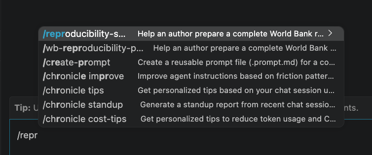
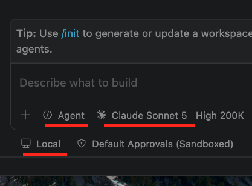

```{r}
#| label: setup
#| include: false
source("../../../_extensions/bootcamp/setup_palettes.R")

knitr::opts_chunk$set(echo = FALSE, warning = FALSE, message = FALSE)
```

## Objective

Produce a **well-structured reproducibility package that runs on someone else's computer and meets the World Bank standard**.

Two starting points for the skill:

- A package that **already exists**, but you're not sure it meets the standard
- Code **written without reproducibility in mind**, a legacy or side project

::: {.callout-note-custom}
The skill embeds the *exact checks the reproducibility team applies as reviewers*. 
:::

## How this session works

One continuous session, from *why* to *doing it yourself*:

1. **The standard:** what a reproducibility package is, and why most packages don't pass on the first try
2. **The skill:** how an AI agent can apply the reviewers' checklist to your project
3. **The workflow:** where the skill fits when you submit a PRWP
4. **Your turn:** run the skill on **our demo project** or **your own project**, stopping at each step to read what the agent found

::: {.callout-note-custom}
Set up while we talk: the next slide has everything you need for the hands-on part.
:::

## Are we ready?

Before we begin, make sure you have everything we need:

- These slides (useful to copy links): [https://bit.ly/ai-reproducibility](https://bit.ly/ai-reproducibility)
- **Visual Studio Code** installed (Software Center on Windows, Self Service on Mac)
- One of the two, signed in within VS Code:
  - **GitHub Copilot** (Copilot Chat extension, with a Claude model available), or
  - The **Claude Code extension**
- **A project to work on**, one of the two:
  - Our demo project, available [here](https://github.com/dime-worldbank/ai-research-training/raw/refs/heads/main/sessions/ai-skills-reproducibility/materials/demo-project.zip), or
  - **Your own project:** code, data, and (ideally) the manuscript in one folder
- The reproducibility skill, in [our repo](https://github.com/worldbank/wb-reproducible-research-repository/tree/main/ai-skills/reproducibility-skill) ([direct download](https://github.com/worldbank/wb-reproducible-research-repository/releases/latest/download/reproducibility-skill.zip))


# Reproducible Research Standards {background-color="#530153"}

## The World Bank Reproducibility standard

- Since **September 2025**, every empirical **Policy Research Working Paper** is expected to have a reproducibility package
- DEC's reproducibility team **verifies** each package and publishes it to the [Reproducible Research Repository](https://reproducibility.worldbank.org)

::: {.callout-note-custom}
The bar is **computational reproducibility**: same data + same code = same results. 
:::


## What goes in a package?

```{=html}
<div class="pkg-diagram">
  <div class="pkg-row">
    <button class="pkg-node" data-key="doc">Documentation</button>
    <span class="pkg-op">+</span>
    <button class="pkg-node" data-key="code">Code</button>
    <span class="pkg-op">+</span>
    <button class="pkg-node" data-key="data">[Data]</button>
    <span class="pkg-op">=</span>
    <button class="pkg-node pkg-result" data-key="pkg">Reproducibility package</button>
  </div>
  <div class="pkg-panel" data-key="hint"><p class="pkg-hint">Click each piece to see what it has to include.</p></div>
  <div class="pkg-panel" data-key="doc" hidden>
    <h3>README</h3>
    <ul>
      <li><strong>Instructions:</strong> run order and run time, the one line to change, software and versions</li>
      <li><strong>Data Availability Statement:</strong> source, URL, access year and license for every input</li>
      <li><strong>List of Exhibits:</strong> every table and figure mapped to the script and file that produce it</li>
    </ul>
  </div>
  <div class="pkg-panel" data-key="code" hidden>
    <h3>All code, from original data to every exhibit</h3>
    <ul>
      <li>One <strong>main script</strong> that runs everything after changing only the top-level path (gold standard)</li>
      <li>Installs every user-written package; sets seeds</li>
      <li>Any manual step (e.g., a chart made in Excel) described in the README</li>
    </ul>
  </div>
  <div class="pkg-panel" data-key="data" hidden>
    <h3>All data needed to reproduce the results</h3>
    <ul>
      <li>For <strong>verification:</strong> everything that can be shared with the team, in its original form</li>
      <li>For <strong>publication:</strong> only what can legally be redistributed (embargo available)</li>
      <li><strong>Restricted data?</strong> NDA, virtual verification, and synthetic data</li>
    </ul>
  </div>
  <div class="pkg-panel" data-key="pkg" hidden>
    <h3>Something a stranger can run</h3>
    <ul>
      <li>A reviewer downloads it, changes one path, runs it, and gets <strong>every exhibit in the paper</strong></li>
      <li>Verified packages get the reproducibility seal and a citable entry in the Repository</li>
    </ul>
  </div>
</div>

<style>
.pkg-row { display: flex; align-items: center; justify-content: space-between; gap: 0.3em; margin: 0.6em 0 0.9em; }
.reveal .pkg-node {
  width: 170px; height: 170px; flex: 0 0 170px; border-radius: 50%; border: 3px solid #800280;
  background: #F4EAF4; color: #530153; font-family: "Montserrat", sans-serif;
  font-weight: 700; font-size: 17px; cursor: pointer; line-height: 1.25; padding: 8px;
}
.reveal .pkg-node:hover { background: #B974B9; color: #fff; }
.reveal .pkg-node.active { background: #800280; color: #fff; }
.reveal .pkg-result { border-color: #530153; background: #fff; }
.pkg-op { font-family: "Montserrat", sans-serif; font-weight: 700; font-size: 1.3em; color: #B974B9; }
.pkg-panel { border-left: 4px solid #800280; background: #F4EAF4; padding: 0.4em 0.9em; min-height: 5.2em; font-size: 0.9em; }
.pkg-panel h3 { margin: 0.2em 0 0.3em; font-size: 1em; }
.pkg-panel ul { margin: 0; }
.pkg-panel li { margin-bottom: 0.2em; }
.pkg-hint { color: #6B6B6B; font-style: italic; margin: 0.8em 0; }
</style>

<script>
document.querySelectorAll('.pkg-diagram').forEach(function (d) {
  d.querySelectorAll('.pkg-node').forEach(function (btn) {
    btn.addEventListener('click', function () {
      var key = btn.dataset.key;
      d.querySelectorAll('.pkg-node').forEach(function (b) { b.classList.toggle('active', b === btn); });
      d.querySelectorAll('.pkg-panel').forEach(function (p) { p.hidden = p.dataset.key !== key; });
    });
  });
});
</script>
```

::: {.notes}
Click Documentation, Code, Data, then the package. The last one is the punchline: a stranger changes one path and gets every exhibit.
:::

## Getting the same results is a low bar... no?

:::: {.columns}

::: {.column width="40%"}
Of the **535 packages** the team has verified, only **about 1 in 5** passed with no changes.

**7 in 10** needed **significant changes**: an updated manuscript, or a fix to an error or omission in the code or data, all requiring action by the authors.
:::

::: {.column width="60%"}
```{r}
#| label: changes-chart
#| fig-width: 6.5
#| fig-height: 3.6
#| fig-alt: "Bar chart: 22% of verified packages needed no changes, 7% minor changes, 71% significant changes."
library(ggplot2)

changes <- data.frame(
  change = factor(c("None", "Minor", "Significant"),
                  levels = c("Significant", "Minor", "None")),
  share = c(22, 7, 71)
)

ggplot(changes, aes(x = share, y = change, fill = change)) +
  geom_col(width = 0.6) +
  geom_text(aes(label = paste0(share, "%")), hjust = -0.15,
            size = 5, colour = analytics_col("dark")) +
  scale_fill_manual(values = c(None = analytics_col("light"),
                               Minor = analytics_col("base"),
                               Significant = analytics_col("dark")),
                    guide = "none") +
  scale_x_continuous(limits = c(0, 90), expand = c(0, 0)) +
  labs(x = NULL, y = NULL,
       title = "Changes required to pass verification") +
  theme_minimal(base_size = 15) +
  theme(panel.grid = element_blank(),
        axis.text.x = element_blank(),
        plot.title = element_text(colour = analytics_col("grey"), size = 14))
```
:::

::::

::: {.source-note}
Source: Reproducibility Initiative progress report, September 2026. Verified packages with a change category assigned (N = 535). Minor changes are fixed by reviewers (installing Stata packages, correcting file paths or variable names).
:::

## Why packages fail, and where the skill comes from

Every round-trip with the reviewer adds days. The failures repeat, so we wrote them down:

| Why packages fail | What the skill checks |
|---|---|
| **Unstructured package:** unclear steps, version issues | Single entry point, run order, pinned versions, no scattered paths |
| **Missing or thin README:** undocumented workflows | README from the official template, List of Exhibits mapped to scripts |
| **Incomplete data statement:** starts from undocumented data | Every external input traced to a source, URL, and access year |
| **Instability:** missing dependencies, no seeds | Packages installed by code, seeds on every random step |
| **Manuscript ≠ code:** the most common failure | Every exhibit regenerated from a clean run before submission |

::: {.callout-note-custom}
The skill is the **official checklist + 14 failure flags** from the team's reviews, written as files an AI agent reads and applies.
:::

::: {.notes}
This is the bridge to the next session. The four failure categories come from the masterclass; the version-mismatch share is the single most common failure. Every row maps to something the skill checks explicitly.
:::

# How AI Can Facilitate Reproducible Workflows {background-color="#530153"}

## What is an AI skill?

A **skill** is a folder of instructions, scripts, and resources that an AI agent reads to get better at a specialized task. The agent loads it **only when triggered**, and reads the actual reference files, not its memory of them.

::: {style="font-size: 1.35em"}
```
reproducibility-skill/
├── SKILL.md            ← always loaded: the 5-phase workflow
├── references/         ← opened only when a phase needs them
│   ├── checklist.md      official package requirements
│   ├── flags.md          14 failure flags + detection patterns
│   ├── datasets.md       WDI, PWT, OECD, ILO citations
│   └── ai_use.md         documenting AI-produced outputs
└── assets/             ← used directly as deliverables
    ├── README_template.md
    ├── README_example.md
    ├── main.do / main.R / main.py
    └── data_inventory.do / .R / .py
```
:::

- **`references/`** extends what the agent *knows*; **`assets/`** extends what it *produces*

::: {.notes}
Key point: the skill ships the standard as readable files. The agent can be wrong about what it remembers; it can't be wrong about what's in front of it. SKILL.md dispatches; references get consulted; assets get copied or filled in. That's why the skill can carry far more of the standard than would ever fit in a prompt.
:::

## Why a skill, and not just a prompt?

The standard is too long to paste into a chat reliably: the full checklist, **14 failure flags** from the team's reviews, templates, and dataset references.

| Without the skill | With the skill |
|---|---|
| You remember to check a few things | The agent checks **every item**, every time |
| The standard lives in someone's head | The standard lives in files the agent reads |
| Each conversation starts from scratch | Guardrails are built into the workflow |
| Standard changes → tell everyone again | Update one file → everyone's next run uses it |

## How does our skill work?

Five phases, with stop points

| Phase | What happens | Writes files? |
|---|---|---|
| **0 · Privacy gate** | Data classification + AI tool → full or code-only mode | Opens nothing |
| **1 · Audit** | Checklist + flags F1–F14; classifies every data file | Read-only |
| **2 · Outline** | Proposes the target structure and a gap table: the build plan | Proposes only |
| **3 · Build** | Drafts README, DAS, main script(s); applies approved fixes | After your approval |
| **4 · Run check** | Reruns from scratch; every exhibit must regenerate | After your approval |

::: {.notes}
Emphasize: the agent stops between every phase and waits for approval. Phase 0 comes before it opens a single file. It will not write a single file until you've seen and approved the outline. This is the author's control point.
:::

## Phase 0 · Privacy gate

Before opening any file, the agent asks your **data classification** and **AI tool**:

| Data classification | Claude | GitHub Copilot (WB enterprise) |
|---|---|---|
| Public, or public with the package | Full mode | Full mode |
| Official Use Only | **Code-only** | Full mode |
| Confidential or personal | **Code-only** | **Code-only** |

**Code-only mode:** the agent never sees the data

- It works on a **copy with no data** (no data files, logs, or notebook outputs) and stops if it finds any
- You run `data_inventory` locally (file names, hashes, variable names, **never values**) and do the final run check

::: {.notes}
The demo project is public data, so today we run in full mode. Walk through the private case live: when in doubt, treat data as the more restrictive category. The skill's "never open data" rule is a second layer; the real protection is that the data is not in the folder the agent can reach.
:::

## Phase 1 · Audit: what the agent checks

Goal: report the current state of the project against the standard. **Change nothing.**

- **Scope:** the manuscript's exhibits define what is in scope
- **Checklist pass:** present / partial / missing, with file or line as evidence
- **Flag pass:** F1–F14 via detection patterns (grep, not eyeballing)
- **README ↔ code:** an existing README or main script is checked against what the code actually does
- **Data ↔ DAS:** each data file is an *external input* or *produced by code*; every external input needs a DAS entry; unknown source = blocking question
- **Exhibit coverage:** every table and figure maps to a script and an output

**And then it stops.** No fixes, no edits.

## The 14 failure flags (F1–F14)

:::: {.columns}

::: {.column width="50%"}
**Paths & structure**

- F1 · Hardcoded user-specific paths
- F2 · No single entry point or run order
- F3 · Scattered `cd` / `setwd` in scripts
- F12 · Outputs overwriting inputs

**Environment**

- F4 · Randomness without a seed
- F5 · Packages not installed by code
- F6 · Software versions not pinned
:::

::: {.column width="50%"}
**Documentation**

- F7 · Manuscript–code version mismatch
- F8 · Input data missing from the DAS
- F9 · Outputs not produced by code
- F10 · Missing List of Exhibits
- F11 · Extraneous files

**Special cases**

- F13 · Restricted data included by mistake
- F14 · Large-compute path undocumented
:::

::::

## Phases 2–3 · Outline → Build

**Outline** *(nothing written to the project yet)*

- Maps every file into the three-folder tree: `data/ · code/ · output/`
- Replicators change a path in **exactly one place per language**
- Gap table: one concrete action per checklist gap and per flag
- **Stops again**: you approve, edit, or reject rows

**Build** *(only after approval)*

- README from the template: Overview, DAS, Instructions, List of Exhibits, Requirements
- Main script(s): versions, one path global, package installs, seeds, run order
- Keeps every file and output name; asks file by file before deleting
- Reruns the Phase 1 audit as a final check

## Phase 4 · Run check

A package that audits clean but has never run from scratch **is not done**.

1. List the expected outputs from the List of Exhibits
2. Set existing outputs aside, **never deleted without your approval**
3. Rerun from a fresh start, changing only the path line
4. Check every exhibit **regenerates** and matches the previous version
5. Record run times in the README; remove the old outputs
6. Remind you to update the manuscript to these outputs

Can't execute (e.g., Stata, Matlab)? You get the **exact clean-run protocol** to run yourself.

## Where the skill fits in your PRWP workflow

```{=html}
<div class="wf-row">
  <div class="wf-step"><span class="wf-num">1</span><strong>Work on your project</strong><span>as usual: code, data, draft</span></div>
  <span class="wf-arrow">→</span>
  <div class="wf-step wf-ai"><span class="wf-num">2</span><strong>Run it through the skill</strong><span>privacy gate, audit, outline, build, run check</span></div>
  <span class="wf-arrow">→</span>
  <div class="wf-step wf-ai"><span class="wf-num">3</span><strong>Address the feedback</strong><span>answer its questions, close the gaps</span></div>
  <span class="wf-arrow">→</span>
  <div class="wf-step"><span class="wf-num">4</span><strong>Submit the reproducibility request form</strong><span>with your package at a good stage</span></div>
  <span class="wf-arrow">→</span>
  <div class="wf-step wf-end"><span class="wf-num">5</span><strong>Verification</strong><span>fewer rounds, faster review</span></div>
</div>
<style>
.wf-row { display: flex; align-items: stretch; gap: 8px; margin: 0.4em 0 0.8em; }
.wf-step { flex: 1 1 0; display: flex; flex-direction: column; gap: 6px; padding: 12px; border: 2px solid #B974B9; border-radius: 6px; background: #fff; font-size: 20px; line-height: 1.3; }
.wf-step strong { font-family: "Montserrat", sans-serif; color: #530153; font-size: 22px; line-height: 1.2; }
.wf-step span:last-child { color: #6B6B6B; }
.wf-ai { background: #F4EAF4; border-color: #800280; }
.wf-end { background: #800280; border-color: #800280; }
.reveal .wf-end strong, .wf-end span:last-child { color: #fff; }
.wf-num { font-family: "Montserrat", sans-serif; font-weight: 700; color: #B974B9; font-size: 18px; }
.wf-end .wf-num { color: #F4EAF4; }
.wf-arrow { align-self: center; color: #800280; font-size: 26px; font-weight: 700; }
</style>
```

Every extra round of corrections means more review time and a later publication date (more work for you and for the reproducibility team):

| Submissions until verified | 1 | 2 | 3 | 4 | 5+ |
|---|---|---|---|---|---|
| **Reviewer hours** (median) | **6h** | 9h | 12h | 18h | 23h |
| **Days to publication** (median) | **14** | 19 | 38 | 62 | 70 |

::: {.source-note}
Source: Reproducibility Initiative progress report data, September 2026. Medians by number of submissions: reviewer hours (N = 533), days from submission to publication (N = 518).
:::

::: {.notes}
This is the workflow Maria wants people to take away. Steps 2–3 (shaded) are where the skill does the work you would otherwise discover through reviewer feedback. The table: one submission = about 6 reviewer hours and 2 weeks; by the fourth round it is 3× the hours and 2 months. It is also more work on the author side each round. The skill is designed so your first submission is your only one.
:::

# Hands-on: Use AI to Create a Reproducibility Package {background-color="#530153"}

## Pick your project

:::: {.columns}

::: {.column width="50%"}
**Option A · Our demo project**

- Small, messy on purpose, runs in minutes
- Best if you want to see the whole workflow first
:::

::: {.column width="50%"}
**Option B · Your own project**

- Work on a **copy** or commit to git first
- Put the **manuscript** in the folder: it defines what's in scope
- Non-public data? Phase 0 tells you if you need **code-only mode**
- Stata / Matlab: you run the final check yourself
:::

::::

::: {.callout-note-custom}
Same setup and prompt for both. We demo on screen.
:::

## Meet the demo project

A cross-country study on **GDP per capita ↔ informality** in R, Stata, and Python ([download](https://github.com/dime-worldbank/ai-research-training/raw/refs/heads/main/sessions/ai-skills-reproducibility/materials/demo-project.zip)).

:::: {.columns}

::: {.column width="68%"}
::: {style="font-size: 1.35em"}
```
demo-project/
├── analysis_final_v3.do    ← C:\Users\wb6878f9\Dropbox\...
├── bootstrap_se.do         ← C:\Users\wb6878f9\Dropbox\...
├── clean_wdi.R             ← C:\Users\wb6878f9\Dropbox\...
├── make_figure2.py         ← no seed; hardcoded path
├── data/
│   ├── wdi_gdppc_extract.csv
│   ├── pwt1001_extract.csv
│   ├── oecd_self_employment.csv
│   └── final_merged_v2.csv  ← ⚠ source unknown
├── output/
│   └── table1_FINAL_formatted_byhand.csv
├── notes/meeting_notes.txt  ← "where did v2 come from??"
└── old/analysis_v2_OLD.do
```
:::

No README. No main script. No requirements file. No structure. No hope.
:::

::: {.column width="32%"}
{width="100%" fig-alt="Animated GIF reacting to a messy project"}
:::

::::

::: {.notes}
The project is intentionally realistic, not a caricature. Code files at the root is extremely common. The mystery file in the meeting notes is the kind of thing that would stump a replicator.
:::

## Let's set it up

1. **Open your project folder** in VS Code: *File → Open Folder* (the **folder**, not a file)
   - Demo: download and unzip it first · Own project: its root folder

2. **Add the skill:** from the VS Code terminal (or right-click → New Folder)

```bash
mkdir -p .agents/skills
```

3. **Copy** the `reproducibility-skill/` folder into `.agents/skills/`:

   `your-project/.agents/skills/reproducibility-skill/SKILL.md`

4. **Check it's available:** type `/` in the chat and look for the skill (next slide)

## Check the skill appears

:::: {.columns}

::: {.column width="55%"}
{fig-alt="VS Code chat autocomplete listing the reproducibility skill after typing /repr"}
:::

::: {.column width="45%"}
Look for `reproducibility-skill` (or `wb-reproducibility-package`). Not listed?

- Restart VS Code
- Dot-folders can be hidden; `ls -a` confirms `.agents` exists
- Try `.github/skills/` (Copilot) or `.claude/skills/` (Claude Code) instead
:::

::::

::: {.notes}
Have people run the skill check before the real prompt. Last time a few went straight to the full prompt, hit a silent non-match, and it took minutes to diagnose.
:::

## Settings check (Claude Code)

:::: {.columns}

::: {.column width="55%"}
{fig-alt="Claude Code extension settings with the session set to Local"}
:::

::: {.column width="45%"}
Set the extension to **Local**.

If you skip it and later see:

`Claude CLI Error: Claude Code process exited with code 1`

**Fix:** start a new chat, then switch to **Local**.
:::

::::

## Let's test it

Open the Claude Code / Copilot chat panel and type:

> *"Prepare a reproducibility package for this project."*

The agent reads the skill and starts with **Phase 0**: it asks how your data is classified and which tool you are using. The demo data is **public**, so answer *public* and it runs in full mode.

::: {.callout-note-custom}
Use **git** to see what's changing: AI agents can touch many files at once, and `git status` / the diff view is how you stay in control of what you accept.
:::

::: {.notes}
Walk people through the VS Code steps before switching windows. Most common issue: opening a file rather than a folder. Pause to check everyone has the folder open.
:::

## What you'll see: the audit output

The agent produces tables before asking permission to continue:

:::: {.columns}

::: {.column width="65%"}

::: {style="font-size: 1.35em"}
```
Flag results (10 FLAGS)
──────────────────────────────────────
F1  Hardcoded paths    FLAG  (4 files)
F2  No entry point     FLAG
F3  Scattered setwd    FLAG  clean_wdi.R:1
F4  No seed            FLAG  make_figure2.py
F5  Packages missing   FLAG
F6  Versions missing   FLAG
F8  Data not in DAS    FLAG  final_merged_v2.csv
F9  Output not code    FLAG  table1_..._byhand.csv
F10 No exhibit list    FLAG
F11 Extraneous files   FLAG  .DS_Store, notes/, old/
```
:::

Plus the checklist table (all **missing**), then it stops: *"Shall I proceed to the outline?"*
:::

::: {.column width="35%"}
{width="100%" fig-alt="Animated GIF reacting to the audit results"}
:::

::::

## What to watch for

We'll stop and read at each gate before moving forward:

:::: {.columns}

::: {.column width="50%"}
**During the audit**

- Does the agent catch all 10 flags?
- How does it handle `final_merged_v2.csv`: does it ask before guessing?
- What does it say about the meeting notes and `old/` folder?
:::

::: {.column width="50%"}
**During outline and build**

- The gap table: one concrete action per flag
- The proposed restructure (code at root → `code/`)
- The main scripts for 3 languages
- The run-check protocol for Stata
:::

::::

→ Switching to VS Code now. On your own project? Same gates: read each audit table before saying *yes*.

## When is a package "done"?

:::: {.columns}

::: {.column width="68%"}
1. **Audit clean:** checklist complete, no open flags
2. **DAS complete:** every external input has a confirmed source, URL, and access date
3. **One-click entry point:** one path to change, packages install, seeds set
4. **Exhibit mapping:** every table and figure maps to a script and an output file
5. **Clean rerun:** every exhibit regenerated from scratch
6. **Manuscript updated** to the regenerated outputs

Then [request verification](https://worldbank.github.io/wb-reproducible-research-repository).
:::

::: {.column width="32%"}
{width="100%" fig-alt="Animated celebration GIF"}
:::

::::

## Cheat sheet: Use it on your own project

The same setup, once per project:

1. **Download the skill** from [github.com/worldbank/wb-reproducible-research-repository](https://github.com/worldbank/wb-reproducible-research-repository/tree/main/ai-skills/reproducibility-skill) (or the [latest `.zip`](https://github.com/worldbank/wb-reproducible-research-repository/releases/latest/download/reproducibility-skill.zip))
2. **Copy `reproducibility-skill/`** into `.agents/skills/` at your project root
3. **Prompt:** *"Prepare a reproducibility package for this project."*

::: {.callout-note-custom}
The checklist and flags are readable on their own, no AI agent needed. When the standard changes, the skill is updated: download it again and your next run uses the new version.
:::

## Thank you {.closing}

Checklist, guidance note, and resources: [worldbank.github.io/wb-reproducible-research-repository](https://worldbank.github.io/wb-reproducible-research-repository)

Questions: [reproducibility@worldbank.org](mailto:reproducibility@worldbank.org)

{height="260px" fig-alt="Animated thank-you GIF"}
