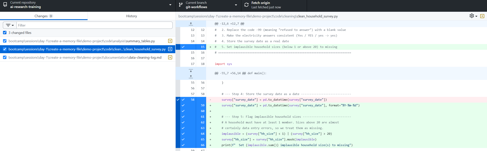
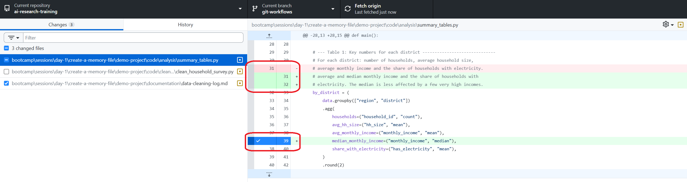
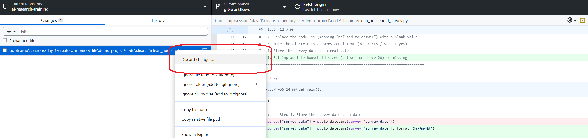
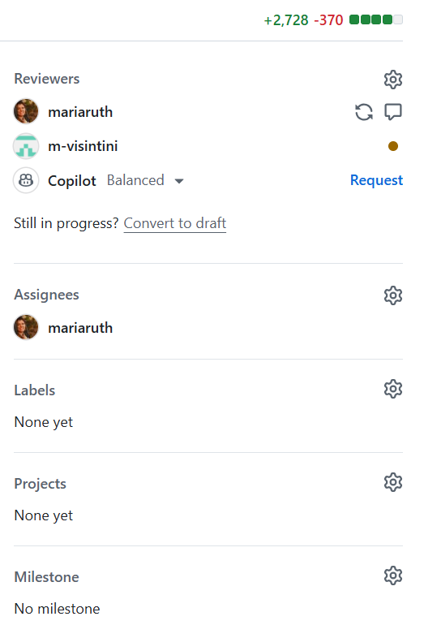

```{r}
#| label: setup
#| include: false

# ../../../ matches the relative path from a qmd file saved
# in the location: sessions/<day>/<topic>/presentation.qmd. 
# Update the file path for presentations elsewhere
source("../../../_extensions/bootcamp/setup_palettes.R")

knitr::opts_chunk$set(echo = FALSE, warning = FALSE, message = FALSE)
```

## Agenda

- Context
- Approach
- Results
- Next steps

# Which workflow is this for? {background-color="#530153"}

## Recap from human-in-the-loop

The content of this session is how to Git and GitHub can help you very verify what we refer to as Static Tools below.

:::: {.columns}
::: {.column style="border: 3px solid #D6BED8; border-radius: 8px; padding: 0.3em;"}

### Static Tools

- Examples: reports, presentation decks, code, etc.
- Created by team members, vendors, or AI tools
- The product owner reviews the finalized output before the product is used or published. This is old-fashioned "human-in-the-loop" review.

:::

::: {.column style="border: 3px solid #F2AA84; border-radius: 8px; padding: 0.5em;"}

### Decision Making Products

- Examples: review bots and interactive bots such as chatbots
- Set up by team members, vendors, or AI tools
- Output is generated in real time. We can do a final review of the setup, but not of the output, unless we have a "human-in-the-loop" checkpoint.

:::
::::

# Unleash the Creativity of AI, but Stay in Control with Git {background-color="#530153"}

## Let the agent finish, then review with Git

When an AI agent modifies files in a repository tracked by Git:

1. **Let the agent work** until the task is complete -- no need to approve every small edit along the way
2. **Review the final result with Git** -- use GitHub Desktop to review the edits before pushing them to your project repository
   - Other Git clients work too, but a GUI client (i.e., not Git on the command line) makes this much easier
3. **Commit only what you approve** -- stage and commit the edits you have reviewed
4. **Not happy?** Ask the agent to fix it, or discard the changes.

## Git Shows You Every AI Edit -- No Matter How Small

- Git gives you a complete, line-by-line record of what the agent did -- you review the outcome, not the process.
- Ask the agent to explain any edit you do not understand or do not see the need for before committing it.

 

## Commit Piece by Piece in Understandable Chunks

- GUI Git clients let you select what to include in each commit. A commit does not have to include -- _and probably should not include_ -- all changes at once.
- Committing in understandable chunks lets you document and preserve the understanding you gain during the review.



## Discard What You Do Not Need

- Agents are verbose. Do not commit unnecessary verbosity to your repository, as it makes the repository hard for humans to follow.
- Update the memory file with instructions that prevent the agent from repeating the same verbosity.



# Use GitHub's Built-in Review Tools {background-color="#530153"}

## Review your changes in a Pull Request

- For each task you want to hand over to the agent, create a branch for that task and check out that branch in your clone.
- Ask the agent to perform the task, using the steps described in the previous section.
- Push the agent's branch to GitHub and open a **Pull Request (PR)** into `main`.
- The PR shows the complete diff of all changes in one place.
- Comment on specific lines, ask colleagues to review, and require approval before merging.
- The PR keeps a permanent record of what was changed, why, and who approved it.


For a full introduction to PRs and more detail on the review features, see the slides from the Impact Analytics PR training:[https://osf.io/e54gy/files/umqzn](https://osf.io/e54gy/files/umqzn)

## GitHub Copilot as a PR reviewer

:::: {.columns .v-center-container}
::: {.column width="75%" }

If you also have a GitHub Copilot license:

- Request **Copilot** as a reviewer on your PR
- Copilot leaves review comments, often with suggested changes you can apply directly.
- A second AI reviewing the first AI's work _can_ catch issues the authoring agent missed.
- One agent reviewing another is no guarantee, but the task is different: Copilot does not follow your initial prompt; it only reviews whether the final set of commits makes sense.

Copilot **assists** the review -- it does not replace it. You are still the product owner and are responsible for what gets merged.

:::
::: {.column width="25%" }



:::
::::


# Give the Agent Its Own Parallel Space - Advanced {background-color="#530153"}

## Worktrees: parallel tasks without collisions

A **worktree** is an extra working directory with its own branch, connected to the same repository.

- Each task gets its own folder and branch, e.g. `.claude/worktrees/login`
- An agent session in one worktree only sees that worktree's files
- Run several sessions in parallel -- a feature, a bugfix, new tests -- without them overwriting each other's edits
- All worktrees share the same Git history, but **not** installed packages or virtual environments (`renv`, `venv`), so you may need to reinstall dependencies

. . .

**Which to pick?** Plain branch switching for one task at a time. Worktrees when you want parallel sessions, or don't want to disturb your current working state.

## Worktrees: how to use them

**With Claude Code:** start a session with `claude --worktree`. The desktop app can create a worktree for each new session automatically.

**Manual route (works anywhere, including VS Code):**

```bash
git worktree add .claude/worktrees/login -b feature/login
```

- Open that folder in a new VS Code window (*File → Open Folder*) and start the agent there
- List worktrees: `git worktree list`
- Remove one when done: `git worktree remove .claude/worktrees/login`
- Add `.claude/worktrees/` to your `.gitignore`

Docs: <https://code.claude.com/docs/en/worktrees.md>

# Thank You! - Questions? {background-color="#530153"}


