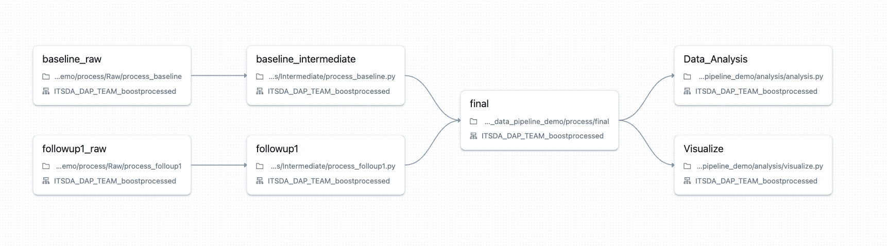
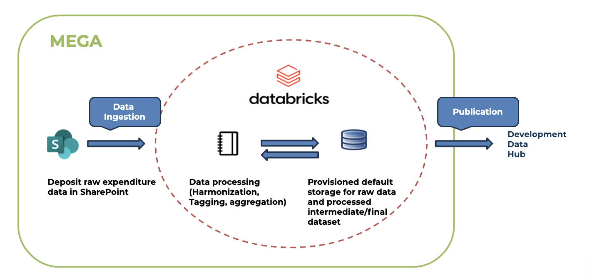
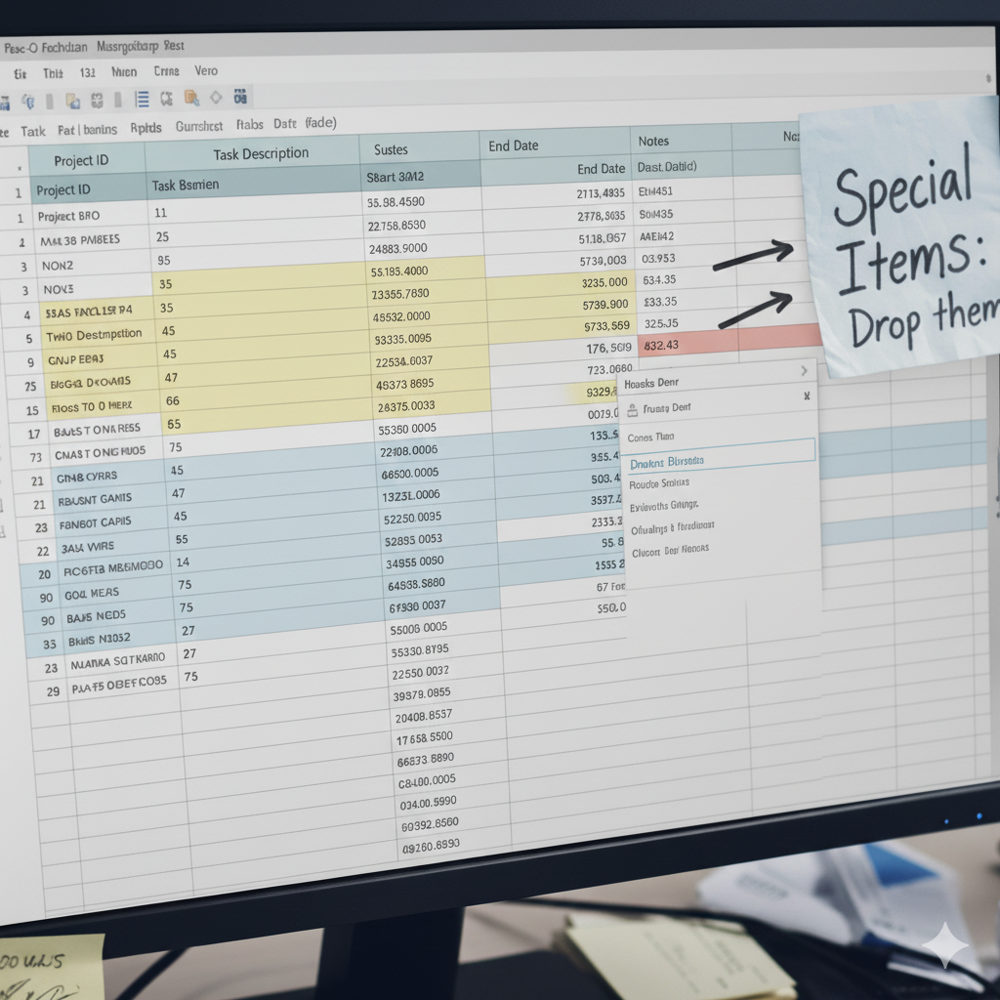
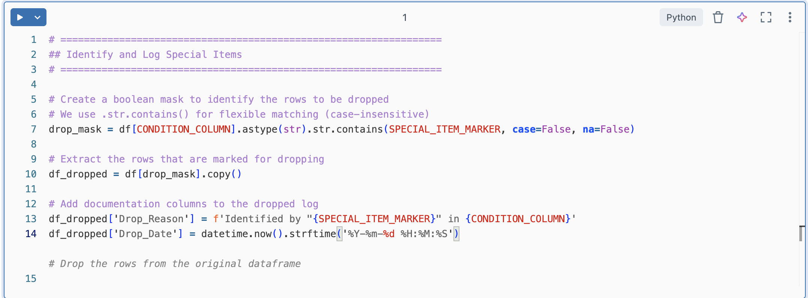
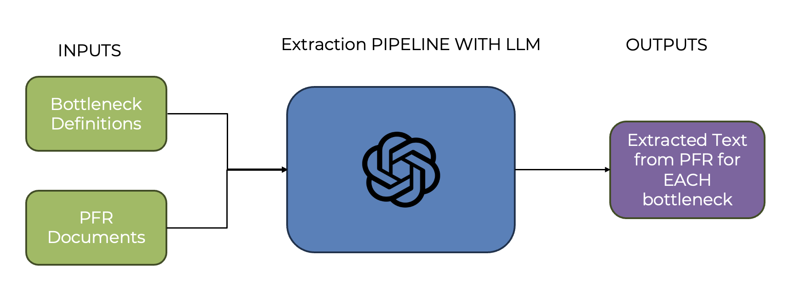
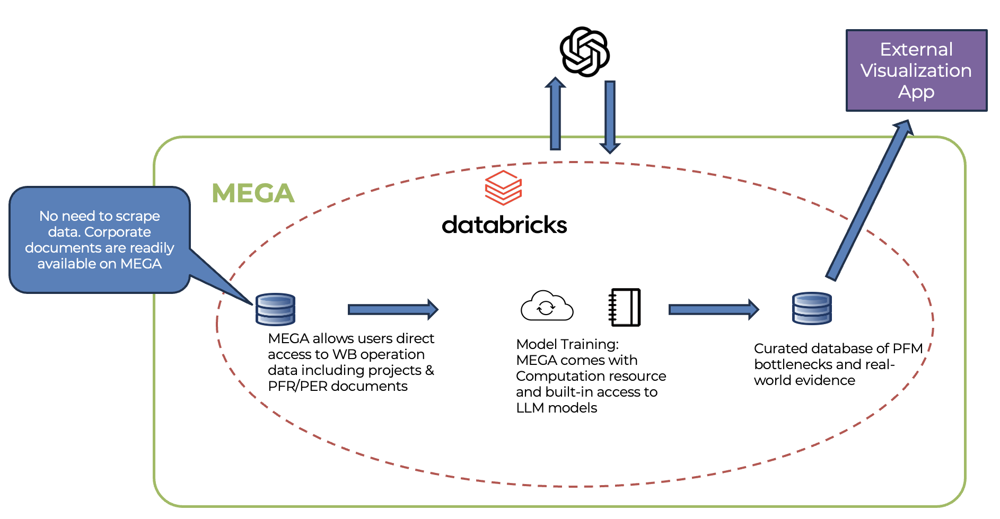

```{r}
#| label: setup
#| include: false

# ../../../ matches the relative path from a qmd file saved
# in the location: sessions/<day>/<topic>/presentation.qmd.
# Update the file path for presentations elsewhere
source("../../../../_extensions/bootcamp/setup_palettes.R")

# MEGA palette for charts, overrides the bootcamp one
analytics_colors[c("dark", "base", "light", "tint")] <-
  c("#02375A", "#00558E", "#9BC8E8", "#D7E9F6")
analytics_seq <- unname(analytics_colors[c("dark", "base", "light")])

knitr::opts_chunk$set(echo = FALSE, warning = FALSE, message = FALSE)
```

## Agenda

- Housekeeping
- What is MEGA
- What it offers
- Use Case: Automated Pipeline for Public Expenditure Data​
- Use Case: LLM Text Mining from World Bank Documents​
- Hands-on Exercise: Using the World Bank AI API in MEGA
- Start working in MEGA

# What is MEGA {background-color="#02375A"}

## What is MEGA?

**M**icrodata & **E**vidence for **G**overnment **A**ction

- Data platform powered by **Databricks**, with built-in integration with WB data, ITS systems and governance policies
- Launched in 2023 through a collaboration between ITS and DECDI
- Used by 70+ project teams across research and operations
- Now the self-service compute layer of the Bank's Development Data Roadmap
- Motivated by:
  - Growing availability of government microdata, much of it still underused
  - fragmented data and computational infrastructure within the Bank

::: {.notes}
Currently it is accessible by all Bank staff, but external collaborators can be onboarded.

It started out motivated by the above, but we realized there is a computational gap in the data ecosystem in the Bank. MEGA fills the gap by providing an integrated computational platform. It is now used by 40+ project teams.
:::

## MEGA enables a collaborative, reproducible workflow

::: {.flow .centered .spaced}
::: {.step}
**Data cleaning**
:::
::: {.arrow}
→
:::
::: {.step .mega}
**Code / Data**

(single source of truth)
:::
::: {.fan}
::: {.branch}
::: {.arrow}
→
:::
::: {.step}
**Data analysis**
:::
:::
::: {.branch}
::: {.arrow}
→
:::
::: {.step}
**Visualization**
:::
:::
::: {.branch}
::: {.arrow}
→
:::
::: {.step}
**Report**
:::
:::
:::
:::

- Code runs on a clean, uniform cloud environment for every team member
- Code and data are both **versioned**, and can be matched and restored to a specific point in the past

## MEGA enables workflow automation

Through **Databricks Jobs**:

- Specify task dependencies and order
- Run a workflow manually, or trigger it on:
  - a pre-determined schedule
  - a specific event (e.g. a file upload)

{fig-alt="Databricks job graph: baseline and follow-up raw and intermediate tasks feed a final task, which feeds data analysis and visualization tasks"}

::: {.notes}
A task is the building block of a job.
:::

## MEGA enables innovation

::: {.cards}
::: {.card}
**Working with big data**

Distributed computing lets you process datasets that are not feasible on a local machine.
:::
::: {.card}
**AI model API access**

Built-in APIs for popular large language models (LLMs), including GPT, Claude, and Gemini.
:::
:::

## MEGA comes integrated with WB data & systems

- **Data ingestion:** integrated with SharePoint. Uploading a file to a designated folder gives immediate access to the same file in the Databricks workspace. Corporate data is already available on MEGA, with no need to upload it.
- **Data publication:** data stored in MEGA can be published automatically to the Development Data Hub (DDH), Microdata Library and other WB data catalogs.
- **Live dashboards and apps:** data can be read directly from MEGA to power real-time dashboards (e.g. Power BI, Tableau, Shiny, Dash, IEHFC).
- **Permission management:** workspace owners have full control to grant or revoke access, for data security and governance.

# Use cases {background-color="#02375A"}

## Use case: BOOST data pipeline

The **BOOST** open budget portal is a decade-long initiative to harmonize detailed public expenditure data across countries.

::: {.cards}
::: {.card}
**Status quo**

A highly manual, labor-intensive process: annual updates across 100+ countries relied on extensive editing in Excel.
:::
::: {.card}
**BOOST on MEGA**

A fully automated pipeline, from raw data ingestion and harmonization to final publication on the DDH.
:::
:::

::: {.notes}
Mention that the Excel workflow is not easily reproducible.
:::

## Use case: BOOST data pipeline

{.r-stretch fig-align="center" fig-alt="BOOST pipeline in MEGA: raw expenditure data deposited in SharePoint is ingested into Databricks, processed (harmonization, tagging, aggregation) and stored as raw, intermediate and final datasets, then published to the Development Data Hub"}

## Use case: BOOST data pipeline

**Result:** an end-to-end data pipeline that is fully reproducible

:::: {.columns}

::: {.column width="40%"}
{fig-alt="Photo of an Excel sheet with a sticky note reading Special Items: drop them"}
:::

::: {.column width="60%"}
{fig-alt="Notebook cell that identifies, logs and drops special items with comments"}
:::

::::

::: {.notes}
Full transparency: every data manipulation and special case is captured directly in the code.
:::

## Use case: text mining from PFRs

The Governance GP's **Reimagining Public Finance** initiative is updating approaches to public finance by focusing on the fiscal and PFM bottlenecks that constrain development outcomes.

::: {.callout-note-custom}
**Goal:** apply text mining to Public Finance Review (PFR) documents to uncover real-world evidence of these bottlenecks, using the newly defined methodological framework.
:::

## Use case: text mining from PFRs

{.r-stretch fig-align="center" fig-alt="Extraction pipeline: bottleneck definitions and PFR documents are inputs to an LLM extraction pipeline, which outputs extracted text from each PFR for each bottleneck"}

## Use case: text mining from PFRs

{height="460px" fig-align="center" fig-alt="PFR text mining in MEGA: WB operations data and PFR/PER documents, already available on MEGA with no scraping needed, feed model training on Databricks with built-in LLM access; results go to a curated database of PFM bottlenecks and real-world evidence, which feeds an external visualization app"}

# Exercise {background-color="#02375A"}

## Before we jump in

1. This exercise is meant for users who are **experienced coders** in R or Python. Since we have more R users than Python users, the exercise will occur in a R notebook, however advanced Python users will be able to follow along.
2. **Why are we doing this exercise in MEGA?** Out-of-the-box support and compute!
3. The purpose of this exercise is not to make you an expert in the MAI Factory API by the time you leave this room, but to show you what is possible when you combine MAI Factory and MEGA.

## Quick concepts that will facilitate your understanding

**MEGA workspace:** Your project environment — bringing together Databricks, connected SharePoint storage, governed data storage, and compute.

**Databricks:** The main environment in MEGA where you work with data, code, and AI.
For today's exercise, you only need three concepts:

::: {.cards}

::: {.card}
**Databricks Workspace**

Your team's working area for *notebooks, scripts, and analysis*.

This is where you will spend most of your time today.
:::

::: {.card}
**Volume**

A place to store files that can be *accessed directly from your notebooks and scripts*.

Think datasets, documents, inputs, and outputs.
:::

::: {.card}
**Compute**

The *processing power and memory* that run your code.

MEGA provides project compute so you are not limited by your laptop.
:::

:::

## The example workflow we will try to replicate: Summarizing and coding interviews in a foreign language

::: {.pipeline}
::: {.phase}
[Design]{.phase-label}

::: {.flow .centered}
::: {.step}
**Themes**

What we want to learn about
:::
::: {.arrow}
→
:::
::: {.step}
**Questions**

Turn each theme into questions
:::
::: {.arrow}
→
:::
::: {.step}
**Questionnaire**

Order and finalize the instrument
:::
:::
:::
::: {.phase-arrow}
→
:::
::: {.phase}
[Fieldwork]{.phase-label}

::: {.flow .centered}
::: {.step}
**Interviews**

Conducted in the local language
:::
::: {.arrow}
→
:::
::: {.step}
**Transcribe**

Audio to text
:::
::: {.arrow}
→
:::
::: {.step .mega}
**Translate**

Into the analysis language
:::
:::
:::
::: {.phase-arrow}
→
:::
::: {.phase}
[Analysis]{.phase-label}

::: {.flow .centered}
::: {.step .mega}
**Code**

Read and map answers to set categories
:::
::: {.arrow}
→
:::
::: {.step}
**Analyze**

Patterns across interviews
:::
:::
:::
:::

::: {.pipeline-legend}
[ ]{.swatch} Steps we will do with AI in this exercise
:::

## Exercise: log in to the MEGA workspace

1. Go to [the exercise workspace](https://adb-6102124407836814.14.azuredatabricks.net/browse/folders/4413675519955135?)
2. You should be prompted to log in with your **Microsoft Entra ID**
3. Follow along with the exercise steps

::: {.callout-note-custom}
**Failed log in?** Raise your hand and a member of our team will make sure you have been correctly added to the workspace.
:::


# Getting Started on MEGA {background-color="#02375A"}

## Getting started on MEGA

- **MEGA site:** type `mega/` in your browser, or go to [worldbankgroup.sharepoint.com/sites/mega](https://worldbankgroup.sharepoint.com/sites/mega)
- **Request a workspace:** from the [MEGA site](https://worldbankgroup.sharepoint.com/sites/mega)
- **Project support:** if you have an idea and would like support, we can help as part of the Computational Impact Lab. [Submit your idea here](https://forms.cloud.microsoft/r/UuMMQUAf8s)
- **Questions:** reach out at [mega@worldbank.org](mailto:mega@worldbank.org)

## Thank you {.closing}

[mega@worldbank.org](mailto:mega@worldbank.org)

