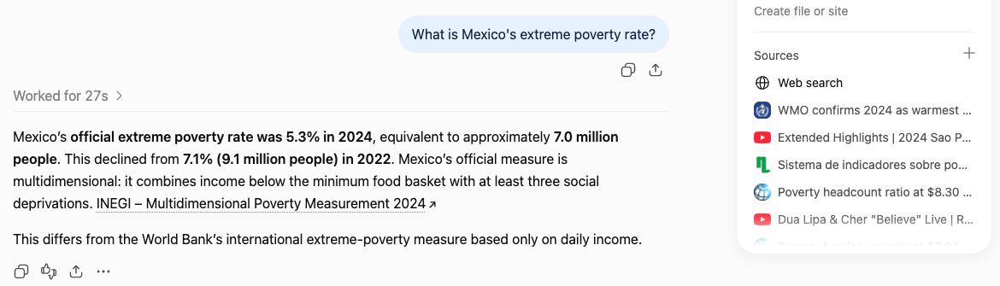
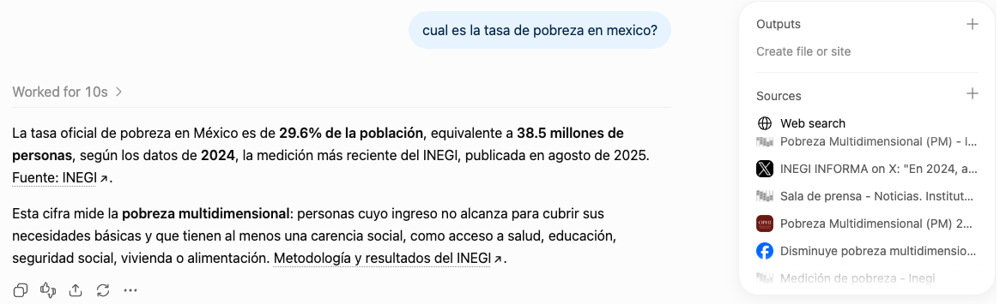
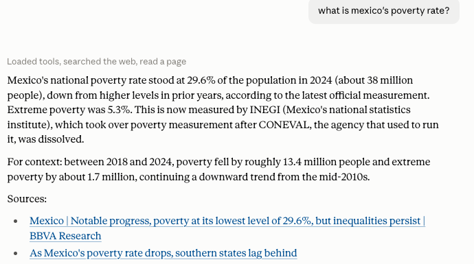
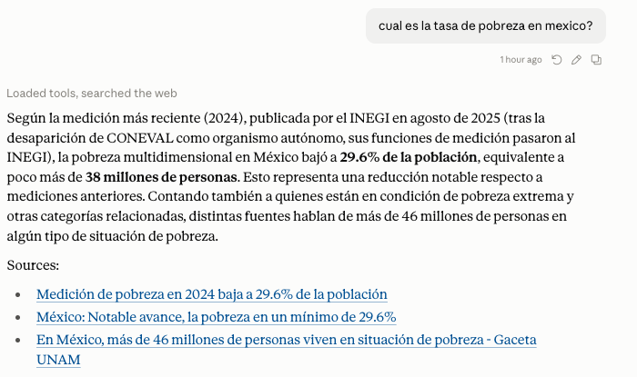
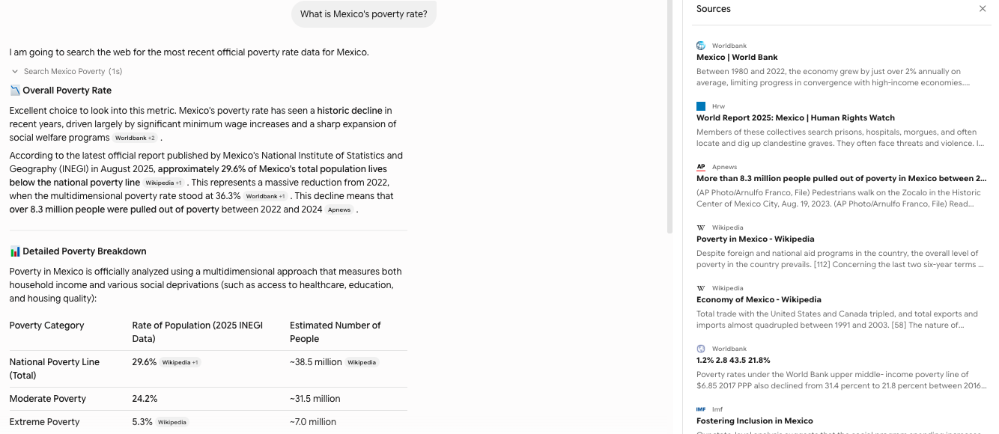
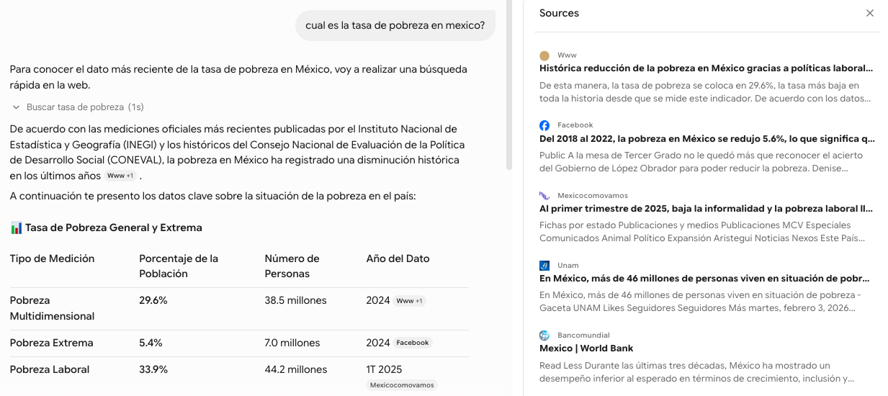
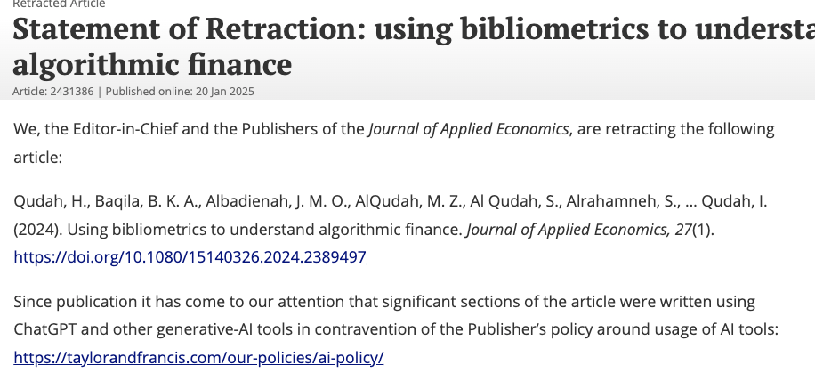
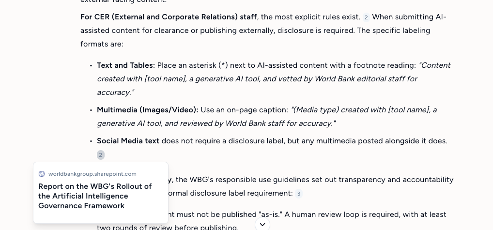
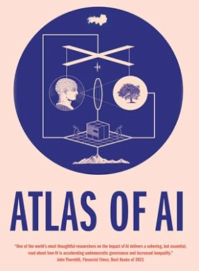

## Have you ever...?

```{=html}
<style>
/* ============ shared tokens ============ */
:root{
  --navy:#002A4F; --blue:#1C618C; --cyan:#01ADEF; --pale:#EAF6FC;
  --green:#1E8F5B; --red:#C0392B; --line:#D6DEE5; --ink:#1B2733;
}

/* ============ slide fit ============
   Replaces Quarto's .smaller. A script at the end of this block measures each
   slide in the live theme and scales its body text so it fills the slide
   without running into the footer: dense slides shrink, light slides grow
   (up to 1.6x). Titles keep the theme size. Opt out per slide: {.no-fit} */
/* reveal.js animates fragments (font-size included); switch that off while measuring */
.reveal .slides section.fitting, .reveal .slides section.fitting *{transition:none!important}
.lede-line{color:#3A4A59}

/* ============ quiz / choice ============ */
.quiz-scenario{background:#f8f8f8;border-left:6px solid var(--navy);padding:.6em 1em;
  border-radius:4px;font-size:.85em;text-align:left}
.quiz-options{display:flex;flex-direction:column;gap:.4em;margin-top:.6em}
.quiz-option{text-align:left;padding:.45em .8em;border:2px solid var(--blue);background:#fff;
  border-radius:6px;cursor:pointer;font-family:inherit;font-size:.85em;color:var(--navy)}
.quiz-option:hover:not(:disabled){background:var(--pale)}
.quiz-option:disabled{cursor:default;opacity:.9}
.quiz-option.correct{background:#DCF3E6;border-color:var(--green);color:#155C3B;font-weight:700}
.quiz-option.incorrect{background:#FBE4E4;border-color:var(--red);color:#8E2A20}
.quiz-feedback{margin-top:.6em;padding:.5em .9em;background:#fff;border:2px dashed var(--cyan);
  border-radius:6px;font-size:.8em;line-height:1.4;text-align:left;display:none}
.quiz-feedback.visible{display:block}

/* ============ big stat ============ */
.stat-wrap{display:flex;align-items:baseline;gap:.6em;margin:.2em 0 .35em}
.stat-num{font-size:2.3em;font-weight:900;color:var(--navy);line-height:1;letter-spacing:-.02em;white-space:nowrap}
.stat-label{font-size:.9em;color:var(--blue);text-align:left;line-height:1.25}
.stat-sub{font-size:.8em;color:#444;text-align:left;margin-top:.5em;line-height:1.45}

/* ============ poll (opening slide) ============ */
.poll-grid{display:flex;flex-direction:column;gap:.45em;margin-top:.6em}
.poll-row{display:flex;align-items:center;gap:.6em}
.poll-btn{flex:0 0 46%;text-align:left;padding:.45em .8em;border:2px solid var(--blue);
  background:#fff;border-radius:6px;cursor:pointer;color:var(--navy);
  font-family:inherit;font-size:.78em}
.poll-btn:hover{background:var(--pale)}
.poll-bar-track{flex:1;height:17px;background:#EDEFF2;border-radius:9px;overflow:hidden}
.poll-bar-fill{height:100%;width:0;background:var(--cyan);transition:width .35s ease}
.poll-count{flex:0 0 2.2em;font-size:.74em;color:var(--blue);font-weight:700}

/* ============ click-panel (cases, tools, stages) ============ */
.picker{display:flex;gap:.35em;flex-wrap:wrap;margin-bottom:.5em}
.pick-btn{flex:1 1 0;min-width:0;padding:.5em .35em;border:2px solid var(--blue);border-radius:6px;
  background:#fff;cursor:pointer;font-size:.6em;line-height:1.2;color:var(--navy);
  font-family:inherit;font-weight:700}
.pick-btn:hover{background:var(--pale)}
.pick-btn.active{background:var(--navy);color:#fff;border-color:var(--navy)}
.pick-btn small{display:block;font-weight:400;opacity:.8;margin-top:.15em}
.pick-panel{min-height:6.6em;border:2px solid var(--cyan);border-radius:6px;padding:.7em .9em;
  background:#fff;text-align:left;font-size:.68em;line-height:1.45}
.pick-panel.tall{min-height:12.5em}
.pick-panel .ptitle{font-weight:900;color:var(--navy);display:block;margin-bottom:.25em;font-size:1.08em}
.pick-panel .pbody{display:block;margin-bottom:.3em}
.pick-panel .pgood{color:#155C3B;display:block;font-weight:700}
.pick-panel .pbad{color:#8E2A20;display:block;font-weight:700}
.pick-panel table{width:100%;border-collapse:collapse;margin:0}
.pick-panel td{padding:.3em .45em;border-bottom:1px solid var(--line);vertical-align:top}
.pick-panel td.k{font-weight:700;color:var(--blue);width:28%}
.pick-panel ul{margin:.2em 0 .4em;padding-left:1.1em}
.pick-panel li{margin-bottom:.12em}
.pick-panel a{color:var(--blue)}
/* ---- screenshot pairs: same question, two languages ---- */
.shotbox .pick-panel{border:none;padding:0;min-height:0}
.shots{display:grid;grid-template-columns:1fr 1fr;gap:.45em;margin:0 0 .3em}
.shot{position:relative;border:1px solid var(--line);border-radius:5px;overflow:hidden;background:#fff;display:flex;flex-direction:column}
.shot .lang{position:absolute;top:0;left:0;z-index:1;font-size:.52em;font-weight:900;color:#fff;background:var(--navy);padding:.15em .55em;letter-spacing:.04em;border-bottom-right-radius:4px;pointer-events:none}
.shot .lang::after{content:" \00B7  click to enlarge";font-weight:400;opacity:.75}
.shot img{display:block;width:100%;height:17.5em;object-fit:contain;object-position:top center;background:#fff;border-bottom:1px solid var(--line);cursor:zoom-in}
.shot-zoom{position:fixed;inset:0;z-index:9999;background:rgba(0,20,40,.88);display:flex;align-items:center;justify-content:center;cursor:zoom-out;padding:2vh 2vw}
.shot-zoom img{max-width:96vw;max-height:94vh;object-fit:contain;background:#fff;border-radius:6px;box-shadow:0 8px 40px rgba(0,0,0,.5)}
.shot .src{font-size:.56em;line-height:1.4;padding:.35em .55em;text-align:left;color:#3A4A59}
.shot .src b{color:var(--navy)}
.src-bad{color:#8E2A20;font-weight:700}
.src-ok{color:#155C3B;font-weight:700}
.shot-pane[hidden]{display:none}
.case-pair{display:grid;grid-template-columns:1fr 1fr;gap:.6em;align-items:stretch}
.case-pair .case-line{margin:0;font-size:.68em}
.thanks{display:flex;flex-direction:column;align-items:center;gap:.8em;margin-top:.6em;text-align:center}
.thanks-line{font-size:1.05em;color:var(--navy);line-height:1.35;max-width:32em}
.thanks-line strong{color:var(--blue)}
.thanks-gif{display:flex;flex-direction:column;align-items:center;gap:.2em}
.thanks-gif iframe{border-radius:8px;max-width:100%}
.thanks-gif a{font-size:.4em;color:#5B6B7A}
.how-list{display:grid;grid-template-columns:40% 1fr;gap:.55em 1.1em;align-items:center;margin:.3em 0 .4em;text-align:left}
.how-list .ex{font-size:.78em}
.how-list .ex .quiz-option{margin:0}
.how-list .say{font-size:.72em;line-height:1.4;color:var(--ink)}
.how-list .say strong{color:var(--navy)}
.legal-grid{display:grid;grid-template-columns:1fr 1fr;gap:1em;margin:.1em 0 .3em;text-align:left}
.legal-col{display:flex;flex-direction:column;gap:.35em}
.legal-kicker{font-size:.62em;font-weight:900;color:var(--navy);text-transform:uppercase;letter-spacing:.05em}
.legal-kicker em{text-transform:none}
.legal-grid .shot img{height:12.5em;object-fit:cover;object-position:top left}
.legal-text{font-size:.62em;line-height:1.45;color:var(--ink)}
.shot-verdict{font-size:.62em;line-height:1.4;text-align:left;background:var(--pale);border-left:5px solid var(--cyan);padding:.4em .7em;border-radius:4px;color:var(--ink)}
.flag-bad{color:#8E2A20;font-weight:700}
.flag-ok{color:#155C3B;font-weight:700}

/* ============ cards and diagrams ============ */
.why-grid{display:grid;grid-template-columns:1fr 1fr;gap:.5em;margin:.3em 0 .5em}
.why-card{border-left:5px solid var(--blue);background:#F5F8FA;padding:.5em .75em;text-align:left;font-size:.72em;line-height:1.4;border-radius:4px}
.why-card strong{display:block;color:var(--navy);font-size:1.1em;margin-bottom:.15em}
.source-flow{display:grid;grid-template-columns:repeat(3,1fr);gap:.55em;align-items:stretch;margin:.35em 0}
.source-tier{border-top:5px solid var(--blue);background:#F5F8FA;padding:.55em .65em;text-align:left;font-size:.68em;line-height:1.35;border-radius:4px}
.source-tier strong{display:block;color:var(--navy);font-size:1.12em;margin-bottom:.25em}
.source-tier em{display:block;color:var(--blue);font-style:normal;font-weight:700;margin-top:.3em}
.consensus-band{margin:.55em auto 0;padding:.55em .8em;background:var(--navy);color:#fff;border-radius:5px;font-size:.68em;text-align:center;max-width:88%}
.life-grid{display:grid;grid-template-columns:repeat(5,1fr);gap:.3em;margin:.45em 0}
.life-stage{border-top:7px solid var(--stage);background:#F5F7F9;padding:.55em .45em;min-height:7.5em;text-align:left;border-radius:4px;font-size:.62em;line-height:1.32}
.life-stage strong{display:block;color:var(--navy);font-size:1.15em;margin-bottom:.35em}
.crosscut{background:#EAF6FC;border-left:5px solid var(--cyan);padding:.45em .7em;font-size:.62em;text-align:center;margin-top:.45em}

/* ============ risk slides ============ */
.risk-head{display:flex;align-items:center;flex-wrap:wrap;gap:.35em;font-size:.72em;margin:0 0 .5em}
.risk-num{font-weight:900;color:var(--navy);text-transform:uppercase;letter-spacing:.05em;margin-right:.4em}
.risk-where{color:#5B6B7A;margin-right:.1em}
.chip{display:inline-block;border-radius:999px;padding:.12em .65em;border:1.5px solid var(--stage);
  color:var(--stage);font-weight:700;background:#fff;line-height:1.4}
.chip.on{background:var(--stage);color:#fff}
.chip.off{border-color:var(--line);color:#A5B1BC}
.case-line{border-left:5px solid var(--red);background:#FDF3F2;padding:.4em .8em;font-size:.78em;
  text-align:left;border-radius:4px;color:#3A2A28;line-height:1.4}
.case-line strong{color:#8E2A20}
.no-line{margin-top:.45em;border-left:5px solid var(--red);background:#FBE4E4;color:#8E2A20;padding:.4em .7em;font-size:.8em;border-radius:4px;line-height:1.4;text-align:left}
.case-line.with-shot{display:flex;gap:.9em;align-items:flex-start}
.case-line.with-shot img{flex:0 0 44%;border-radius:3px;box-shadow:0 2px 9px rgba(0,0,0,.18)}
.case-line.with-shot .ct{flex:1}

/* ============ AI vs governance timeline ============ */
.tl{display:grid;grid-template-columns:7.5em repeat(6,1fr);gap:.3em;font-size:.6em;margin:.3em 0 .4em;text-align:left}
.tl .yr{font-weight:900;color:var(--navy);border-bottom:3px solid var(--navy);padding:.2em .3em;font-size:1.15em}
.tl .lane{font-weight:900;color:#fff;border-radius:4px;padding:.45em .5em;display:flex;align-items:center}
.tl .lane.ai{background:var(--cyan)} .tl .lane.gov{background:var(--navy)}
.tl .ev{background:#F5F8FA;border-radius:4px;padding:.4em .45em;line-height:1.3;min-height:3.2em}
.tl .ev.ai{border-left:4px solid var(--cyan)} .tl .ev.gov{border-left:4px solid var(--navy)}
.tl .ev.empty{background:transparent;border:none}

/* ============ risk x lifecycle matrix ============ */
.rl{margin-top:.2em}
.reveal .rl table.rlm{width:100%;border-collapse:separate;border-spacing:.3em;font-size:.75em;margin:0}
.reveal .rl table.rlm th,.reveal .rl table.rlm td{border:none;padding:0;vertical-align:middle}
.reveal .rl thead th{border-top:6px solid var(--stage)!important;background:#F5F7F9;color:var(--navy);padding:.35em .3em!important;text-align:center;border-radius:3px}
.reveal .rl tbody th{text-align:left;color:var(--navy);font-weight:800;padding-right:.5em!important;white-space:nowrap}
.cell{width:100%;height:2.1em;border:1.5px dashed #B9C4CE;background:#fff;border-radius:6px;cursor:pointer;
  font-family:inherit;font-weight:900;font-size:1em;color:#fff;line-height:1}
.cell:hover{background:var(--pale)}
.cell.vote{background:var(--cyan);border:1.5px solid var(--cyan)}
.cell.given{background:var(--navy);border:1.5px solid var(--navy);cursor:default}
.cell.given::after{content:'\25CF'}
.cell.vote::after{content:'\25CF'}
.rl.revealed .cell[data-a="1"]{background:var(--navy);border:1.5px solid var(--navy)}
.rl.revealed .cell[data-a="1"]::after{content:'\25CF'}
.rl.revealed .cell.vote[data-a="1"]{background:var(--green);border-color:var(--green)}
.rl.revealed .cell.vote[data-a="1"]::after{content:'\2713'}
.rl.revealed .cell.vote[data-a="0"]{background:#fff;border:1.5px solid var(--cyan);color:var(--cyan)}
.reveal .rl tfoot td,.reveal .rl tfoot th{visibility:hidden;font-size:.85em;color:#3A4A59;vertical-align:top;line-height:1.3;text-align:left;font-weight:400}
.reveal .rl tfoot th{color:var(--blue);font-weight:800}
.reveal .rl.revealed tfoot td,.reveal .rl.revealed tfoot th{visibility:visible}
.rl-actions{display:flex;align-items:center;gap:.5em;margin-top:.3em;font-size:.7em}
.rl-legend{visibility:hidden;color:#5B6B7A}
.rl.revealed .rl-legend{visibility:visible}
.reveal-btn{padding:.35em .9em;border:2px solid var(--blue);background:#fff;color:var(--navy);
  border-radius:6px;cursor:pointer;font-family:inherit;font-size:1em;font-weight:700}
.reveal-btn:hover{background:var(--pale)}

/* ============ concept maps (five risks, eight pillars) ============ */
.board{display:flex;gap:1em;min-height:13em;margin-top:.3em;align-items:stretch}
.map{position:relative;flex:0 0 50%;display:flex;align-items:stretch}
.map svg.wires{position:absolute;inset:0;width:100%;height:100%;pointer-events:none;overflow:visible}
.map-root{align-self:center;flex:0 0 5.4em;background:var(--navy);color:#fff;border-radius:6px;
  padding:.6em .5em;font-size:.62em;font-weight:900;line-height:1.25;text-align:center;
  position:relative;z-index:2}
.map-gap{flex:0 0 3.2em}
.map-list{flex:1;display:flex;flex-direction:column;justify-content:space-around;gap:.3em;
  position:relative;z-index:2}
.map-item{display:flex;align-items:center;gap:.45em;border:1.5px solid var(--line);background:#fff;
  color:var(--ink);border-radius:5px;padding:0 .6em;min-height:1.9em;cursor:pointer;
  font-family:inherit;font-size:.66em;font-weight:700;text-align:left;width:100%}
.map-item:hover{background:var(--pale);border-color:var(--blue)}
.map-item .dot{flex:0 0 .45em;height:.45em;border-radius:50%;background:var(--line)}
.map-item.seen .dot{background:var(--green)}
.map-item.active{background:var(--navy);border-color:var(--navy);color:#fff}
.map-item.active .dot{background:var(--cyan)}
.map-panel{flex:1;border:1.5px solid var(--cyan);border-radius:6px;padding:.7em .9em;background:#fff;text-align:left}
.map-panel h4{margin:0 0 .35em;font-size:.85em;font-weight:900;color:var(--navy);line-height:1.2;text-transform:none}
.map-panel .lede{font-size:.66em;line-height:1.45;margin:0 0 .55em;color:#3A4A59}
.map-panel .lab{font-size:.58em;font-weight:900;color:var(--blue);margin:0 0 .15em}
.map-panel ul{margin:0 0 .55em;padding-left:1em}
.map-panel li{font-size:.62em;line-height:1.4;margin-bottom:.1em}
.map-panel .bank{font-size:.62em;line-height:1.4;background:var(--pale);border-radius:4px;
  padding:.45em .6em;color:var(--navy);margin:0}


/* ============ visible stage action lists ============ */
.stage-actions{margin:.4em 0 0;padding-left:0;list-style:none}
.stage-actions li{position:relative;padding:.1em 0 .1em 1.5em;line-height:1.35}
.stage-actions li::before{content:"\2610";position:absolute;left:0;top:.1em;color:var(--blue);font-size:1em}

/* ============ practical check highlight ============ */
.rule-card{border-left:6px solid var(--blue);background:var(--pale);padding:.5em .9em;font-size:.85em;
  text-align:left;border-radius:4px;color:var(--navy);line-height:1.4}
.rule-card strong{display:block;font-size:.85em;text-transform:uppercase;letter-spacing:.06em;color:var(--blue);margin-bottom:.15em}

/* ============ book shelf (real cover photos) ============ */
.shelf{display:grid;grid-template-columns:repeat(3,12em);gap:2.2em;margin:.5em 0 .3em;justify-content:center}
.bk .cover{width:100%;height:14em;object-fit:contain;border-radius:3px;box-shadow:0 3px 12px rgba(0,0,0,.22)}
.bk .t{font-size:.85em;font-weight:900;line-height:1.15;letter-spacing:-.01em;margin-top:.55em}
.bk .a{display:block;font-size:.6em;font-weight:700;opacity:.75;line-height:1.3;margin-top:.15em}
.bk .why{font-size:.62em;line-height:1.45;margin-top:.5em;color:#3A4A59;text-align:left}

/* ============ callouts ============ */
.warn-card{border-left:6px solid var(--red);background:#FBE4E4;padding:.5em .9em;font-size:.85em;
  text-align:left;border-radius:4px;color:#8E2A20;line-height:1.4}
.ok-card{border-left:6px solid var(--green);background:#DCF3E6;padding:.5em .9em;font-size:.85em;
  text-align:left;border-radius:4px;color:#155C3B;line-height:1.4}
.ok-card ul{margin:.3em 0 0;padding-left:1.1em}
.ok-card li{margin-bottom:.35em}
.ok-card p{margin:0}
.quote-big{font-size:.92em;line-height:1.45;text-align:left;border-left:6px solid var(--cyan);
  padding:.5em 1em;color:var(--navy);font-style:italic}
.todo{color:#B8860B;font-style:italic;font-weight:700}
.refs{font-size:.5em;column-count:2;column-gap:1.4em;line-height:1.35;text-align:left;margin:0;padding-left:1.1em}
.refs li{margin-bottom:.3em;break-inside:avoid}

/* ============ decdi theme rules, inlined ============
   Quarto's self-contained/embed-resources export does not reliably embed
   this project's compiled _extensions/decdi/decdi.scss theme (the compiled
   CSS exists on disk during render but the wrong, un-themed default reveal
   theme gets embedded into the self-contained HTML instead -- reproduced
   with both self-contained:true and embed-resources:true on Quarto 1.9.37).
   Rules that matter for the deck to look right are duplicated here as plain
   CSS so they always make it into index.html regardless of that bug. Keep
   this in sync with decdi.scss's scss:rules section if that file changes. */
#title-slide{text-align:left}
#title-slide .title{font-size:1.5em;border-bottom:5px solid #2599CD}
#title-slide .title:after{content:'';display:block;border-bottom:5px solid #002A4F;margin-bottom:-5px;max-width:50%}
#title-slide .subtitle{color:#002A4F;font-size:90%;font-family:'Montserrat',sans-serif}
#title-slide .institute,#title-slide .quarto-title-affiliation{font-style:italic;font-size:80%}
#title-slide .author,#title-slide .quarto-title-author-name{color:#002A4F;font-size:85%}
#title-slide .date{color:#002A4F;font-size:80%}
#title-slide .quarto-title-authors{display:flex;justify-content:left}
#title-slide .quarto-title-authors .quarto-title-author{padding-left:0;padding-right:0;width:100%}
#title-slide p.author::before,#title-slide div.quarto-title-author::before{content:"";display:block;border:none;background-color:#FFFFFF;color:#002A4F;height:3px;margin-bottom:1em}
#title-slide p,#title-slide a{color:#002A4F}
.reveal .footer{color:black;font-family:'Montserrat',sans-serif}
.has-dark-background .footer{color:white}
section.has-dark-background a,section.has-dark-background a:hover{color:#f8f8f8}
.reveal .slide-number{font-family:'Montserrat',sans-serif}
.reveal .slide-number a{color:#2599CD}
.slide-logo{display:block !important;position:fixed !important;top:0 !important;right:10px !important;max-height:8% !important;height:100% !important;width:auto !important;color:#000000 !important}
.has-dark-background .slide-logo{filter:brightness(0) invert(1)}
.slide-number,.reveal.has-logo .slide-number{bottom:10px !important;right:10px !important;top:unset !important;color:#000000 !important}
.v-center-container{display:flex !important;justify-content:center;align-items:center;height:90%}
.vh-center-container{display:flex !important;justify-content:center;align-items:center;height:90%;text-align:center}
.h-center-container{text-align:center}
.MathJax{font-size:80% !important}
</style>

<script>
/* ---- quiz ---- */
function quizAnswer(btn, ok){
  var g=btn.parentElement;
  g.querySelectorAll('.quiz-option').forEach(function(b){b.disabled=true;});
  btn.classList.add(ok?'correct':'incorrect');
  var f=g.nextElementSibling;
  if(f&&f.classList.contains('quiz-feedback')) f.classList.add('visible');
}

/* ---- poll ---- */
var pollT={};
function pollVote(k,i){
  if(!pollT[k]) pollT[k]={};
  pollT[k][i]=(pollT[k][i]||0)+1;
  var tot=0; Object.keys(pollT[k]).forEach(function(x){tot+=pollT[k][x];});
  document.querySelectorAll('[data-poll="'+k+'"]').forEach(function(r){
    var j=r.getAttribute('data-idx'), n=pollT[k][j]||0;
    r.querySelector('.poll-bar-fill').style.width=(tot?100*n/tot:0)+'%';
    r.querySelector('.poll-count').textContent=n;
  });
}

/* ---- the five WBG risks and the research lifecycle: one source of truth ---- */
var STAGES=[['Design','#1683B5'],['Acquisition','#159B88'],['Processing','#E67E22'],['Analysis','#7D3C98'],['Publication','#006B73']];
var RISK_NAMES=['Accountability &amp; traceability','Validity &amp; accuracy','Security &amp; privacy','Ethical','Legal'];
/* stages where each risk needs the most attention (rows = risks, values = stage index) */
var RISK_STAGES=[[0,2,3,4],[0,2,3,4],[0,1,2,3,4],[0,1,3,4],[0,1,4]];
var STAGE_Q=['What should AI support, and which judgments stay with us?',
  'Are we collecting or accessing data responsibly, and who is missing?',
  'Did the transformations preserve the meaning and integrity of the data?',
  'Is the estimate right, for everyone we report on?',
  'Have we verified, disclosed, and kept the evidence?'];
/* Research uses and checks, grouped by stage. */
var STAGE_USE=["Concept notes, research questions, literature reviews, identification strategies and draft questionnaires.", "Survey programming, interviews and consultations, transcription, dataset searches, downloads and document extraction.", "Cleaning and merging data, harmonising names, constructing variables, translating responses and classifying text.", "Estimation code, tables and figures, interpretation of results and checks of robustness.", "Drafting and editing papers, translating summaries, preparing policy briefs and documenting the research package."];
var STAGE_DO=[
  [
    "Decide which task AI will support and which judgments stay with you. For anything feeding an operational decision, plan for human review, override, and a way for people to contest errors.",
    "If AI helped draft the concept note or a literature review, verify every claim and citation against its original source &mdash; AI-generated reference lists can include citations that are wrong or do not exist.",
    "Confirm yourself that the proposed method fits the question, data, and assumptions. An AI-drafted design can look complete without being right for your case.",
    "If AI drafted or translated survey questions, check them for leading wording and local meaning, then pilot with real respondents before fielding.",
    "Before collecting any data, confirm what AI use is permitted under the data agreement, participant consent, and any required ethics or IRB review.",
    "If AI will generate variables or labels later in the project, budget time now for human validation across the relevant languages and groups."
  ],
  [
    "Confirm participant consent, information sheets, and the collection protocol explicitly cover any recording or AI use you plan, such as transcription or translation.",
    "If AI helped write survey code, skip logic, or translations, test it with realistic edge-case responses. Separately check who might be missed by language, connectivity, nonresponse, or the sampling approach.",
    "Check every AI transcript or extracted value against the source recording or document. Preserve genuine uncertainty and missing responses &mdash; do not let AI invent an answer.",
    "If AI helped locate or extract secondary data, verify the source, version, definitions, and coverage yourself, and confirm the download or extraction is complete.",
    "Before sending any data to an AI tool, confirm you are authorised to under the data's classification, the data agreement, and, for identified data, the IRB protocol.",
    "Strip or minimise personally identifiable content before it goes anywhere near an AI tool &mdash; names, exact locations, voices, and interview text that could identify a respondent. Removing names alone does not make a dataset safe to share."
  ],
  [
    "Keep the original data untouched and log every transformation. Only send a tool data that is permitted for that data's classification and purpose.",
    "Read and understand AI-written code before you run it. Test it on small examples, including missing values, duplicates, and unmatched records.",
    "Before and after any AI-assisted transformation, compare observation counts, missingness, and merge results. Investigate every unexpected change &mdash; AI-written code can silently drop or duplicate records.",
    "When AI generates analytical content, record the model, version, date, prompts, and settings, and keep the raw outputs in an authorised location.",
    "If AI creates labels or variables, validate them against human-reviewed examples, including the relevant languages and groups."
  ],
  [
    "Whether or not AI wrote the estimation code, confirm yourself that the sample, variable definitions, weights, and model specification are correct, and apply the methodological checks your question requires.",
    "Check every AI-drafted or AI-formatted figure and table against the underlying results: values, labels, axes, units, sample sizes, and uncertainty.",
    "If AI helped write the interpretation, check that it preserves magnitude, uncertainty, and limitations.",
    "When an AI-generated measure enters the analysis, assess how its errors affect the findings, including whether they differ across groups.",
    "Have someone with the relevant expertise review the substantive conclusions. Code running successfully does not mean it is correct."
  ],
  [
    "Verify every claim and citation against the original source, especially anything AI helped draft, and check consistency across the text, tables, figures, and abstract.",
    "If AI drafted a translation or policy summary, confirm it preserves the paper's uncertainty and qualifications rather than turning a tentative finding into a firm recommendation.",
    "Disclose meaningful AI assistance at submission, following the target journal's policy. Requirements vary and are getting stricter &mdash; for example, the American Economic Association requires authors to describe any AI use in drafting or editing; AI cannot be listed as an author, and authors remain solely accountable for fact-checking its output.",
    "If you are reviewing a paper, disclose any AI use in your review too, and use only tools that guarantee the manuscript will not be used to train a model &mdash; several journals, including the AEA, now require this explicitly. <a href=\"https://www.aeaweb.org/journals/aer/submissions\" target=\"_blank\" rel=\"noopener\">AEA guidance</a>",
    "In the reproducibility package, document AI-generated analytical outputs and link the records from the README. For coding assistance alone, retain the scripts and consider a brief disclosure. <a href=\"https://worldbank.github.io/wb-reproducible-research-repository/guidance/AI_reproducibility_guidelines.html\" target=\"_blank\" rel=\"noopener\">RRR guidance</a>",
    "Review what may be shared beyond the paper itself &mdash; data, prompts, outputs, and any third-party material."
  ]
];
function chip(name,color,on){ return '<span class="chip '+(on?'on':'off')+'" style="--stage:'+color+'">'+name+'</span>'; }

/* ---- generic picker ---- */
var PICK={};

/* Security & privacy: which tool, which data */
PICK.tool={
  t_mai:'<table>'+
    '<tr><td class="k">Status</td><td>Live &middot; all staff &middot; free.</td></tr>'+
    '<tr><td class="k">Cleared for</td><td class="flag-ok">WBG Restricted Data and Personal Data, per AI@WBG guidance.</td></tr>'+
    '<tr><td class="k">Trains on your prompts?</td><td>No &mdash; operates within WBG security controls.</td></tr>'+
    '<tr><td class="k">Still applies</td><td>Tool approval is not data authorization.</td></tr>'+
    '</table>',
  t_cop:'<table>'+
    '<tr><td class="k">Status</td><td>Approved for WBG staff alongside mAI.</td></tr>'+
    '<tr><td class="k">Cleared for</td><td class="flag-ok">WBG Restricted Data and Personal Data, per AI@WBG guidance.</td></tr>'+
    '<tr><td class="k">Trains on your prompts?</td><td>Not used to train public models under WBG enterprise terms.</td></tr>'+
    '</table>',
  t_gemc:'<table>'+
    '<tr><td class="k">Status</td><td>Live &middot; all staff &middot; license required. Email <a href="https://ai.worldbankgroup.org/">AI@WBG</a>.</td></tr>'+
    '<tr><td class="k">Cleared for</td><td class="flag-ok">WBG content, including Strictly Confidential content.</td></tr>'+
    '<tr><td class="k">Trains on your prompts?</td><td>Under a qualifying Workspace licence, Google states content is not human-reviewed and is not used to train models outside your domain &mdash.</td></tr>'+
    '<tr><td class="k">Policy</td><td><a href="https://knowledge.workspace.google.com/admin/gemini/gemini-for-google-workspace-faq">Workspace Gemini FAQ</a></td></tr>'+
    '</table>',
  t_gpt:'<table>'+
    '<tr><td class="k">Cleared for</td><td class="flag-bad">Public information only, and only under the Addendum&rsquo;s four conditions.</td></tr>'+
    '<tr><td class="k">Trains on your chats?</td><td class="flag-bad">Yes, unless you opt out.</td></tr>'+
    '<tr><td class="k">Retention</td><td>Varies by setting. Temporary chats are excluded from training and deleted within 30 days. A 2025 US court order required temporary retention of some consumer logs.</td></tr>'+
    '<tr><td class="k">Policy / settings</td><td><a href="https://openai.com/enterprise-privacy/">Enterprise privacy</a> &middot; Settings &rarr; Data Controls</td></tr>'+
    '</table>',
  t_cla:'<table>'+
    '<tr><td class="k">Cleared for</td><td class="flag-bad">Public information only, and only under the Addendum&rsquo;s four conditions.</td></tr>'+
    '<tr><td class="k">Trains on your chats?</td><td class="flag-bad">Yes, unless you turn it off. Consumer training became opt-out in September 2025.</td></tr>'+
    '<tr><td class="k">Retention</td><td>Up to 5 years with training on; 30 days with it off. Safety-flagged content is handled separately.</td></tr>'+
    '<tr><td class="k">Policy / settings</td><td><a href="https://www.anthropic.com/legal/privacy">Privacy policy</a> &middot; <a href="https://claude.ai/settings/data-privacy-controls">Turn training off</a></td></tr>'+
    '</table>',
  t_gem:'<table>'+
    '<tr><td class="k">Cleared for</td><td class="flag-bad">Public information only, and only under the Addendum&rsquo;s four conditions.</td></tr>'+
    '<tr><td class="k">Trains on your chats?</td><td class="flag-bad">Yes &mdash; and human reviewers read a sample.</td></tr>'+
    '<tr><td class="k">Retention</td><td>Reviewed data is disconnected from your account and kept 3 years. Deleting the chat does not retract it.</td></tr>'+
    '<tr><td class="k">Google says</td><td class="flag-bad">Do not enter confidential information you would not want a reviewer to see.</td></tr>'+
    '<tr><td class="k">Policy / settings</td><td><a href="https://support.google.com/gemini/answer/13594961">Privacy hub</a> &middot; <a href="https://myactivity.google.com/product/gemini">Manage activity</a></td></tr>'+
    '</table>'
};

/* Stage panels show the question, relevant risks, and actions immediately. */
PICK.stage={};
STAGES.forEach(function(st,i){
  PICK.stage['s'+i]='<span class="ptitle">'+st[0]+'</span>'+
    '<span class="pbody"><strong>Ask:</strong> '+STAGE_Q[i]+'</span>'+
    '<span class="pbody"><strong>Typical AI uses:</strong> '+STAGE_USE[i]+'</span>'+
    '<ul class="stage-actions">'+STAGE_DO[i].map(function(x){return '<li>'+x+'</li>';}).join('')+'</ul>';
});

/* Validity: one fact, three assistants, two languages. The screenshots are real  tags in
   the slide itself, so Quarto's self-contained export embeds them as data URIs (paths inside a
   JS string are not rewritten and would break once index.html moves). This only toggles panes. */
function shotShow(btn,id){
  var wrap=btn.closest('.shotbox');
  wrap.querySelectorAll('.pick-btn').forEach(function(b){b.classList.remove('active');});
  btn.classList.add('active');
  wrap.querySelectorAll('.shot-pane').forEach(function(p){p.hidden=(p.id!==id);});
}
/* click a screenshot to see it full screen; click or Esc to close */
document.addEventListener('click',function(e){
  var z=document.querySelector('.shot-zoom');
  if(z){ z.remove(); e.stopPropagation(); return; }
  var img=e.target.closest && e.target.closest('.shot img');
  if(!img) return;
  z=document.createElement('div'); z.className='shot-zoom';
  z.innerHTML=''; z.firstChild.src=img.src; z.firstChild.alt=img.alt;
  document.body.appendChild(z); e.stopPropagation();
},true);
document.addEventListener('keydown',function(e){
  var z=document.querySelector('.shot-zoom');
  if(z&&(e.key==='Escape'||e.key==='Esc')){ z.remove(); e.stopPropagation(); e.preventDefault(); }
},true);

function pickShow(group,id,el){
  var wrap=el.parentElement.parentElement;
  wrap.querySelectorAll('.pick-btn').forEach(function(b){b.classList.remove('active');});
  el.classList.add('active');
  wrap.querySelector('.pick-panel').innerHTML=pickHTML(PICK[group][id]);
}
function pickHTML(c){
  return typeof c==='string' ? c :
    '<span class="ptitle">'+c[0]+'</span><span class="pbody">'+c[1]+'</span><span class="pgood">'+c[2]+'</span>';
}

/* ---- risk slide headers: risk number + the lifecycle stages where it bites ---- */
function buildRiskHeads(){
  document.querySelectorAll('.risk-head[data-r]').forEach(function(h){
    var r=+h.getAttribute('data-r');
    h.innerHTML='<span class="risk-num">Risk '+(r+1)+' of 5</span><span class="risk-where">'+RISK_NAMES[r]+'</span>';
  });
}

/* ---- risk x lifecycle matrix: the room votes, then compare ---- */
function buildMatrix(){
  document.querySelectorAll('.rl[data-rl]').forEach(function(box){
    var h='<table class="rlm"><thead><tr><th></th>'+
      STAGES.map(function(st){return '<th style="--stage:'+st[1]+'">'+st[0]+'</th>';}).join('')+'</tr></thead><tbody>';
    RISK_NAMES.forEach(function(r,k){
      h+='<tr><th>'+r+'</th>'+STAGES.map(function(st,i){
        var a=RISK_STAGES[k].indexOf(i)>=0?1:0;
        if(k===0) return '<td><button class="cell given" type="button" disabled data-a="'+a+'"></button></td>';  /* row 1 is the worked example */
        return '<td><button class="cell" type="button" data-a="'+a+'" onclick="this.classList.toggle(\'vote\')"></button></td>';
      }).join('')+'</tr>';
    });
    h+='</tbody><tfoot><tr><th>Main question</th>'+STAGE_Q.map(function(q){return '<td>'+q+'</td>';}).join('')+'</tr></tfoot></table>'+
      '<div class="rl-actions"><button class="reveal-btn" type="button" onclick="this.closest(\'.rl\').classList.toggle(\'revealed\')">Show our answer</button>'+
      '<button class="reveal-btn" type="button" onclick="var b=this.closest(\'.rl\');b.classList.remove(\'revealed\');b.querySelectorAll(\'.cell\').forEach(function(c){c.classList.remove(\'vote\')})">Reset</button>'+
      '<span class="rl-legend">&#10003; you matched &middot; &#9679; navy: also needs attention &middot; cyan outline: your extra pick, worth discussing</span></div>';
    box.innerHTML=h;
  });
}

/* ---- concept map data. RISKS drives the Section 3 board. PILLARS is retained but no longer shown: the eight-pillars slide was cut. ---- */
var RISKS=[
 {n:'Accountability &amp; traceability',
  u:'You own the result, and someone else must be able to trace how it was produced.',
  c:['An output you cannot explain from your own expertise','No record of the tool, model, prompt, or checks behind a number','A decision about a person with no way to contest it'],
  b:''},
 {n:'Validity &amp; accuracy',
  u:'Unreliable or inaccurate results leading to misinformation.',
  c:['Invented citations, figures, and quotations','Code that runs and returns the wrong number','AI-coded labels that are wrong more often for some groups','The same prompt giving a different answer next week'],
  b:''},
 {n:'Security &amp; privacy',
  u:'Exposure to hacking or malicious activity, and harm to data subjects.',
  c:['Microdata, client documents, or code pasted into a personal account','Identifiers left in prompts and chat histories','Photographs and files with other people in them'],
  b:''},
 {n:'Ethical',
  u:'Bias against individuals, communities, or member countries.',
  c:['The tool is not neutral, and neither is what it hands back','Training text that over-represents rich, online, English-speaking people','Sources that miss poorer, rural, less connected households','Proxies nobody tested group by group'],
  b:''},
 {n:'Legal',
  u:'Copyright, licences, disclosure, and the Bank&rsquo;s immunities.',
  c:['Third-party data uploaded against the agreement','Published output that reproduces copyrighted text','AI assistance that was never disclosed'],
  b:''}
];
var PILLARS=[
 {n:'Legally compliant',
  u:'Right tool, right data classification. The Bank has already decided this one for you.',
  c:['Data privacy, discrimination, IP and human rights law','Safeguards across the lifecycle, not bolted on at the end','Audits; partners held to the same standard'],
  b:'Legal risk &middot; Acceptable Use of AI Addendum &middot; information classification.'},
 {n:'Fair and inclusive',
  u:'Who is missing from the data you fed it &mdash; and would you ever notice?',
  c:['Representative datasets; test and mitigate bias at every stage','Judge performance on rare and edge cases, not the average','Equal access, not just equal treatment'],
  b:'Ethical risk &middot; staff obligation to review output for unintended bias.'},
 {n:'Technically robust and secure',
  u:'Never paste restricted data into a consumer tool.',
  c:['Reliable under unusual or unexpected inputs','Protected against poisoning, prompt injection and extraction','Purpose limitation applied'],
  b:'Security and privacy risk &middot; approved tools only.'},
 {n:'Transparent',
  u:'Say when AI helped. Every time, internal or external.',
  c:['Stakeholders understand how the system works and on what basis','Purpose and limits communicated, not just capabilities','Processes documented'],
  b:'Disclosure requirement &middot; prohibition on actively hiding AI use.'},
 {n:'Accountable',
  u:'You own the error, not the tool.',
  c:['Clear ownership of outcomes; named roles','Oversight maintained and periodically evaluated','Logs kept for consequential decisions'],
  b:'Accountability and traceability risk &middot; T.A.C.T.I.C.'},
 {n:'Explainable',
  u:'Can you defend it without saying &ldquo;the AI said so&rdquo;?',
  c:['Describe how and why a specific output was reached','Match explainability to the level of impact','Outputs are not replicable &mdash; the same prompt can give a different answer'],
  b:'Verification obligation &mdash; AI is not an authoritative source.'},
 {n:'Human-centric',
  u:'AI drafts. You decide.',
  c:['Augments rather than replaces human decision-making','Supports human agency in high-stakes settings','Oversight calibrated to autonomy'],
  b:'Prohibited practice: preventing humans from overriding AI-generated decisions.'},
 {n:'Environmentally sustainable',
  u:'Do not run the largest model on a task a search would answer.',
  c:['Energy and water cost of training and of every query','Data center growth, and where that electricity comes from','Our mandate covers both development and climate'],
  b:'Model size is a choice you make on every query.'}
];
var MAPS={
  risks:{labels:['Where it shows up','Where to read more'],items:RISKS},
  pillars:{labels:['What it covers','Where the Bank already says this'],items:PILLARS}
};
function mapPanelHTML(bd,i){
  var p=bd._m.items[i], L=bd._m.labels;
  return '<h4>'+p.n+'</h4><p class="lede">'+p.u+'</p><p class="lab">'+L[0]+'</p><ul>'+
    p.c.map(function(x){return '<li>'+x+'</li>';}).join('')+'</ul>'+
    (p.b ? '<p class="lab">'+L[1]+'</p><p class="bank">'+p.b+'</p>' : '');
}
function buildMaps(){
  document.querySelectorAll('.board[data-map]').forEach(function(bd){
    if(bd._m) return;
    bd._m=MAPS[bd.getAttribute('data-map')]; bd._seen={}; bd._act=0;
    var list=bd.querySelector('.map-list');
    bd._m.items.forEach(function(p,i){
      var b=document.createElement('button');
      b.className='map-item'; b.type='button';
      b.innerHTML='<span class="dot"></span>'+p.n;
      b.onclick=function(){mapSelect(bd,i);};
      list.appendChild(b);
    });
    mapSelect(bd,0);
  });
}
function mapSelect(bd,i){
  bd._act=i; bd._seen[i]=true;
  [].forEach.call(bd.querySelector('.map-list').children,function(el,j){
    el.classList.toggle('active',j===i); el.classList.toggle('seen',!!bd._seen[j]);
  });
  bd.querySelector('.map-panel').innerHTML=mapPanelHTML(bd,i);
  drawWires(bd);
}
/* Uses layout offsets, not screen coordinates, so wires stay aligned when reveal.js scales the slide. */
function drawWires(bd){
  var svg=bd.querySelector('svg.wires'), map=svg.parentElement, root=map.querySelector('.map-root'), list=map.querySelector('.map-list');
  if(!root.offsetWidth) return;
  var x1=root.offsetLeft+root.offsetWidth, y1=root.offsetTop+root.offsetHeight/2, out='';
  [].forEach.call(list.children,function(el,i){
    var x2=list.offsetLeft+el.offsetLeft, y2=list.offsetTop+el.offsetTop+el.offsetHeight/2, mid=x1+(x2-x1)*0.55;
    var col=i===bd._act?'#01ADEF':(bd._seen[i]?'#1E8F5B':'#D6DEE5'), w=i===bd._act?2.4:(bd._seen[i]?1.6:1);
    out+='<path d="M'+x1+','+y1+' C'+mid+','+y1+' '+mid+','+y2+' '+x2+','+y2+
         '" fill="none" stroke="'+col+'" stroke-width="'+w+'" stroke-linecap="round"/>';
  });
  svg.innerHTML=out;
}
function drawAllWires(){ document.querySelectorAll('.board[data-map]').forEach(function(bd){ if(bd._m) drawWires(bd); }); }

/* ---- slide fit: scale each slide's body so it fills the slide and clears the footer ---- */
var FIT_LIMIT=0.88, FIT_MIN=0.5, FIT_MAX=1.6, FIT_STEP=0.03;
function slideBottom(s){
  var st=s.getBoundingClientRect(), k=st.width/(s.offsetWidth||1), m=0;
  (function walk(el){
    [].forEach.call(el.children,function(e){
      if(e.tagName==='ASIDE') return;
      var r=e.getBoundingClientRect(); if(r.height>0) m=Math.max(m,(r.bottom-st.top)/k);
      if(e.tagName.toLowerCase()==='svg') return;  /* drawn wires follow the layout, not the reverse */
      var ov=getComputedStyle(e).overflowY;
      if(ov!=='auto'&&ov!=='hidden'&&ov!=='scroll') walk(e);
    });
  })(s);
  return m;
}
/* worst case: quiz answers revealed, every picker option and every map item shown */
function worstBottom(s){
  var fb=[].filter.call(s.querySelectorAll('.quiz-feedback'),function(f){return !f.classList.contains('visible');});
  fb.forEach(function(f){f.classList.add('visible');});
  var m=slideBottom(s);
  s.querySelectorAll('.picker').forEach(function(pk){
    var panel=pk.parentElement.querySelector('.pick-panel'); if(!panel) return;
    var keep=panel.innerHTML;
    pk.querySelectorAll('.pick-btn').forEach(function(b){
      var a=(b.getAttribute('onclick')||'').match(/pickShow\('(\w+)','(\w+)'/);
      if(a&&PICK[a[1]]&&PICK[a[1]][a[2]]){ panel.innerHTML=pickHTML(PICK[a[1]][a[2]]); m=Math.max(m,slideBottom(s)); }
    });
    panel.innerHTML=keep;
  });
  s.querySelectorAll('.board[data-map]').forEach(function(bd){
    if(!bd._m) return;
    var panel=bd.querySelector('.map-panel'), keep=panel.innerHTML;
    bd._m.items.forEach(function(_,i){ panel.innerHTML=mapPanelHTML(bd,i); m=Math.max(m,slideBottom(s)); });
    panel.innerHTML=keep;
  });
  fb.forEach(function(f){f.classList.remove('visible');});
  return m;
}
function fitSlide(s){
  if(!s||s.getAttribute('data-fit')==='done') return;
  var h2=s.querySelector(':scope > h2'); if(!h2||s.classList.contains('no-fit')) return;
  var H=Reveal.getConfig().height, lim=H*FIT_LIMIT, f=1;
  function setF(x){ f=Math.round(x*100)/100; s.style.fontSize=f+'em'; h2.style.fontSize='calc(var(--r-heading2-size, 1.6em) / '+f+')'; }
  s.classList.add('fitting');
  s.style.fontSize=''; h2.style.fontSize='';
  if(worstBottom(s)>lim){
    while(worstBottom(s)>lim && f>FIT_MIN) setF(f-FIT_STEP);
  } else {
    while(f<FIT_MAX){ setF(f+FIT_STEP); if(worstBottom(s)>lim){ setF(f-FIT_STEP); break; } }
  }
  s.classList.remove('fitting');
  s.setAttribute('data-fit','done');
}
/* measured on the visible slide only: hidden slides report unreliable sizes */
function fitCurrent(){
  if(!window.Reveal||!Reveal.getCurrentSlide) return;
  var s=Reveal.getCurrentSlide(); if(!s) return;
  if(s.getAttribute('data-fit')==='done'){ drawAllWires(); return; }
  s.style.visibility='hidden';
  requestAnimationFrame(function(){ fitSlide(s); s.style.visibility=''; drawAllWires(); });
}
function refitAll(){ document.querySelectorAll('section[data-fit]').forEach(function(s){ s.removeAttribute('data-fit'); }); fitCurrent(); }

/* ---- initialise ---- */
document.addEventListener('DOMContentLoaded',function(){
  buildRiskHeads(); buildMatrix(); buildMaps();
  document.querySelectorAll('.pick-btn.active').forEach(function(b){b.click();});
});
window.addEventListener('load',function(){
  if(!window.Reveal) return;
  var go=function(){
    if(/print-pdf/.test(location.search)){ document.querySelectorAll('.reveal .slides section').forEach(fitSlide); return; }
    fitCurrent(); if(document.fonts&&document.fonts.ready) document.fonts.ready.then(refitAll);
  };
  if(Reveal.isReady&&Reveal.isReady()) go(); else Reveal.on('ready',go);
  Reveal.on('slidechanged',fitCurrent);
  Reveal.on('resize',function(){ setTimeout(drawAllWires,30); });
});
</script>
```

```{=html}
<div class="poll-grid">
  <div class="poll-row" data-poll="w1" data-idx="0"><button class="poll-btn" onclick="pollVote('w1',0)">Shared an Official Use Only file with ChatGPT or Claude without checking whether the account was approved for it</button><div class="poll-bar-track"><div class="poll-bar-fill"></div></div><span class="poll-count">0</span></div>
  <div class="poll-row" data-poll="w1" data-idx="1"><button class="poll-btn" onclick="pollVote('w1',1)">Used AI-generated charts, tables, or figures without checking the source or underlying code</button><div class="poll-bar-track"><div class="poll-bar-fill"></div></div><span class="poll-count">0</span></div>
  <div class="poll-row" data-poll="w1" data-idx="2"><button class="poll-btn" onclick="pollVote('w1',2)">Produced a paper or deck with AI help and did not disclose that assistance</button><div class="poll-bar-track"><div class="poll-bar-fill"></div></div><span class="poll-count">0</span></div>
  <div class="poll-row" data-poll="w1" data-idx="3"><button class="poll-btn" onclick="pollVote('w1',3)">Uploaded personally identifiable or other non-public data to Claude or a coding assistant for tasks like cleaning</button><div class="poll-bar-track"><div class="poll-bar-fill"></div></div><span class="poll-count">0</span></div>
  <div class="poll-row" data-poll="w1" data-idx="4"><button class="poll-btn" onclick="pollVote('w1',4)">Accepted an AI-generated result because it looked right without checking the sources</button><div class="poll-bar-track"><div class="poll-bar-fill"></div></div><span class="poll-count">0</span></div>
  <div class="poll-row" data-poll="w1" data-idx="5"><button class="poll-btn" onclick="pollVote('w1',5)">None of the above</button><div class="poll-bar-track"><div class="poll-bar-fill"></div></div><span class="poll-count">0</span></div>
</div>
```

## You're Not the Only One

::: {.quote-big}
Whatever you raised your hand for, you weren't the only one. That's not a coincidence &mdash; the rules for AI are new, unevenly known, and nobody's really taught them yet. This hour is that teaching.
:::

# 1 &middot; Why It Matters {background-color="#002A4F"}

## The question for today

AI can produce useful work quickly. Nobody in this room needs convincing of that.

::: {.quote-big}
What must we do to ensure that the work is also accurate, fair, secure, and defensible?
:::

By the end, you should be able to:

- name AI risks and what to do about each
- choose the right tool for the type of data
- see where each risk shows up in our work, and think of who is harmed if it goes wrong

::: {.notes}
Say: this is about using AI well, not about whether to use it. Generative and predictive examples both, because the governance problems do not care which technology caused them.

Time: one minute, then move.
:::

## Why this matters (for our work and beyond)

```{=html}
<div class="why-grid">
  <div class="why-card"><strong>AI is already in the workflow</strong>Drafting, coding, summarising, translating, analysing. At work and at home. The question is no longer whether we use it, but whether we use it well.</div>
  <div class="why-card"><strong>Our errors travel</strong>Research feeds policy advice, lending, and targeting.</div>
  <div class="why-card"><strong>Our data is about people</strong>Access to a dataset does not authorise every new use of it. Prompts, uploads, and chat histories are data too &mdash; at the Bank, and on your phone.</div>
  <div class="why-card"><strong>The harm is not evenly spread</strong>When AI is wrong, it is usually wrong about the people already least visible in the data. Mostly, the people we exist to serve.</div>
</div>
```

::: {.notes}
Say: card one is why this is not optional. Cards two to four are what it costs to get it wrong: validity, security, ethical. Legal is the fifth and comes with the rules.

Dwell on card four. Aggregate accuracy is compatible with total failure for the people we exist to serve, and that is a sentence worth saying twice.

Ask: which card describes the thing you clicked on the first slide?

Transition: so where do we turn for guidance?

Time: two minutes.
:::

# 2 &middot; Where the Guidance Comes From {background-color="#002A4F"}

## AI moves faster than governance

```{=html}
<div class="tl">
  <div></div><div class="yr">2019&ndash;21</div><div class="yr">2022</div><div class="yr">2023</div><div class="yr">2024</div><div class="yr">2025</div><div class="yr">2026&ndash;27</div>
  <div class="lane ai">AI</div>
  <div class="ev empty"></div>
  <div class="ev ai"><strong>ChatGPT</strong> puts generative AI in everyone&rsquo;s hands (Nov)</div>
  <div class="ev ai">AI assistants built into office software</div>
  <div class="ev ai">Models that read documents, images and data &middot; <strong>voice</strong> you can talk over</div>
  <div class="ev ai">Coding assistants and agents that act on files and systems &middot; audio and video generation</div>
  <div class="ev ai">&hellip;and whatever comes next</div>
  <div class="lane gov">Governance</div>
  <div class="ev gov"><strong>OECD</strong> AI Principles (2019) &middot; <strong>UNESCO</strong> Recommendation (2021)</div>
  <div class="ev empty"></div>
  <div class="ev gov"><strong>NIST</strong> AI RMF (Jan) &middot; <strong>WBG</strong> generative AI guidance (Apr) &middot; <strong>ISO/IEC 42001</strong> (Dec)</div>
  <div class="ev gov"><strong>EU AI Act</strong> in force (Aug) &middot; OECD principles updated (May)</div>
  <div class="ev gov">EU AI Act obligations begin to apply</div>
  <div class="ev gov">EU AI Act obligations still phasing in</div>
</div>
<div class="consensus-band">Capabilities arrive in months; binding rules take longer. The gap between the two rows is where our judgment is more relevant.</div>
```

::: {.visual-note}
**Bigger is not free.** Training and running these models costs energy, water, and minerals, and who bears that cost is an ethical question in its own right. It is beyond the scope of today; Crawford's *Atlas of AI* is where to start.

Sources: [OECD](https://oecd.ai/en/ai-principles) · [UNESCO](https://www.unesco.org/en/artificial-intelligence/recommendation-ethics) · [NIST AI RMF](https://airc.nist.gov/) · [ISO/IEC 42001](https://www.iso.org/artificial-intelligence/responsible-ai-ethics) · [EU AI Act](https://eur-lex.europa.eu/eli/reg/2024/1689/oj)
:::

::: {.notes}
Say: not "governance is absent", not "catching up". Principles came first; generative AI overtook them; the implementation questions are still open.

The adoption line is the one to land: the top row is also a description of our own behaviour. A new model is announced and we switch, without asking whether the task needed it. Ask the room how many changed their default model in the last three months, and how many compared the two on an actual task.

On the environmental note: say it in one sentence and do not open it up. It is real, it is an ethical question, and it is not today's session.

Worth pointing at: voice and audio. A recorded interview or a consultation you transcribe with an AI tool is the same data question as a spreadsheet, and it does not feel like one. Most policies were written before anyone was uploading audio.

Time: one and a half minutes. First slide to cut if behind.
:::

## The frameworks mostly agree {.no-fit}

```{=html}
<div class="why-grid">
  <div class="why-card"><strong>They agree on</strong>Accountability &middot; fairness &middot; validity and security &middot; privacy and transparency &middot; watching for harm.</div>
  <div class="why-card"><strong>They differ on</strong>Definitions, thresholds, remedies &mdash; and which of them actually binds you.</div>
</div>
```

::: {.consensus-band}
The hard part is not disagreement about what matters. It is knowing which document to follow for the task in front of you. For WBG work, the Bank&rsquo;s framework governs.
:::

::: {.notes}
Say: there is no single universal procedure, so we need one anchor. That anchor is the next slide.

Ask (optional): has anyone been asked to comply with two of these at once? Usually a journal and the Bank.

This slide is marked no-fit, so it keeps the theme's normal type size instead of being scaled up to fill the slide. If you add content it may overflow; remove {.no-fit} from the heading if it does.

Time: one minute. Second slide to cut: the band is the whole point.
:::

# 3 &middot; What the Bank Asks {background-color="#002A4F"}

## Five risks to consider when you use AI

::: {.lede-line}
The WBG AI Risk Management Framework groups what can go wrong when you use AI into **five risks**. Click each one to see what it means and how it shows up in research work.
:::

```{=html}
<div class="board" data-map="risks">
  <div class="map">
    <svg class="wires"></svg>
    <div class="map-root">WBG AI<br>Risk<br>Framework</div>
    <div class="map-gap"></div>
    <div class="map-list"></div>
  </div>
  <div class="map-panel"></div>
</div>
```

::: {.visual-note}
**Source:** [WBG AI Risk Management Framework](https://worldbankgroup.sharepoint.com/:p:/s/ITSSRFiles/EYRhCk4Xdh1PkVpeB1uw9egBWBIV5tJcBlTMQRFW1HbtOQ?e=6xh3wK&CID=BB4D28B7-094F-4C2F-ADF5-1B27D4E72EAE&wdLOR=cF67CCC10-3A55-4C8C-BE42-210E53B70B08). 
:::

::: {.notes}
**[CHECK BEFORE DELIVERY]** Confirm the five risk names against the current Framework.

Say: this is the anchor for the rest of the hour. Click all five, one sentence each. Do not read the bullets out; point at one per risk.

Do not read the reading line out either. It is there so that people who want to go further know where to go, and so that the five risks look like what they are: a compliance framing of arguments that people have been making properly for a decade.

Ask: which of the five does your team talk about least? Usually accountability.

Time: three minutes.
:::

## What you may never do

::: {.lede-line}
Most AI use involves judgment calls. These six don't: the Bank prohibits them.
:::

**Never use AI to:**

- Cause or worsen harm to people or communities, whether social, cultural, economic, environmental or political.
- Promote bias, discrimination or stigma against individuals or groups.
- Make decisions that a person cannot override.
- Hide that AI was used.
- Manipulate or deceive.
- Infer someone's emotions, such as a client's or a counterpart's.

::: {.visual-note}
The WBG prohibited practices, from the [Acceptable Use of AI Addendum](https://worldbankgroup.sharepoint.com/:p:/r/sites/AIWBG/Shared%20Documents/Guides/AI%20Prohibited%20Practices.pptx?d=w4073f635f0b04d7ca43dd588eddcbc73&csf=1&web=1&e=6JjC1W). They apply by any means, AI included. **From here on, blue boxes give practical checks; red boxes flag the prohibited practices described here.**
:::

## What you should do! 

Use the TACTIC Framework

| | The check | Risk it addresses |
|---|---|---|
| **T** Transparency | Have I disclosed meaningful AI assistance? | Legal |
| **A** Accountability | Have I verified the claims, and do I own this? | Validity · Accountability |
| **C** Context | Have I applied institutional, country, and cultural knowledge? | Validity · Ethical |
| **T** Take ownership | Is human judgment still in charge of the decision? | Accountability |
| **I** Impact | Who is wronged if this is wrong? | Ethical |
| **C** Compliance | Approved tool, right classification, data agreement respected? | Security &amp; privacy · Legal |

::: {.visual-note}
**Source:** [T.A.C.T.I.C. AI Checklist from learning module (Using AI Responsibly@WBG](https://wbg.sabacloud.com/Saba/Web_spf/NA1PRD0002/app/me/learningeventdetail/cours000000000050989?classId=dowbt000000000017453)
:::

# 4 &middot; The Risks {background-color="#002A4F"}

## How the next part works

::: {.lede-line}
We take the five risks one at a time. Each slide follows the same pattern, so here is what to look for.
:::

```{=html}
<div class="how-list">
  <div class="ex"><button class="quiz-option" type="button" tabindex="-1" style="pointer-events:none;width:100%">A. Hand-code a random validation sample&hellip;</button></div>
  <div class="say"><strong>A situation from research work.</strong> Pick your answer before I click. Then we see which is best, and why the others fall short.</div>

  <div class="ex"><div class="rule-card"><strong>Practical check</strong>What to do in your own work.</div></div>
  <div class="say"><strong>Blue: the practical check.</strong> The habit to take away.</div>

  <div class="ex"><div class="no-line" style="margin:0"><strong>Prohibited:</strong> a Bank rule, not a judgment call.</div></div>
  <div class="say"><strong>Red: a prohibited practice.</strong> Shown only where one of the Bank's prohibited practices applies.</div>

  <div class="ex"><div class="case-line"><strong>Real case &middot;</strong> what happened when it went wrong.</div></div>
  <div class="say"><strong>A real case.</strong> Documented, with a link, so you can read it yourself.</div>
</div>
```

::: {.visual-note}
Some slides swap the scenario for a live example: my own tests with ChatGPT, Claude and Gemini, or a tool picker to click through.
:::

::: {.notes}
Say: one minute on the format so nobody has to work it out later. Point at each row.

Line to land: the scenario is where you think; blue is what you take home; red is not up for discussion.

Time: one minute.
:::

## Accountability: who owns the decision?

```{=html}
<div class="risk-head" data-r="0"></div>
```

:::: {.columns}
::: {.column width="62%"}
::: {.quiz-scenario}
A ministry of agriculture is about to launch an AI system that automatically approves or denies farmers' fertilizer subsidy applications, based on land size, past harvests, and income. Accuracy testing, explaining the criteria to farmers, and independent certification are all worth doing &mdash; and the ministry has limited time before planting season starts. Which one condition would you insist on before anything else?
:::
::: {.quiz-options}
<button class="quiz-option" onclick="quizAnswer(this, false)">A. The system's approval accuracy has been validated against the outgoing manual process.</button>
<button class="quiz-option" onclick="quizAnswer(this, false)">B. Farmers can see which factors were used in their decision.</button>
<button class="quiz-option" onclick="quizAnswer(this, true)">C. A named official can review, override, and reinstate any individual farmer's wrongly denied case.</button>
<button class="quiz-option" onclick="quizAnswer(this, false)">D. An independent body has certified the system before rollout.</button>
:::
::: {.quiz-feedback}
**C is correct.** All four matter &mdash; but only C protects the specific farmer the system gets wrong. Accuracy, transparency, and certification all describe the system in general; none of them do anything for an individual case once a mistake has already happened.<br>If you can only insist on one thing before launch, insist on a way to catch and reverse individual errors. Everything else is worth doing, but this is the one thing that, if missing, means a wrongly denied farmer has nowhere to go.
:::
:::
::: {.column width="36%" .fragment}
::: {.rule-card}
**Practical check**

Verify and validate all output. You remain accountable for it.
:::

::: {.no-line}
**Prohibited**

Preventing humans from overriding AI-generated decisions.
:::
:::
::::

::: {.case-line}
**Real case &middot; India:** since 2016, Telangana state has used a machine-learning system to merge records across government databases and catch duplicate or fraudulent welfare beneficiaries. Reporting found it has wrongly cut off thousands of families from food, income, and housing benefits due to database-merging errors. People affected are stuck in a bureaucratic maze with little to no way to contest it, and Amnesty International itself could not complete an audit of the system because of how opaque it is. ([Amnesty International, 2024](https://www.amnesty.org/en/latest/news/2024/04/india-global-new-technologies-in-automated-social-protection-systems-can-threaten-human-rights/))
:::

::: {.notes}
Say: read the scenario, take hands on each option before revealing. Expect a split across several options; that split is the point &mdash; A, B, and D are all real practices worth doing, and the case is that only C is non-negotiable.

After the reveal: this is not hypothetical, it is a live system. No named official could review, override, and reinstate an individual case, so thousands of families are still stuck with no way back in.

The Netherlands had a version of this too: a tax authority's fraud model used nationality as a risk factor, officials could not see why anyone was flagged, about 26,000 parents were wrongly accused, and the government resigned over it in 2021. Mention it if useful as a second data point &mdash; this is not a one-country problem.

Same test for ordinary work: who can explain and correct an AI-assisted result once you have moved on to the next project?

Time: three minutes.
:::

## Validity: the confident wrong answer

```{=html}
<div class="risk-head" data-r="1"></div>
```

:::: {.columns}
::: {.column width="62%"}
We all know AI invents things, but it's hard to tell by looking. One of these does not exist:

::: {.quiz-options}
<button class="quiz-option" onclick="quizAnswer(this, false)">A. Obermeyer, Z. et al. (2019). Dissecting racial bias in an algorithm used to manage the health of populations. <em>Science</em>, 366(6464), 447&ndash;453.</button>
<button class="quiz-option" onclick="quizAnswer(this, false)">B. Aiken, E. et al. (2022). Machine learning and phone data can improve targeting of humanitarian aid. <em>Nature</em>, 603(7903), 864&ndash;870.</button>
<button class="quiz-option" onclick="quizAnswer(this, false)">C. Gebru, T. et al. (2021). Datasheets for datasets. <em>Communications of the ACM</em>, 64(12), 86&ndash;92.</button>
<button class="quiz-option" onclick="quizAnswer(this, true)">D. Okonkwo, A. &amp; Ramirez, L. (2023). Algorithmic exclusion in social registries: Evidence from twelve countries. <em>Journal of Development Economics</em>, 164, 103187.</button>
:::

::: {.quiz-feedback}
**D was invented for this exercise.** Plausible journal, volume, article number, topic, authors. You cannot spot a fabricated citation by reading it, only by opening the original and checking that it says what you claim it says. The same goes for numbers, quotations, and for code: AI-written code that runs is not AI-written code that is correct.
:::
:::
::: {.column width="36%" .fragment}
::: {.rule-card}
**Practical check**

Review outputs for inaccuracy and incompleteness. AI is not an authoritative source.
:::

::: {.quote-big}
"Verified" means you opened it and read it. Not that the tool said so, and not that the code ran without an error.
:::
:::
::::

::: {.case-line}
**Real case · New York, 2023:** lawyers filed a brief citing six court decisions that ChatGPT had invented, and vouched for them when the court asked. The court fined them $5,000. (*Mata v. Avianca*, No. 22-cv-1461, S.D.N.Y., [opinion on sanctions](https://www.courtlistener.com/docket/63107798/mata-v-avianca-inc/))
:::


## Validity: similar fact, different sources

```{=html}
<div class="risk-head" data-r="1"></div>
```

::: {.lede-line}
 In September 2026 I asked three assistants for Mexico's poverty rate, in **English** and in **Spanish**. (Two official sources for its measurement CONEVAL and INEGI)
:::

```{=html}
<div class="shotbox"><div class="picker">
<button class="pick-btn active" onclick="shotShow(this,'sp_gpt')">ChatGPT<small>personal</small></button>
<button class="pick-btn" onclick="shotShow(this,'sp_cla')">Claude<small>personal</small></button>
<button class="pick-btn" onclick="shotShow(this,'sp_gem')">Gemini<small>enterprise</small></button>
</div><div class="pick-panel tall">

<div class="shot-pane" id="sp_gpt">
<div class="shots">
<div class="shot"><span class="lang">ENGLISH</span>

<span class="src"><b>5.3% extreme poverty, 2024.</b> <span class="src-ok">Linked INEGI directly.</span> But the retrieved set also held a WMO warmest-year bulletin, a sports highlights reel and a Dua Lipa concert clip.</span></div>
<div class="shot"><span class="lang">ESPA&Ntilde;OL</span>

<span class="src"><b>29.6%, 38.5 millones, 2024.</b> <span class="src-ok">Linked INEGI directly.</span> Retrieved set: INEGI's press room, an INEGI post on X, <span class="src-bad">and a Facebook post.</span></span></div>
</div>
<div class="shot-verdict">The only assistant that took me to the statistical agency &mdash; in both languages. I asked it two different questions here: <em>extreme</em> poverty in English, poverty in Spanish, and both answers are right for the question asked. What changed with the language was what it read to get there.</div>
</div>

<div class="shot-pane" id="sp_cla" hidden>
<div class="shots">
<div class="shot"><span class="lang">ENGLISH</span>

<span class="src"><b>29.6%, ~38 million; extreme poverty 5.3%.</b> Sources: <span class="src-bad">BBVA Research &mdash; a bank &mdash; and a news article.</span></span></div>
<div class="shot"><span class="lang">ESPA&Ntilde;OL</span>

<span class="src"><b>29.6%, poco m&aacute;s de 38 millones.</b> Sources: <span class="src-bad">two press items and the Gaceta UNAM.</span></span></div>
</div>
<div class="shot-verdict">Same question, same answer, both languages &mdash; and it named INEGI and CONEVAL in the text. <strong>It never linked either one in the source.</strong> Follow the citations and you land on a bank's research arm and a university newspaper.</div>
</div>

<div class="shot-pane" id="sp_gem" hidden>
<div class="shots">
<div class="shot"><span class="lang">ENGLISH</span>

<span class="src"><b>29.6%; extreme poverty 5.3%</b> &mdash; the table cites that figure to <span class="src-bad">Wikipedia.</span> Around it: World Bank, IMF, AP, Human Rights Watch.</span></div>
<div class="shot"><span class="lang">ESPA&Ntilde;OL</span>

<span class="src"><b>29.6%; pobreza extrema 5.4%</b> &mdash; the table cites that figure to <span class="src-bad">Facebook.</span> Around it: M&eacute;xico &iquest;C&oacute;mo Vamos?, Gaceta UNAM, a blog.</span></div>
</div>
<div class="shot-verdict"><strong>One fact, two numbers.</strong> Extreme poverty is 5.3% when the chain runs through Wikipedia and 5.4% when it runs through a Facebook post &mdash; and you only see the gap because the two screenshots sit side by side.</div>
</div>

</div></div>
```

::: {.consensus-band}
Every answer lands near the official figures (in this case). The numbers agree, so nothing looks wrong. Underneath: **not one linked CONEVAL**, **two never linked INEGI at all**, **only Gemini Enterprise** linked the World Bank and **what the model read changed with the language I asked in**.
:::

::: {.visual-note}
**Practical check:** cite the measurement, never the assistant. If you cannot name the institution that produced the number and open the page it sits on, you do not have the number yet.
:::


## Validity: when AI does the measuring

```{=html}
<div class="risk-head" data-r="1"></div>
```

::: {.lede-line}
When AI turns responses or documents into research variables, it becomes part of the **measurement process**. Errors can differ across languages and groups and can change the findings. Check those errors against human-reviewed examples.
:::

:::: {.columns}
::: {.column width="62%"}
::: {.quiz-scenario}
20,000 open-ended responses in French and Hausa. An LLM codes them in an hour and agrees with you on the ten you read. Hand-coding costs two weeks; the paper is due Friday. What is the least you need to make the AI codes usable?
:::
::: {.quiz-options}
<button class="quiz-option" onclick="quizAnswer(this, true)">A. Hand-code a random validation sample, check errors by language, and account for them in the analysis</button>
<button class="quiz-option" onclick="quizAnswer(this, false)">B. Hand-code only the responses the model was least confident about, and fix those</button>
<button class="quiz-option" onclick="quizAnswer(this, false)">C. Check a random sample; if agreement exceeds 85%, use the AI codes as they are</button>
:::
::: {.quiz-feedback}
**A is the best starting point.** A randomly selected, human-reviewed sample helps assess errors, including differences by language. The analysis must then account for those errors using an appropriate method.<br>**B** misses confident mistakes. **C** treats an overall agreement score as sufficient, even when performance differs across groups. Neither establishes that the findings are reliable.
:::
:::
::: {.column width="36%" .fragment}
::: {.rule-card}
**Practical check**

Validate your claims. You own the estimate.
:::

:::
::::

::: {.visual-note}
Choose the validation sample size for the task and relevant subgroups. Statistical corrections have assumptions and do not automatically guarantee reliable findings.
:::

::: {.notes}
For technical questions: design-based supervised learning and prediction-powered inference offer approaches under specific sampling and modelling assumptions. Use the cited papers for details. Errors may vary with language, education or place, so do not assume they cancel out.

Ask: hands for A, B, C. C usually wins. Ask a C voter what 85% agreement tells them about the Hausa subsample. Nothing.

If silent: ask what they would give up for the two weeks: speed, sample size, or scope.

Caveats if pressed: the sample depends on prevalence, subgroup sizes, precision, and method. Human coders disagree too, so document adjudication. The corrections have assumptions and do not guarantee useful precision everywhere. Egami, Hinck, Stewart & Wei (2023); Angelopoulos et al. (2023), both on the references slide.

Line to land: you do not need a perfect labeller, you need a measured one.

Time: three minutes. Protect this slide.
:::

## Security: what you paste is what you leak

```{=html}
<div class="risk-head" data-r="2"></div>
```

:::: {.columns}
::: {.column width="62%"}
::: {.quiz-scenario}
You want an approved WBG tool to draft the cleaning code for a Confidential household survey. The data is identified, so access is restricted to the people named in the IRB protocol &mdash; and separately, the data agreement says research use only. What do you give the tool?
:::
::: {.quiz-options}
<button class="quiz-option" onclick="quizAnswer(this, false)">A. Nothing. Personally identifiable information should never go into an AI tool, even a WBG-approved one.</button>
<button class="quiz-option" onclick="quizAnswer(this, true)">B. The codebook and a synthetic extract with the same structure and quirks.</button>
<button class="quiz-option" onclick="quizAnswer(this, false)">C. The codebook and twenty real rows, so the code matches the data.</button>
<button class="quiz-option" onclick="quizAnswer(this, false)">D. The whole file. The tool is approved for Confidential data.</button>
:::
::: {.quiz-feedback}
**B is correct.** Writing cleaning code requires the shape of the data, not the records themselves, and a synthetic extract carries the structure and the quirks without carrying anybody.<br>**D** confuses two separate permissions. Tool approval is not data authorisation &mdash; even a tool cleared for Confidential data doesn't inherit the data agreement's terms, and "research use only" governs regardless of which tool is used. Separately, the IRB approval under which this data was collected names the specific people allowed to access it, and an AI tool is not one of them. Either restriction alone would block this; here both apply.<br>**C** sends Personal Data to someone outside the IRB's approved list: twenty real rows carrying village, age, and household size identify households. This is a privacy/human-subjects violation, not a contract one &mdash; it would still be wrong even if the data agreement said nothing about research use.<br>**A** gets the principle right but stops too early. The records should stay out, but the codebook and a synthetic extract contain no one, so the tool can still help. Refusing everything has a cost of its own: the code still gets written, by hand late at night or in a personal account.
:::
:::
::: {.column width="36%" .fragment}
::: {.rule-card}
**Practical check**

Clearance is not authorisation. Personal Data is separately governed by the [WBG Policy on Personal Data Privacy](https://worldbankgroup.sharepoint.com/sites/ppfonline/PPFDocuments/abbc6711-2d7e-409d-a1a5-07a703157d48.pdf.pdf), which requires a legitimate purpose for each use — and drafting cleaning code is not one. The assistant needs the shape of the data, not the people in it.
:::
:::
::::

::: {.case-line}
**Real case · Samsung, 2023:** Engineers pasted confidential semiconductor source code in to debug and optimise it, and another employee fed in an internal meeting recording to draft a summary. Unlike an ordinary leak, none of it could be pulled back: submitted data can be retained and used to improve the model. Samsung banned generative AI tools for staff within weeks. ([Forbes, 2 May 2023](https://www.forbes.com/sites/siladityaray/2023/05/02/samsung-bans-chatgpt-and-other-chatbots-for-employees-after-sensitive-code-leak/))
:::


## Security: how restricted is your data?

```{=html}
<div class="risk-head" data-r="2"></div>
```

Start with **the label on the information**, then choose the tool. Not the other way round.

| Classification | In our work | Which AI tools |
|---|---|---|
| **Public** | Published reports, open data | Approved tools freely. Others only under the Addendum's four conditions |
| **Official Use Only** | Most daily work | Approved WBG tools only |
| **Confidential** | Research microdata, HR, negotiation material | Approved WBG tools only, need to know |
| **Strictly Confidential** | Investigations, restricted Board or legal material | Ask ai@worldbankgroup.org first |

. . .

::: {.warn-card}
Switching off training in a personal account changes nothing about the label or the rules. And an approved tool does not answer whether the data agreement allows this use.
:::

::: {.visual-note}
Four conditions: [Acceptable Use of AI Addendum](https://worldbankgroup.sharepoint.com/sites/ppfonline/PPFAnnex/727dee72-17dc-4648-a9d5-0252c01ff988Annex1.pdf). Classification: WBG Information Classification and Control Policy; label files with TagIt. Examples are illustrative. The label on the file governs.
:::

::: {.notes}
**[CHECK BEFORE DELIVERY]** Confirm against current policy: (i) whether Public information may go into any tool, or whether the four conditions apply even then; (ii) the examples in the Official Use Only and Confidential rows, especially where research microdata sits; (iii) the current approved-tool list.

The four conditions, if asked: no Restricted or Personal Data; no installation on WBG systems or access to WBG data; no output in an external WBG product; only insignificant potential adverse impact. All four must hold.

Ask: what label would your last AI-assisted document carry? Most daily work is Official Use Only by default.

Time: two minutes.
:::

## Security: Tool settings and data use

```{=html}
<div class="risk-head" data-r="2"></div>
```

```{=html}
<div><div class="picker">
<button class="pick-btn active" onclick="pickShow('tool','t_mai',this)">mAI</button>
<button class="pick-btn" onclick="pickShow('tool','t_cop',this)">M365 Copilot</button>
<button class="pick-btn" onclick="pickShow('tool','t_gemc',this)">Gemini<small>enterprise</small></button>
<button class="pick-btn" onclick="pickShow('tool','t_gpt',this)">ChatGPT<small>personal</small></button>
<button class="pick-btn" onclick="pickShow('tool','t_cla',this)">Claude<small>personal</small></button>
<button class="pick-btn" onclick="pickShow('tool','t_gem',this)">Gemini<small>personal</small></button>
</div><div class="pick-panel tall"></div></div>
```

::: {.visual-note}
Not on the approved list? Only under the four conditions of the [Acceptable Use of AI Addendum](https://worldbankgroup.sharepoint.com/sites/ppfonline/PPFAnnex/727dee72-17dc-4648-a9d5-0252c01ff988Annex1.pdf). **Sources:** AI@WBG · provider terms, accessed September 2026. Current approved tools: [ai.worldbankgroup.org](https://ai.worldbankgroup.org/).
:::

::: {.notes}
**[CHECK BEFORE DELIVERY]** Re-verify in the week of delivery: (i) the Bank's current position on AI agents; (ii) the training and retention terms in each personal-plan panel (Anthropic, OpenAI and Google all changed theirs within the last year); (iii) the mAI product-owner name and the "cleared for" rows, which come from internal guidance.

Say: do not click all six. Click mAI, then one personal tool. The row that matters is "Cleared for". The rest is reference for the handout.

Line to land: a personal account with training switched off is still not an approved tool.

Time: two minutes. Cut this one to sixty seconds if you are behind: say the line, show mAI, move on.
:::

## Ethical: where bias enters

```{=html}
<div class="risk-head" data-r="3"></div>
```

:::: {.columns}
::: {.column width="62%"}
::: {.quiz-scenario}
A development agency wants to identify the poorest villages for a cash-transfer programme, but cannot survey every household in the country. It trains a model on satellite images &mdash; night-time lights, building density, roads &mdash; calibrated against the villages where survey data already exists, then uses it to estimate wealth in villages that were never surveyed. Before scaling this model nationwide, what needs to be true?
:::
::: {.quiz-options}
<button class="quiz-option" onclick="quizAnswer(this, false)">A. The model should be validated to confirm it accurately predicts wealth in the villages it was trained on. That is the test.</button>
<button class="quiz-option" onclick="quizAnswer(this, false)">B. Every village should have satellite imagery of sufficient resolution.</button>
<button class="quiz-option" onclick="quizAnswer(this, true)">C. Someone must check whether the visual signals it learned &mdash; buildings, roads, lights &mdash; track welfare evenly across different livelihoods, including communities that don't show up the same way in satellite images.</button>
:::
::: {.quiz-feedback}
**C is correct.** The model is a proxy: it stands in for wealth using what's visible from space. That's only safe once you've tested whether the same visual markers mean the same thing everywhere it will be used &mdash; a dispersed pastoralist community won't look like a poor village in the training data, it will look like nothing at all.<br>**A** confirms the model fits where it was trained, not whether the same signal holds elsewhere. **B** fixes image availability, not whether the proxy is the right stand-in for welfare.
:::
:::
::: {.column width="36%" .fragment}
::: {.rule-card}
**Practical check**

Review output for unintended bias.
:::

::: {.no-line}
**Prohibited**

Using AI to promote bias, discrimination, or stigmatization; to manipulate or deceive; or to infer a person&rsquo;s emotions.
:::
:::
::::

:::: {.case-pair}
::: {.case-line}
**Real case · United States, 2019:** A health algorithm applied to about 200 million people a year needed a proxy for health need, so it was trained to predict healthcare *cost* instead. Because less is historically spent treating Black patients at the same level of illness, cost quietly measured *access* to care, not *need* for it &mdash; equally sick Black patients scored as healthier. Fixing it would have raised the share of Black patients flagged for extra care from 17.7% to 46.5%. ([Obermeyer et al. 2019](https://doi.org/10.1126/science.aax2342))
:::

::: {.case-line}
**Real case · Dermatology AI:** leading skin-cancer models were tested on a diverse set of clinical images, and accuracy dropped significantly. The models were better at finding cancer in lighter-skinned patients and underperformed for darker-skinned patients. ([Frasier et al. 2025](https://www.jdermis.com/full-text/the-blind-spots-of-artificial-intelligence-in-skin-cancer-diagnosis), reviewing Daneshjou et al. 2022)
:::
::::

::: {.notes}

Two real cases, same lesson: a model can work well on average and fail the people it was not built around.
:::

## Ethical: four ways bias gets in

```{=html}
<div class="risk-head" data-r="3"></div>
```

| Source | What it can mean for our work |
|---|---|
| **Training data** | Historical stereotypes and uneven representation influence responses. |
| **Model design** | Targets, labels and measures of success reward some outcomes over others. |
| **Inputs and retrieval** | Our documents, examples or selected sources omit relevant perspectives. |
| **Application** | We use the tool in a language or population where it has not been validated. |

::: {.consensus-band}
Aggregate accuracy is compatible with total failure for the people we exist to serve. **Who is missing, and how could that change the result?**
:::

::: {.notes}
Say: bias is not one thing that lives inside the model. It can enter at different points, and three of them are choices we make.

Point at the last two rows: inputs and application are ours. What we feed the tool and where we use it.

Map the two cases you just saw onto the table: dermatology is training data, the health algorithm is model design (the target). Then land the band line slowly, and say it twice: a model can be accurate overall and wrong for almost everyone in the group your project is about.

Time: two minutes.
:::

## Legal: AI disclosure 

```{=html}
<div class="risk-head" data-r="4"></div>
```

```{=html}
<div class="legal-grid">
<div class="legal-col">
<div class="legal-kicker">Real case &middot; <em>Journal of Applied Economics</em>, 2025</div>
<div class="shot"><span class="lang">RETRACTION NOTICE</span>

</div>
<div class="legal-text">A paper published in August 2024 was <strong>retracted in January 2025</strong>. The editors found that significant sections had been written with ChatGPT and other generative AI tools, <strong>contrary to the publisher's AI policy</strong>.</div>
<div class="shot-verdict"><strong>Read the policy before you submit.</strong> Every journal sets its own AI rules. Break them and you can lose the paper.</div>
</div>
<div class="legal-col">
<div class="legal-kicker">At the Bank &middot; the rule says <em>what</em>, not <em>how</em></div>
<div class="shot"><span class="lang">mAI ANSWER</span>

</div>
<div class="legal-text">The Acceptable Use of AI Addendum already requires it: <em>&ldquo;Disclose the use of AI Output when used in World Bank Group&rsquo;s external and internal facing websites, documents or publications.&rdquo;</em> It <strong>does not say how</strong>. I asked mAI: it found <strong>set labels only for CER</strong> (External and Corporate Relations) and says the rollout report flags the missing format as a gap. Its source: the <em>Report on the WBG&rsquo;s Rollout of the AI Governance Framework</em>, which <strong>I am not allowed to open</strong>.</div>
<div class="shot-verdict"><strong>This is also a validity problem.</strong> Even an approved tool can give me a claim I have no way to check. I can't verify it, so I can't cite it.</div>
</div>
</div>
```

::: {.consensus-band}
**Disclose it.** The Bank already requires disclosure, in internal and external documents alike. There is no set format yet, so say what you used and what you checked, as the next slide shows.
:::

::: {.visual-note}
**Sources:** [WBG Acceptable Use of AI Addendum](https://worldbankgroup.sharepoint.com/sites/ppfonline/PPFAnnex/727dee72-17dc-4648-a9d5-0252c01ff988Annex1.pdf) &middot; [Statement of retraction](https://doi.org/10.1080/15140326.2024.2431386), *Journal of Applied Economics* (2025) &middot; [Taylor &amp; Francis AI policy](https://taylorandfrancis.com/our-policies/ai-policy/) &middot; mAI answer, author's query, September 2026 (underlying report not accessible to the author).
:::


# 5 &middot; Where In The Work {background-color="#002A4F"}

## Compliance is the floor

::: {.quote-big}
Permission answers "may I use it?" Ethics asks "should I use it this way, and who carries the risk if it fails?"
:::

A permitted use can still be misleading, exclusionary, poorly validated, or impossible to contest. Planning checks on AI risk early can prevent harm and expensive rework.

**So the last question is when in our work should we consider this?**


## The research lifecycle

```{=html}
<div class="life-grid">
  <div class="life-stage" style="--stage:#1683B5"><strong>Design</strong>What should AI support, and which judgments stay with us?</div>
  <div class="life-stage" style="--stage:#159B88"><strong>Acquisition</strong>Are we collecting or accessing data responsibly, and who is missing?</div>
  <div class="life-stage" style="--stage:#E67E22"><strong>Processing</strong>Did the transformations preserve the meaning and integrity of the data?</div>
  <div class="life-stage" style="--stage:#7D3C98"><strong>Analysis</strong>Is the result right, for everyone we report on?</div>
  <div class="life-stage" style="--stage:#006B73"><strong>Publication</strong>Have we verified, disclosed, and kept the evidence?</div>
</div>
<div class="crosscut"><strong>Two questions at every stage:</strong> is it right, and who is wronged if it is not? The answers are the author&rsquo;s, never the tool&rsquo;s.</div>
```


## What to do at each stage

At every stage: a responsible person, permitted data use, and a record of what changed. Select a stage for specific checks.

```{=html}
<div><div class="picker">
<button class="pick-btn active" onclick="pickShow('stage','s0',this)">Design</button>
<button class="pick-btn" onclick="pickShow('stage','s1',this)">Acquisition</button>
<button class="pick-btn" onclick="pickShow('stage','s2',this)">Processing</button>
<button class="pick-btn" onclick="pickShow('stage','s3',this)">Analysis</button>
<button class="pick-btn" onclick="pickShow('stage','s4',this)">Publication</button>
</div><div class="pick-panel tall"></div></div>
```


::: {.notes}
The stage buttons show typical AI uses and the actions immediately. These are recommended research practices. The internal policies linked elsewhere determine what is required for a particular tool and use.

Design: start with a concept note. Ask whether its evidence exists, whether its proposed method fits, and who might be missing from the framing. Questionnaire design belongs here, including human piloting and local-language review.

Acquisition includes collecting data from people. AI may help program a SurveyCTO form, translate a question or transcribe an interview. Check skip logic with realistic test responses, confirm the intended recording and AI use are covered by participant information and the collection protocol, and check transcripts against the recording. A missing answer is not an invitation to invent one. For secondary data, check source versions, access conditions and complete downloads. Removing names alone does not establish that a recording or dataset is safe to share.

Processing: code can execute while dropping observations with missing values, duplicating records in a merge or changing variable definitions. Compare counts and data properties before and after transformations. Keep human reference examples for AI-created labels.

Analysis: inspect every table and figure, then check whether the interpretation follows from the evidence. AI coding help does not replace methodological review.

Publication: a policy brief or translation must retain the qualifications in the paper. Distinguish AI-generated analytical content from coding assistance alone when documenting the package. Traceability supports accuracy and accountability.

The stages overlap: transcription may occur during collection or processing. Apply the relevant check wherever that task happens. Invite participants to identify one check they would add to their own workflow.

:::


# Closing {background-color="#002A4F"}


## Takeaways (start today)

1. Check the data label before you open the tool.
2. Verify every number, quote, and citation before you use it.
3. Ask who is not in your data, and how their absence could change your results.
4. Keep a record of what you asked AI and how you checked it.
5. Disclose meaningful AI assistance instead of staying silent. ([RRR: Documenting AI use](https://worldbank.github.io/wb-reproducible-research-repository/guidance/AI_reproducibility_guidelines.html))
6. If you're not sure, ask ai@worldbankgroup.org.


## Resources and contacts

| Resource | Use it for |
|---|---|
| [AI@WBG](https://ai.worldbankgroup.org/) | Current approved tools, permitted uses, and guidance |
| [WBG Acceptable Use of AI Addendum](https://worldbankgroup.sharepoint.com/sites/ppfonline/PPFAnnex/727dee72-17dc-4648-a9d5-0252c01ff988Annex1.pdf) | Binding requirements, including prohibited practices and the four conditions for unapproved tools |
| [WBG AI Risk Management Framework](https://worldbankgroup.sharepoint.com/:p:/s/ITSSRFiles/EYRhCk4Xdh1PkVpeB1uw9egBWBIV5tJcBlTMQRFW1HbtOQ?e=6xh3wK&CID=BB4D28B7-094F-4C2F-ADF5-1B27D4E72EAE&wdLOR=cF67CCC10-3A55-4C8C-BE42-210E53B70B08) | The five risks |
| [Responsible Use of Generative AI announcement](https://worldbankgroup.sharepoint.com/sites/newshub/SitePages/Announcements/Responsible-Use-of-Generative-Artificial-Intelligence-at-the-World-Bank-Group-04052023-122115.aspx) | Short staff guidance on information and verification |
| **[T.A.C.T.I.C. AI Checklist from learning module (Using AI Responsibly@WBG](https://wbg.sabacloud.com/Saba/Web_spf/NA1PRD0002/app/me/learningeventdetail/cours000000000050989?classId=dowbt000000000017453)** | The thirty-second check before you send something |
| [WBG Personal Data Privacy](https://worldbankgroup.sharepoint.com/sites/ppfonline/PPFDocuments/abbc6711-2d7e-409d-a1a5-07a703157d48.pdf.pdf) | Core privacy principles governing use of personal data |
| OIS | Unexpected AI behaviour or unauthorised data access |
| ai@worldbankgroup.org | AI questions, use cases, and guidance |

**This presentation was developed with AI assistance and reviewed by the author for accuracy.**


## Parting gift: three book recommendations

```{=html}
<div class="shelf">
  <div class="bk">
    
    <span class="t">Data Feminism</span>
    <span class="a">Catherine D&rsquo;Ignazio &amp; Lauren F. Klein &middot; 2020</span>
    <div class="why">Who counts, who does the counting, and who is missing.</div>
  </div>
  <div class="bk">
    
    <span class="t">Algorithms of Oppression</span>
    <span class="a">Safiya Umoja Noble &middot; 2018</span>
    <div class="why">Retrieval is not neutral.</div>
  </div>
  <div class="bk">
    
    <span class="t">Atlas of AI</span>
    <span class="a">Kate Crawford &middot; 2021</span>
    <div class="why">What AI is made of: minerals, labour, and data.</div>
  </div>
</div>
```


## Thank you! Questions? {.no-fit}

```{=html}
<div class="thanks">
  <div class="thanks-line">Let’s use AI to improve how we work, <strong>and take responsibility for how we use it.</strong></div>
  <div class="thanks-gif">
    <iframe src="https://giphy.com/embed/a3IWyhkEC0p32" width="480" height="298" frameBorder="0" class="giphy-embed" allowFullScreen title="Thank you GIF"></iframe>
    <a href="https://giphy.com/gifs/thank-you-cute-a3IWyhkEC0p32">via GIPHY</a>
  </div>
</div>
```


## References

```{=html}
<ul class="refs">
<li>Aiken, E., Bellue, S., Karlan, D., Udry, C. &amp; Blumenstock, J. (2022). Machine learning and phone data can improve targeting of humanitarian aid. <em>Nature</em>, 603(7903), 864&ndash;870. <a href="https://www.nature.com/articles/s41586-022-04484-9">doi:10.1038/s41586-022-04484-9</a></li>
<li>Algaba, A., Mazijn, C., Holst, V., Tori, F., Wenmackers, S. &amp; Ginis, V. (2025). Large language models reflect human citation patterns with a heightened citation bias. <em>Findings of NAACL 2025</em>. <a href="https://aclanthology.org/2025.findings-naacl.381/">aclanthology.org</a></li>
<li>Amnesty International (2021). <em>Xenophobic Machines: Discrimination through unregulated use of algorithms in the Dutch childcare benefits scandal</em>. <a href="https://www.amnesty.org/en/documents/eur35/4686/2021/en/">amnesty.org</a></li>
<li>Angelopoulos, A., Bates, S., Fannjiang, C., Jordan, M. &amp; Zrnic, T. (2023). Prediction-powered inference. <em>Science</em>, 382(6671), 669&ndash;674. doi:10.1126/science.adi6000</li>
<li>Associated Press (2025). Deloitte to partially refund Australian government for report with apparent AI-generated errors. 7 October. <a href="https://www.usnews.com/news/business/articles/2025-10-07/deloitte-to-partially-refund-australian-government-for-report-with-apparent-ai-generated-errors">via usnews.com</a> &middot; Accounting Times (2025). <a href="https://www.accountingtimes.com.au/technology/deloitte-to-refund-government-after-using-ai-in-440k-report">accountingtimes.com.au</a></li>
<li>Brubaker, J., Kilic, T. &amp; Wollburg, P. (2021). Representativeness of individual-level data in COVID-19 phone surveys: Findings from Sub-Saharan Africa. <em>PLOS ONE</em>, 16(11), e0258877. <a href="https://doi.org/10.1371/journal.pone.0258877">doi:10.1371/journal.pone.0258877</a></li>
<li>COPE (2023). <em>Authorship and AI tools: COPE position statement</em>. <a href="https://publicationethics.org/guidance/cope-position/authorship-and-ai-tools">publicationethics.org</a></li>
<li>Durmus, E. et al. (2024). Towards measuring the representation of subjective global opinions in language models. <a href="https://arxiv.org/abs/2306.16388">arXiv:2306.16388</a></li>
<li>Egami, N., Hinck, M., Stewart, B. &amp; Wei, H. (2023). Using imperfect surrogates for downstream inference: Design-based supervised learning for social science applications of large language models. <em>NeurIPS</em> 36.</li>
<li>Gebru, T. et al. (2021). Datasheets for datasets. <em>Communications of the ACM</em>, 64(12), 86&ndash;92. <a href="https://arxiv.org/abs/1803.09010">arXiv:1803.09010</a></li>
<li>GitHub (2026). Updates to GitHub Copilot interaction data usage policy. <a href="https://github.blog/news-insights/company-news/updates-to-github-copilot-interaction-data-usage-policy/">github.blog</a></li>
<li>He, J. (2025). Who gets cited? Gender- and majority-bias in LLM-driven reference selection. <a href="https://arxiv.org/abs/2508.02740">arXiv:2508.02740</a></li>
<li>ICMJE (2024). <em>Recommendations for the Conduct, Reporting, Editing, and Publication of Scholarly Work in Medical Journals</em>. <a href="https://www.icmje.org/recommendations/">icmje.org</a></li>
<li><em>Mata v. Avianca, Inc.</em>, No. 22-cv-1461 (S.D.N.Y. June 22, 2023), opinion and order on sanctions. <a href="https://www.courtlistener.com/docket/63107798/mata-v-avianca-inc/">courtlistener.com</a></li>
<li>NIH (2023). <em>The Use of Generative Artificial Intelligence Technologies is Prohibited for the NIH Peer Review Process</em>. NOT-OD-23-149. <a href="https://grants.nih.gov/grants/guide/notice-files/NOT-OD-23-149.html">grants.nih.gov</a></li>
<li>NIST (2023). <em>Artificial Intelligence Risk Management Framework (AI RMF 1.0)</em>. NIST AI 100-1. <a href="https://doi.org/10.6028/NIST.AI.100-1">doi:10.6028/NIST.AI.100-1</a></li>
<li>Obermeyer, Z., Powers, B., Vogeli, C. &amp; Mullainathan, S. (2019). Dissecting racial bias in an algorithm used to manage the health of populations. <em>Science</em>, 366(6464), 447&ndash;453. <a href="https://doi.org/10.1126/science.aax2342">doi:10.1126/science.aax2342</a></li>
<li>OECD (2019, amended 2024). <em>Recommendation of the Council on AI</em>. <a href="https://legalinstruments.oecd.org/en/instruments/OECD-LEGAL-0449">OECD/LEGAL/0449</a></li>
<li>Ray, S. (2023). Samsung bans ChatGPT and other chatbots for employees after sensitive code leak. <em>Forbes</em>, 2 May. <a href="https://www.forbes.com/sites/siladityaray/2023/05/02/samsung-bans-chatgpt-and-other-chatbots-for-employees-after-sensitive-code-leak/">forbes.com</a></li>
<li>Regulation (EU) 2024/1689 (Artificial Intelligence Act). <a href="https://eur-lex.europa.eu/eli/reg/2024/1689/oj">eur-lex.europa.eu</a></li>
<li>UNESCO (2021). <em>Recommendation on the Ethics of AI</em>. <a href="https://www.unesco.org/en/artificial-intelligence/recommendation-ethics">unesco.org</a></li>
<li><strong>Books</strong> &mdash; Arora, <em>The Next Billion Users</em> (Harvard UP, 2019) &middot; Benjamin, <em>Race After Technology</em> (Polity, 2019) &middot; Buolamwini, <em>Unmasking AI</em> (Random House, 2023) &middot; Couldry &amp; Mejias, <em>The Costs of Connection</em> (Stanford UP, 2019) &middot; Crawford, <em>Atlas of AI</em> (Yale UP, 2021) &middot; D'Ignazio &amp; Klein, <em><a href="https://data-feminism.mitpress.mit.edu/">Data Feminism</a></em> (MIT Press, 2020) &middot; Eubanks, <em>Automating Inequality</em> (St Martin's Press, 2018) &middot; Merchant, <em>Blood in the Machine</em> (Little, Brown, 2023) &middot; Noble, <em>Algorithms of Oppression</em> (NYU Press, 2018) &middot; O'Neil, <em>Weapons of Math Destruction</em> (Crown, 2016).</li>
<li><strong>Provider terms</strong> &mdash; <a href="https://www.anthropic.com/legal/privacy">Anthropic privacy policy</a> &middot; <a href="https://code.claude.com/docs/en/data-usage">Claude Code data usage</a> &middot; <a href="https://openai.com/enterprise-privacy/">OpenAI enterprise privacy</a> &middot; <a href="https://support.google.com/gemini/answer/13594961">Gemini Apps privacy hub</a> &middot; <a href="https://knowledge.workspace.google.com/admin/gemini/gemini-for-google-workspace-faq">Workspace Gemini FAQ</a> &middot; <a href="https://github.blog/news-insights/company-news/updates-to-github-copilot-interaction-data-usage-policy/">GitHub Copilot data usage update</a>. All accessed September 2026.</li>
</ul>
```

