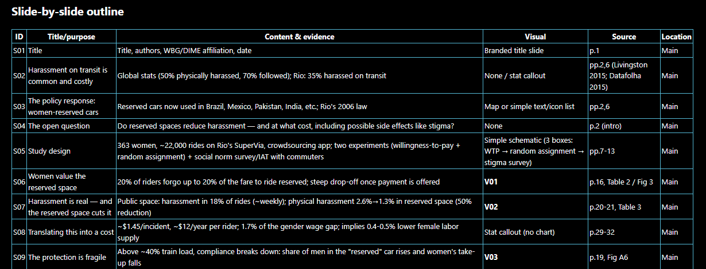
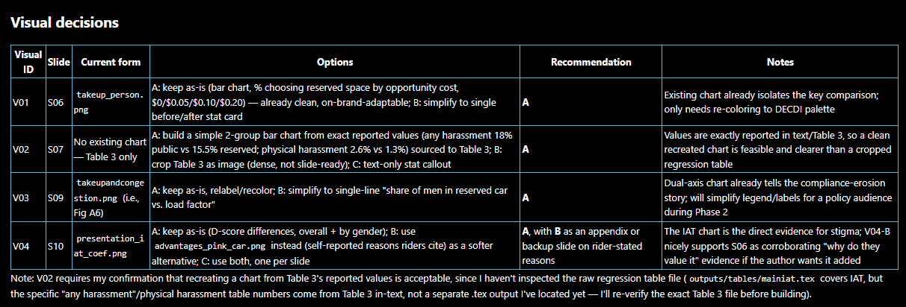

## Objective

Produce a **well-structured, presentation-ready slide deck**.

. . .

You can start from:

- Research materials such as a manuscript, results, code, or a reproducibility
  package. The more relevant material you provide, the better.
- An existing slide deck that needs structural improvement or rebranding.

::: {.notes}
The session covers both starting points. Exercise 1 creates a new deck.
Exercise 2 improves an existing deck.
:::

## Before we begin: prerequisites

- **Training slides:** [https://bit.ly/ai-slide-skills](https://dime-worldbank.github.io/ai-research-training/sessions/ai-skills-slides/slides/)
- **Visual Studio Code** installed from the Software Center
- One AI assistant signed in within VS Code:
  - GitHub Copilot with the Copilot Chat extension and a Claude model
  - Claude Code extension linked to a personal or team account
- Your own existing project, or the demo project: download [here](https://github.com/dime-worldbank/ai-research-training/raw/refs/heads/main/sessions/ai-skills-slides/materials/demo-projects.zip)
- The **prepare-slides AI skill:** download [here](https://github.com/dime-worldbank/ai-research-training/releases/latest/download/prepare-slides.zip)

::: {.notes}
Participants can follow the demonstration if they cannot complete the setup.
The links can be added when the session materials and skill ZIP are published.
:::

# Why use a skill? {background-color="#002A4F"}

## What is an AI skill?

An AI skill is a folder of instructions and resources that an AI agent reads
to perform a specialized task more consistently.

. . .

It is triggered when:

- The agent recognizes that the task matches the skill description
- The user explicitly tells the agent to read and follow `SKILL.md`

The skill adds task-specific workflow and resources to the agent's general
capabilities.

## A skill makes the workflow reusable

| A prompt on its own | A prompt using the skill |
|---|---|
| Must explain the process each time | A short request triggers the established process |
| May not include the current templates or brand files | Templates, logos, and standards are packaged with the instructions |
| Success depends on what the agent remembers to check | Approval and quality checks are built into the workflow |

::: {.notes}
The skill does not replace the prompt. The prompt provides the task, audience,
and source paths. The skill provides the repeatable method and resources.
:::

# Why use the `prepare-slides` skill? {background-color="#002A4F"}

## The same research often becomes several different presentations

Think about how many times you prepare slides using the same research:

- For government policymakers
- For an academic or research audience
- For an internal review or project meeting
- For a conference, workshop, or training

Each time, you must select the story, rewrite the content, adapt the figures,
apply the template, and check the formatting.

**Turning research into slides becomes a second production workflow.**

## `prepare-slides` makes that workflow reusable

- Start from the same manuscript, results, figures, or existing deck
- Adapt the story and level of detail for the intended audience
- Review the outline and visual choices before production
- Create or improve slides in PowerPoint, Quarto, or Beamer
- Apply DECDI branding and check the rendered output

**Spend your time tailoring the message, not rebuilding the presentation.**

## Architecture  of `prepare-slides` skill

```text
skills/
├── README.md             how a person installs and requests the skill
└── prepare-slides/
    ├── SKILL.md          workflow and approval gates
    ├── references/       structure, evidence, review, and format standards
    ├── branding/         canonical colors and approved logos
    └── assets/           working format-specific starters
```

- `README.md` is for the person using the skill
- `SKILL.md` is for the AI agent
- `branding/` is the source of truth that feeds the starter assets. This was built from the [DECDI branding guidelines](https://www.canva.com/design/DAG_uu89IfA/9M6MXACvYKjn4wmVqjc5Lg/view?utm_content=DAG_uu89IfA&utm_campaign=designshare&utm_medium=link&utm_source=viewer#16.) 

## The agent loads only what the task needs

:::: {.columns}

::: {.column width="32%"}
**Always**

`SKILL.md`

Selects the service and controls the two phases.
:::

::: {.column width="32%"}
**When relevant**

`references/`

Adds detailed standards for the current task.
:::

::: {.column width="32%"}
**During production**

`assets/`

Provides the starter for the selected format.
:::

::::

## References guide decisions; assets become working files

:::: {.columns}

::: {.column width="50%"}
### References

- `slide-structure.md`
- `figure-table-guidelines.md`
- `deck-review-checklist.md`
- `decdi-branding.md`
- `format-conventions.md`

The agent reads the relevant files. They are not copied into the output.
:::

::: {.column width="50%" .fragment}
### Assets

- `quarto/`
- `beamer/`
- `pptx/`

The agent copies or uses the selected starter during production.
:::

::::

# How the skill works {background-color="#002A4F"}

## Start with project materials or an existing deck

### 1. Create a new deck from project materials

Provide the manuscript, results, code, figures, tables, and project notes. The
more relevant material the agent can access, the better.

::: {.fragment}
### 2. Improve an existing deck

Improve the story, content, layouts, visuals, and branding. If the content is
already strong, request rebranding only.

::: {.callout-note appearance="simple"}
Supporting materials help the agent verify claims and improve either pathway.
:::
:::

## The author approves the plan before production begins

### 1. Phase 1: Proposal

The agent reviews the materials and proposes the story, slide outline, and
visual alternatives.

### 2. Author review

The author revises or approves the story and visual choices, then selects the
presentation format and logo.

### 3. Phase 2: Production

The agent creates or revises the deck, renders it, inspects the output, and
fixes material problems.

**Production begins only after the author approves the plan.**

## Phase 1 turns source material into decisions

For a new deck or substantial improvement, the agent provides:

1. A short narrative summary
2. A slide-by-slide outline
3. Visual alternatives for figures and tables
4. An assessment of the existing deck, when relevant
5. A prefilled Author Decision Form

**No presentation files are created or edited during Phase 1.**

## A Phase 1 proposal shows the proposed outline {.smaller}

{width="100%"}

## The proposal also records visual decisions {.smaller}

{width="100%"}

## The author can approve, edit, or request alternatives

```text
Outline: Approve with changes

Slide changes:
- S03: Use more cautious language in the title

Visual decisions:
- V01: Show options B and C side by side before I choose
- V02: Keep the simplified table

Format: PowerPoint
Logo family: DECDI/DEC
```

The author can respond in ordinary language and ask for additional alternatives
before or after production.

## Phase 2 follows one of three routes

::: {.fragment}
:::: {.columns}
::: {.column width="18%"}
**Build**
:::
::: {.column width="80%"}
Copy the selected starter and create the approved deck.
:::
::::
:::

::: {.fragment}
:::: {.columns}
::: {.column width="18%"}
**Improve**
:::
::: {.column width="80%"}
Edit the existing source or reconstruct it in the starter, based on the
approved review.
:::
::::
:::

::: {.fragment}
:::: {.columns}
::: {.column width="18%"}
**Rebrand**
:::
::: {.column width="80%"}
Edit a copy of the existing source using the starter's visual system.
:::
::::

After reviewing the output, the author can request additional changes. The
original source remains unchanged unless in-place editing was explicitly
requested.
:::

# Limitations {background-color="#002A4F"}

## Less source material means more uncertainty and more review

Without the manuscript, results, code, notes, or data, the agent must limit its
checks and state what it cannot verify.

With only a manuscript, it may adapt exact reported values or leave a
placeholder. It should not invent missing values.

Large or inconsistent decks with missing source files require more
reconstruction, rendering, and author review.

::: {.callout-note appearance="simple"}
More relevant source material improves what the agent can verify and usually
reduces revision time.
:::

## Recreated exhibits may not update automatically

If the agent recreates a table or chart without the original code and data,
the exhibit may be hard-coded. It will not update automatically when the
results change.

If updateability matters, request:

- Charts and tables generated from the provided code and data
- Editable, reusable source files
- Clear links to the underlying data
- Instructions for rerendering the deck

::: {.callout-warning appearance="simple"}
When code or data are unavailable, an updated manuscript can be used to
regenerate the deck, but the author still needs to review every recreated
exhibit.
:::

# Hands-on exercise {background-color="#002A4F"}

## Choose your starting point

### Option 1: Use your own project

Work with a manuscript, results, code, figures, or an existing research
project already on your computer.

### Option 2: Use the demo project

Download the prepared exercise folder:

**[Download the demo project](https://github.com/dime-worldbank/ai-research-training/raw/refs/heads/main/sessions/ai-skills-slides/materials/demo-projects.zip)**

Both routes use the same skill and approval workflow.

## If you are using your own project

1. Download and unzip the [prepare-slides skill](https://github.com/dime-worldbank/ai-research-training/releases/latest/download/prepare-slides.zip)
2. Create `.agents/skills/` at the project root
3. Copy the complete `prepare-slides/` folder into it

```text
your-project/
├── .agents/
│   └── skills/
│       └── prepare-slides/
│           ├── SKILL.md
│           ├── references/
│           ├── branding/
│           └── assets/
├── manuscript.pdf
├── results/
└── other-project-files/
```

## If you are using the demo project

1. Download and unzip the demo project. The demo-project folder has 2 sub-folders: `exercise-1` and `exercise-2`. We will use the `exercise-1` to create slides from scratch.  
2. Download and unzip the [prepare-slides skill](https://github.com/dime-worldbank/ai-research-training/releases/latest/download/prepare-slides.zip)
3. Copy `prepare-slides/` into the exercise-1's `.agents/skills/` folder

```text
exercise-1/
├── .agents/
│   └── skills/
│       └── prepare-slides/
│           └── SKILL.md
└── irrigation-project/
```

Keep the complete skill folder even though only `SKILL.md` is shown here.

## Open the project in VS Code and check the settings

:::: {.columns}

::: {.column width="52%"}
1. Select **File → Open Folder**
2. Open your project folder (or `exercise-1` folder), not an individual file
3. Open the Copilot Chat or Claude Code panel
4. If using Claude Code, install the **Claude Code extension** and sign in


If you see a Claude CLI error when using Copilot chat, start a new chat and confirm that **Local** is
selected.
:::

::: {.column width="46%"}
{width="100%"}
:::

::::

## Ask the agent to prepare the slides

```text
Read prepare-slides/SKILL.md and use it to preapre a 30-minute beamer 
presentation using the relevant research materials in this project.
The audience is government policymakers. Focus on the main findings and policy
implications. 
```


## Review the source inventory and proposed story

Check:

- Did the agent identify the relevant source files?
- Did it state what it could not verify?
- Do the slide titles tell a coherent story?
- Does the proposed main deck fit the presentation time?
- Are technical details moved to the appendix when appropriate?
- Are the visual alternatives faithful to the available evidence?

Correct the inventory or narrative before approving production.

## Approve the outline or ask for alternatives

```text
Outline: Approve with changes

Slide changes:
- S__: [your requested change]

Visual decisions:
- V01: Show options A and B side by side
- V02: Keep the recommended option

Format: [PowerPoint / Quarto / Beamer]
Logo family: [DECDI/DEC / World Bank Group]
```

You can ask the agent to revise the outline or present additional visual
alternatives before choosing.

## Inspect the rendered deck

- Is the narrative still the one you approved?
- Are the claims traceable to the supplied materials?
- Are figures and tables faithful, legible, and easy to interpret?
- Is the branding consistent?
- Are sources and notes concise?
- Is anything clipped, crowded, or unexpectedly wrapped?

Ask for corrections before accepting the output.

# Optional exercise 2: Improve an existing deck {background-color="#002A4F"}

## This deck has slides, but it is not presentation-ready

1. We will use `exercise-2` for this session. 
2. Copy `prepare-slides/` into the exercise-1's `.agents/skills/` folder

```text
exercise-2/
├── .agents/
│   └── skills/
│       └── prepare-slides/
│           └── SKILL.md
└── sms-project/
```

::: {.visual-note}
**Notes:** The  exercise deck is intentionally inconsistent and
text-heavy. 
:::

## Ask for improvement and review the proposal


```text
Read the prepare-slides SKILL.md and follow it.
Improve the existing slide deck using the materials in the folder. 
The resulting slides should be in the latex-beamer format.
```


## Approve the priorities, then inspect the result

Before production:

- Approve or revise the proposed narrative
- Choose the most important slide changes
- Approve visual alternatives
- Confirm whether you want improvement or rebranding only
- Confirm the logo family

After production, check that the deck was improved rather than merely
recolored and that every approved change was implemented.

# Apply it to your project {background-color="#002A4F"}

## Install the complete folder once per project

1. Download and unzip the [prepare-slides skill](https://github.com/dime-worldbank/ai-research-training/releases/latest/download/prepare-slides.zip)
2. Create `.agents/skills/` at the project root if needed
3. Copy the complete `prepare-slides/` folder into it

```text
your-project/
└── .agents/
    └── skills/
        └── prepare-slides/
            ├── SKILL.md
            ├── references/
            ├── branding/
            └── assets/
```

`.agents/skills/` is a convention. Use your agent's preferred skills directory
if it has one.

## Your prompt needs a task and source paths

**Create**

> Create a 30-minute presentation using the relevant files in
> `[YOUR PROJECT FOLDER]`.

**Improve**

> Improve `[YOUR DECK]` using `[SUPPORTING MATERIALS]` to check the content.

**Rebrand**

> Rebrand `[YOUR DECK]` using the bundled DECDI template and branding
> guidance. Preserve its content arrangement and order.

## The author approves; the agent produces and checks

```text
source material
      ↓
Phase 1 proposal
      ↓
author decisions
      ↓
Phase 2 production
      ↓
rendered inspection
```

The approval gate is where the author controls the story, evidence, format,
and visual choices.

## Spend less time formatting. Spend more time strengthening the message.

::: {.vh-center-container}

**Reuse the same research materials to produce clearer, audience-specific decks
with a consistent workflow.**

:::

## Thank you

Questions and discussion

::: {.callout-note appearance="simple"}
The `prepare-slides` skill is a work in progress. Feedback from real projects
is appreciated and will help improve it.
:::

{width="30%"}
